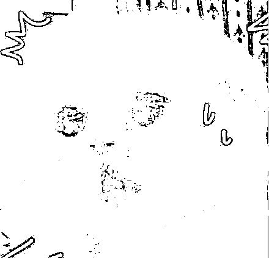
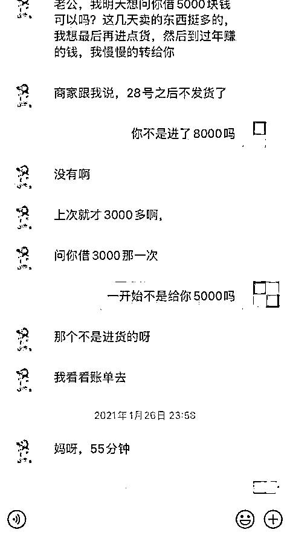
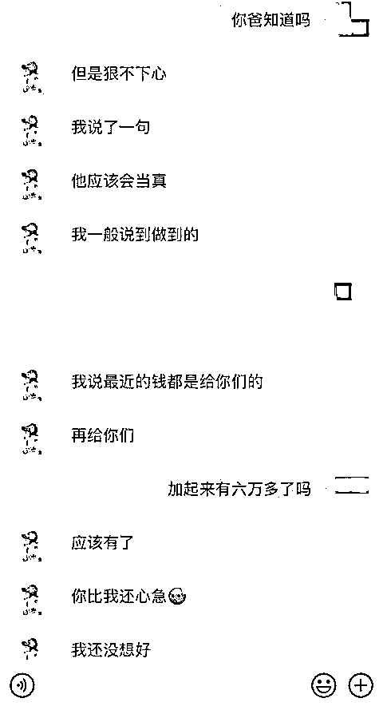
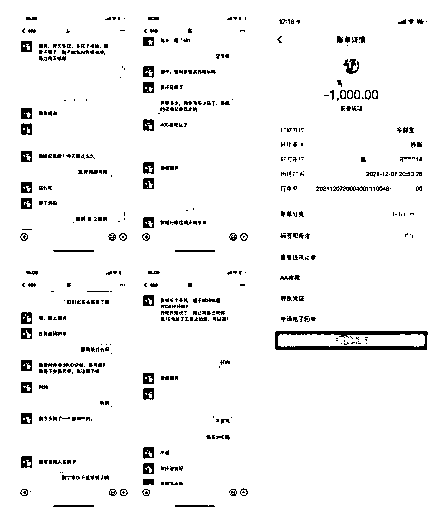
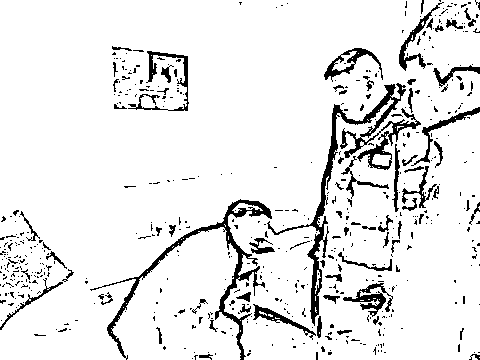
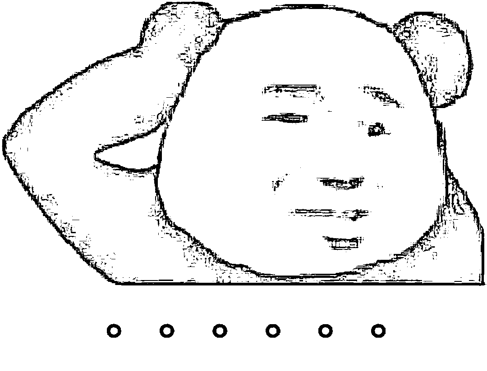

# 到派出所咨询情感问题，却发现未婚妻竟是男人？还被骗了 20 多万……

> 原文：[`mp.weixin.qq.com/s?__biz=MzIyMDYwMTk0Mw==&mid=2247529501&idx=5&sn=a0bf09b6d380e52224b8e136137bf84f&chksm=97cbbf25a0bc36330239a7886e7ab53c8aac344e2a92d762e07e10a5af227f199edcbadbc0a7&scene=27#wechat_redirect`](http://mp.weixin.qq.com/s?__biz=MzIyMDYwMTk0Mw==&mid=2247529501&idx=5&sn=a0bf09b6d380e52224b8e136137bf84f&chksm=97cbbf25a0bc36330239a7886e7ab53c8aac344e2a92d762e07e10a5af227f199edcbadbc0a7&scene=27#wechat_redirect)

**男子利用嗓音优势模仿女声**

**一人分饰“姐弟”两个角色**

与被害人钟先生

线上“谈婚论嫁”一年多

编造看病、创业等借口

**诈骗 20 余万元**

近日

市民钟先生到派出所咨询“情感问题”

民警敏锐察觉当中存在“猫腻”

破获了这样一起诈骗案件

据悉，目前，袁某因涉嫌诈骗罪被上海市公安局闵行分局依法刑事拘留，案件正在进一步侦办中。

**半个月谈婚论嫁****索要万元改口费**

钟先生今年 30 岁，单身，在上海市闵行区工作。2020 年 12 月的一天，他在某交友软件上认识了一位女子，对方自称本名叫“袁媛”，也是单身，两人聊得很投机，便互加了微信好友。

两人微信聊了半个月，对方就提出要和钟先生结婚，给钟先生发来自己的照片，钟先生一看到对方正是他喜欢的类型，立即坠入了情网。**随后对方提出要钟先生付 9999 元的改口费**，钟先生并没有觉得不妥，两个人这么聊得来，感觉是遇到了“真爱”。于是不假思索就直接给对方转账了 9999 元。而对方在退了两次后，第三次才收下了这笔改口费，两人自此就以老婆老公相称。

没几天，女友说要换手机，**钟先生就给女友转账 5988 元买了一部新手机**。2021 年 1 月，女友又因为家里装修，问钟先生**借了 1 万元**。紧接着女友又问钟先生要了**1 万元彩礼钱**，之后女友称要在老家创业开店，**问钟先生又借了 5 万元钱**。

聊天记录 警方供图

当月，女友又称自己有个弟弟被车撞骨折了，**向钟先生借了 6 千元看病**，顺便把弟弟袁某介绍给了钟先生，之后**弟弟偶尔也会因为生活原因向钟先生借钱**，少则几千多则上万。甚至弟弟还到过钟先生家中借宿过几次。对此，钟先生觉得既然是女友的弟弟，那就是一家人了，并没有介意。

聊天记录 警方供图

**“重病”提分手引起怀疑终被抓**

两人交往期间，钟先生提出见面约会，女友总是以身体不适、有工作要忙、要见客户等理由婉拒，钟先生偶尔通过电话和女友一诉衷肠。而女友每个月买衣服、买化妆品、还信用卡、家里人看病，这样那样的种种开销，钟先生都一一爽快答应。

直至今年 1 月，**女友突然告诉钟先生自己需要骨髓移植，可能活不到 40 岁，要跟钟先生分手**。回想起女友这一年多以来弟弟被车撞骨折、酒精中毒、母亲出车祸、父亲开刀住院，如今又生重病，那么多的不幸遭遇反而让钟先生产生了一丝怀疑。

1 月 13 日晚，钟先生越想越不对劲，来到莘松派出所咨询自己的感情问题，**想知道自己是不是真的被骗了，对于恋情还抱着一丝幻想**。

听了钟先生的描述，民警当即判断这就是一起典型的婚恋诈骗案件。根据研判，**初步怀疑钟先生女友的弟弟袁某就是嫌疑人**，通过调查走访，当晚 23 时许，离钟先生到派出所咨询不到四小时，民警就在本市青浦区某小区内抓获了嫌疑人袁某。

到案后，袁某交代自己平时会用女性身份在社交平台上寻找男性聊天交往。2020 年底遇上钟先生，聊了半个月后开玩笑要结婚，还给钟先生发了一张自己 p 图后的照片。**钟先生爽快答应并按他要求马上转账了改口费，这让他觉得钱来得太容易了**。

袁某贪图享受，于是就以女友身份一次又一次编造理由向钟先生要钱，**偶尔与钟先生打电话，他就变声模仿女声，没有被发现后更加令他肆无忌惮**。为进一步获取信任，更是用自己本名编造了“弟弟”的身份，去接近钟先生，让他消除戒心。在交往的一年多时间里，袁某以各种理由骗取钟先生 20 多万元，**而这些钱都被他拿去吃喝玩乐挥霍一空**。

**警方提醒**

**网络交友要谨慎**

**尽量选择线下交往并核实身份**

**涉及到钱财时要多留一个心眼**

**避免上当受骗**

来源：上海法治报

← 向右滑动与灰产圈互动交流 →

