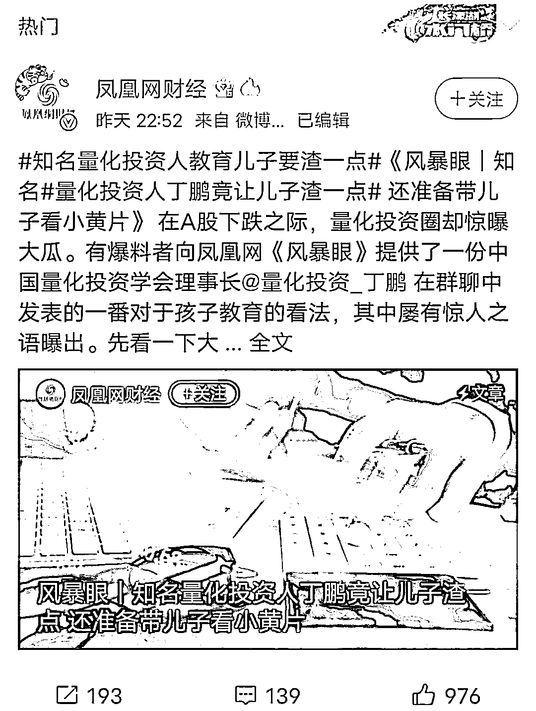

# 三观尽毁！量化投资大佬培养儿子当"渣男"

> 原文：[`mp.weixin.qq.com/s?__biz=MzIyMDYwMTk0Mw==&mid=2247529555&idx=1&sn=4ed3aea083dd2cba9381105d52e30c6b&chksm=97cbbf6ba0bc367ddcf493c252aec66b77048da019e588eebe76fcaa1d1649156880765670ab&scene=27#wechat_redirect`](http://mp.weixin.qq.com/s?__biz=MzIyMDYwMTk0Mw==&mid=2247529555&idx=1&sn=4ed3aea083dd2cba9381105d52e30c6b&chksm=97cbbf6ba0bc367ddcf493c252aec66b77048da019e588eebe76fcaa1d1649156880765670ab&scene=27#wechat_redirect)

2 月 10 日，有关知名量化投资人丁鹏的聊天记录引发热议。谈及孩子教育问题，丁鹏表示，“我对我儿子说，老爸不要求你发财，只要求你多*几个女人，多给你老爸多生几个孙子。” 

有关言论引发网友批评：“价值观真是一地碎。”对此丁鹏表示：随便传、不在乎。

图源社交媒体

**培养孩子从小当渣男？还曾“支招”：没有孩子看病自费，三孩报销 90%** 

网传对话内容显示，在谈到教育孩子问题时，丁鹏表示：“我准备明年给他看小黄片，亲自教育他，高中应该就可以睡女生了。”“我儿子小学的时候，我就给他买了好的手机，给他办的微信，打了不少钱过去，让他请班上的女学生去吃零食，这样培养他从小当渣男。”

▼

▼

▼

▼

▼

社交媒体图片

被曝光的言论很快点燃了网友怒火。有网友质疑，在丁鹏眼中，自己儿子的人生乐趣就是睡女人、生孩子？更有网友直言，丁鹏的“价值观真是一地碎。”

社交媒体截图

截至今日 11 时，丁鹏尚未在其官方微博发表回应。他最近的一篇文章发表于 2021 年 6 月，题为《想让老百姓多生孩子？我来支个招！》。该文章称，“如果想让大家多生孩子，只要将孩子的数量和资产挂钩就可以。”其中包括所谓“没有孩子的看病自费，一个孩子报销 50%，有三个孩子的报销 90%”等。

社交媒体截图

**业内人士：丁鹏和大家不是一个圈子** 

资料显示，丁鹏 1992 年毕业于东南大学电子系；1998 年毕业于该校自控系；2001 年，他毕业于上海交通大学计算机系，获得博士学位。这或许即丁鹏在对话中所感叹的：“这一辈子太苦了，从小到大读书，三十岁还在读书。”

工作经历显示，丁鹏履历遍布高校、券商、公私募基金和期货等领域。同时，他还是一些媒体、平台的特邀嘉宾。他的大多数工作内容都和量化有关，其多年累计管理资金规模超过 50 亿元人民币。

中国证券投资基金业协会网站截图

2001 年，丁鹏加入上海交通大学计算机系，从事人工智能方面的研究；2008 年，他加入东方证券金融衍生品总部，从事量化投资策略开发；2012 年，丁鹏加入方正富邦基金，任专户部副总监，从事量化对冲产品的设计与开发；2014 年，他加入东航金控，任资产管理部总经理，从事全球资产配置。

2016 年，丁鹏组建荣石投资，进入私募领域。

中国证券投资基金业协会网站显示，丁鹏对荣石投资的认缴比例为 20%。综合《每日经济新闻》消息，他后来退出。数据显示，荣石投资旗下目前只有荣石流金 2 号一只产品。据 Wind 统计数据，荣石流金 2 号的年度回报（2021）为 132.02%，在 18649 只同类产品中排名 507 位。

中国证券投资基金业协会网站截图

2012 年 1 月，丁鹏推出了《量化投资-策略与技术》一书，现在来看反响不一。在社交媒体和电商平台评论区，不少读者表示，“当年入门量化投资，读的第一本书作者就是他。”业内人士则表示，“当时，国内市场环境比较特殊，对量化投资很陌生。这本书主要是介绍国外量化投资的一些基本知识。”

某版《量化投资-策略与技术》作者简介截图

在公开场合，丁鹏标注自己是“中国量化投资学会（CQIA）理事长”。据《每日经济新闻》今日消息，多位中大型量化私募公司人士向其记者表示，一般中大型量化私募都不在那个所谓的学会里。

某资深量化私募投资人士直言：“丁鹏的确是关注量化投资比较早的人士，早些年还出了本书，主要是介绍国外的量化基本知识。他和大家不是同一个圈子里的，现在他们那个圈子主要搞量化学员收费培训。”

**原持股公司被列为失信被执行人，今又因三观问题引发争议** 

综合《证券时报·券商中国》去年 7 月报道，曾有一位山东投资者 2018 年 1 月斥资 100 万购买上海兴盾资产管理有限公司发行的私募基金产品——兴盾期权套利 1 号。2020 年 8 月，该投资者打算赎回该产品时却遭拒绝。该投资者随后获悉，该产品在并未告知他的情况下，已于 2019 年 10 月提前清算，净值归零。100 万本金折损殆尽。

投资者表示，截至 2019 年 7 月净值还有 1.30 元左右。但该产品在随后短短 3 个月净值竟然归零了，设置的止损线完全形同虚设。“我严重怀疑这只私募产品净值在造假。”此外，兴盾资产还涉及多起投资者纠纷。2020 年 10 月，该公司被上海市浦东区人民法院列为失信被执行人。

早期兴盾资产管理股东名单中，丁鹏在列。2020 年 8 月，他退出股东序列。

启信宝截图

此次有关育儿观的争议言论，再次将丁鹏送上热搜。

据《每日经济新闻》报道，深圳某私募基金人士表示：“丁鹏的‘奇葩’教育理念，社会影响确实不太好。虽然这并不涉及其投资工作，但投资人三观有问题只想捞钱，能给投资者带来回报吗？作为一位业内知名人士，更需要谨言慎行，考虑给公众带来的影响。从业人员不仅在工作中要自律，生活中的言行同样也需要自律。”

综合界面新闻等国内媒体报道，对于自己言论引发的质疑和批评，丁鹏表示：这有啥？我又不在乎，随便传。

网传图片截图

近年来，包括中国证券投资基金业协会在内，多方屡屡提倡行业自律。从业人员的工作道德和个人私德，正愈发受到舆论关注。丁鹏言论中涉及女性和婚育的内容，引发网友不适和愤怒，这值得有关行业和人员更多思考。

来源：观察者网

← 向右滑动与灰产圈互动交流 →

