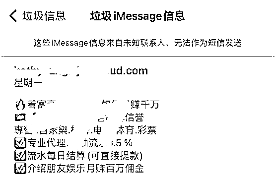

# 你的“家人”邀请你使用约 P 神器？苹果 iPhone 又摊上事了

> 原文：[`mp.weixin.qq.com/s?__biz=MzIyMDYwMTk0Mw==&mid=2247529555&idx=2&sn=82210abb21a1abe9a9f58921ee91fc30&chksm=97cbbf6ba0bc367d24e768ef7c9fb2872815aae8a19b1564f666cf6f365547ec51ec13643bee&scene=27#wechat_redirect`](http://mp.weixin.qq.com/s?__biz=MzIyMDYwMTk0Mw==&mid=2247529555&idx=2&sn=82210abb21a1abe9a9f58921ee91fc30&chksm=97cbbf6ba0bc367d24e768ef7c9fb2872815aae8a19b1564f666cf6f365547ec51ec13643bee&scene=27#wechat_redirect)

可能有很多朋友都知道，苹果的 **iMessage** 上曾经各种虚假违法广告泛滥。

<shape type="#_x0000_t75" filled="f"><imagedata title="7860860131644485940980"></imagedata></shape>

iMessage 原本只是苹果公司推出的即时通信软件，集成在 iOS 系统中，可以免费发送短信、视频等。

由于苹果庞大的用户基数，iMessage 也被黑产盯上，各种违法的网络赌博、色情等广告四处乱飞，一度搞的 iPhone 用户们苦不堪言。

有网友开玩笑：**打开 iMessage，你就收获整个澳门赌场**。

最离谱的是，苹果公司自己也有些素手无策：

好在随着苹果公司这几年的大力整治，iMessage 的违法广告最近越来越少了。

不过，黑产人员最近又盯上了新的“**财富密码**”，那就是苹果的“**日历**”和“**家庭**”功能。

今天，我们 IT 之家的小伙伴就有中招的：他收到了一个**家庭邀请**，竟然是请他体验“**约炮神器**”...

好家伙，浪歌连呼好家伙，这要是老婆\女朋友看到了岂不是又一场腥风血雨。

除了家庭，iOS 中的“**日历**”功能也被黑产人员拿来发小广告：

之前被 iMessage 小广告骚扰的小伙伴，还可以从设置中关闭 iMessage，以此来避免骚扰。

但是家庭和日历功能压根没有给用户关闭的权限，这咋防啊！

这里，浪歌给大家讲解几个办法，让你从源头彻底断绝黑产小广告的骚扰。

**1・iMessage 防骚扰**

首先，我们可以选择**直接关闭 iMessage 功能**，在设置 - 信息 - iMessage 中取消选定，即可彻底停用 iMessage 功能

不过，对于 iMessage 有需求的小伙伴，这样直接停用就影响日常使用了，我们还可以通过设置“**过滤未知发件人**”来避开骚扰广告。

在设置 - 信息 - 信息过滤中，打开“过滤未知发件人”功能。

这样不在你联系人中的用户，就无法给你发送 iMessage 信息了。

**2・日历、****家庭 防骚扰**

目前苹果虽然并不提供这两个功能的防骚扰辅助功能，不过我们也有应对之策。

第一招，就是**直接关闭**这俩功能。

直接在 iCloud 中关闭日历、家庭，以及将 iCloud 日历邀请改为邮箱通知，并且将家庭 App 删掉 / 关闭通知。

不过这招对有些小伙伴不适用，因为关闭 iCloud 家庭会让 AppleTV、HomePods 或者是其他有 HomeKit 功能的智能家居的无法使用。

还有一个不一定百分之百有效，但是会避免上一招中的麻烦的办法：**更换 Apple ID 的绑定邮箱**。

由于目前垃圾广告 / 邀请大多是通过邮箱地址群发，国内用户使用比较多的 QQ 邮箱、163 邮箱等，有更大几率被黑产盯上。

因此，**更换为一些比较冷门的邮箱**，可以一定程度上避免被骚扰。

只需在网页端登陆 Apple ID，然后点击“Apple ID”，输入想要更换的邮箱账号即可完成更换。

之后在 iPhone 的设置中，找到 Apple ID 中的电子邮件后，将旧的邮箱地址删除，即可一定程度上避免骚扰广告。

另外，在你收到广告邀请后，千万不要直接点击“拒绝”按钮。

这是因为你点击“拒绝”之后，苹果会把拒绝的信息回传给信息发送者，这反而“变相”通知了垃圾广告商，这个邮箱绑定了 Apple ID 并且是一个活跃用户。

这之后黑产人员反而更会“加大力度”，你收到垃圾广告的可能性就更大了。因此在收到这一类垃圾广告后一定不要点击“拒绝”。

你，学废了吗？

另外，浪歌这里也想要小小吐槽一下。

这些黑产人员逼得我们普通用户不停找各种办法来解决问题，但是想要**从根本上解决问题**，还得看**苹果**。

苹果在防黑产广告方面，一直都做的不算好。

浪歌不是产品经理，但是浪歌自己就能想到好几个解决办法：

加强 Apple ID 管理，所有被举报的账号经过人工核实后进行**封禁**；

细化通知管理功能。对共享邀请等功能**提供单独开关**，让被骚扰的用户可以一键关闭相关功能；

要是苹果的程序员实在想偷懒，给邀请功能**加个验证码**也能一定程度阻拦这些黑产人员哇！

苹果，精神起来哇！

部分图片来源：Sweekli

← 向右滑动与灰产圈互动交流 →

