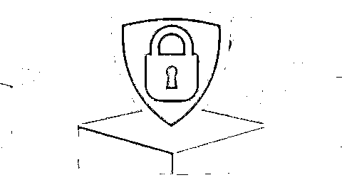
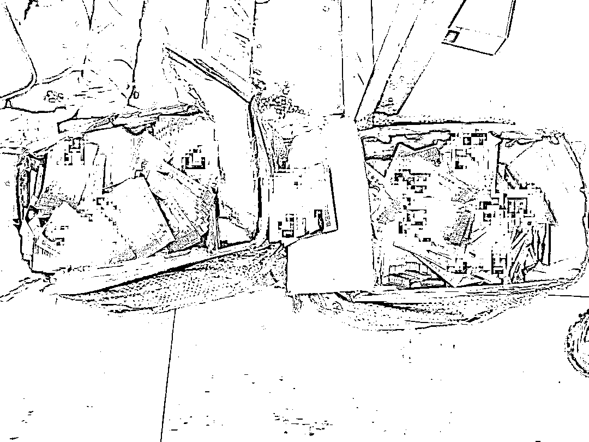
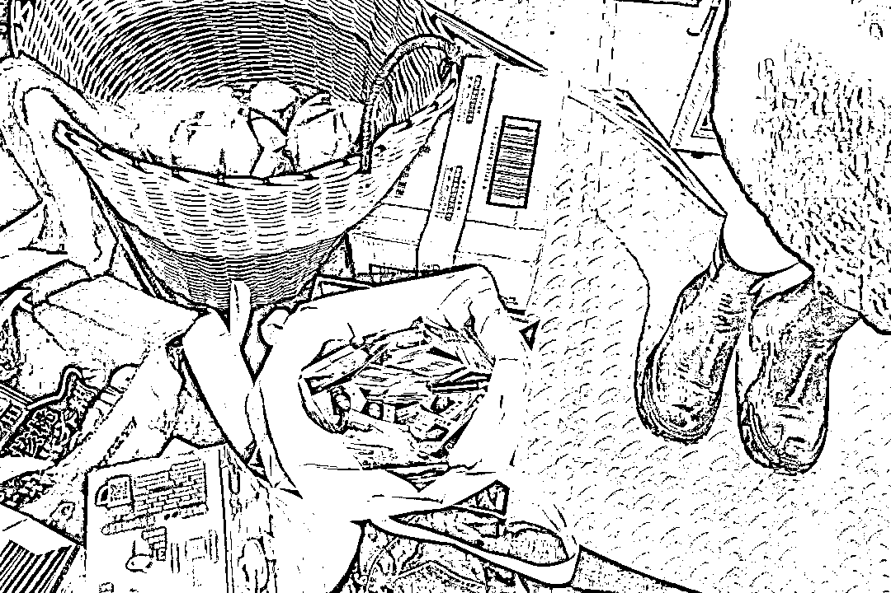
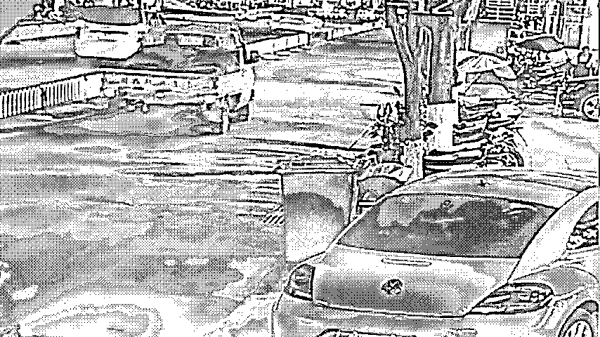
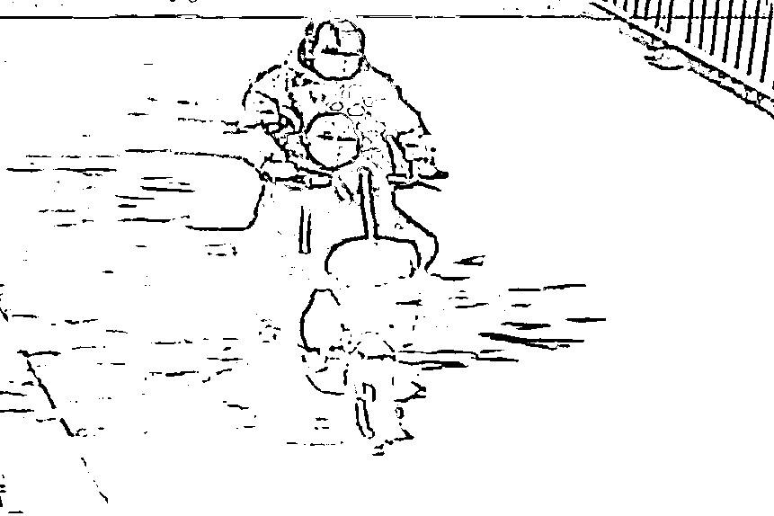
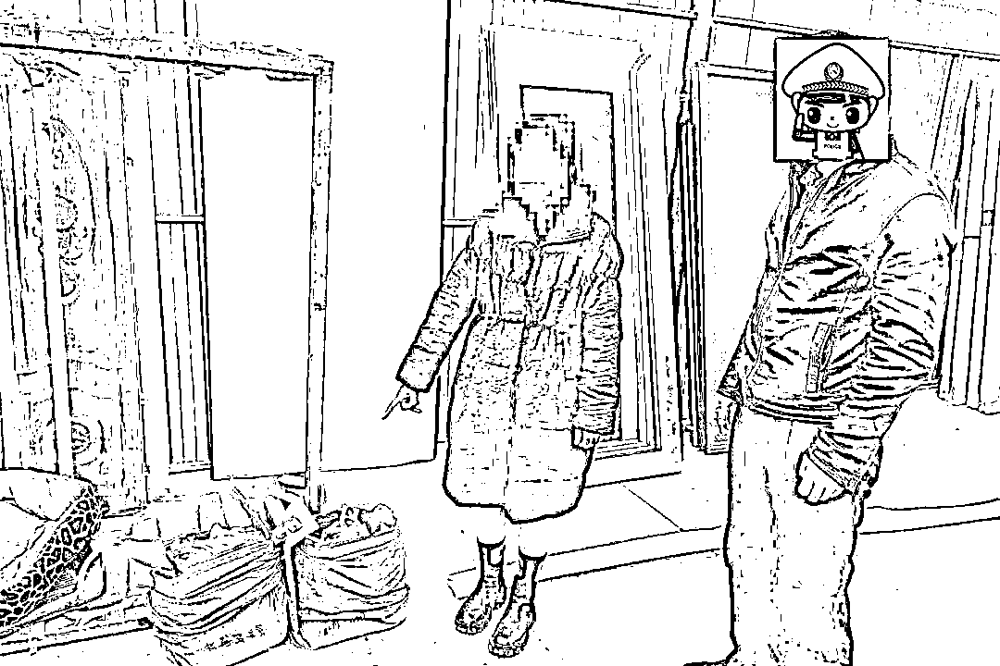

# 街头“小卡片”背后的真相

> 原文：[`mp.weixin.qq.com/s?__biz=MzIyMDYwMTk0Mw==&mid=2247529555&idx=3&sn=3bcf1e85abf66e29cc2e77b477e7d577&chksm=97cbbf6ba0bc367d32ec2fcc886d94b4e8454ea240f48a0463fc0c04ed98e9c518c1ecb31fda&scene=27#wechat_redirect`](http://mp.weixin.qq.com/s?__biz=MzIyMDYwMTk0Mw==&mid=2247529555&idx=3&sn=3bcf1e85abf66e29cc2e77b477e7d577&chksm=97cbbf6ba0bc367d32ec2fcc886d94b4e8454ea240f48a0463fc0c04ed98e9c518c1ecb31fda&scene=27#wechat_redirect)

近日，保山隆阳警方巡特警大队在城区开展巡逻期间，发现少数路段有涉黄小卡片，严重影响辖区治安形象。秉承对“黄赌毒”零容忍的态度，分局巡特警大队立即展开调查。

**拆穿挂羊头卖狗肉的谎言**

通过侦查发现，对方并不是一个以招嫖为目的涉黄团伙，而是一个打着提供“特殊服务”为旗号，实为电信诈骗他人钱财的犯罪团伙。

**转移调查方向  ****顺藤摸瓜找到源头**

确定涉黄小卡片为电信诈骗后，大队民警开始转移调查方向，对这些小卡片的来源进行追查。通过对重点时段重点路段开展排查，民警追查到散发小卡片的人系一对中年男女，2 人多次驾驶一辆银灰色轿车进入隆阳城区，又共同换乘一辆共享电单车，在城区各路段沿途散发涉黄小卡片后迅速离开。

经核查分析，2 名嫌疑人为曾某飞、杨某夫妇。民警迅速出击，于近日在城郊将 2 人抓获，现场查获涉黄小卡片 2 箱（约 40000 张）。据 2 人供述，之前一个外地的熟人与其联系，称只要 2 人能帮忙发一些“小卡片”，就愿意支付高额报酬。于是，夫妻俩铤而走险，开始按照对方的指示开启了诈骗之路。

目前，曾某飞、杨某 2 人因涉嫌诈骗罪，已被公安机关依法处理，案件正在进一步审理中。

**骗术揭秘**

**第一步，四处撒网。**骗子会四处派发附有上门按摩、推油等“色情服务”信息，并印有性感露骨照片的涉黄小卡片，等着受害人上钩。

**第二步，物色目标。**等到受害人主动找上门询问招嫖信息时，骗子立即承诺相关的服务内容，并通过言语诱惑，让受害人想入非非，丧失理智。

**第三步，预交订金。**达成交易意向后，骗子开始以各种理由让受害人先交钱，并且承诺一收到钱，马上提供上门服务。通常这笔钱的金额不会很大，大概三四百元，主要是为了试探受害人的心理防备程度。

**第四步，变本加厉。**当受害人交了第一笔钱之后，骗子又会以要保证服务者的安全为由，要求受害人再交几百甚至上千元的保证金。接下来，各种要求转账的借口会层出不穷，直至受害人骑虎难下，心力交瘁。

**第五步，无影无踪。**等到受害人发现上当受骗时，骗子已经诈骗得手，消失得无影无踪。

**普法时刻**

**《中华人民共和国治安管理处罚法》第六十六条：**

卖淫、嫖娼的，处十日以上十五日以下拘留，可以并处五千元以下罚款；情节较轻的，处五日以下拘留或者五百元以下罚款。在公共场所拉客招嫖的，处五日以下拘留或者五百元以下罚款。

**《中华人民共和国刑法》第三百五十九条【引诱、容留、介绍卖淫罪；引诱幼女卖淫罪】**

引诱、容留、介绍他人卖淫的，处五年以下有期徒刑、拘役或者管制，并处罚金；情节严重的，处五年以上有期徒刑，并处罚金。

**民警提醒**

**自觉抵制涉黄活动，若发现有人派发涉黄小卡片应及时报警举报。此外，提升自我防范意识，慎防掉进骗子的陷阱。**

来源：隆阳警方，昆明反电信网络诈骗中心

← 向右滑动与灰产圈互动交流 →

