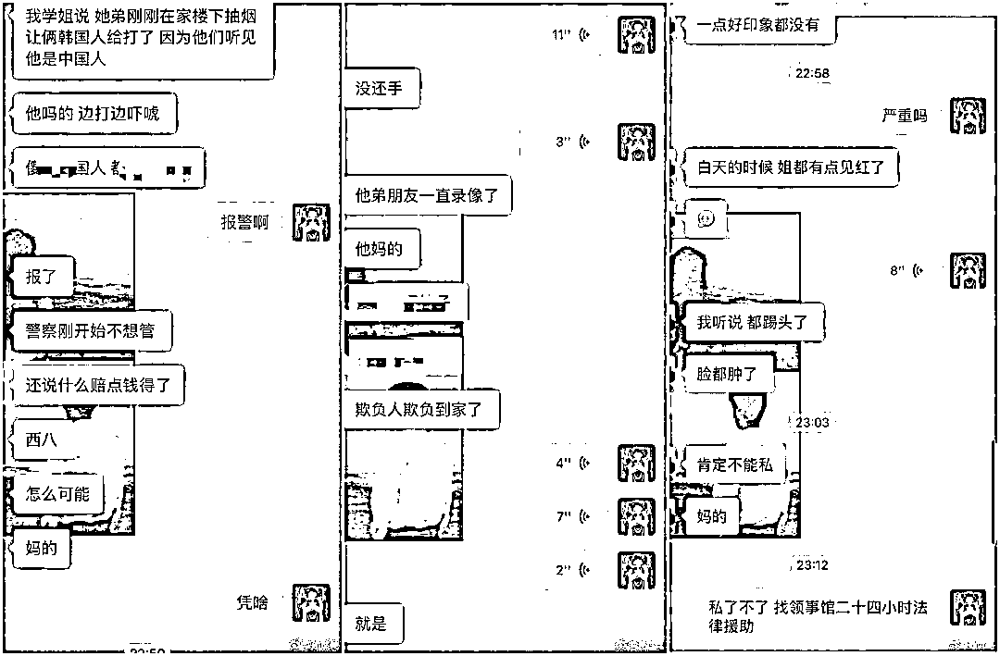

# 外交部、韩国警方回应"中国留学生在韩被殴打"

> 原文：[`mp.weixin.qq.com/s?__biz=MzIyMDYwMTk0Mw==&mid=2247529555&idx=6&sn=2cafe5469837c0dc3306a81e71124379&chksm=97cbbf6ba0bc367d6373d40242906fe34b7cad20e95278dbaf1c19525f9b26522eaf58c1cc60&scene=27#wechat_redirect`](http://mp.weixin.qq.com/s?__biz=MzIyMDYwMTk0Mw==&mid=2247529555&idx=6&sn=2cafe5469837c0dc3306a81e71124379&chksm=97cbbf6ba0bc367d6373d40242906fe34b7cad20e95278dbaf1c19525f9b26522eaf58c1cc60&scene=27#wechat_redirect)

9 日，有网友爆料称，因为冬奥会，中国留学生在韩国遭到殴打，引发舆论关注。随后，中国外交部领事保护中心官方微博表示，驻釜山总领馆已联系当事人了解情况并提供积极协助，协调当地警方立案调查。 

11 日，韩国官方通讯社韩联社称，记者今日获悉，釜山警方 9 日接到报案称一名中国留学生被两名韩国男子当街殴打。在将两名施暴者带回讯问后，警方认为，本案与冬奥判罚引发的“反华”情绪并无太大关系。同日，我国外交部就中国留学生在韩遭攻击一事表态，表示中方对这件事‌‌高度关注，将全力维护在海外的‌‌中国公民的合法权益‌‌和人身安全。

韩联社报道截图

在微博爆料“中国留学生在韩被殴打”一事的是网友@孙世曼。9 日晚 23 点 42 分，@孙世曼 上传了 6 张图片，并配文称：“就因为冬奥会，然后韩国人就可以莫名其妙的殴打在韩国的留学生？”

@孙世曼 发布的图片前 3 张均是聊天截图，内容是有人表示，自己学姐的弟弟在楼下抽烟，却“让俩韩国人打了，因为他们听见他是中国人”。此人继续说，已经报警，被打者没有还手，其在现场的朋友已录像，“我听说都踢头了，脸都肿了”。根据@孙世曼 发布的第 6 张图，被打者的头皮已渗出血点。

10 日，@孙世曼 继续在微博跟进此事。凌晨 1 点 6 分，@孙世曼 表示，被打者将去验伤，“我们不接受大事化小小事化了”。@孙世曼 还称，“韩国警察说是摩擦？什么摩擦？我们根本就没还手，我们也不需要你经济赔偿。那以后是不是你们韩国人打完我们，赔钱就可以了？而且真的是摩擦，你们跑什么？”

根据@孙世曼 发布的 3 张聊天截图，向其描述此事的人称，打人者共有 2 人，一人与被打者同住一栋楼，另一人应该是他的朋友，“现在跑了”。

10 日上午 11 点 39 分，@孙世曼 公开事发时现场视频，并表示，“打人的两个韩国人！已经报警处理了！！！欺人太甚，有一个就住在受害人的楼下，他知道施暴的位置没有 cctv（监控）。所以朋友拿出手机拍摄的时候已经有些晚了，是这两人同时施暴。”

根据视频，开头便是两名韩国男子在车库围着一位倒地的男子。随后其中一人见有人录像，就直冲着拍摄者走来，边走边指着拍摄者，似乎想要抢手机制止录像。在看到一名女子走近后，这名男子才转身不再跟着拍摄者。

拍摄者躲到一旁，将镜头对准另一名正在施暴的男子。该男子一边用手撑墙，一边用脚多次狠踢坐在地上的男子。最后，在另一人的呼唤下，此人才走开。

在@孙世曼 的接连发文爆料下，“中国留学生在韩被殴打”一事引起国内网友极大关注。许多人十分愤慨，要求对此事展开调查。不少人还提醒在韩同胞注意安全，保护好自己。

中国外交部领事保护中心也注意到此事，官方微博@领事直通车 10 日下午 17 点 40 分转发@孙世曼 的微博，表态称，“我们对此高度关注。驻釜山总领馆已联系当事人了解情况并提供积极协助，协调当地警方立案调查，并将持续跟进。我们将全力维护在海外的中国公民的合法权益和人身安全。”

11 日，韩国官方通讯社韩联社发文报道此事。文章称，据记者 11 日获悉，釜山警方 9 日接到报案称一名中国留学生被两名韩国男子当街殴打。

报警人称，9 日晚 8 点 50 分许，在釜山市南区的大渊洞街头，20 多岁的中国籍留学生 A 某遭到 30 多岁的韩国籍男子 B 某等 2 人的殴打。釜山警方随后将两名施暴者带回派出所进行了简单的讯问。

报道特意提及了@孙世曼 的帖文，称“事发后，疑为 A 某挨打的视频在微博上广泛传播，贴文称中国人因北京冬奥会在韩被打。”

针对这一点，韩联社的报道称，警方认为，本案与冬奥判罚引发的“反华”情绪并无太大关系，只是因走路时撞肩引发的争执。“据警方了解，加害人没有专门针对中国人施暴，将传唤加害人进一步了解情况。”

在此需要注意的是，近期，在一些韩国媒体和政客的臆测与煽动下，韩国国内“反华情绪高涨”。10 日，韩国总统文在寅接受韩联社、新华社等全球八大通讯社联合采访，更是被问及在“反华”情绪以年轻一代为中心不断蔓延的情况下，如何才能打造面向未来的韩中关系。

对此，文在寅强调，韩中需要深化经贸合作并努力使两国国民从中获益，尤其需要增进年轻一代的彼此理解，拉近友好感情。

另外，值得一提的是，11 日下午，我国外交部就中国留学生在韩遭攻击一事表态。外交部发言人赵立坚表示，我们对这件事‌‌高度关注。中国驻釜山总领馆已经联系‌‌当事人‌‌了解情况，并提供积极协助，‌‌协调当地警方‌‌立案调查，‌‌并将持续跟进。‌‌我们将全力维护在海外的‌‌中国公民的合法权益‌‌和人身安全。

来源：观察者网

← 向右滑动与灰产圈互动交流 →

