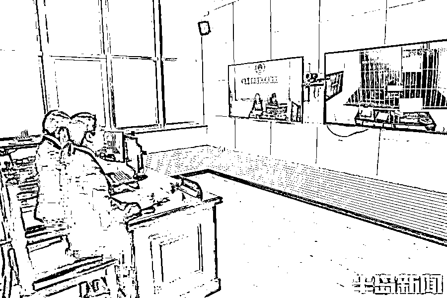

# 涉及 4 万余人，流水超 46 亿元…一帮人在青岛开发了个“社交 APP”，结果全栽了

> 原文：[`mp.weixin.qq.com/s?__biz=MzIyMDYwMTk0Mw==&mid=2247529602&idx=1&sn=7ad148eab0d158eb873c062d323e2a36&chksm=97cbbfbaa0bc36ac9b90b3f73fd15767149e556b6ed828cfc037282ce4566cbe7c14d21c65dd&scene=27#wechat_redirect`](http://mp.weixin.qq.com/s?__biz=MzIyMDYwMTk0Mw==&mid=2247529602&idx=1&sn=7ad148eab0d158eb873c062d323e2a36&chksm=97cbbfbaa0bc36ac9b90b3f73fd15767149e556b6ed828cfc037282ce4566cbe7c14d21c65dd&scene=27#wechat_redirect)

随时能都在线撩妹

还能抢红包赚大钱

……

2020 年 6 月份

赌徒刘某峰找到老乡

组团开发了这样一款社交 APP

不到半年时间

涉及全国范围内**4 万余人**

流水金额超过**46 亿元**

**提现金额达**3.3 亿元****

****查获赌资超过**2700 万元******

************

******没错****** 

******事情真的不简单******

******团伙成员被一锅端****** 

********组团开公司打掩护********

******躲幕后操盘开赌场 ******

****这是青岛李沧区破获的第一起网络赌博平台设在本地的案件。****

****因涉及面广，案情复杂，该案被列为公安部督导案件。****

****案件的主要幕后操盘手刘某峰，2018 年就因为犯开设赌场罪被判处有期徒刑二年，缓刑二年。****

****吸取上一次的教训，他从前台躲到了幕后。2020 年 5 月份，他找到了同村的刘某伟，商量在网上开赌场的事情。****

****刘某峰跟老乡说，他以前接触过网络发红包赌博的平台，认识很多参与赌博的人，开发这种赌博平台很赚钱，他们可以开发一个 APP 平台，建群发红包赌博可以赚钱。****

****刘某峰称，之前是不小心才被警方抓获归案，现在他总结了经验，放心大胆一块发财就行。****

****听刘某峰已经有了详细的方案，刘某伟禁不住金钱的诱惑，就打算合起伙来一块干。****

****由于刘某峰信誉不好，是黑户，开不了卡，成立不了公司。具体开公司的流程，软件的后期运行等，都由刘某峰来负责，刘某伟只需要出钱担任公司法定代表人就可以。****

****公司成立后，刘某峰负责联系技术人员开发 APP 软件，还负责拉拢人员到平台建群参赌，盈利了两个人平分。****

****2020 年 5 月份，两个人一拍即合，刘某峰又联系周某、郭某、雷某等人，共同出资在李沧区成立了一家网络平台公司，所有股东按照不同比例分成。****

****一伙人前后共投入 100 多万，用于软件的开发以及维护等。****

****他们的盈利方式也是多种多样，参赌人员想要升级群人数，将赌资提现等都需要收费。****

******专人“拉手”引流 ******

******群里抢红包赌博****** 

****作为整个线上赌场的幕后操盘手，刘某峰还以客服身份在赌博群中收集、汇总信息，并处理投诉。****

****同时，他也联系专门的“拉手”，负责给平台引流，吸引更多的人参与赌博。****

****办案检察官说，网络赌博分工越来越明确，逐渐催生出一些灰色产业链。****

****有专门的人员负责拉人引流，群主要按比例给提成。他们会在各大游戏平台或者聊天软件里发广告，有一款可以抢红包的软件。****

****注册会员以后，可以在群里玩抢红包的游戏。据了解，抢红包的踩雷规则是群主制定，现在都是群成员和群主两人的赌博，群主组建群，自己注册多个账号，再拉进来参赌群成员。群成员在群里发红包，根据红包尾数数字是否与红包设定的雷数相同，如果相同为踩雷了，踩雷者就要输给发包人红包金额的倍数，只能是群主和群主的小号抢，如果有群成员抢包了，群主就把这个抢红包的群成员踢出群。****

****为了吸引别人参与的兴趣，群主利用注册多个微信号，不停地玩游戏。****

****群主在群里左手倒右手，参与的人员偶有小赔，但是挣钱的时候居多，一次就能赚几百元。****

****“挣钱原来这么简单”，很多人在群里看了一阵后，也想着试一试。结果进入群聊以后，偶尔小赚一点，最后都赔进去不少。有些在朋友的介绍下玩起了这个游戏，结果被套越陷越深。****

****这些群主有些是群成员自己单独建群，有一些则是刘某峰等幕后操盘手找来的。群主作为庄家赢来的钱，也需要给平台进行分成。****

#### ******赌博平台疯狂吸金 ******

#### ******团伙成员被一窝端******

****2020 年 5 月份，该公司开发的软件正式上线，参与到该软件平台上赌博的人迅速增多。****

****到了 2020 年 10 月份， 参赌人员达到了高峰期。每一天平台有上百个群聊，参与人员也来自全国各地，人数超过 4 万人。****

****疯狂的赌博行为很快引起了警方的注意。2020 年 10 月份，青岛市公安局李沧分局接到公安部网警平台推送李沧区某网络科技公司运营某魅 APP 可能涉赌的警情，公安机关立即组织精干力量进行调查。****

****专案组民警通过分析研判发现，刘某峰是主要的操盘手之一。刘某峰经常登录该平台，并掌握该 APP 管理密码、后台运营细节。****

****2020 年 11 月 12 日，民警在莱西一家酒店内将刘某峰抓获归案。随后，该软件运营公司的法定代表人等陆续到案，整个团伙被一窝端。****

****然而，落网后的刘某峰以及公司法定代表人刘某伟等，并没有显得很慌张，似乎早已做好了准备。****

****刘某峰拒不交出后台管理运营的账户以及密码，辩称他们建立的平台就是用来聊天的。具体在平台上聊什么，他们都不知道。****

****很快，细心的专案组民警发现，在抓捕过程中，后台人员有所察觉，删除了所有的记录。****

****专案组民警调取赌博网站数据时发现记录全部丢失，而且该赌博软件的两大托管平台均称赌博软件所有后台数据找不到了……”此时，案件陷入僵局。****

******数据库被删陷僵局 ******

******资金去向露马脚****** 

****2020 年 12 月，该案被移送至李沧区检察院。****

****办案检察官分析，基本所有的社交平台，都会有自己的记账系统，他们下达指令以后，通过第三方支付平台来操作。****

****赌博的数据往来必然伴随着资金往来，可以从第三方支付的平台数据进行入手。****

****办案检察官及时引导公安机关，从间接证据入手形成完整证据链来证实犯罪事实。****

****随后，侦查人员及时找到第三方支付平台，证实了该赌博平台资金进出情况。****

****经过调查了解到，2020 年 5 月份，刘某峰找到该公司，双方之间签订了第三方支付服务。截止到案发，平台用户一共充值 37 万余笔。****

****直到此时，刘某峰仍然负隅顽抗，一直辩称网站只是用来交友，而且他们还有商城模块。他们有自己的仓库，资金的往来账目都是会员买卖商品产生的。****

****此时，这款 APP 已经无法登录，后台数据更是被删除，无法验证他们的说法。****

****正当他们自以为无懈可击的时候，办案检察官指出整个案件证据链的关键。****

****办案检察官分析，如何对该 App 定性、是否涉及网络赌博，主要看犯罪嫌疑人所说该 App 是购物商城的说法是否有证据证实，是否有交易记录的提取和分析。商城是否真实存在，可以看仓库的进出库记录。该公司所在地并不远，就位于李沧区，非常便于取证。****

****随后，公安机关立即对两人所说的商城展开实地调查。民警来到该公司所在地发现，他们既没有仓库，也没有出库记录，所谓的网上商城只不过是用于迷惑人的幌子。****

****民警通过固定第三方支付平台关键证人证言，明确了第三方支付平台与赌博平台之间的资金关系，证实了赌博平台资金的进出情况，为确定赌资数额打好了基础。****

********

****办案检察官远程讯问犯罪嫌疑人****

******固定七千多万条数据 ******

******专案组请来专业事务所****** 

****证实了两个“账本”之间的关系，涉及到具体的诉讼，需要明确每一条数据的资金往来。而提取的电子数据多达七千多万条，这个专案组的工作带来了新挑战。****

****但因人员、经验、设备等原因可能耽误分析时间，检察官建议由有资质的事务所专业人员对该案涉及的参赌人数、涉案金额等进行专项审计。****

****侦查机关也采纳检察机关意见，及时委托专业事务所对相关资料进行审计，形成专项审计报告。在之后的庭审过程中，法院完全采信该审计报告，为顺利办结此案打下了扎实的基础。****

******涉案流水超 46 亿 ******

******幕后操盘手全落网****** 

****最后，面对铁一般的证据，刘某峰再也无法抵赖，如实交代了在网上开设赌场的事实。刘某峰供述，2018 年 11 月份，他因为网络赌博被判处有期徒刑二年缓期二年。****

****他回到老家以后，也没有去找正式的工作，反而倒腾起了二手车。由于不精通这个行业，不仅一分钱没挣到，反而把从朋友那里借来的钱也赔光了。为了还钱，他打算重操旧业，在网上开赌场挣钱。****

****于是，他找到了老乡刘某伟担任公司法定代表人，又找了其他朋友出资作为股东。整个 APP 的运营以及后期技术管理，都由他来负责协调。****

****运行了半年多时间，在平台上聊天赌博的人越来越多，各个股东也收入不菲。****

****为了躲避打击处理，在警方抓捕的过程中，由其他人员将平台的数据库删除。****

****再加上设置了专门的商城，自以为天衣无缝的计划，没想到还是被民警跟检察官识破。****

****最终，**法院以开设赌场罪分别判处刘某峰、刘某伟有期徒刑八年九个月、六年九个月，各并处罚金。**宣判后，二人未上诉，判决已生效。目前，其他涉案人员也陆续被提起公诉，案件正在进一步的办理过程中。****

****来源：半岛都市报，利箭在行动****

****************

****← 向右滑动与灰产圈互动交流 →****

********