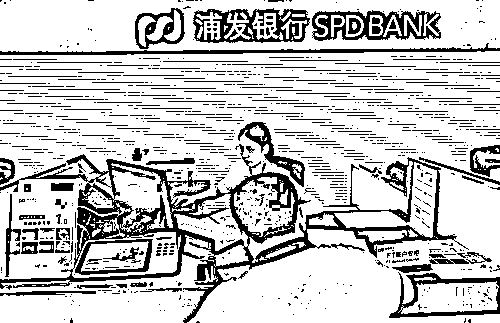
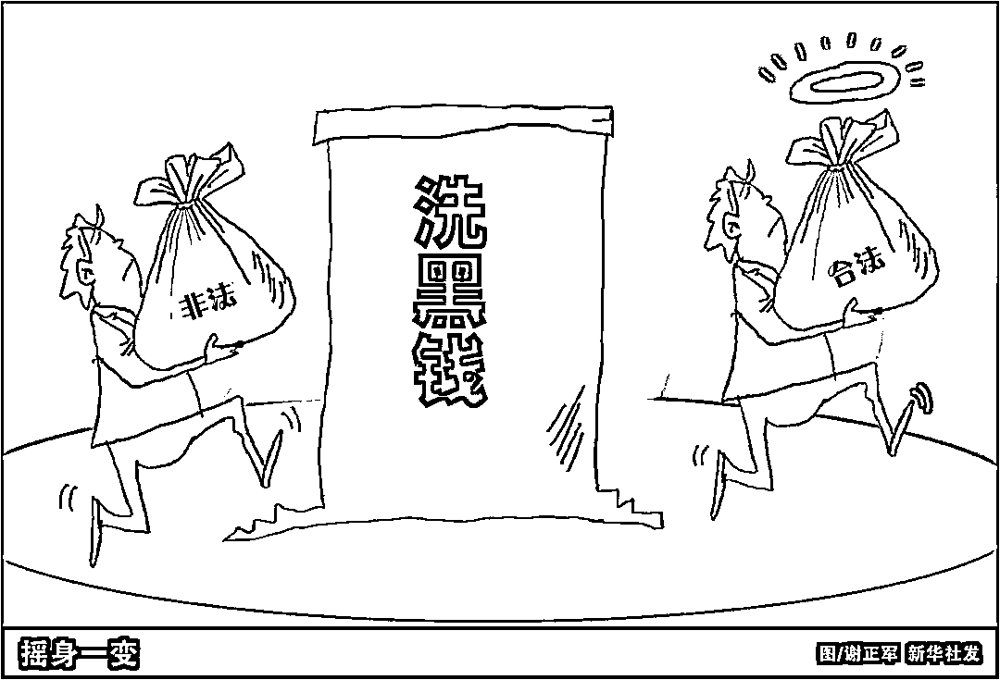

# 5 万元以上现金存取要登记？原来是这个原因！

> 原文：[`mp.weixin.qq.com/s?__biz=MzIyMDYwMTk0Mw==&mid=2247529602&idx=4&sn=061f483faaf8180d10fbbe3656855a08&chksm=97cbbfbaa0bc36ac1acaae68ece5ef166e9525aa9d196945d080ac70f4aadd5e019ed84a6228&scene=27#wechat_redirect`](http://mp.weixin.qq.com/s?__biz=MzIyMDYwMTk0Mw==&mid=2247529602&idx=4&sn=061f483faaf8180d10fbbe3656855a08&chksm=97cbbfbaa0bc36ac1acaae68ece5ef166e9525aa9d196945d080ac70f4aadd5e019ed84a6228&scene=27#wechat_redirect)

3 月起，个人存取现金有了新要求：**存取现金超 5 万元或需登记资金来源、用途。**不少人对此有些疑惑：为啥存取现金要登记？这会不会使存取现金变得不方便？

其实，这一要求来自中国人民银行、银保监会、证监会 1 月共同发布的新规——《金融机构客户尽职调查和客户身份资料及交易记录保存管理办法》，**该办法将从 3 月 1 日起实施。**

办法明确提出：商业银行、农村合作银行、农村信用合作社、村镇银行等金融机构为自然人客户办理人民币单笔 5 万元以上或者外币等值 1 万美元以上现金存取业务的，应当识别并核实客户身份，了解并登记资金的来源或者用途。

**为何推出这一规定？**

人民银行有关司局表示，**出台该办法是为了预防和遏制洗钱等违法犯罪活动，保护人民群众资金安全和利益。**

近年来，电信诈骗、非法集资、非法传销、跨境赌博、地下钱庄等违法犯罪活动较为猖獗，严重危害人民群众利益。人民银行相关人士介绍，通过对电信诈骗案件的梳理发现，由于现金匿名、难以追踪的特点，犯罪分子往往偏好使用现金进行交易活动。金融机构依法适当加强对现金存取款活动的管理，有利于防范违法犯罪活动，有利于保护最广大人民群众的根本利益。

从实践经验看，近年来我国金融机构不断加强洗钱风险管理，发现了不少涉嫌违法犯罪活动，保护了人民群众资金安全。

2021 年 9 月，一对老年夫妇到河南郑州某银行取现 9.5 万元，银行工作人员询问取款用途时，老人告知要买保健品。因担心老人受骗，银行工作人员反复劝说老人谨防受骗。因老大爷没带身份证无法取大额现金，银行工作人员在老大爷回家取身份证的过程中，不停劝导、安抚老太太，并联系民警。**最终经过民警与工作人员的劝阻，为老人挽回 9.5 万元经济损失。**

图为在浦发银行海口分行，一名银行工作人员在为客户办理业务。

**存取现金便利程度会受到影响吗？**

人民银行有关司局负责人明确表示，**金融机构执行该规定不会影响居民正常现金存取款业务，便利程度也不会受到影响。**

“存款自愿”“取款自由”早被写进商业银行法，居民合法收入的存取业务在我国一直受到法律严格保护。

近年来，为防范电信诈骗、洗钱等违法犯罪活动，不少金融机构从“以客户为中心”的理念出发，在办理大额现金存取业务时对资金的来源和用途进行必要了解和提示，形成了一些经验做法。

前几年有个案例，有位老人在一名 30 多岁男子陪伴下到湖北武汉某银行取款 10 万元。在取款过程中，老人对于钱款用途闪烁其词，同来男子只在远处看着老人，情形较为异常。银行工作人员劝老人联系家人确认取钱，同时报警，而同来男子在民警到达前匆忙离开银行。民警了解到，该男子是老人通过网络认识的微信好友，并给老人介绍了所谓的“高息”金融业务。

人民银行相关人士介绍，正常情况下，金融机构不需要客户填写信息或者提供证明材料，金融机构在简单询问了解后即可直接为客户办理现金存取业务并登记相关情况，**只有发现交易明显异常、有合理理由怀疑交易涉嫌洗钱等违法犯罪活动时，才会向客户进一步了解情况。**

另外，业内人士表示，《金融机构客户尽职调查和客户身份资料及交易记录保存管理办法》完善了反洗钱监管制度，有利于与反洗钱国际标准接轨。

据了解，金融行动特别工作组反洗钱国际标准明确要求，金融机构应当对超过一定金额的现金交易开展尽职调查。作为其成员，我国也要落实反洗钱国际标准的要求。**况且，全球主要国家对一定金额以上的现金交易都有类似要求。**

人民银行的数据显示，目前，我国超 5 万元人民币的现金存取业务笔数仅占全部现金存取业务的 2%左右。在人民银行相关人士看来，新要求对客户办理现金业务影响较小。

**如何确保资金来源和用途等客户信息得到保护？**

“为存款人保密”被明确地写入商业银行法，所以金融机构对业务办理过程中获取的个人信息、客户隐私必须严格保密。**泄露个人信息、客户隐私，银行及其工作人员要承担法律责任，情节严重的还要承担刑事责任。**

人民银行相关人士表示，将持续关注并指导金融机构严格执行相关规定，把握好防范风险和优化服务的平衡，严格保护公民个人信息和隐私。下一步，人民银行将指导金融机构制定实施细则，在认真履行反洗钱义务的同时，要严格执行最少、必要原则去了解登记客户信息，不得增加客户负担。尤其是针对老年人等现金使用较多的群体，金融机构要主动提供更加友好便利的服务。

来源：新华社（ID：xinhuashefabu1）

← 向右滑动与灰产圈互动交流 →

