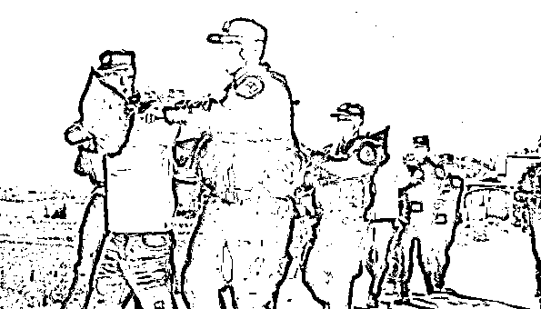
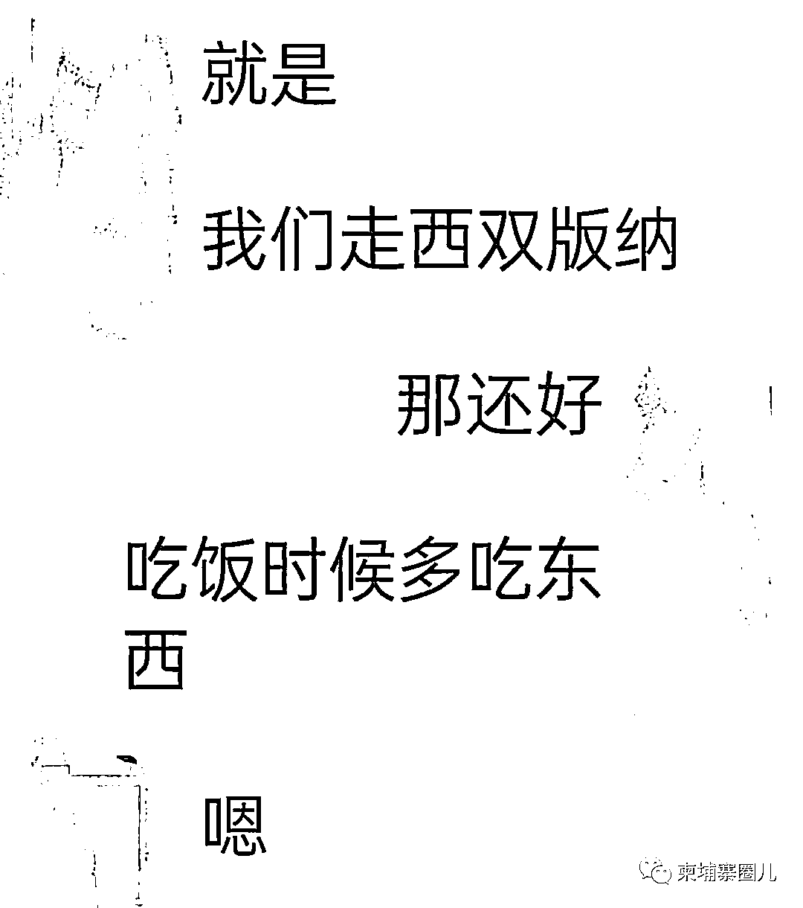
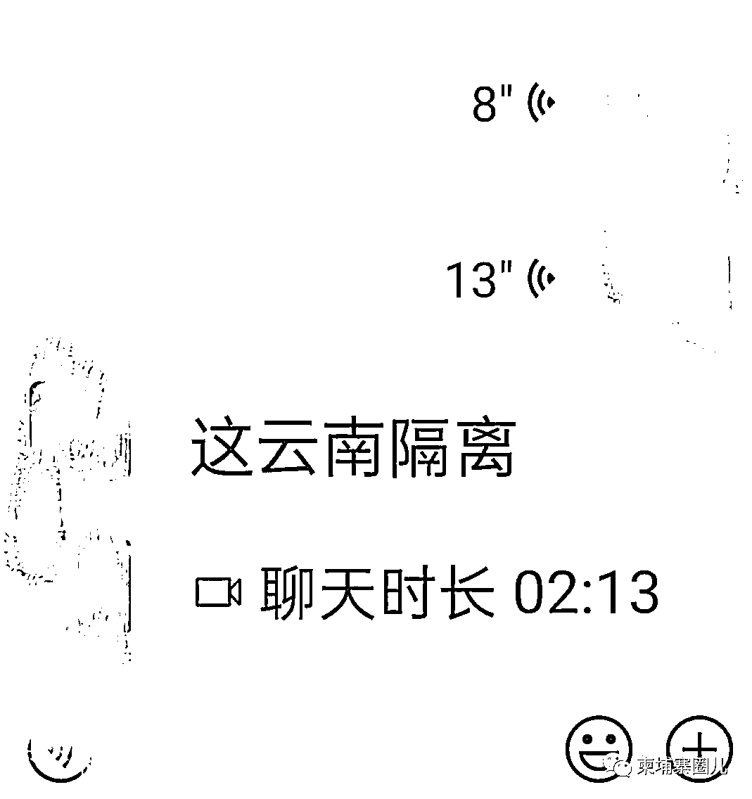
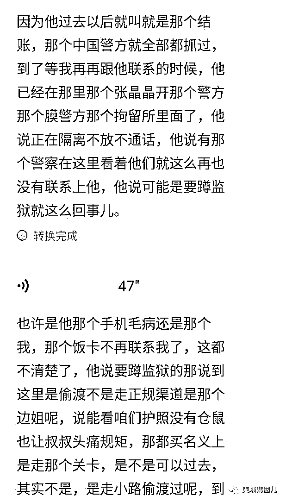
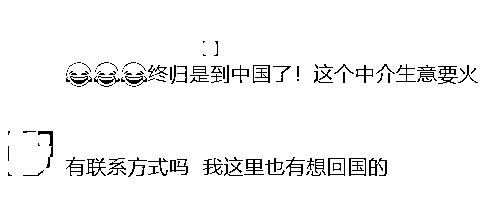

# 被骗 24 万！8 名中国人从柬埔寨偷渡回国被抓，黑中介逍遥法外！

> 原文：[`mp.weixin.qq.com/s?__biz=MzIyMDYwMTk0Mw==&mid=2247529602&idx=5&sn=6c6002d5566ed97ed11c9fbc1dfb1227&chksm=97cbbfbaa0bc36acc28009ddef26a99ace634b1a437bd3197dfcabf953b15da9ddcfb8c646bd&scene=27#wechat_redirect`](http://mp.weixin.qq.com/s?__biz=MzIyMDYwMTk0Mw==&mid=2247529602&idx=5&sn=6c6002d5566ed97ed11c9fbc1dfb1227&chksm=97cbbfbaa0bc36acc28009ddef26a99ace634b1a437bd3197dfcabf953b15da9ddcfb8c646bd&scene=27#wechat_redirect)

在疫情这样的特殊时期，尤其回国航班还未增加恢复的情况下，回国还真不是一件“心急”的事。

近日，一名网友向**柬埔寨头条**爆料，此前与他一起工作的瓦工老张迫切回国，结果上当受骗。

包括老张在内，**8 名中国人被黑中介诱骗从柬埔寨偷渡回国，每人被骗了 3 万人民币，他们铤而走险，走山路悄悄从云南入境中国，最后被边防警察全部抓捕，还面临牢狱之灾**。

**8 名中国人从柬埔寨偷渡回国** 

**每人被骗 3 万元，刚到云南全部被抓**

这名网友表示，老张在柬埔寨已经待了三四年时间，因迫切回国，他通过微信渠道进入一个从柬埔寨邻国陆路回国的群。虽说正规渠道回国，但实际上是在组织“偷渡”，一旦把人带到中越边境，就不管了。

**在黑中介的组织下，老张与另外 7 人组队（其中有 2 名网投小孩，没护照），每人缴纳 3 万人民币，从金边出发，辗转越南陆路回国**。

网友说，当时他告诉老张，从柬埔寨出发，经过越南到中越口岸，走正常通道回国。老张当时如同一头固执的牛，劝都劝不听，非要通过这个途径回国。

*图片来源网络 

由于此前听说陆路回国有偷渡、被卖人头等各种“坑”，因担心老张遇到突发情况和危险，所以老张从金边出发当天，他们两人一直通话直到越南边境。

据了解，老张等 8 人搭乘一辆车从金边到越南边境后换了车，期间他们换乘好几次车。只能跟着走，不能多问、也不能多说话，一路上吃住都是中介包揽，最后终于到了云南边境。

**与之前说的正规渠道不同，带路中介并非将他们送到边境口岸以正规途径回国，而是送到偏僻的偷渡小道****。中介指着对他们说，前面就是中国边境，顺着方向走就到国内了，随后扔下他们。老张等 8 人只能硬着头皮，顺着指引，悄悄从山路往云南方向走，最后被中国边防警方全部抓获**。

网友表示，后来再联系老张，得知他们 8 人已经被扣押在拘留所里面，老张回复说正在隔离，旁边有警察看守，不方便通话，结束隔离后他们要受到法律惩处蹲监狱。

网友还说，老张他们要蹲多久监狱，他也不清楚，因为后来两人不联系了。 

他认为，大家在柬埔寨拼搏真的很不容易，尤其是在不景气的经济下挣钱更难，比如老张，好不容易攒这几万人民币，被骗不说，还违反多国法律偷渡，最后被严惩。而偷渡过程中无论生命安全、健康风险都非常高。

假如老张他们 8 人没有被中国边防警察抓获，神神秘秘的回到国内，若自身携带病毒，回国后无心的传播给他人，造成城市疫情蔓延，也是千古罪人，罪加一等。

然而，把他们 8 人送上犯罪道路的黑中介却坐收 24 万，逍遥法外，继续组织和策划偷渡，霍霍那些迫切想回国的人！

不过此文在柬埔寨头条发表后，也有网友表示，宁愿坐牢也要偷渡回国。

在此提醒在柬同胞，回国固然重要，但它不是一件可以“心急”的事情，一定要通过正规渠道回国，这次幸亏这些人还有点良心，要是碰到更没有良心的黑中介，直接将你丢在半路上，让你叫天天不应，叫地地不灵。

如果偷渡途中万一碰到什么风向，想都不用想，这些黑中介绝对先将你们当做弃子抛弃。

所以，上面 8 个人已经是不幸中的万幸了。

来源：柬埔寨头条，我在柬埔寨

← 向右滑动与灰产圈互动交流 →

