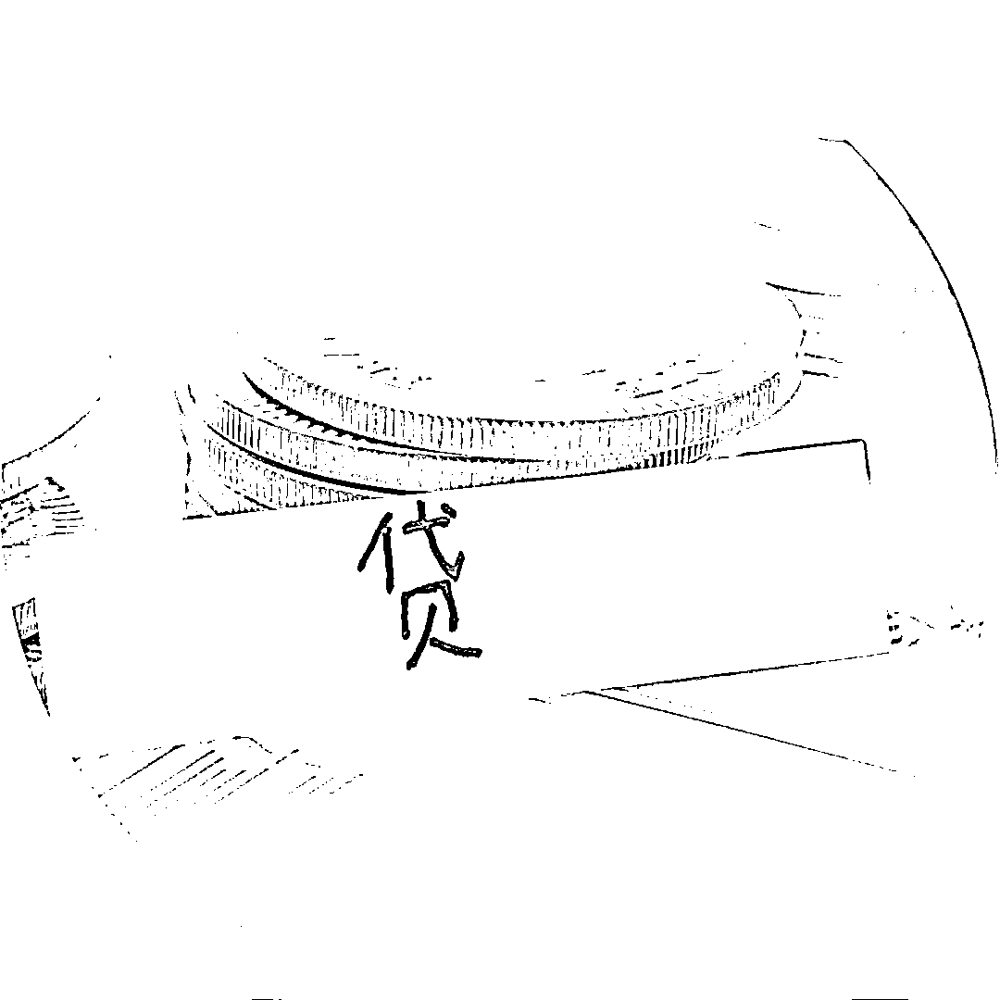
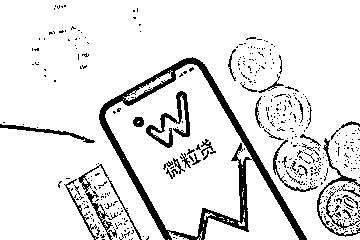
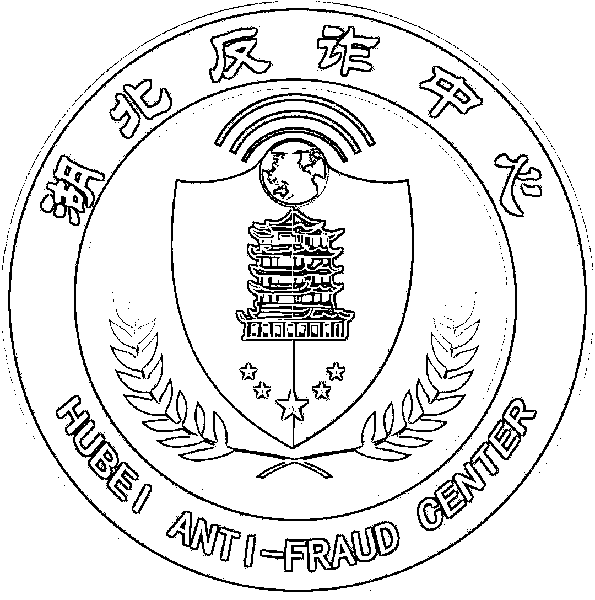

# 极速放款？随借随还？

> 原文：[`mp.weixin.qq.com/s?__biz=MzIyMDYwMTk0Mw==&mid=2247529602&idx=6&sn=9044f5258396a469e65c72c41674ced3&chksm=97cbbfbaa0bc36acb8362a3426ad754295d98ba7c9c35b1a045410cc49fcf09984f5ffe1232c&scene=27#wechat_redirect`](http://mp.weixin.qq.com/s?__biz=MzIyMDYwMTk0Mw==&mid=2247529602&idx=6&sn=9044f5258396a469e65c72c41674ced3&chksm=97cbbfbaa0bc36acb8362a3426ad754295d98ba7c9c35b1a045410cc49fcf09984f5ffe1232c&scene=27#wechat_redirect)

[`v.qq.com/iframe/preview.html?width=500&height=375&auto=0&vid=wxv_2264443602334547971`](https://v.qq.com/iframe/preview.html?width=500&height=375&auto=0&vid=wxv_2264443602334547971)

看准了投资项目

选中了心仪商品

突然有大额花销

……

着急用钱的时候

**找亲友不好开口**

（还钱之后，人情债该咋算？）

**银行贷款程序繁琐**

**极速放款!**

**网络贷款  手续简单** 

**利息低廉  无需担保** 

**办理快捷  随借随还**

这时手机电脑

弹出的小广告

**让人眼前一亮**

可是你知道吗 

**贷款怎会如此简单？**

**这往往是骗局的开始！**

本文开头的微电影

源自一则**真实案例**

村民常某打算从事水产养殖，手上还缺数万元承包费。正想着如何凑钱时，他的手机收到一条**低息无抵押贷款**的短信。常某点击短信提供的网址链接，下载了“微粒贷”APP。

按要求填写身份信息、手机号码、银行卡号申请贷款之后，他惊喜的发现，“微粒贷”APP 显示其贷款已经到账。可是，常某准备提现时却被告知，其**银行卡号填写错误导致贷款被冻结**。他赶紧联系客服，咨询如何解决问题。在“客服”的指导下，常某下载了“友客”聊天 APP。对方在“友客”平台上说，需要**转账 1 万元解冻金到指定银行账户**，随后解冻金会跟贷款一起提现。常某按照“客服”的要求转了“解冻金”，却仍然无法提现。这时，“客服”表示，需要按照贷款金额 1:1 转账两次，通过认证之后才能解冻。他**再次转账两笔共计 6 万元至指定账户**，仍然提现失败。常某这才意识到自己被骗，立即到当地派出所报警。一番操作下来，**钱没借着，反倒把自己辛苦攒下的 7 万元全搭进去了！**

**网贷套路骗局盘****点**

**01**｜**凭身份证就能贷款？**

贷款广告声称，仅需一张身份证就能贷款。换位思考一下，如果你是贷款公司是老板，**仅凭一个身份证，你敢轻易贷款给别人？**

真相是要么骗钱、套取公民个人信息，要么只是小额贷款公司的宣传语而已，真正办手续的时候，就会要你提供收入证明、工作证明和征信报告。

**02**｜**大大低于银行利息？**

那些声称贷款利息比银行还要低的金融机构，你一定要谨记这句话——**天上不会掉馅饼！**

对方很可能让你一步一步地缴纳各种费用，最终拉黑走人。

**03**｜**提现要缴纳费用？**

正规贷款机构对需要收取的手续费等各项费用，一定会在协议中明确标示出来，让当事人清楚知晓，而且在**贷款成功发放后才开始收取**。

各大银行办理信用卡，只有等卡审批下来并激活正常使用之后，才会扣除相关管理费用。

**那些贷款没下来就要求交钱的，基本都是诈骗!**

**04**｜**可以“强开蚂蚁借呗”？**

最近有人打着“强开技术”的幌子，声称能想办法开通蚂蚁借呗，“**收费 800 元，包出 2 万以上额度。”**

等你掏钱买了“强开技术”，对方再装模作样地发来一套所谓的“教程”。用过之后，你发觉依然强开不了，再联系对方，早已被其拉黑。

**05**｜**填完信息银行卡就空了？**

骗子将事先编好的贷款信息，以短信、微信和 QQ 消息等形式群发。待有人上钩之后，对方**发送“木马”程序安装包**，诱骗借款人按要求填入自己的银行卡号、密码等重要信息，随后将其卡内的余额一扫而光。

不要在不明网站和 APP 上输入**身份证号、银行卡号和密码、验证码**等重要信息。

**06**｜**登陆的网贷平台是山寨的？**

不法分子仿冒正规贷款机构的网络页面，打造**山寨平台**。

所以，大家搜索某个贷款机构或金融服务平台时，一定要**认清官网和推广之间的差别**。

1\. **不轻信**陌生来电和短信、微信、QQ 等信息，**不点击下载**任何**来路不明的网址链接和贷款 APP**。

2\. 任何声称**“无抵押”“低息或无息”**的网贷广告都存在极大风险，注意提高警惕。

3\. **凡是在未放款之前要求先缴纳各种费用的网贷行为，都涉嫌诈骗！****“保证金”“提现费”“解冻费”“提额费”“系统错误”“信息错误”**……全是不法分子的诈骗伎俩，千万别信！

来源：湖北反诈中心，阻击诈骗

← 向右滑动与灰产圈互动交流 →

