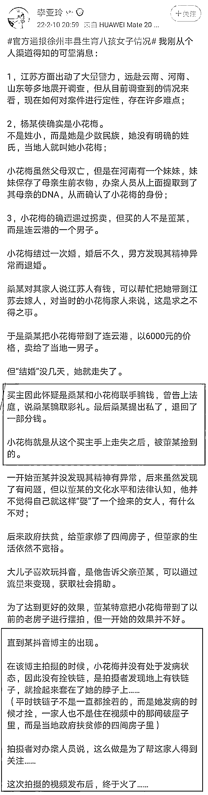
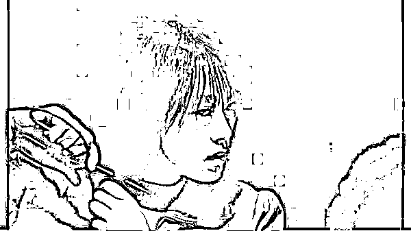
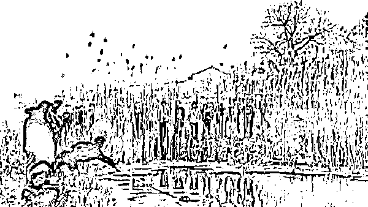

# 从不存在拐卖行为到第四次通报！啪啪啪啪，脸呢？

> 原文：[`mp.weixin.qq.com/s?__biz=MzIyMDYwMTk0Mw==&mid=2247529653&idx=1&sn=dce156c8450d2bbe55b8db6067b120ca&chksm=97cbbf8da0bc369b0a57491ffa8adc93ca4a11a7774298fcac1fbfbc9b78a194971547cdff01&scene=27#wechat_redirect`](http://mp.weixin.qq.com/s?__biz=MzIyMDYwMTk0Mw==&mid=2247529653&idx=1&sn=dce156c8450d2bbe55b8db6067b120ca&chksm=97cbbf8da0bc369b0a57491ffa8adc93ca4a11a7774298fcac1fbfbc9b78a194971547cdff01&scene=27#wechat_redirect)

终于等来丰县八孩女子事件的第四次官方通报。

通报内容包括三个方面，第一，经过科学验证，八孩女子确实是云南的小花梅；第二，承认拐卖行为，董某涉嫌非法拘禁被刑拘，桑某和时某涉嫌拐卖妇女罪被刑拘；第三，民政部门对董某子女进行处理。 

我在前天的文章[**《丰县「8 孩妈妈」事件：魔幻的三份官方通报下，老公居然接广告了！》**](http://mp.weixin.qq.com/s?__biz=MzIyMDYwMTk0Mw==&mid=2247529393&idx=1&sn=371dac1988768a59735d05724cd7ead0&chksm=97cbb889a0bc319fc72f7a4d0f4778d5acf44b63a0902014d0af584d259a291899bdf5769362&scene=21#wechat_redirect)提出质疑：她是不是拐卖的？

这次通报最大的进步就是公开承认存在拐卖行为，否定了第一次通报内容，狠狠打了丰县县委的嘴巴。

**为什么不叫打脸呢，事到如今已经找不到脸了。**

自 1 月 28 日事件曝光、丰县初次回应，到 1 月 30 日丰县再次回应，再到 2 月 7 日徐州公布调查进展。

毫不夸张地说，官方的几次回应都没能取得满意的结果，反而使得诸多质疑沸反盈天。

若不是网友持续不懈的追问，也许，就停止在第一份通报的“不存在拐卖行为”了。

那桑某妞、时某忠会继续逍遥法外，这桩罪恶也许还将继续隐匿下去。

**为什么这么多的人，要对这个事情打破砂锅问到底？**

**因为每一个人、每一个家庭、每一个父母，都可能遭遇到那该千刀万剐的人贩子，都会没有安全感。**

[`v.qq.com/iframe/preview.html?width=500&height=375&auto=0&vid=i3321sg1o8u`](https://v.qq.com/iframe/preview.html?width=500&height=375&auto=0&vid=i3321sg1o8u)

上篇文章我就说过，自己来查自己，自己监督自己，这结果你真能信服吗？

应该提级，或者异地调查。

**从“不存在拐卖行为”，到有人“涉嫌拐卖妇女罪”被刑拘，四次通告，四个版本，是基层官员的失误？还是有人从一开始就有意隐瞒？**

其中隐情，用脚指头都能猜到大有问题。

期盼能有更多的人，不要对苦难和不公视而不见，不要对罪恶和丑陋保持沉默。

**希望这起事件，能够推动相关法律的修订。**

**让锁在封县八孩女脖子上的铁链，拴到它该拴到的地方。**

网传 8 孩母亲失踪可能就是 26 年的四川女孩——李莹，因为长得太像了。然而，经过与李莹母亲 DNA 比对，8 孩母亲不是李莹。

那么，李莹，你在哪呢？

现在，终于有人因为“涉嫌拐卖妇女罪”被刑拘了，那么在丰县，还有没有类似的情况？

最迫切的是，网传同村还有一位“裹被女”，是否也涉及“拐卖”？调查组在调查小花梅时，有没有顺便调查一下这位“裹被女”？

说了那么多，推荐一部电影《盲山》。 

[`mp.weixin.qq.com/mp/readtemplate?t=pages/video_player_tmpl&action=mpvideo&auto=0&vid=wxv_2008617724461056000`](https://mp.weixin.qq.com/mp/readtemplate?t=pages/video_player_tmpl&action=mpvideo&auto=0&vid=wxv_2008617724461056000)

《盲山》是由 Studio Canal 公司于 2007 年 11 月 23 日在中国大陆发行的一部剧情片，由李杨执导，黄璐、杨幼安、贺运乐主演。

**该片讲述一名女大学生被人贩子拐卖至某法盲山区，多年后才被解救出盲山的故事。**

豆瓣瓣评分高达 8.6 分。

8.6 分是什么概念？虎年春节档电影口碑最好的《狙击手》也不过是 7.7 分。虽然《盲山》已经过去 15 年，商业价值已经不大，但放弃苦心拍摄的作品的版权，李杨导演仍然赢得了网友的赞许：**我们欠李杨很多张电影票！**

女大学生白雪梅毕业之后找不到工作，遇到“做草药生意”的一对男女，以为是碰到了好人，**充满了感激和对人生的向往。**

然后，这一对就把她带到西北的山区去“收购草药”。

结果就是一杯水下肚，证件和钱包全没有了，**而白雪梅也变成了 40 岁农民德贵的媳妇。**

明白自己是被拐卖了，白雪梅便想要离开。

她想求德贵放了她，**显然不可能。**

她以为村委会能够帮她。

**可是换来的只有德贵的强奸。**

**于是，她选择了死亡。这是对生命尊严的追求，失去尊严的生活不如死亡。**

**最可怕的就是求死尚不可得**，割脉的白雪梅被抢救了过来。德贵妈找来村里其他被拐卖的媳妇来劝白雪梅。

其他人的经历都差不多，她们劝白雪梅首先要活着，**逃不出去的，习惯这样的生活，有孩子就好了。**

也许是求死不得，也许是劝解有用，白雪梅不再求死，而是接受现状先活下来。

**她剪去头发，象征着重新开始，她不再求死，要活着逃出去。**

她成了表面上的德贵媳妇，承受着德贵的凌辱和虐待。

村里来了领导视察，她们这些被拐卖来的媳妇还要被拉出去躲着。

注意上图妇女们的眼神，白雪梅的忧伤和若有所思在其他人脸上看不到，**其他人都是淡然如常的表情，她们已然放弃了追求（逃跑），接受了现在的生活。**

白雪梅没有，白雪梅在亲近的嫂子的告诉下，知道了翻过最高的山头就有通往县城的公路。她翻过了山头见到了公路，却因为没有钱，汽车不愿意载她，在公路上被抓了回去。

德贵的表弟德诚是村上的老师，**他是唯一一个同情白雪梅的人。**

也是整个村上唯一一个给白雪梅带来希望的人，**他答应带白雪梅出去**。可是迟迟没有履行承诺，只是和白雪梅保持着性关系。奸情被德贵家人撞破之后，德诚一个人离开了村庄。

德诚虽然是渣男，可是他的这一回眸，**让人觉得他是真的同情白雪梅**，可能也真的想过帮白雪梅逃出去，只是他没有能力，也渐渐不愿放弃和白雪梅的交欢。

白雪梅始终没有放弃，她一封封的让邮递员给家里寄信，一次次的等待。

终于白雪梅又一次选择逃跑，**她用身体从小卖部老板那换来了四十块钱。**又一次翻过了大山跑到了公路上，并且到了县城坐上了离开的大巴。

可是还是被德贵从车上抓了回去。

**糟糕的是，白雪梅终于还是怀孕了。**

她也安稳了一段时间，教村里那些交不起学费的孩子念书，同时一封封的给家里寄信。

**这时，村里有女婴被丢水里淹死。**

**白雪梅担心自己也生个女孩子。**

是因为，生女孩很有可能也被扔掉；即使不扔，也有可能像自己一样被卖掉，过悲惨的一生。

白雪梅生了个儿子，**有了孩子的白雪梅还是没有放弃逃跑。**

可是，她教的那个孩子告诉她，邮递员把她写的信给了德贵。并且那个孩子愿意替她寄信。

白雪梅恨得想要杀了德贵，在德贵洗完头支使正在干活的她给拿毛巾的时候，手里的刀已经举了起来。

**孩子寄的信最终带来了自己的父亲和警察。**

可是**村民们发挥了人民群众的力量**，集体出动，拦住了警察。

**警察一行被逼的躲进村委会**，主任却指责警察没有和村委协商就直接办案，让他们先回去。

这两个警察竟然让白雪梅先留下，不然村民不会善罢甘休的。白父不愿回去，因为这一趟他已经花了几千块钱的解救费，他拿不出钱再来一趟了。

**警察承诺会再来，就走了。**

德贵要带走白雪梅，白父和他起了冲突。

**在德贵殴打自己父亲的时候，白雪梅再一次举起了刀，并且砍了下去。**

**影片到这里，走向了结束。**

**白雪梅的希望和追求也走向了结束。**

《盲山》拍摄于 2007 年，外景地是陕西秦岭。

根据导演李杨说，这部电影不但基于真实事件改编，连演员也基本都是非专业演员，除女主角白雪梅的扮演者是受过专业训练的演员，其他相关角色，全部都由当地民众或非职业演员扮演。

这是一个令人惊讶的事实，很难想象一个地方的本地民众，会毫不在乎的出演这样一部以展现本地丑恶行径为目的，会严重损害当地声誉的电影。

不过在影片中这些村民的本色出演，让人理解了他们为什么毫不在乎。

因为他们压根不认为这是什么大不了的事，不是罪，更不是恶，是本地风俗，是天经地义。

据李杨回忆，居然还有村民在得知是拍电影的前提下，还恬不知耻的来问：**“那个女娃娃（女主角）长得不错，干脆就卖给我吧。”**

也许正是这种真实的环境，让整部影片从头到尾，都弥漫着令人绝望的气息。

虽然是 2007 年的电影，现在看仍然一点都不过时，这是最有现实意义的电影，真实得让人绝望，痛苦得怒火中烧！

找个时间，去看一看吧。

来源：昌南大队长

← 向右滑动与灰产圈互动交流 →

