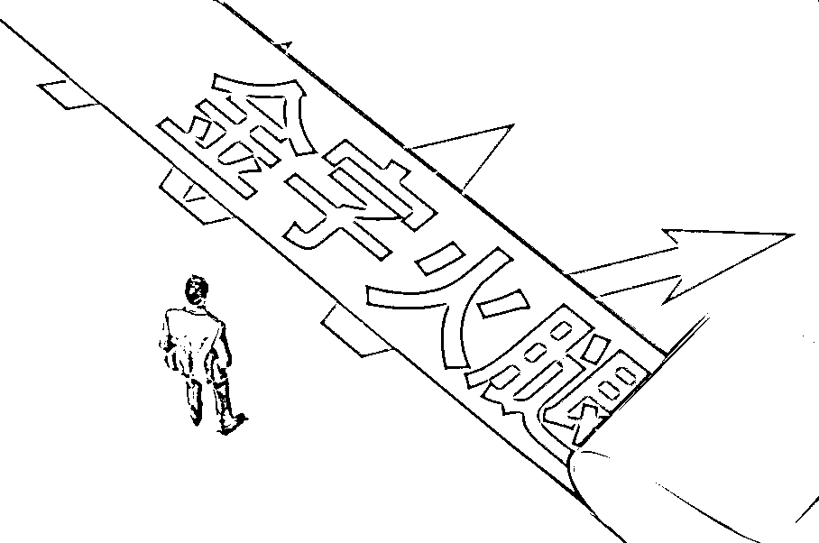
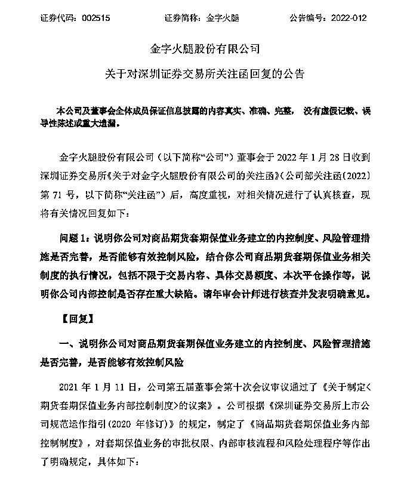
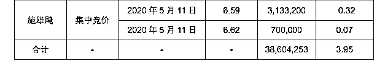
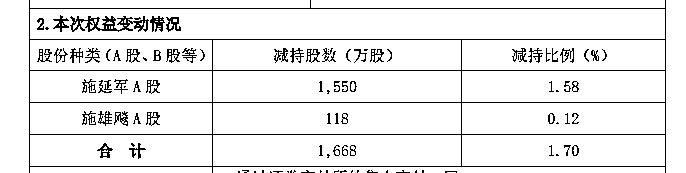
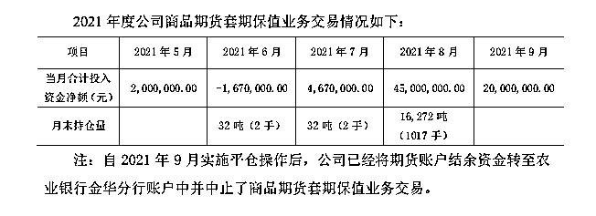

# A 股好岳父？交易员亏掉公司 5500 万，岳父借钱又卖股！三天就补上

> 原文：[`mp.weixin.qq.com/s?__biz=MzIyMDYwMTk0Mw==&mid=2247529653&idx=4&sn=7944e8a22453095888ff3ad975539b66&chksm=97cbbf8da0bc369be07c96bcb4ad41c94d918870848c44984d9f98f45d9de3017e84e34818f1&scene=27#wechat_redirect`](http://mp.weixin.qq.com/s?__biz=MzIyMDYwMTk0Mw==&mid=2247529653&idx=4&sn=7944e8a22453095888ff3ad975539b66&chksm=97cbbf8da0bc369be07c96bcb4ad41c94d918870848c44984d9f98f45d9de3017e84e34818f1&scene=27#wechat_redirect)

金字火腿（002515.SZ）“擅自”平仓致公司期货亏损 5510 万、又自掏腰包还上的交易员，背后竟有“高人”相助。

红星资本局注意到，**2 月 11 日晚间，金字火腿在回复深交所问询函时表示，公司期货交易员支付到公司账户的补偿款系来源于其个人及岳父施雄飚自有及自筹资金。施雄飚是金字火腿持股 3.45%的自然人股东，且为公司前实际控制人施延军之兄。**

据了解，5510 万补偿款中，有 4105 万是施雄飚向其朋友王启辉（金字火腿副总裁、原董事会秘书）临时拆借所得，另有 595 万是施雄飚占用其兄弟施延军（金字火腿总裁、原董事长）原委托其支付给其侄子的抚养费。

金字火腿表示，施雄飚基于岳父的身份而并非股东身份，用自有及自筹资金帮助其女婿支付补偿款，此笔交易不构成权益性交易。另外，公司内部控制整体不存在重大缺陷。

红星资本局统计发现，施雄飚在三年内两次减持金字火腿股票，合计套现 3328.22 万元，其所持股份比例也从 4.26%减至本次公告中的 3.45%。

**交易员“擅自平仓”** 

**致金字火腿亏损 5510 万**

1 月 27 日，红星资本局获悉，金字火腿发布关于商品期货套期保值业务的进展公告，披露了此前生猪期货亏损一事。

根据此前公告，2021 年 3 月 16 日，公司开立期货账户，并于 8 月底陆续买入生猪 2111、2201、2203、2205 看涨合约（使用保证金在 5000 万元以内），公司账户从 17,000 元/吨左右开始建仓，至 15,000 元/吨左右完成建仓，期间生猪期货价格最低下探至 13,000 元/吨左右。

随后生猪现货和期货价格持续呈现单边下跌趋势，公司账户出现较大金额浮亏，保证金大幅缩水。为防止被动平仓，2021 年 9 月 1 日，公司决定将所持仓的全部生猪期货合约后期进行实物交割，并在 9 月上旬分批次向期货账户追加 2000 万元保证金（最高时保证金为 7000 万元）。

**但 2021 年 9 月生猪期货价格继续走低，因对后市过度悲观，在未经审批的情况下，公司期货交易员擅自将持有的合约进行了平仓操作，导致公司账户总计亏损 5510.53 万元。**

2 月 11 日，在对深交所问询函的回复中，金字火腿更加详细地披露了该交易员的交易过程。

金字火腿称，经查询期货交易记录，公司期货交易员擅自将持有的合约进行平仓操作、出现较大投资损失的时间是 2021 年 9 月 16 日。

去年 9 月以来，生猪期货指数从 16,075 点持续单边下行，至 9 月 16 日，生猪期货指数从开盘的 14,172 点快速下探至 13,798 点，公司期货交易员承受巨大压力，担心公司持仓合约发生强制平仓风险。于是在当日上午，该期货交易员在未向期货决策小组任何成员请示的情况下，擅自卖出共计 902 手生猪合约，并试图以更低的价格重新建仓，致当日产生实际投资损失约 4422 万元。

**随后，2021 年 9 月 27 日，该期货交易员向公司汇报了上述事项，并承诺赔偿公司全部损失。2021 年 9 月 29 日、30 日，该期货交易员将相应损失款项支付至公司账户。**

令人唏嘘的是，就在交易员平仓后不久，10 月份生猪期货价格就出现了阶段性回升，并在一个月内就回到了金字火腿建仓时期的价格。**换言之，金字火腿在地板价格“割肉离场”。**

**“A 股好岳父”借钱又卖股** 

**其曾在三年内套现 3300 万**

事件披露后，网友热议该交易员为何如此“神通广大”，短短几天内就筹集到 5510 万补上公司损失？

2 月 11 日，金字火腿披露称，资金来源于交易员个人及岳父施雄飚自有及自筹资金。

值得一提的是，**施雄飚系持有公司 3.45%股份的自然人股东，施雄飚的弟弟施延军为公司总裁、原董事长、前实际控制人。**

根据招股说明书，施雄飚出生于 1959 年，初中学历。其 1978 年到 1982 年于安徽省宣城军分区服役，1982 年开始到金华市漂染厂任普工，工作 16 年之后，1998 年开始在金华市火腿有限公司生产部担任生产与采购职务，2008 年后在金字火腿股份有限公司任生产管理部采购经理。

而这 5510 万补偿款中，有 4105 万是施雄飚向其朋友王启辉（金字火腿副总裁、原董事会秘书）临时拆借所得，另有 595 万是施雄飚占用其兄弟施延军原委托其支付给其侄子的抚养费。

**之后，施雄飚通过转让其所持有的其他公司股票所得偿还对王启辉大部分欠款，**同时按照施延军委托支付其侄子抚养费 570 万元并归还差额。截至 2 月 11 日，施雄飚占用施延军资金的情形已经消除，对王启辉还有 692.78 万元欠款未偿还。除此之外不存在资金实际来源于公司控股股东、实际控制人的情形。

针对补偿款的交易性质的问询，金字火腿回应称，施雄飚基于岳父的身份而并非股东身份，用自有及自筹资金帮助其女婿支付补偿款，此笔交易不构成权益性交易，因此公司将赔偿款计入营业外收入，不存在利用赔偿款调节利润的情形。

红星资本局统计发现，**从 2019 年至今，三年内金字火腿前实控人施延军及其一致行动人施雄飚、薛长煌多次减持股票，其中施雄飚个人就有两次大规模减持动作。**

2019 年 10 月 22 日，金字火腿发布公告称，实控人施延军及其一致行动人施雄飚、薛长煌拟减持共计不超过 5%的金字火腿股份，董事兼高管王启辉和监事夏璠林拟减持共计不超过 0.12%的金字火腿股份，5 人的减持理由均为“自身资金需求”。

2020 年 5 月 12 日，该减持计划完成，实际控制人施延军及其一致行动人施雄飚、薛长煌累计减持公司股份 3860.43 万股，占公司总股本的 3.95%。其中，施雄飚通过集中竞价的方式，在 2020 年 5 月 11 日，以每股 6.59 元的价格减持 313.32 万股，占公司总股本 0.32%；又以 6.62 元的价格减持 70 万股，占公司总股本 0.07%，合计套现 2528.18 万元。

2020 年 7 月 8 日，金字火腿又发布公司实控人施延军及一致行动人施雄飚的减持公告，其中，施雄飚减持 118 万股，减持比例 0.12%，按当日金字火腿收盘价 6.78 元计算，施雄飚套现 800.04 万元。

两次减持，施雄飚合计套现 3328.22 万元。减持后，施雄飚所持公司股份比例也从 4.26%减至本次公告中的 3.45%。

**金字火腿总结：** 

**习惯性以现货思维操作期货业务**

期货交易损失事件，也引起了深交所的关注。

1 月 28 日，深交所对金字火腿下发关注函，要求金字火腿结合商品期货套期保值的交易内容、具体交易额度、本次平仓操作等在内的执行情况，说明公司内部控制是否存在重大缺陷，并请年审会计师进行核查并发表明确意见。

2 月 11 日，金字火腿回复称，经调查，认为公司内部控制整体不存在重大缺陷，此次损失系期货交易员违规平仓操作所致。

此前，1 月 27 日，金字火腿证代办公室工作人员对红星资本局表示，**之所以叫交易员承担巨额损失，是因为“这是他的操作有问题而导致的，并不是说正常操作引起的亏损叫他赔偿。”**

金字火腿表示，本次期货套保业务开展以来，在交易操作上，2021 年 8 月底前，账户交易操作均有交易日报表进行审核确认，2021 年 8 月 24 日分管副总已明确签署意见暂停操作，9 月 1 日公司决定转为实物交割后，账户已无须交易，故公司不再要求打印交易日报表进行审核确认，因此对期货交易员的交易行为并不知情。

而对于公司期货套保业务内控制度的规定和执行上，金字火腿称还存在一些不足和瑕疵。“由于对该交易品种的认识以及对其风险敞口理解不够深刻，简单地选取公司生猪采购环节来开展套期保值业务，习惯性地以现货思维的方式指导套期保值业务，故在 2021 年生猪现货及期货出现单边下挫的行情下，未达到套期保值的预期目标，给公司带来了深刻的教训。”

从金字火腿披露的 2021 年度套保交易情况来看，在建仓头寸上，截至 2021 年 8 月 31 日，公司持仓量为 1.63 万吨（1017 手），低于公司 2020 年度采购量和 2021 年度计划采购量的 2/3。

但由于 2021 年生猪现货价格持续下行，公司品牌肉业务开展未达预期，故与公司 2021 年在现货市场实际采购数量没有完全匹配。

另外，值得注意的是，**去年 9 月底，金字火腿收到交易员赔付资金之后，对于投资损失和赔偿收入均未进行账务处理，也未在第三季度报告中对此进行披露。**

对此，金字火腿回复称，因对套期保值相关会计准则的理解存在偏差，将收到赔偿款误认为期货套保本金计入收回期货保证金本金，对于投资损失和赔偿收入均未进行账户处理，预计对公司利润不会产生实际影响。基于此，公司证券部认为，本次事项对公司经营无实际影响，对公司利润没有重大影响，无需履行信息披露义务，故未进行信息披露。

天健会计师事务所年审会计师经核查认为，虽已及时收到期货交易员支付的补偿款，避免了公司实际损失的产生，但仍存在一些内部控制缺陷，如：在期货市场建仓时未能根据市场行情及时进行调整，导致与公司一定时段内现货实际经营需求数量出现偏差；对期货交易员日常监督管控有待加强；对于公司商品期货套期保值业务重要事项的会计处理有误或不及时且未能及时披露等。

2021 年三季报显示，报告期内公司营业收入 7936.1 万元，同比减少 53.92%；归母净利润亏损 785.5 万元，亏损同比扩大 127.56%。2021 年前三季度公司营收 4 亿元，同比下降 17.56%；归母净利润 5679.92 万元，同比下降 38.61%。

← 向右滑动与灰产圈互动交流 →

