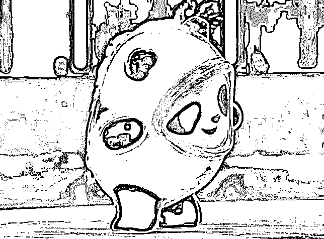
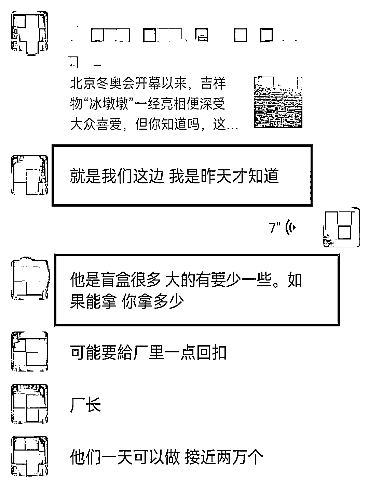
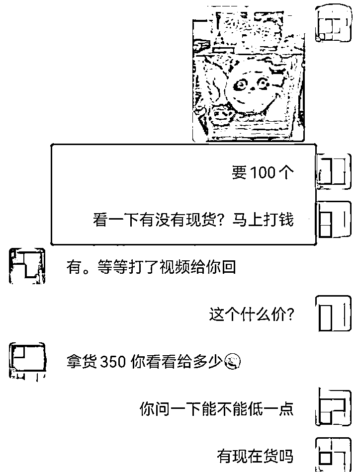
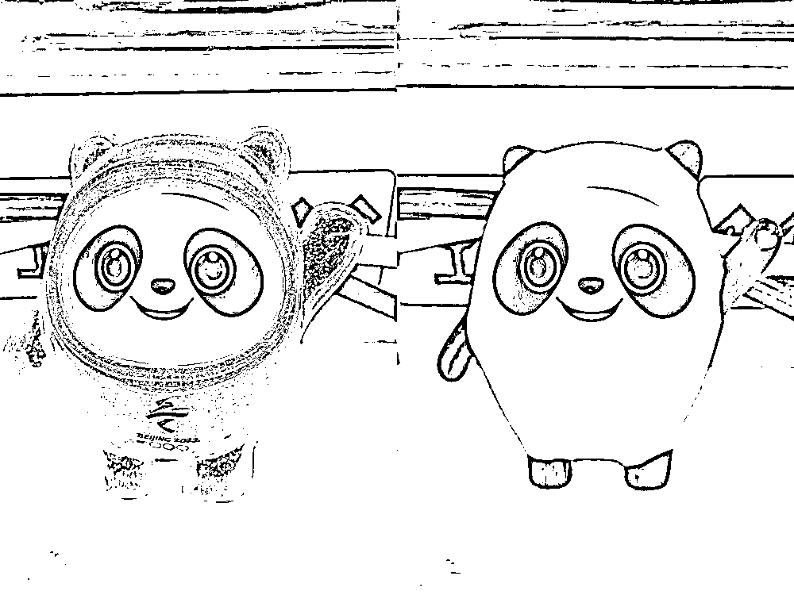
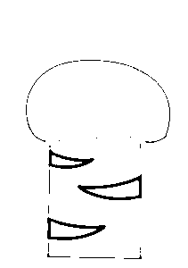

# 东莞一男子 95 元买到了冰墩墩？结果...

> 原文：[`mp.weixin.qq.com/s?__biz=MzIyMDYwMTk0Mw==&mid=2247529653&idx=5&sn=d4e324da3bca0e4b7b0c52dc57b7cce6&chksm=97cbbf8da0bc369b2dd75f29c6805e073e48cb7bc22bdc887737a05627a785b08526c7a7362e&scene=27#wechat_redirect`](http://mp.weixin.qq.com/s?__biz=MzIyMDYwMTk0Mw==&mid=2247529653&idx=5&sn=d4e324da3bca0e4b7b0c52dc57b7cce6&chksm=97cbbf8da0bc369b2dd75f29c6805e073e48cb7bc22bdc887737a05627a785b08526c7a7362e&scene=27#wechat_redirect)

近期 

胖乎乎圆滚滚的“冰墩墩”彻底火了广大网友渴望“一户一墩” 可实则“一墩难求”

然而

寮步镇一男子竟如此“幸运”

不用抢购就有“冰墩墩”送上门来？

究竟是怎么做到的？ 

2 月 7 日早晨寮步周先生在家中玩手机刷到了一个冬奥会吉祥物冰墩墩的视频不久后**他收到一条好友申请****询问其是否想购入冰墩墩……**想买冰墩墩吗？我这边有供应商卖，一个只要 95 元。

这么便宜？那我要 100 个！

全国热捧疯抢的冰墩墩**不要 998 元，也不要 98 元****只要 95 元！**周先生看中了这个商机在网友“先付款再发货”的要求下**转账了 10220 元（包含运送费）**转账后 周先生满怀期待等着那一车冰墩墩的到来然而等了一天也等不到网友的回音**周先生才察觉自己是被诈骗了****总计损失 10220 元**目前寮步警方正在积极为该事主追回损失北京冬奥会吉祥物“冰墩墩”近期引爆购买潮然而骗子已经盯上了它小编在前期推文里告诉大家一些诈骗手段

**（戳下面图片回顾↓）**

然而 

**类似的案例、套路还有很多 **

**** ↓↓↓****

****

****被骗邮费****

**点赞评论送“冰墩墩”被要求支付邮费，随后被骗子拉黑，邮费被骗。******被骗预售款******非官方正规渠道购买预售“冰墩墩”手办，链接失效订单作废，预售款被骗。******山寨“冰墩墩”******高价从“黄牛”处抢购正品，实则收到山寨“冰墩墩”。****************2 月 7 日** **一名网友在某社交平台上发帖称****其在“冰墩墩”手办交易过程中被骗****而被骗的过程****与“冒充电商客服”类诈骗异曲同工******抢“墩”被骗过程↓******1、骗子在社交平台兜售“冰墩墩”手办，吸引流量；****2、受害人私聊骗子，骗子则以第三方交易平台为保证，让受害人通过第三方平台完成钱货交易；****3、自认为安全有保障等待开箱收取“冰墩墩”的受害人，在下单后的第二天被骗子通知“订单异常”，需要“加群退款”；****4、进入群聊后，对方以“冰墩墩退款”为由，要求受害人下载安装某视频会议 App 并开启屏幕共享；****5、在屏幕共享状态下，受害人在手机上的一举一动都被骗子紧盯，受害人的个人信息以及各类支付方式的密码被骗子掌握，随后，骗子会利用掌握到的受害人信息进行借贷、转账。****利用第三方交易平台****进行“冰墩墩”手办线上交易****看似安全有保障******实则骗子利用受害人********对视频会议 App 功能的不了解********及受害人急需“退款”的心理钻空子************警方提醒******诈骗套路花样多****保住自己的钱袋子****这几点防骗提示请牢记****↓↓↓**

*   **对各种有关冬奥会的抽奖活动，最好登录冬奥会官方网站或向权威机构核实。**
*   **遇到需要提前支付“预付款”“定金”“手续费”等，诈骗的可能性极大，千万不要轻信。**
*   **不要轻易点击来历不明的链接和网页，不要轻易在网上泄露自己的身份信息、存款信息、银行卡信息等。**
*   **一旦被骗，第一时间拨打 96110。**

**来源:东莞阳光网综合平安寮步、东莞市公安局，巴蜀反诈**********

**← 向右滑动与灰产圈互动交流 →**

****