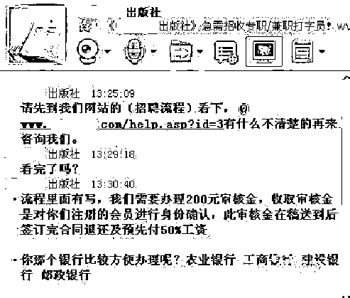

# 年后复工，当心以招聘为名的各类诈骗！

> 原文：[`mp.weixin.qq.com/s?__biz=MzIyMDYwMTk0Mw==&mid=2247529653&idx=7&sn=e1c167360eb5ba7a49730727810ac0aa&chksm=97cbbf8da0bc369b2a95940eb09eb3f4a9d21841409eb0bddf4e558a4f657bc7f2cd8cfba936&scene=27#wechat_redirect`](http://mp.weixin.qq.com/s?__biz=MzIyMDYwMTk0Mw==&mid=2247529653&idx=7&sn=e1c167360eb5ba7a49730727810ac0aa&chksm=97cbbf8da0bc369b2a95940eb09eb3f4a9d21841409eb0bddf4e558a4f657bc7f2cd8cfba936&scene=27#wechat_redirect)

春节假期结束 

又是工友们外出找活儿的高峰期

各类“招工”诈骗也趁机出动

有网络虚假招工诈骗

有非法传销诈骗

有兼职刷单类诈骗

……

骗子们的手段“五花八门” 

不少求职者上当受骗

**犯罪分子一般通过网络平台**

**发布虚假的招工信息**

****待取得务工人员信任后****

******便以刷单、投资、做任务等种种理由******

********骗取受害人钱财********

******骗局一：网络虚假招工******

****骗子在一些知名网站、本地论坛上发布事先编造好的招工信息。****

********

****通常以“高薪急聘”、“学历不限”等夸张字眼吸引应聘者注意。****

********

****点进去后发现，具体招工描述中，却要求应聘者通过加 QQ、微信等方式“进一步联系”。****

********

****添加联系方式后，骗子为稳住应聘者，会要求其进行面试等流程。****

********

****为了进一步忽悠，骗子会声称其已被录取，但要交押金、体检费等“必要费用”，骗取被害人钱财后，骗子们就携款逃之夭夭。****

********

****骗子之所以“做足戏”，就是冲着被害人的这几笔钱而来。****

******骗局二：假招工真传销******

****不法分子深谙一些年轻人求职心切且社会经验不足，对高薪酬的向往的心态，在网上发广告，以“勤工俭学、招聘兼职、高额回报”为诱饵，吸引青年应聘者。****

********

****等到应聘者相信时，便要求他们交纳一定费用或购买产品，并指派各种“推销任务”。****

****这类打着“连锁销售、特许经营、企业直销、政府试点”等幌子进行的非法传销活动迷惑性强，不少人深陷其中。****

********

******骗局三：兼职刷单类诈骗******

****今年 1 月 17 日，王先生（化名）到派出所报警，称其在网上刷单被骗。****

********

****经查，1 月 6 日王先生在一个微信群中看见有人发代加工招聘广告后与骗子进行联系，并在骗子的一步步诱导中下载了“万汇帮”刷单 APP，登记基本信息做了几单后，王先生轻轻松松赚了 200 元。见确实能赚到钱，王先生便相信了对方。****

****接着在对方许诺垫付金额越大佣金越高后，王先生分四次向对方指定账户转账。但当他完成刷单，准备将本金和佣金提现时，对方却以“操作失误”、“再刷 3 单才可以提现”等理由予以拒绝，直至王先生意识到被骗。**** 

******骗局四：地下非法劳务**************

****保安、包装工、建筑小工……不需要太高技术含量，也不用接受培训就能直接上岗。这种不缴纳社会保险、不签订劳动合同，一辆车直接“拉”走的工作，劳动者们的合法权益很难得到保证。**** 

****因此，求职者们要当心一些非法“小作坊”、“黑工厂”，留心“街边趴”的非法劳务市场。找工作一定要选择正规平台，了解清楚用人单位性质资质等相关信息。**** 

******骗局五：编造虚假单位**************

****2021 年，李某冒充医院工作人员，在中介和网上发布招聘信息，谎称只要缴纳 4 万元“报名费”，即可不考试直接进医院工作。为了让受害人相信，嫌疑人还雇佣社会人员“扮演”医院主任、护士长对应聘者进行面试、签订假合同、制作假胸牌，先后诈骗 170 余人共计 340 余万元。****

********

****让民警惊讶的是，这 170 余名受害人直到民警找到他们，竟无一人报警。****

****那么，求职者在应聘过程中应当注意一些什么呢？****

********

****快来！查收您的招工应聘防诈骗指南！****

********

********

********

********

********

********

********

********

******新的一年里******

******祝愿大家都能找到一份称心的工作******

******钱包越来越鼓，生活越来越好！******

****来源：郁南微平台，平安云浮，阻击诈骗****

****************

****← 向右滑动与灰产圈互动交流 →****

********