# 还有脸学人家擦领奖台呢？韩国人真让人下头

> 原文：[`mp.weixin.qq.com/s?__biz=MzIyMDYwMTk0Mw==&mid=2247529713&idx=2&sn=2087818e5e80b80407b0638a7e1a16e2&chksm=97cbbfc9a0bc36df13b7275c48c2006cdce50d058a17ee647cc6b9ed54156d78cd4e155ea0f8&scene=27#wechat_redirect`](http://mp.weixin.qq.com/s?__biz=MzIyMDYwMTk0Mw==&mid=2247529713&idx=2&sn=2087818e5e80b80407b0638a7e1a16e2&chksm=97cbbfc9a0bc36df13b7275c48c2006cdce50d058a17ee647cc6b9ed54156d78cd4e155ea0f8&scene=27#wechat_redirect)

**01**

**高亭宇夺金**

2 月 12 日下午进行的北京冬奥会速度滑冰男子 500 米决赛中，我国选手高亭宇在第七组出场。

1997 年出生的高亭宇在 2018 年平昌冬奥会上拿到铜牌，

在北京奥运周期高亭宇日趋成熟，已经具备了冲击金牌的实力。

**在决赛中他滑出了 34 秒 32 的成绩，打破了奥运会纪录。**

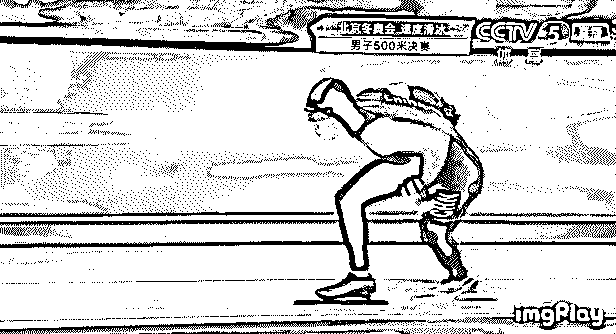

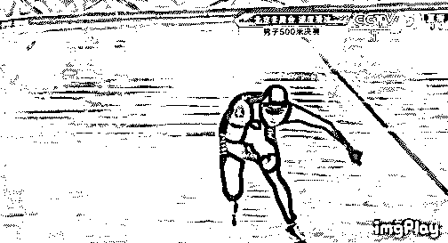

随着最后一组选手的成绩出炉，高亭宇毫无争议地锁定了金牌，这也是中国代表团本届冬奥会第 4 枚金牌。

**韩国人 34 秒 39 拿到银牌，日本选手森重航 34 秒 49 获得铜牌。**

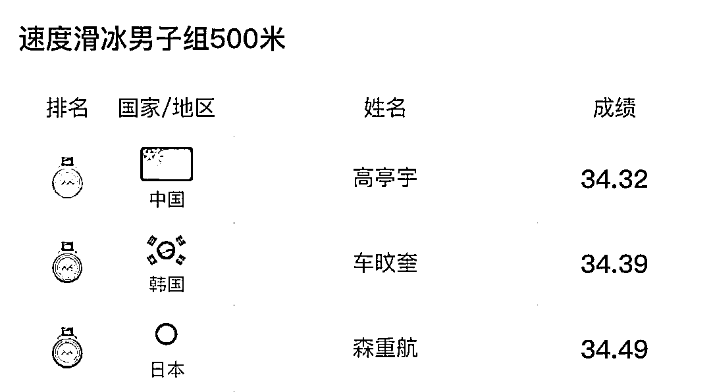

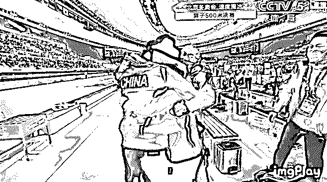

但是在颁奖的时候，却出现了诡异的一幕。

**银牌获得者，韩国人居然在上台前用手擦了擦领奖台。**

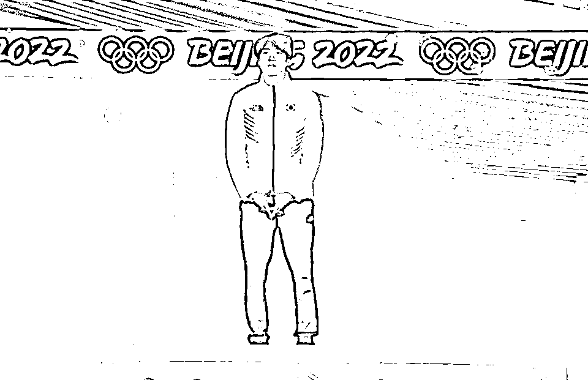

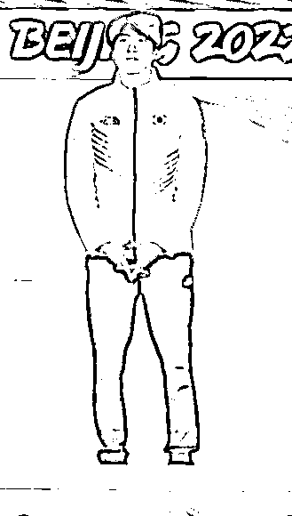

这个动作抄袭自 2018 年平昌冬奥会，加拿大队在拿到短道速滑男子 5000 米铜牌后，加拿大队登上领奖台之前选择了这样的庆祝方式。

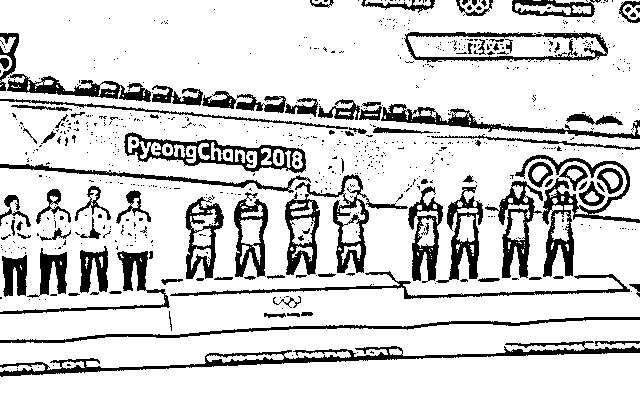

然而速度滑冰又不是短道速滑。

**速度滑冰比赛一人一条赛道，并不像短道速滑会有各种身体接触。**

**单纯比拼速度的比赛也能黑？**

**这种事情也只有小西八做得出来了。**

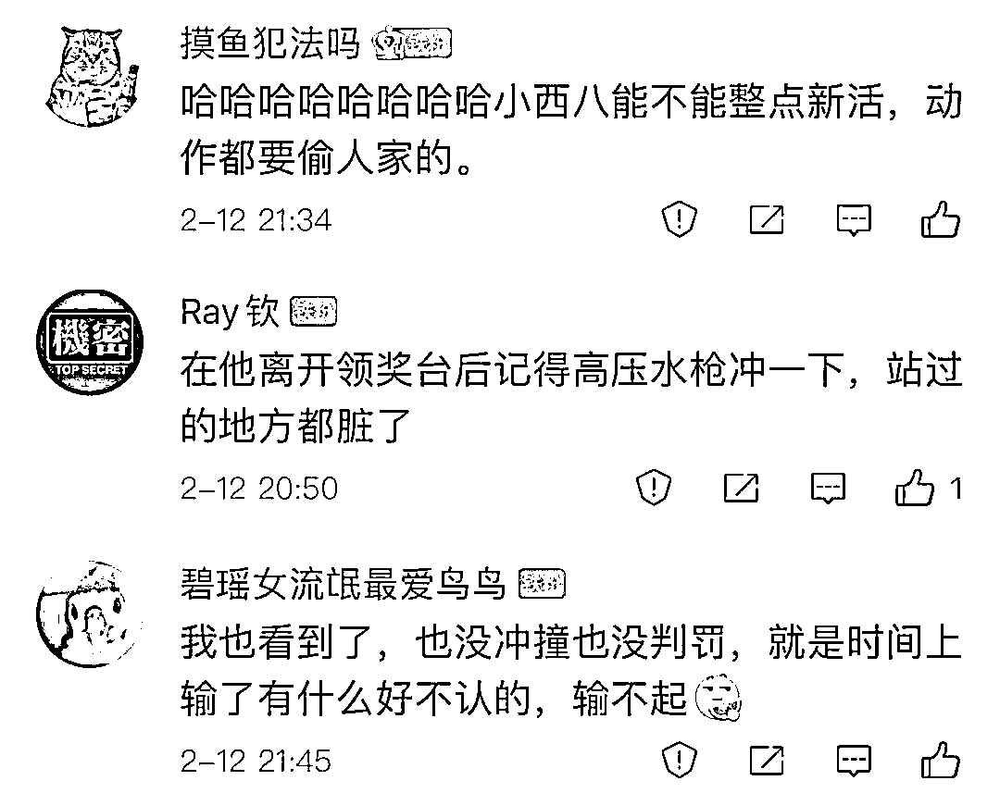

还是说，是因为昨天崔敏静站过，韩国男同胞嫌弃崔敏静太脏了，所以要擦一擦领奖台。

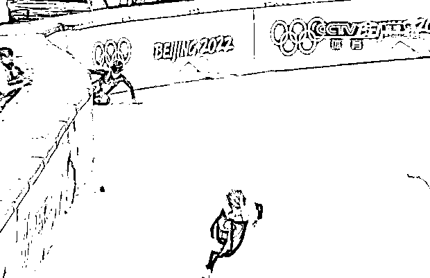

2 月 11 日晚的冬奥会，女子短道速滑 1000 米决赛中，崔敏静在最后时刻拼命扒拉舒尔廷留下了一幅世界名画《卡机嘛》。

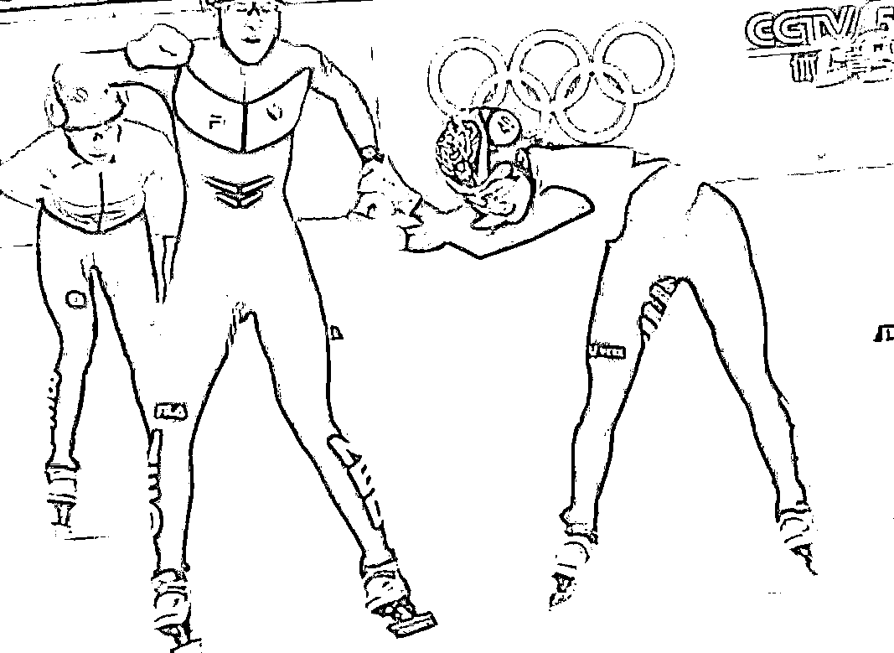

崔敏静在赛后独享亚军喜悦，啜泣不已。

**都已经这么拼命扒拉了，还是没能扒拉到金牌，要去服兵役了嘤嘤嘤......**

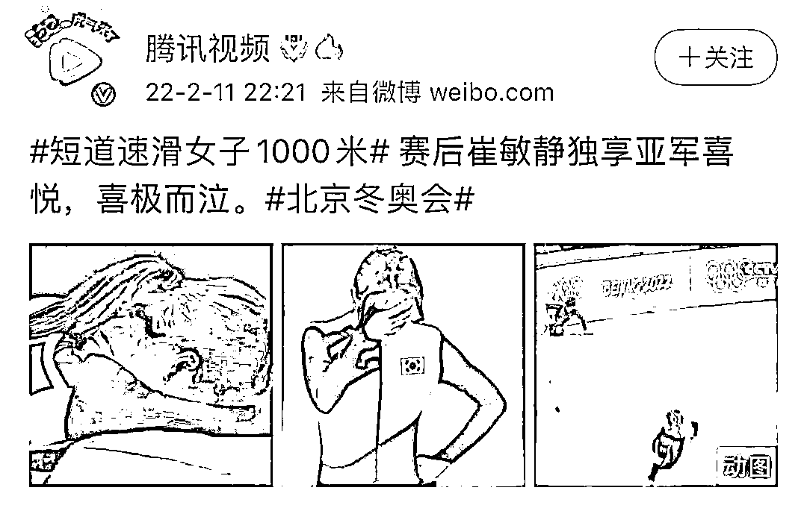

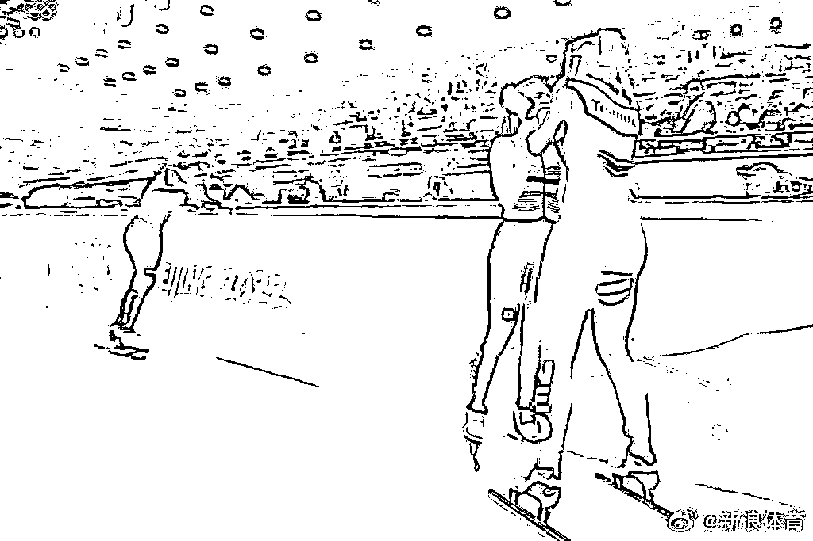

**02**

**韩国内斗有多狠**

在短道速滑项目上韩国实力不容小觑，要说实力嘛的确是有的。

但是让全世界运动员更害怕的，还是韩国选手的那些小动作和阴招。

**每次冬奥会、世锦赛这种世界大赛上，韩国人的各种手段都会成为全世界的焦点。**

有意思的是，大水冲了龙王庙,韩国人内斗更是一只鼎。

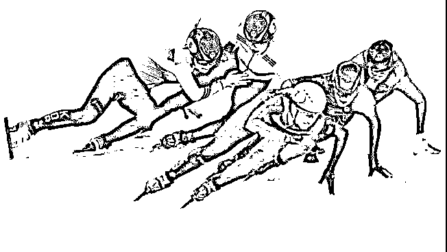

2017 年世锦赛上，沈石溪就曾把崔敏静推出赛道，狠起来连自己人都不放过。

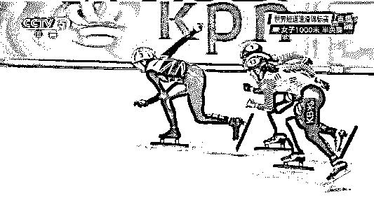

一年后的平昌冬奥会上，沈石溪故伎重演一把推开崔敏静。

崔敏静眼看要冲出赛道，就扒拉住沈石溪的腿两人双双摔出场外。

**沈姐姐你要这样做，那我们就同归于尽吧。**

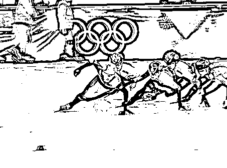

明明一路辛苦杀到决赛，最终因队内恩怨厮杀出局。

韩国教练做梦也没想到会是这样的结果。

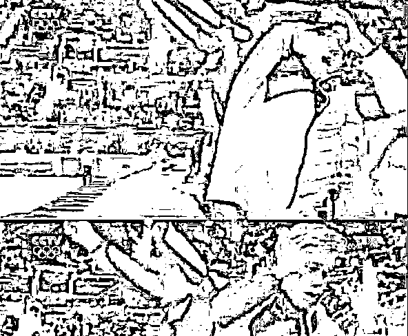

成年人的崩溃总是在一瞬间，4 年心血付之东流，不知道此时教练心理阴影有多大。

事后二人更是把矛盾带到了场外，当然韩国内斗远不止于此。

2019 世界杯名古屋站，金雅朗从背后出手推搡金智友犯规出局。

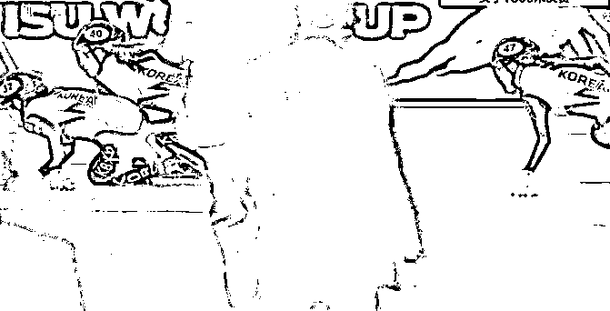

2019 世界大冬会，本来第一第二的朴智源与洪京焕，为了竞争互相残杀直接淘汰。

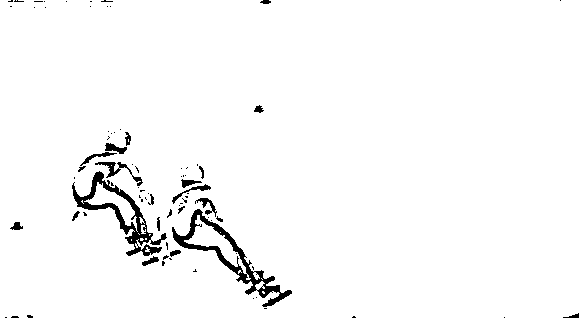

既然说到内斗，黄大宪和林孝俊必须榜上有名，精彩程度不亚于大型宫斗剧。

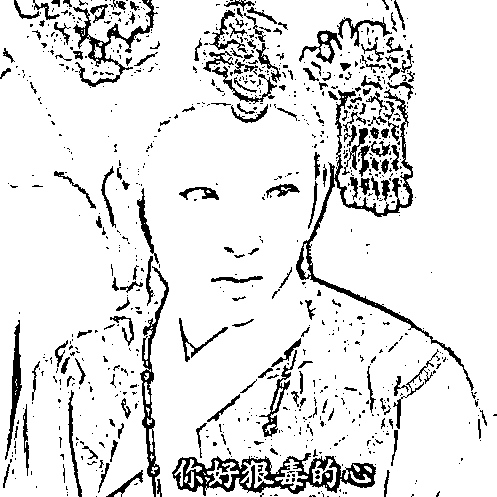

2018 平昌冬奥会上，黄大宪背后拉林孝俊犯规，林孝俊最终夺冠，至此二人的梁子算是结下了。

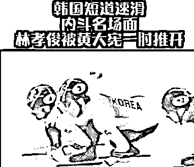

**据说韩国拿到金牌可以免服兵役，也难怪内斗现象这么严重，完美诠释了比赛第一友谊第二。**

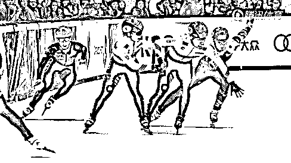

**03**

**韩国短道速滑有多脏**

你以为韩国选手只会内斗吗？

相比对中国选手做的手段，内斗这些事只能是九牛一毛，奥林匹克精神早就抛在脑后。

2006 年的都灵冬奥会，王濛在 1500 米决赛被韩国选手干扰，面对四名韩国选手，最终只能遗憾第四。

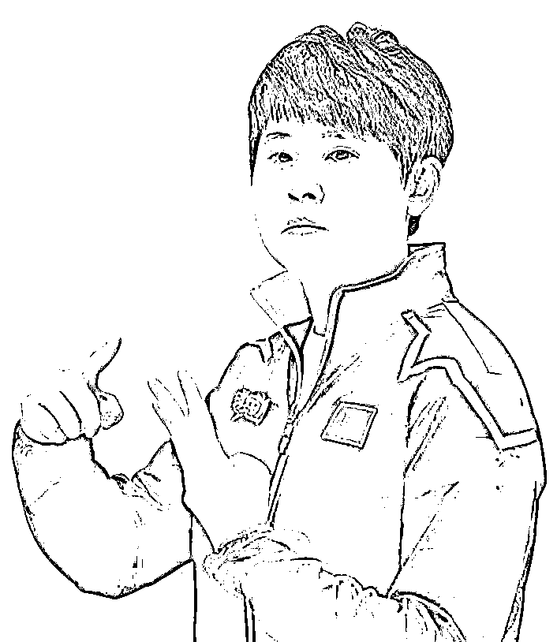

08/09 赛季世界杯日本站，女子 1500 米决赛，韩国选手郑恩珠用手按到周洋的头盔上，导致周洋脑震荡和颈椎错位。

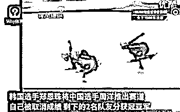

2010 年短道速滑世界杯上海站，韩国选手金炳俊强行超越我国选手韩佳良。

两人也是一起摔出赛道，**并且韩国选手还将冰刀对准我国选手，造成韩佳良多处划伤血溅当场。**

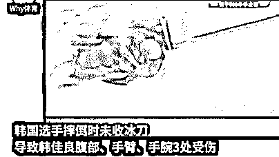

韩国队的肮脏程度，用罄竹难书来形容毫不为过，上面列举的真的只是九牛一毛，要细数干净各位看官可能要看上几天几夜。

**2018 年平昌冬奥会上，韩国人更是将阴险提升到新的高度，就连裁判也要使坏，明显程度让其他国家都看不下去。**

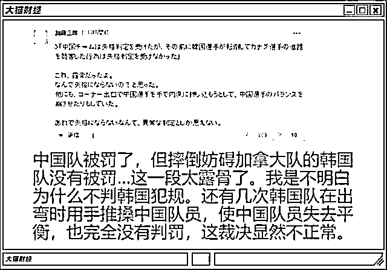

最后在决赛的颁奖典礼上，加拿大选手集体用手轻扫领奖台，暗讽比赛是在是不干净。

韩国人既然这么喜欢这个动作，不如把它申请世界文化遗产，让大家都牢牢记住它的起源。

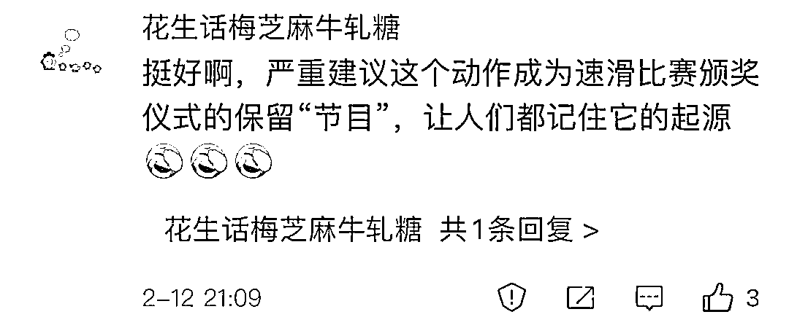

**无论经济如何发展，自卑、卑鄙和狭隘，都是刻在韩国人骨子里的。**

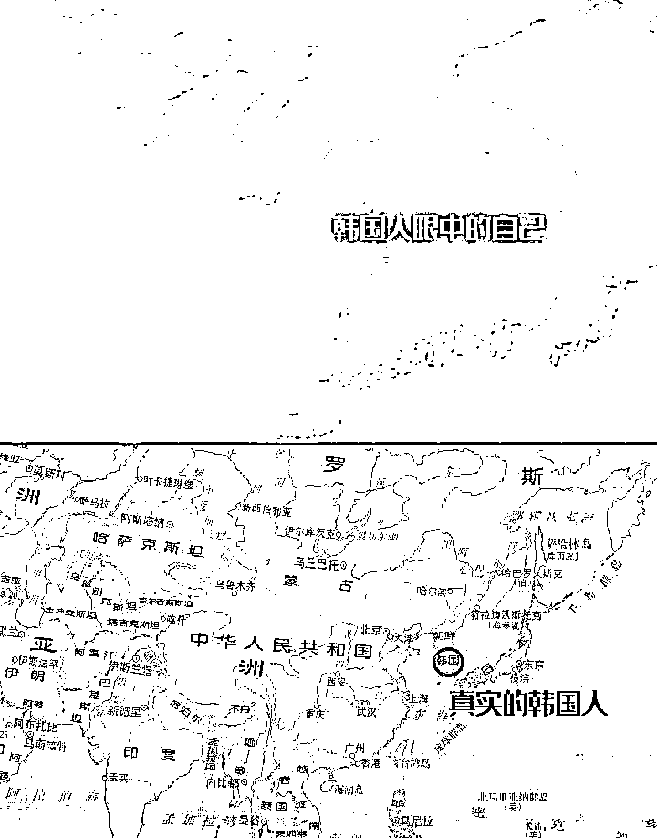

来源：脊梁 in 上海 SH（shanghai_310），昌南大队长

← 向右滑动与灰产圈互动交流 →

