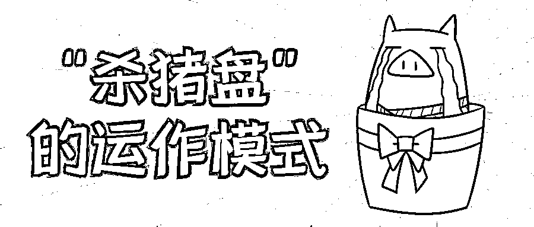
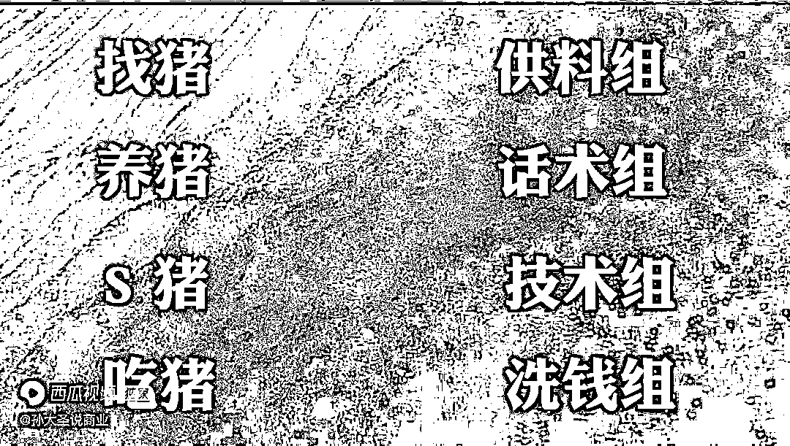
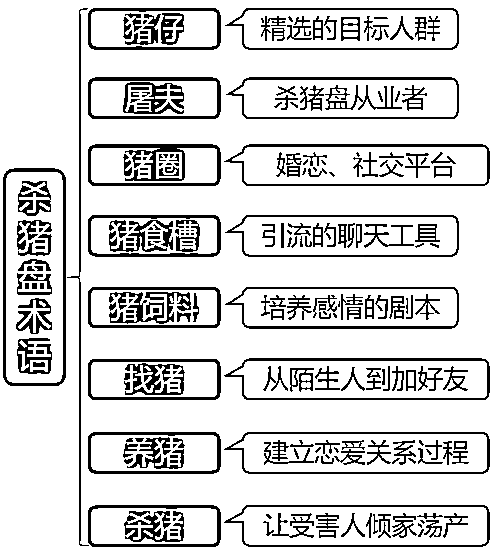
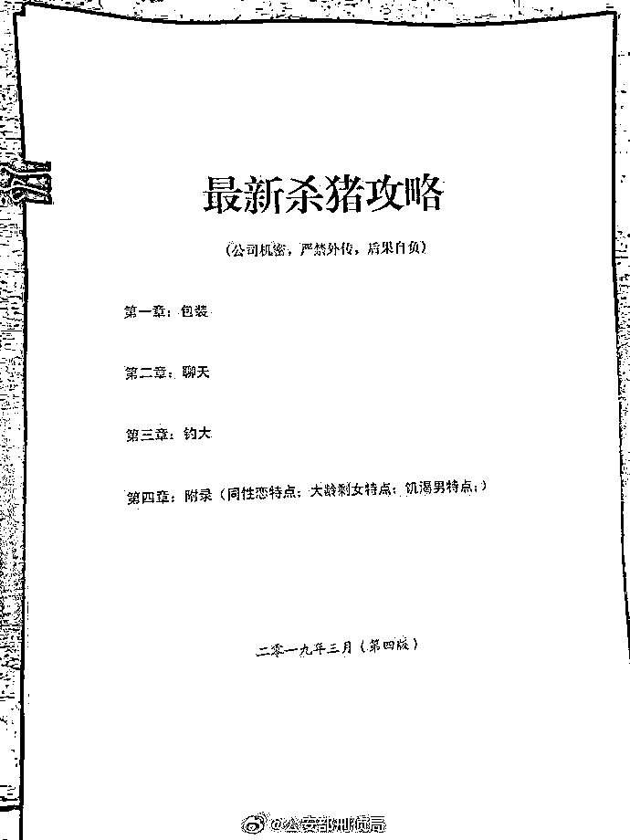

# 人性高手：“杀猪盘”背后不为人知的黑灰产业链，骗子降维打击“用炮轰苍蝇”

> 原文：[`mp.weixin.qq.com/s?__biz=MzIyMDYwMTk0Mw==&mid=2247529713&idx=3&sn=1ae187608225d81ca8d16145dd98564a&chksm=97cbbfc9a0bc36df0d503900c480fdd6d9331ccde6416fcfeafefa944c5212f1d40b15e509d1&scene=27#wechat_redirect`](http://mp.weixin.qq.com/s?__biz=MzIyMDYwMTk0Mw==&mid=2247529713&idx=3&sn=1ae187608225d81ca8d16145dd98564a&chksm=97cbbfc9a0bc36df0d503900c480fdd6d9331ccde6416fcfeafefa944c5212f1d40b15e509d1&scene=27#wechat_redirect)

[`v.qq.com/iframe/preview.html?width=500&height=375&auto=0&vid=wxv_2264867351190044683`](https://v.qq.com/iframe/preview.html?width=500&height=375&auto=0&vid=wxv_2264867351190044683)

王总讲他朋友诈骗最多的一次骗了两百多万。受害人是一个开餐厅的中年大叔李强，从加微信到成功诈骗只用了十天时间，具体的诈骗过程一共分为四步：**找猪、养猪、杀猪和吃猪**，对应杀猪盘内部的四个部门，分别是**供料组、话术组、技术组和洗钱组。**接下来咱们详细说说这个黑色产业链是如何运作的。一次成功的诈骗从供料组找猪开始，这帮人是怎么找到李强的？

据大圣了解，**供料组找猪也分“南北派”：****南派活细**，喜欢找精准客户，比如到婚恋网站，专挑大龄剩女，到陌陌、探探，专挑中年老色品，找到精准客户后，还会让技术组或黑产破解客户信息，比如客户的 QQ 空间照片、个人资料、资产等情况，方便对症下药；**北派活糙，**信奉大力出奇迹。微博、微信，脉脉、卖卖、facebook 、blued 、soul、世纪佳缘等等，你听过的没听过的交友网站，他们全上玩的就是勤奋加概率。李强就是南派供料组精挑细选的肥猪。

**下面咱们就还原一下整个诈骗过程**

这天店里不忙，李强麻木的刷着段子打发时间。突然有一个年轻貌美的姑娘加他微信。男人嘛总是幻想点风花雪月的好事，尤其是像李强这种生活淡如水的中年老色皮。有妹子加微信，甭管干啥先聊着呗，反正也没啥损失。妹子加了微信，问李强是不是张总，李强说不是妹子赶紧道歉，不好意思加错了，要不删了吧。还没等李强回复，妹子又发了一句**“既然加了，也算是缘分，就不删了，说不定还有其他缘分”**。李强笑眯眯的回复：“好的”，妹子也不多说，借口有事儿就离开了。此时李强心里多少有点荡漾，顺手翻了翻妹子的朋友圈，发现不光人长得好看，身材也不错，而且貌似人畜无害，没事就会在朋友圈发一发跟宠物狗的合影，可问题是，李强也喜欢狗。而此时，距李强三千多公里外的缅甸，一个满脸青春痘的小伙阿伟放下手机，长出了一口气，终于有肥猪上钩了。

**阿伟是被朋友骗到缅甸打工的，刚开始也不想干这种骗人的勾当，但想走根本走不了，手机和身份证全被公司没收了，每天吃喝拉撒也都有人盯着。公司规定，要走必须按时间赔偿，一个月赔 1.25 万，两个月 1.7 万、三个月 3 万。不服从的立马关进小黑屋，身无分文的阿伟为了尽早逃离魔窟，被迫开始学习怎么骗钱，但总是良心过不去，所以一直不出业绩。**中间不知道被公司打了多少次。直到在组长的帮助下，阿伟成功骗到了第一单 20 万，按照公司 25%的提成，阿伟分了 5 万。这可是他在国内辛苦一年的收入，居然聊聊天就能赚到。回头再看同组的其他几个人，每个月也都能来好几万，组长更是轻轻松松月入几十万。阿伟慢慢进入了状态。这次面对李强，阿伟势在必行。因为跟他睡上下铺的小明刚拿下一头肥猪，已经在他面前炫耀了好几天。为了拿下李强，阿伟认真学习了公司花 18 万美金买来的话术宝典。首先想让肥猪信任，必须有一个好的人设，按照话术宝典的说明，**好的人设符合两点****真实****和****投其所好**，投其所好很容易，人性是相通的。肥猪是拜金女，骗的就是成功男，肥猪是老色痞，骗的就是大胸萌妹。肥猪是恨嫁女，骗的就是收入稳定的 IT 男。再根据肥猪的个人喜好，加上点儿小细节，比如李强喜欢狗，阿伟就装成喜欢狗的大胸萌妹。

好感就很容易建立，但网络诈骗真正难的地方还是真实，**怎么能仅凭几次聊天就让肥猪对你掏心掏肺，这也是一门技术活？**为此，阿伟下了大功夫。首先根据人设，包装个人基本信息，基本信息不是简单的姓名、年龄、身高、体重、三围，还有工作情况、父母情况、成长背景的信息。总之，一个真人设计的一切信息，阿伟都必须准备由于工作情况聊的最多，阿伟还特意准备了十几张工作照片，并且点灯熬夜背诵行业知识，防止被李强问住，基本信息搞定。接下来就是打造朋友圈网上交友人习惯会去看朋友圈，所以朋友圈的打造至关重要。这也是公司培训的重点。好在话术宝典已经把怎么发朋友圈说的非常详细，具体到了每个时间段，阿伟只需要按部就班的发就行了。

可问题是，一个男人假装成女人发朋友圈，素材从哪里来？这个时候就要上技术组了，技术组会根据阿伟需要找到对应的人设素材。并且按照场景分好，阿伟想发啥都有。当然光有人数还不够，聊天才是重点，为了拿下李强，阿伟报了公司的深造班。开头那段加错人就是深造班的学习成果，阿伟屡试不爽。尤其针对老男人，阿伟在深造班学习的重点是理解人物。**骗子跟演员一样，演技很关键，演技搞不好，关键是要花心思研究人物细节必须拿捏到位，太浮夸，又太假，太舒服又太装了。**导师告诉阿伟，男人演女人很容易，只需要抓住两个窍门，女生该有的脾气必须有，女生该有的语气必须要。因此，接下来几天，阿伟跟李强聊天，时不时会加上几句撒娇话。好的、好吗之类的，听的李强晕晕乎乎。有一次李强出于本能怀疑阿伟是不是假的，阿伟没有遇到这种情况，顿时慌了，不知道怎么回答。组长看到以后拿过手机直接一顿臭骂，并扬言要拉黑李强。阿伟心想，这下完蛋了，肥猪要跑了，结果没想到李强费但不生气，反而不听道歉。组长觉得火候差不多了，又告诉李强自己有个小毛病，一刮风头就疼，刚才也有些冲动，希望李强不要在意。就这样，阿伟觉得束手无策的问题，组长在一推一拉之间，用暴露小缺陷轻松化解掉，还让两个人的感情关系迅速升温。紧接着，阿伟向李强彻底打开心扉，说自己从小在单亲家庭长大，喜欢投资和做饭，因为的感情很专一，被前男友带了绿帽，还骗走了一大笔分手费。希望找一个有安全感的人结婚，并且特意强调不在乎对方年龄。李强听了以后简直是心花怒放，感觉这就是上天派给他的专属天使。到这个份上，俩人很顺利的确定了男女关系，哪怕是还没有见过一次面。当然了，李强肯定会提出视频聊天，阿伟怎么拒绝呢？还精心打造的苦情人士又起了作用。阿伟借口感情创伤拒绝视频，李强不但不反感，反而更加心疼女友，彻底放下对阿伟的防备，阿伟顺势拿起镰刀，**终于到了收割的时候**。

**之前阿伟已经铺垫过自己喜欢投资，现在只需要有意无意的泄密给李强**。这里面的关键是运营环境内骚外聊，这样来来回回拉扯几次，李强的胃口彻底被吊了起来，就可以下套了。下套是技术组的工作，他们会在后台操作，让李强先强调前头，以为自己发现了金矿，然后阿伟使劲忽悠李强压重注，最好是卖房卖车，掏空家底。李强刚开始也不愿意投太多钱，可已经上了贼船，不甘心，白白损失之前赚的钱，当然也舍不得阿伟妹子。最后，李强在贪欲和色欲的诱惑下堵上了一切。此时，远在缅甸的阿伟激动的在办公室大喊大叫，自己杀了 200 万的大肥猪，几百人的办公室没人觉得诧异。他们已经见多了这样的场景，反倒受了阿伟成功的刺激，各个磨刀准备杀猪。整个杀猪过程从供料组找猪到阿伟所在的话术养猪最后技术组操控投资后才杀猪，一气呵成。直到李强发现甜蜜女友阿伟消失了，顿时清醒，慌忙向警方报警，希望能追回损失。

[`v.qq.com/iframe/preview.html?width=500&height=375&auto=0&vid=wxv_1994799185820188676`](https://v.qq.com/iframe/preview.html?width=500&height=375&auto=0&vid=wxv_1994799185820188676)

但是，李强的钱已经从技术组转到了洗钱组手上，他们是杀猪盘的最后一环，也是最复杂和最困难的。互联网时代，任何的交易都会留下记录。警方顺藤摸瓜，很容易连过团可道高于尺，魔高一丈。**杀猪盘已经把洗钱搞成了产业链，**手段千奇百怪，防不胜防。李强的钱就是从其中一个链条非法结算平台洗白的，具体操作是这样的，现在的支付渠道太多了，支付宝、微信各大银行都有线上支付。对于商家来说，每家都搞个二维码太麻烦，所以就诞生了很多聚合支付平台，一个二维码搞定所有平台，类似底下这样的商家图个省事平台，赚点辛苦钱。一般商家想接受平台必须提供商户资料给各个支付机构申请账户，然后平台通过技术手段把二维码连在一起。但非法平台不这么搞，他们必须要商户资料，直接用平台自己的商户收钱，收完手续费钱就到了杀猪盘手上。为了伪装自己非法结算平台的所有资料都是真的，他们会收买真实的个人四件套。也就是身份证、银行卡、U 盾和手机卡和企业八件套，短时间内查不出任何问题。另外，微信、支付宝、银联等平台每家的风控系统不一样，一个平台封掉还能拿着资料去另一个平台继续干。最奇葩的是这种洗钱操作，还能用在电商平台，而且更加疯狂。他们先用收上来的四件套，在电商平台开店，发布正常的商品，店铺该刷单刷单，该刷评论刷评论，跟正常店铺一模一样。然后悄悄的把付款链接换成二维，码放在赌博网站里面。肥猪充值赌金是直接扫码付款，电商平台的店铺就会卖出等价的产品。最后搞个虚假发货，洗钱就算完成了，这样诈骗来的黑钱变成了一次正常的电商购物，完全绕开了第三方支付的风控风险。骗子们为了省事，店铺最喜欢卖手机、充值卡、游戏卡等虚拟服务产品，网购平台也很郁闷，有段时间连发声明，直接锁定各种虚拟产品，但这种是防不胜防。今天是电商平台，明天是直播平台，后天是虚拟货币平台。打一枪换一个地方，你根本拿他没办法，抓住一条线一网打尽行不行，也比较难。**这种非法结算平台往往有一个庞大的网状结构，比如一级收 8%的手续费，底下有好几个二级代理收 6%的手续费。每个二级代理下面又有若干三级代理，收 4%手续费。最后到提供四件套的参与者手上只有两三百块钱，****这些参与者大多是不知内情的学生、宝妈等小白****，抓了他们有啥用，就算层层摸瓜，抓住了一条大鱼，最后量刑也很麻烦。**之前有一个案件，一伙人收集了大量信

用卡，涉及 83 起诈骗案，起诉的理由是妨碍信用卡管理罪，而不是诈骗共犯。这也是无奈之举。完整的诈骗取证要求很高，需要把受害者到诈骗犯的整个链条找到，骗子们身经百战，警惕性很高，很难控制证据，只能用其他罪名先控制罪犯。当然也有釜底抽薪的方法，不管是哪种洗钱方式，总得用到银行卡或者是收款码。今年，全国公安机关推行“断卡”行动，已经清除了 14.8 亿张一张卡。对。你没听错，是 14.8 亿，平均全国人民人均一张直接打中了杀猪盘的 7 寸。但是从古至今，官方打击诈骗就没停过，骗术依旧屡禁不止。古有凤、马、雁雀四门骗局，仅有杀猪盘、资金盘等各类陷阱。说到底，只因凡人不仅愚蠢，而且贪婪。骗子只是心魔作孽罢了。心魔不除，妖魔难灭呀。

** **温馨提醒，预防电信诈骗，****

****请下载国家反诈中心 APP**。**

来源：洛阳市反诈骗中心，阻击诈骗

← 向右滑动与灰产圈互动交流 →

