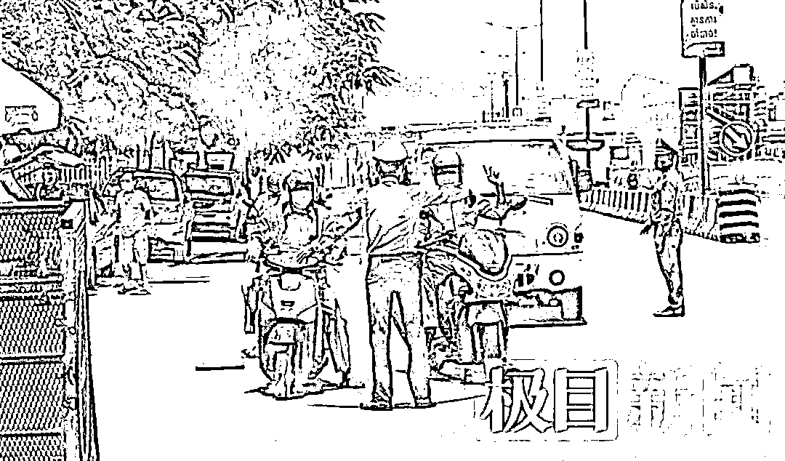
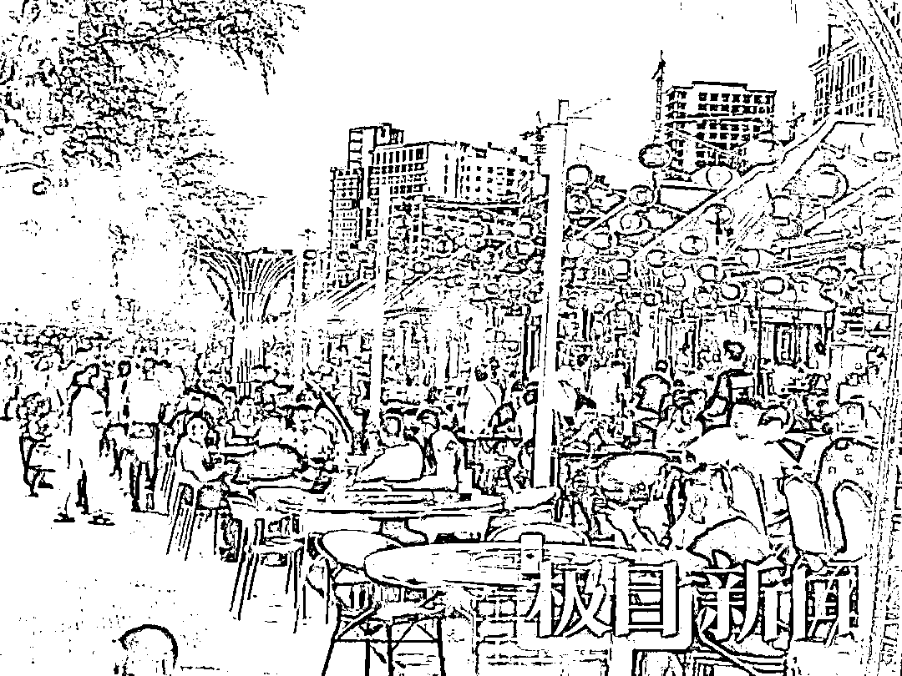

# 困在柬埔寨诈骗公司的中国人：交了 30 万赎金却被转卖，完不成业绩被电击！

> 原文：[`mp.weixin.qq.com/s?__biz=MzIyMDYwMTk0Mw==&mid=2247529713&idx=4&sn=ddfec568dcd5aa13f7e3517b77d18d35&chksm=97cbbfc9a0bc36df0870d52c009d4efdb99ea2d0e7a8c548e0b58cb9b00818166e90b5c1a71a&scene=27#wechat_redirect`](http://mp.weixin.qq.com/s?__biz=MzIyMDYwMTk0Mw==&mid=2247529713&idx=4&sn=ddfec568dcd5aa13f7e3517b77d18d35&chksm=97cbbfc9a0bc36df0870d52c009d4efdb99ea2d0e7a8c548e0b58cb9b00818166e90b5c1a71a&scene=27#wechat_redirect)

被熟人高薪引诱，得知骗局后却已失去人身自由，为时已晚。

2020 年以来，相同的情节一次又一次地在柬埔寨上演。**这些赴柬的国人被限制在金边、西哈努克等地所谓的“园区”里，被中国籍老板雇请的打手及物业胁迫，通过“杀猪盘”等方式，在网络上“行骗”，将世界各地华人的钱骗入公司的账户**。

在公司内，**没完成业绩、不听话、逃跑，面临的都是电棍电击以及毒打**。

这些人中，有不少都还是未成年人。

**（柬埔寨街头）**

为了解救他们，两年来，当地的华人组织了**中柬义工队，队长陈宝荣**通过各种方式营救被骗的中国人；在因疫情原因这些受害人无法回家时，他又联合华人老板免费提供住宿，帮其寻找工作，成为他们最信任的人。

如今，有幸逃出“园区”的人，目前因为熔断的航班和昂贵的机票无法回国；而为了可观的“人头费”，依然有中间人愿意铤而走险，继续在国内进行诱骗出境活动。

**被高薪诱骗入柬从事诈骗**

接到老乡的电话时，16 岁的袁志鹏（化名）和女朋友正在西安学习文身和化妆。

“湖北老乡说有朋友开了文身店，待遇也不错，就让我们到上海，之后又飞到广东汕头。”袁志鹏回忆，两人到广东后，2021 年 8 月 18 日晚上 9 点多，老乡带他们乘车来到潮州饶平县，说是晚上出海去打鱼，娱乐娱乐。

乘坐小船在海面走了 3 个小时后，两人突然被要求换到一艘大船。“**当时就感觉不对劲，大船上大概有六七十人。**”虽然有些抗拒，但深夜在公海，两人无处可去。最终，经过 7 天的海上航行，8 月 25 日，船只靠岸。

当时，看到岸边一些标牌上陌生的文字和语言，袁志鹏明白，自己已经到国外了。他们刚上岸，一辆豪华面包车开了过来，将两人带走。

**（柬埔寨街头）**

同在 8 月份，来自贵州的叶强（化名）也被骗入柬。

叶强在去年 3 月跟几个朋友到贵阳找工作。一个老朋友给他打来电话，让**他到广西南宁一家公司去面试，月薪 8000 元，干得好能拿 1 万多。**叶强到南宁待了 10 多天后，一天晚上，朋友突然通知他们一行乘车先到公司去安排好住宿，还称第二天就可以直接上班了。

“当时我们就疑惑，为什么要大晚上的出发？”上车之后，叶强发现车辆越开越偏僻，便要求下车。但此时，车上的人已经被控制，组织者还告诉他，如果要下车，就得赔付这几天路费等费用共几万块钱。

后来，**在广西边境下车后，一行人在深山老林徒步几个小时，到了越南。再通过私家车、大客车，船只等交通工具，又过了五、六天，叶强被送到了柬埔寨普萨省，从事电诈。**

**交 30 万赎金最后却被转卖**

程玲（化名）也是贵州人，她和叶强乘同一辆车来到普萨省，但双方并不认识。

车辆来到诈骗园区内，**程玲刚下车就被带进了公司，并没收了个人手机。在这里，她被要求通过抖音吸引粉丝、拉群，然后下载她们推送的 APP 做任务，并鼓励对方充钱进账号，每天工作 12-14 个小时。**

**（聊天截图）**

“**不听话就挨打，还不能与外界联系，完全无法忍受。**”程玲告诉记者，诈骗公司所在的园区戒备森严，**由华人老板雇佣的当地持枪打手和物业人员进行管理，完不成业绩、不遵守规定，轻则被威胁将她们送去卖淫，要么被殴打、电击**。

空余时间，程玲偷偷到园区诊所买了安眠药，准备随时服药离开这个世界。后来程玲才知道，不仅仅是她，公司几个闺蜜也都准备了安眠药。

在诈骗公司里，叶强被关过小黑屋，还被电棍电过一次。

叶强来自贵州的山村，从小跟爷爷长大，小学没有上完就辍学了。二十来岁的他一直不太会使用电脑打字，以至于诈骗聊天的时候打字速度很慢。就因为这个原因，叶强被关在一个小屋子里，被电棍电击，“这个太痛了，当时我都已经哭出来了。”

叶强说，工作人员首先是进行恐吓，时间长了就开始使用电棍了。

“我们去了知道是诈骗就不想做了，想走。”刚到公司时，袁志鹏便想带着女朋友离开，谁知公司开口向他们索要 30 万人民币的赎金，要把从中国过来的路费先赔给公司。然而，当家里人艰难凑齐钱打过来之后，袁志鹏和女朋友并没有获得人身自由，而是被公司以 4 万美金的价格，转卖给了另一个电诈公司。

**（柬埔寨街头）**

有人千方百计成功出逃

2021 年 8 月，30 岁的顾全（化名）经朋友介绍到柬埔寨从事视频制作工作。

未想到在当地工作一个半月后，准备启程去泰国开展业务前，他却被当地办护照签证的中介给绑架，然后卖给了诈骗公司。

那天凌晨 1 时许，办签证的中间人让他下楼取已经弄好的护照。下楼之后，一辆路虎越野车在路边等着他，顾全上车便被持枪的打手控制，没收了手机。车内人员告诉他，他已经被中介 1.8 万美金给卖掉了。

“我跟他们商量，给他们 2 万美金，把我给放了，但是对方说跟中介是长期合作关系，不会放人。”车行六个小时之后，来到了 200 公里外的西哈努克白沙园区。

顾全说，这个园区有四栋楼，每栋大概有 8 层高。他被卖到的公司在其中一栋楼的四楼，规模有 100 多人。

**“如果你在公司不听话，一直不安分，最终就会被转卖到下一家公司。**”因为不愿意工作，一直想办法出逃，还偷买了手机跟外界联系，顾全在公司被殴打过多次，直到他被转卖。

到第二家公司后，顾全第三天就通过公司的手机联系上朋友，找到当地中国民间组织中柬义工队队长陈宝荣，最终通过当地警方及多方协调，于 2021 年 12 月 17 日被成功解救。

当年 10 月，袁志鹏和女朋友在用公司专用的手机刷视频时，看到了中柬义工队的信息，并趁公司工作人员没注意之时，拨通了陈宝荣的电话，经过协调，顺利被解救。

前述的叶强、程琳则通过佯装生病到医院看病的方式，伺机成功出逃，后来集中在陈宝荣安排的宾馆居住。

中柬义工队解救安置国人 

将这些人从诈骗园区解救出来，陈宝荣费了不少力气。

来自湖北蕲春的陈宝荣今年 48 岁，他二十年前到柬埔寨闯荡，目前已经成为当地小有名气的企业家。

**陈宝荣（左）**

据陈宝荣讲述，2020 年 11 月份，**他到当地大使馆更换完护照的路上，发现有三个人跑过来求救。详细了解他才知道，这三人来自山东、云南、安徽，是从诈骗公司跑出来的。从那三个同胞口中，陈宝荣第一次听说中国人在这些企业里不干活会被打，还被随意标价买卖，很是震惊。**

将这三个人带回朋友的宾馆安顿好，陈宝荣还帮他们买了机票将他们送回国。

从那时起，解救行动便开始了。**陈宝荣通过自己的影响力，不断地协调当地政府及警方，帮助上当受骗的国人逃出诈骗公司，至今已经解救超过 300 人。去年 9 月，帮扶、解救同胞的中柬义工队成立，陈宝荣任队长。**

**（回国航班一票难求）**

“刚开始的时候，我们救一个可以送走一个。”陈宝荣说，2020 年以来，国内的航空公司都很支持解救工作，解救出来的人乘飞机回家非常顺利。但近半年疫情的发展导致航班熔断后，回国航班少之又少，机票价格也涨至 6、7 万元，加上回家隔离的费用可能需要上十万元。

这些人短时间内无法回家，解救之后，就需要地方对他们进行安置。

陈宝荣告诉极目新闻记者，**因为被解救者不少是被国人骗来柬埔寨，还有的人是直接被绑架到诈骗园区，所以这些人在被解救出来后，不会轻易相信任何人，而且面临着随时被抢回去的危险。他们唯一信任的人，只有陈宝荣自己。**

为了安置这些人，陈宝荣和他的朋友都站了出来，拥有四五个酒店的华人老板主动让这些同胞住了进来；后期酒店撑不下去，国内的朋友持续提供资金支持。

同时，有工作能力的，陈宝荣帮他们找工作，先让他们养活自己，然后等待回国的机会。

园区诈骗公司遍地开花

在柬埔寨，**说到园区**，**大家都知道那就是搞网络诈骗的地方**。

当地知情人告诉极目新闻记者，**该国包括金边、西哈努克、普萨等地，基本上所有的园区都是诈骗园区，诈骗企业都集中在园区里，遍地开花。公司规模从 10 多人到 160 余人大小不等，且老板基本都是中国人。**

**（柬埔寨夜市）**

为了吸引更多的人力来进行诈骗，这些企业公开发布消息，**通过 2 至 3 万美金一个人头的方式购买员工。巨额的金钱诱惑让一些中间人不惜在国内铤而走险，通过行骗、控制人身自由偷渡出国；也让在柬埔寨的生活的中国人有可能随时面临被绑架、售卖的危险**。

不少人被绑架后，还会被要求转出银行卡里所有的钱，然后还跟家里联系，将家人的钱也掏空，曾经有人凑了 100 万人民币都没能获得人身自由。

目前在当地的**网络诈骗公司，已经不是传统意义上的诈骗，基本都是“杀猪盘”，即通过网络交友的方式，一步步诱导受害人花钱投资。**

经历过两个不同公司的顾全介绍，**在前一个公司，是以免费送电饭锅为诱饵，让受害者加入微信群后，逐步聊天取得信任；再通过发布微信号关注任务获得返款，后期想完成任务需要一步步往平台充钱，然后在平台上下注，这些钱一旦到了平台，就再也无法要回来。**

在另一家公司，**顾全被包装成高富帅，或者事业有成的男性。他通过全民 K 歌、绿洲、小红书、陌陌、探探等软件加一些女性，跟他们聊感情，熟络后然后让她们投资各种虚拟币。**

**“其实这些币真的就是虚拟币，不会有任何收益，投进去的钱是不会退给他们的，只要买了币，就是公司的钱了。**”

期盼早日回到祖国家中

今年 42 岁的林忠（化名）本是在国内做玉石生意，日子本来过得不错。

四年前，有朋友称可以到柬埔寨去搞投资，能赚不少钱，林忠随即来到柬埔寨。最后，林忠没有看到任何项目，然而被朋友怂恿到当地赌场下注，慢慢输光了自己做玉石生意赚的所有的钱。

后来，**林忠又被骗到诈骗公司进行诈骗。为了赎回自己的人生自由，林忠不得已将自己的女儿交给当地诈骗园区一女性工作人员抚养作为交换。离开园区后，他被陈宝荣安置在宾馆居住。**

**根据柬埔寨当地中国人根据园区的分布粗略统计，目前聚集在柬埔寨从事诈骗行业的中国人数目惊人。**他们有的是遭遇诱骗，也有部分是主动留在公司进行诈骗的。****

****

****（义工队赠送物资）****

**从陈宝荣解救出来的人来看，这些被骗至国外的主要来自云南、广西、贵州等省份，湖北、湖南也有少数。其中，有很大一部分是未成年人，不少人或家庭贫困、或出生在单亲家庭，有的人尚未读完小学，且大多数人都是被熟人所骗。**

****

****（义工队看望孩子）****

**去年年底到今年年初，**中柬义工队刚刚救出 60 多个中国未成年人，最小的是出生于 2007 年的女孩，现在才 15 岁。****

****这些人一旦进了柬埔寨的诈骗企业，那就可能意味着整个家底被掏空，一个人会让全家都陷入深渊。****

****被营救出来的人，是幸运的。袁志鹏的母亲曾在电话里告诉他，搭进去再多的钱，以后可以慢慢还，只要人是安全的，就是幸运的。****

****2 月 10 日下午，在柬埔寨高龙岛，顾全正在努力学习潜水技术。在陈宝荣的引荐下，他正备考潜水教练证，同时，等待机会成熟时回国。****

******** 

********

******此前全国多地反诈中心发布
境外“高薪务工”提醒****** 

****来源：极目新闻****

****************

****← 向右滑动与灰产圈互动交流 →****

********