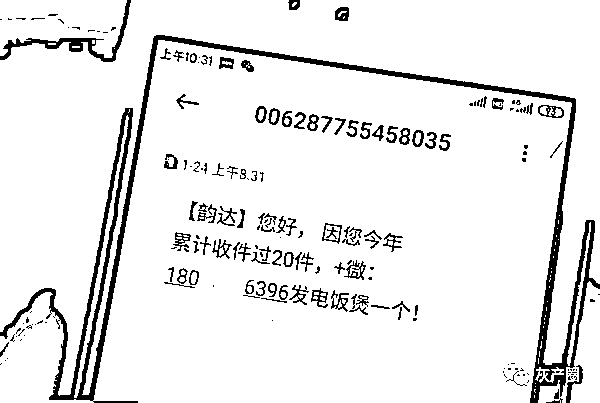
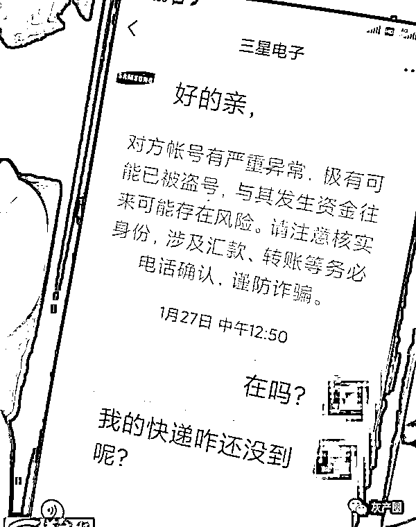
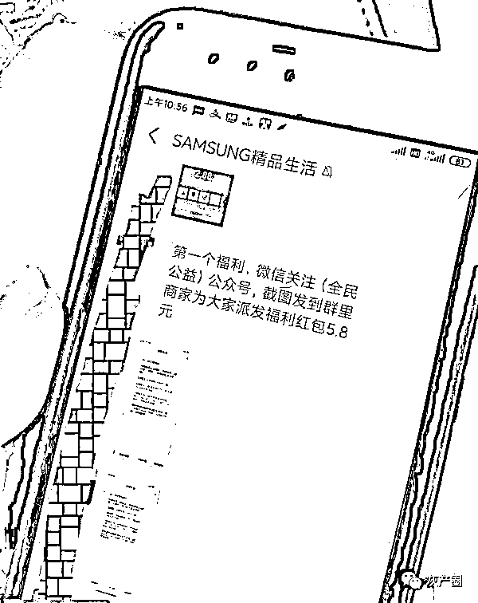
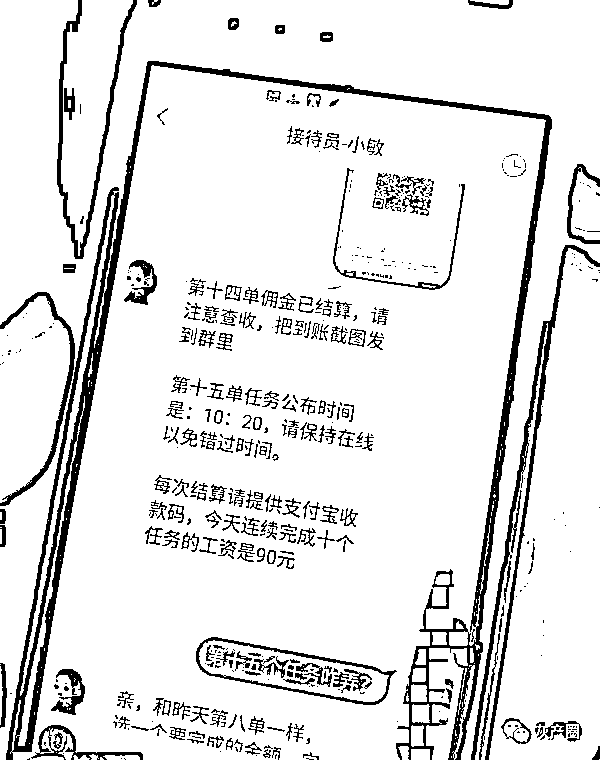
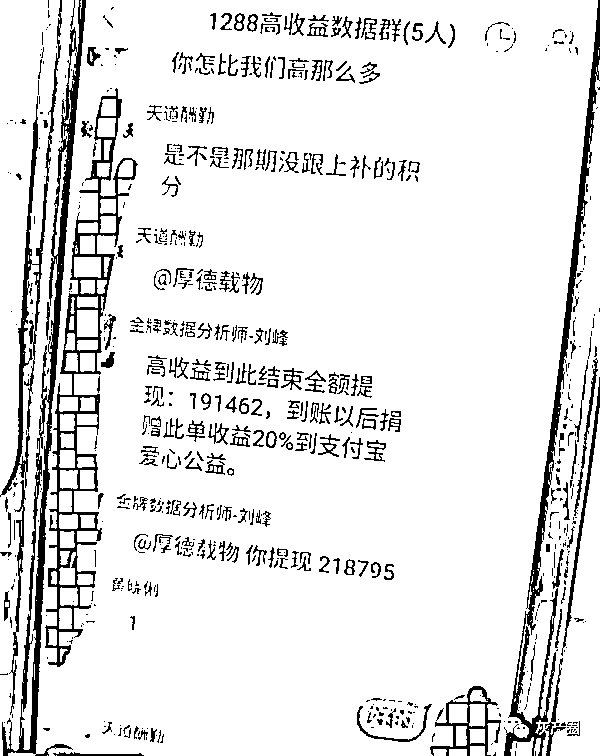
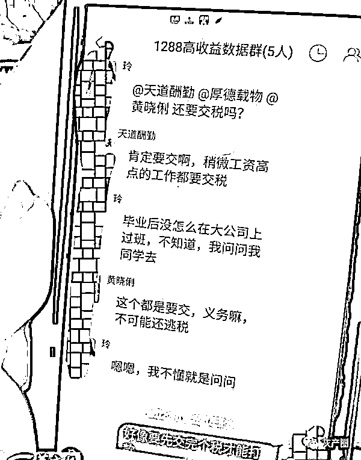

# 为领免费电饭煲，西安一市民掉进“盈利单”陷阱，被骗十余万…

> 原文：[`mp.weixin.qq.com/s?__biz=MzIyMDYwMTk0Mw==&mid=2247529713&idx=6&sn=9de3ca95ba119a08872ba83928b7529a&chksm=97cbbfc9a0bc36df626b3cca7516850b3da295fcf67748b368cdb54d17d2be0adb73a75d6b86&scene=27#wechat_redirect`](http://mp.weixin.qq.com/s?__biz=MzIyMDYwMTk0Mw==&mid=2247529713&idx=6&sn=9de3ca95ba119a08872ba83928b7529a&chksm=97cbbfc9a0bc36df626b3cca7516850b3da295fcf67748b368cdb54d17d2be0adb73a75d6b86&scene=27#wechat_redirect)

## 

不久前，西安市民张先生收到了领取免费电饭煲的短信，信以为真的他一步步掉进了早已设好的陷阱，最终电饭煲非但没领到，反而被骗了十余万元。 

**“商家”大放送**

**进群领取品牌电饭煲**

 市民张先生是西安周至县一所学校的教职工，1 月 24 日，他的手机收到了一条可以免费领取电饭煲的短信。短信上留了一个微信号码，需要添加该微信申请领取。 

 “当时在家里也没啥事情，就抱着试一试的态度，按照短信内容加了上面的微信号。”张先生说，“加了对方微信后，登记了我选中的电饭煲款式、颜色，并留了收货地址，随后他又我引导去加进了一个支付宝的群聊。” 

华商报记者注意到，在张先生和对方的微信聊天记录中，系统曾多次预警提示该账号有严重异常，与其发生资金来往可能存在风险。但张先生并没有所警觉，他称当时他以为加进了支付宝群，确认后就可以领到免费电饭煲了。 

 **群里不停的有人在发红包**

**要领电饭煲还得先做任务**

 张先生按照指引添加了这个上百人的支付宝群聊。进群后，管理员不停的刷屏通知，福利活动将于下午 3 时开始，期间还有厂家福利回馈的红包活动。下午 3 时，群管理员发布了第一个任务，微信关注(xx 公益)公众号，截图发到群里商家为大家派发福利红包 5.8 元。张先生和很多人照做后，也确实领到了 5.8 元的红包。之后又连续发布了几个任务，大多都是关注某某公益的公众号，随后也确实领到了数个几元钱的小红包。 

 群内管理员最后称，需要下载一款 APP 和客服人员进行资格审查，并领取 16.8 元的奖励后发放电饭煲。算下来这不到一个小时，点了点手指，张先生就已经领到了 10 余元红包，张先生觉得这事“靠谱”就按照管理员的指引下载了这款 APP。 

**看似挣了钱**

**却早已坠入了陷阱**

 记者看到该款名为某知名电器品牌的 APP 制作十分简陋，最主要功能仅是通讯聊天，在聊天界面上，客服人员对张先生进行了身份核实，紧跟着又发布了一些关注公众号的任务，并领取了几元钱不等的所谓佣金红包。 

 其中第六项任务为，公益捐赠 10 元钱，客服人员称捐赠后可领取佣金 16.8 元。张先生仍照做了，他也确实领到了 16.8 元的佣金。不仅如此，客服人员还支付了完成当日所有任务的 60 元佣金。随后客服人员告知他第二天 10：30 分在该 APP 上再完成一些公益任务，就可以领取到电饭煲了。 

1 月 25 日一大早张先生就通过这款 APP 有领取了一些任务，其中包括捐赠 388 元返还 504 元的。随后他被引导添加了该 APP 上一个所谓的“高收益”群聊中。

领电饭煲被抛之脑后 

**变成了一门心思的发大财**

 这个群聊中，只有一名所谓的投资引导师，和四名学员，张先生就是其中一名。“我们四个学员，两个是老手，我和另外一人是新手。等我明白自己被骗了才恍然大悟，其他三名学员都是托。”张先生说。 

引导师发布了第一个任务名为盈利单，三个选项，投资 3998 元收益高达 40%；投资 6888 元收益高达 45%元；投资 9888 元收益高达 50%。群内老手 A 说选第三个选项收益高。老手 B 说，这种高收益任务抢到了要珍惜。新手 A 说，自己第一次玩有些犹豫先选个 3998 元的投资看看风向。由于所谓的投资任务需要四名学员选择同一类型才能完成，此时的张先生在群内十分犹豫。

“两个老学员不停的说着自己赚了多少钱多少钱，那名新学员有些犹豫选择先投资少一点看看成果。而引导员却在不停的倒计时，还剩 10 分钟，还剩 5 分钟。”张先生说，当时他都有些紧张了，最终还是按照任务说明给某账号汇去了 3998 元。 

没一会，他的这款 APP 显示到账 5597 元。“但不能立即提现，需要连做四笔投资才行，是引导员和那两名老手在群里解释的。”张先生说，他当时也没惊醒，自己完全像是被洗脑了一样，像一名赌徒期待着引导员赶紧发布第二项任务。 

就这样张先生又连做了三个任务，分为 8888 元，28888 元，28888 元。此时张先生该款 APP 的账户余额显示为 218795。但当张先生准备提现时，却被告知需要先支付 20%的个人所得税，共计 43759。此时已经顾不得多一点思考的张先生又给对方汇去了 4 万余元，可谁知这钱却加到了该款 APP 的余额中，被对方告知操作错误，需要重新支付，张先生仍没有惊醒，又支付了一笔 4 万余元。 

然而，支付了个人所得税后，张先生还是不能提现，对方告知他由于存在大额资金往来，被监控为涉嫌洗钱，需支付 8 万元保证金后期返还。“为了支付个人所得税，我问同亲朋好友同事那借了钱，现在又要支付 8 万元保证金才能取现彻底把我难住了。不掏这笔钱吧，之前的投资全打了水漂。掏吧，我又怕被骗，而且也一时半会借不来那么多钱了。” 

 1 月 26 日晚张先生夫妻俩为这 8 万元犯了难，27 日凌晨他妻子偷偷给在西安工作的儿子打了电话，告诉了这一系列遭遇后。他的儿子马上意识到父母被骗十余万元，当即报警。当日凌晨 3 时许，辖区派出所民警敲响了张先生的家门。这时夫妻俩如梦初醒，不单单电饭煲没领上，然而损失了十余万元。目前周至警方已对此案介入调查。

来源：华商报，巴蜀反诈

← 向右滑动与灰产圈互动交流 →

