# 杨某侠结婚照曝光！细思极恐的诡秘：“小花梅”到底是几个人？

> 原文：[`mp.weixin.qq.com/s?__biz=MzIyMDYwMTk0Mw==&mid=2247529771&idx=1&sn=e2cd2da2b06597b82b71ddb9578485eb&chksm=97cbbe13a0bc3705352559c04d8be1149dbb1178169c1369116067206f89251751116929aff3&scene=27#wechat_redirect`](http://mp.weixin.qq.com/s?__biz=MzIyMDYwMTk0Mw==&mid=2247529771&idx=1&sn=e2cd2da2b06597b82b71ddb9578485eb&chksm=97cbbe13a0bc3705352559c04d8be1149dbb1178169c1369116067206f89251751116929aff3&scene=27#wechat_redirect)

关于徐州丰县“八孩铁链女”，今天又有猛料被曝出。

2 月 15 日上午 9 时 1 分，原凤凰周刊编委、记者部主任邓飞在微博上曝出杨某侠和董某民 1998 年 8 月的结婚证，**而结婚证上贴的杨某侠照片，与视频中的“八孩女”完全不像一个人。**

邓飞在微博发文称：

收到网友发来杨某侠和董志民陈旧结婚证照片（图 1—3。结婚证上的杨庆侠即徐州官方所称的杨某侠），显示 1998 年 8 月登记结婚，杨出生日期是 1969 年 6 月 6 日，符合我之前收到的身份证数据。

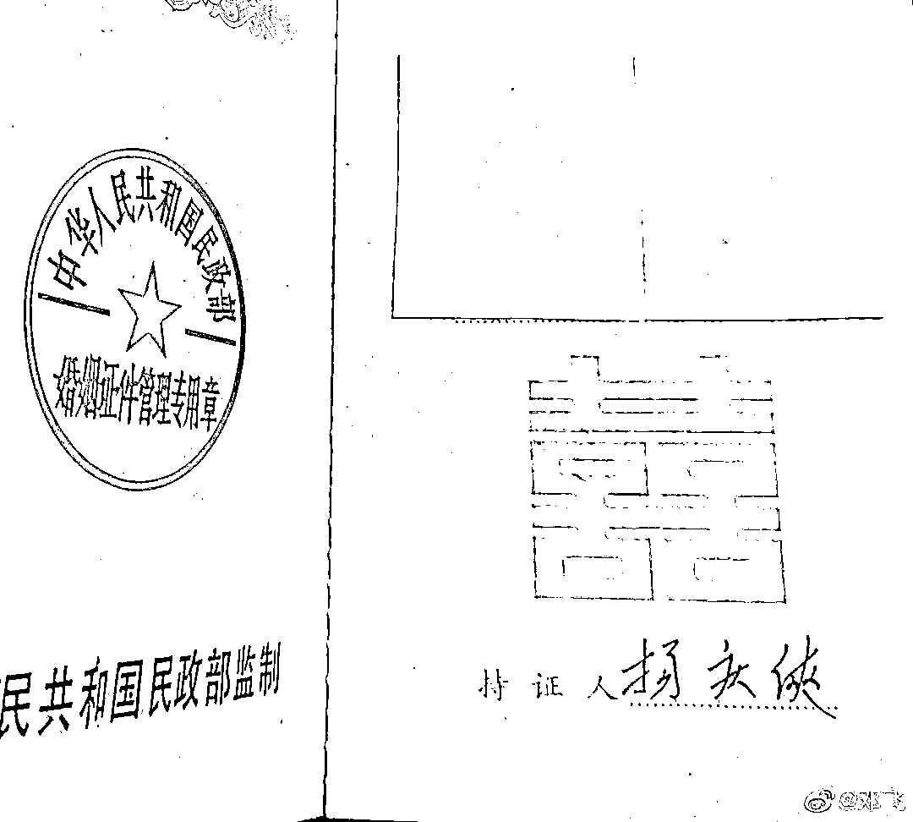

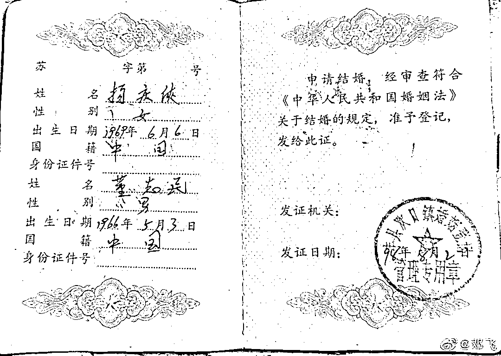

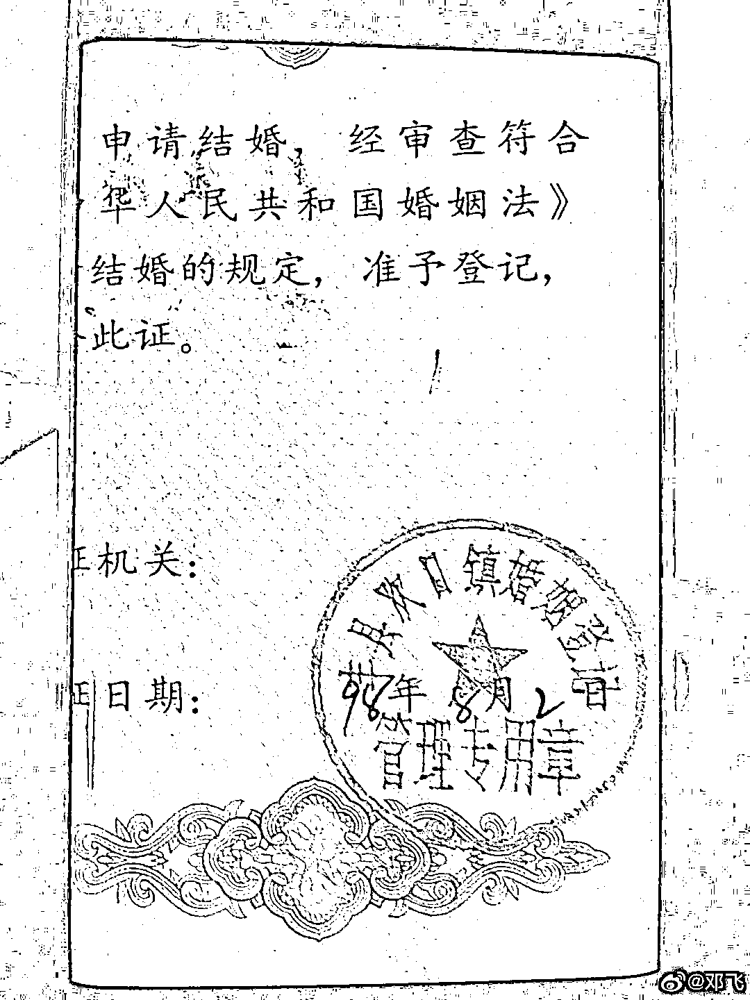

邓飞表示，我不能判断该照片女性就是如今视频里看到的杨某侠，**两者如是同一人，那该女性就是 52 岁。两者如非同一人，那董为什么要欺瞒民政部门？**最后，我公开向徐州联合调查组提供该条线索，希望可以支持江苏警方尽快确定铁链妈妈来源身份。

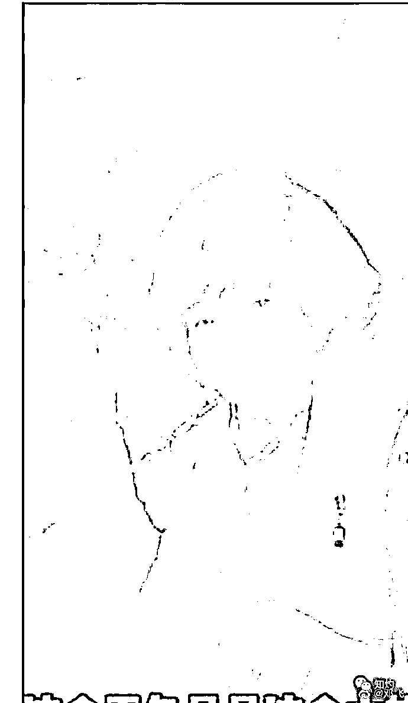

针对邓飞曝出的结婚证照片，你觉得这是一个人吗？这眼睛，眉毛，鼻子嘴巴，还有这瞳距，能是一个人吗？

**网友纷纷表示，这完全就不是一个人。**

**# 往期推文 #**

[**丰县「8 孩妈妈」事件：魔幻的三份官方通报下，老公居然接广告了！**](http://mp.weixin.qq.com/s?__biz=MzIyMDYwMTk0Mw==&mid=2247529393&idx=1&sn=371dac1988768a59735d05724cd7ead0&chksm=97cbb889a0bc319fc72f7a4d0f4778d5acf44b63a0902014d0af584d259a291899bdf5769362&scene=21#wechat_redirect) 

[**从不存在拐卖行为到第四次通报！啪啪啪啪，脸呢？**](http://mp.weixin.qq.com/s?__biz=MzIyMDYwMTk0Mw==&mid=2247529653&idx=1&sn=dce156c8450d2bbe55b8db6067b120ca&chksm=97cbbf8da0bc369b0a57491ffa8adc93ca4a11a7774298fcac1fbfbc9b78a194971547cdff01&scene=21#wechat_redirect)

[**江苏生育八孩女子事件后，盲山女主角辟谣“被村民买”，反被围攻**](http://mp.weixin.qq.com/s?__biz=MzIyMDYwMTk0Mw==&mid=2247528872&idx=1&sn=5aef3166e0fbb28331a1ddbebcd419f5&chksm=97cbba90a0bc338654d8cc198d7216aaed57f3fb727f32cf84774fa8844ade7213c0206e4b14&scene=21#wechat_redirect)

**01**

**问题重重的结婚证**

**23 岁的大儿子亲生的吗**

我仔细看了这几张结婚证，发现问题很多。 

① 无结婚证编号；

② 无双方身份证号；

③ 女方姓氏错写为“扬”，不是常见的“杨”；

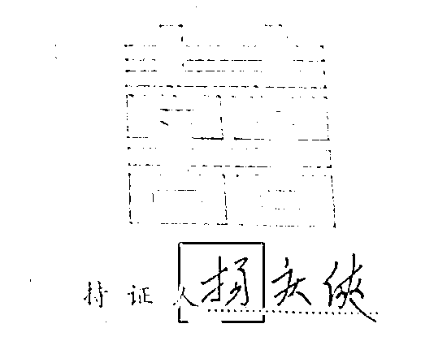

④ 办证日期为 1998 年 8 月 2 日，是星期天，非工作日；

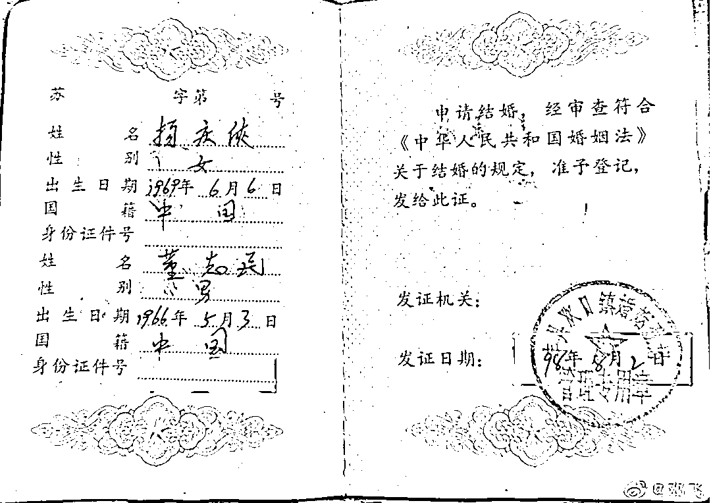

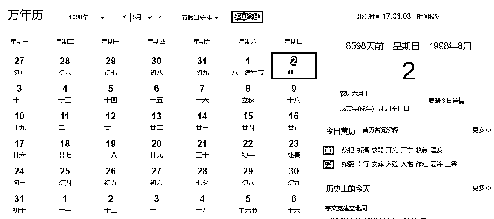

⑤ 结婚照为两张单人照片拼接而成，不是合影；

问题又来了——这个证是从哪里办的？谁办的？谁审查的？证上的字是谁写的？看过双方身份证户口本吗？

我很怀疑，这是假证吗？

有一点大家不知道注意到没，官方报道杨某侠的大儿子 23 岁，也到了懂事能担事的年纪，让自己的亲生母亲被锁链锁着、冻着，这一般做儿子的能忍？

网上有人骂这大儿子骂的很难听，我突然想到一点：

**万一不是亲妈呢？**

**徐州杨某侠大儿子出生日期曝光，为 1997 年 3 月，但官方通报董家捡到杨某侠是 1998 年 6 月，但后一份官方通报称母子关系成立，这是矛盾的。**

那么董家大儿子到底是谁生的？

**如果这结婚证上的女人和小花梅是两个女人，或许也能解开大儿出生后中间十来年未生育的谜团，那之前通报验过的 DNA 检验可信么？**

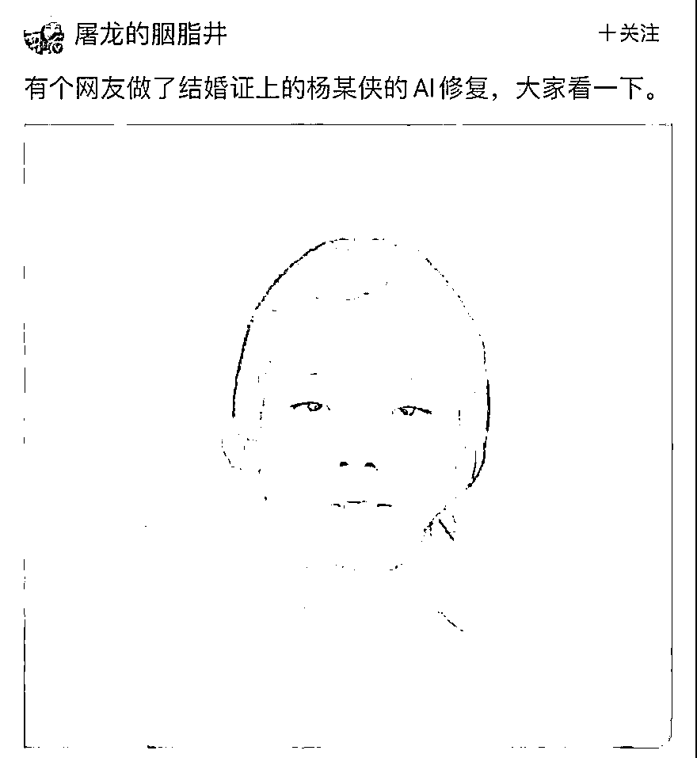

有人与亚谷村失踪的小花梅旧照对比，发现很像。 

若二者是同一人，为何成年后相貌变化如此之大？

若不是同一人，只有四种可能：

**要么是董志民欺瞒民政部门；**

**要么是民政部门收了好处闭着眼睛办理了结婚登记证；**

**要么是董志民找了一个别的女人办理结婚登记，而把杨庆侠用铁链拴在黑屋里虐待摧残；**

**要么就是照片上这个女人已经不在了，而用现在的李莹和官方口中的小花梅顶替杨庆侠这个名字。**

**02**

**结婚照的杨某侠就是小花梅**

**但不是铁链八孩女子**

我更认可第四种猜想：

**结婚照的杨某侠是小花梅，但不是铁链八孩女子。**

1998 年董某民确实和杨某侠登记结婚了，而这个杨某侠很可能就是云南古亚的小花梅。但后来小花梅因某种原因不见了，可能是死亡、失踪或其他原因。

小花梅很可能在与董某民的婚姻期间生有一子，这个孩子很可能就是八个孩子中的大儿子。

小花梅很可能在大儿子儿童时期不见的。**董某民在小花梅消失了以后，找到了铁链女，并将她替代了小花梅的身份，与她一起生育了其他七个孩子。**

那么，小花梅确有其人，而铁链女则很可能是四川失踪的女孩李莹。

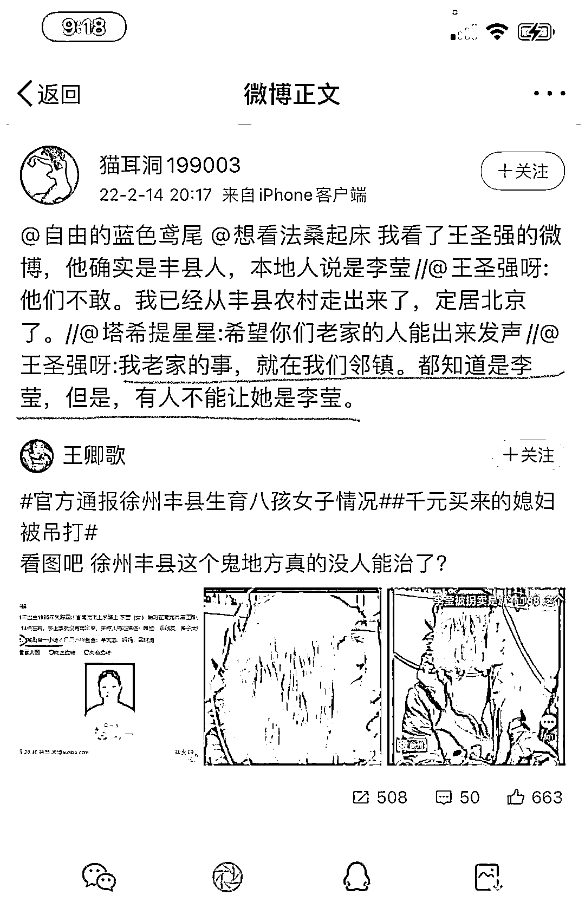

**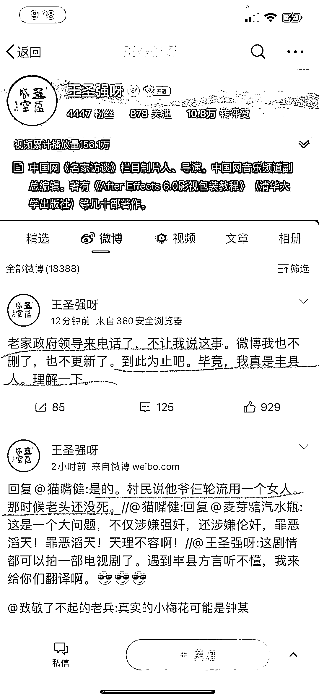**

**这个故事版本与所有本案中的所有蹊跷细节完美印证，现实比小说更加魔幻。**

**03**

**7 次高龄产子简直离谱** 

**换成李莹的年纪就说得通** 

到这你要问我有什么证据吗？

**巧了，我们靠现有的数据推演一下，真假自辨。**

在接受快手博主询问时，董某民自己说，大儿子 23 岁了，也就是 1997 年出生。

杨某侠出生日期是 1969 年 6 月 6 日。

也就是说：

**大儿子生于 1997 年，小花梅时年 28 岁；**

**二儿子生于 2011 年，小花梅时年 42 岁；**

**三儿子生于 2012 年，小花梅时年 43 岁；**

**老四生于 2013 年，小花梅时年 44 岁；**

**五儿子生于 2016 年，小花梅时年 47 岁；**

**六儿子生于 2017 年，小花梅时年 48 岁；**

**老七生辰不详；**

**八儿子生于 2019 年，小花梅时年 50 岁。**

**徐州 3.0 通报过，这 8 个孩子是同父同母，都是董某民和杨某侠的孩子。**

也就是说，**杨某侠从 28 岁生完老大后，有 12 年没有再生孩子，然后从 42 岁起迎来了生育高峰，在 42-50 岁的 9 年时间里，连生 7 子。**

这不算医学奇迹，什么算医学奇迹？反正我觉得离奇！

**一个女人，生存环境恶劣，营养跟不上，但是身体素质一直这么好，7 次高龄产子。**

如果结婚证上的人是网友们一直高度怀疑的李莹呢？

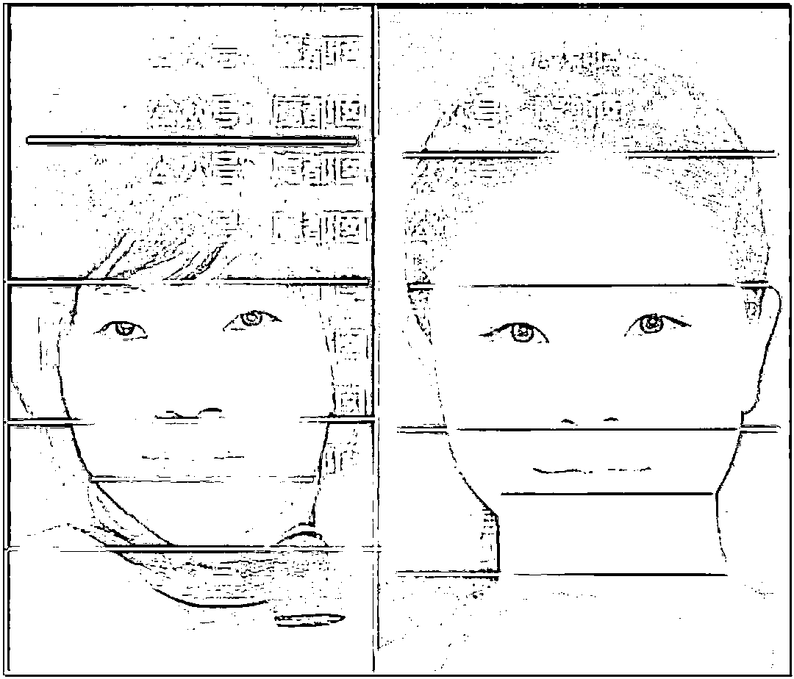

**李莹 1984 年出生，1996 年失踪。**

**生大儿子时，时年 14 岁；**

**生二儿子时，时年 27 岁；**

**生三儿子时，时年 28 岁；**

**生老四时，时年 29 岁；**

**生老五时，时年 32 岁；**

**生老六时，时年 33 岁；**

**生老八时，时年 35 岁。**

排除未成年产子（14 岁也有这个可能），是不是感觉这个生育年龄更符合常识一些？

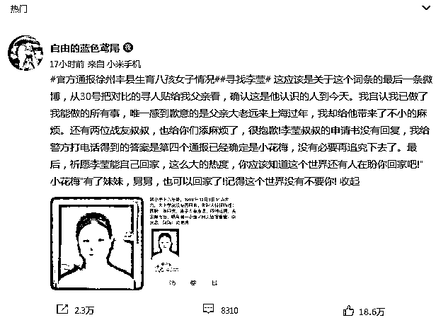

结婚照的杨某侠就是小花梅，铁链八孩女子可能是李莹。

现在官方用铁链女子代替小花梅堵住悠悠之口。

但其实是两人。

**那小花梅在哪？是死是活？铁链女子又是谁？**

****一个谎话，需要好多的谎话来圆。****

以现在的形势发展来看，徐州丰县是很有必要再发布第五次通告了。

只是这一次，再闹笑话。

****元宵猜灯谜，李莹在哪里？丰县官老爷，何时揭谜题。****

在央视采访的一段镜头中，杨某侠躺在病床上几次翻身起床，向前来嘘寒问暖的医生大声说：“放我走吧”。

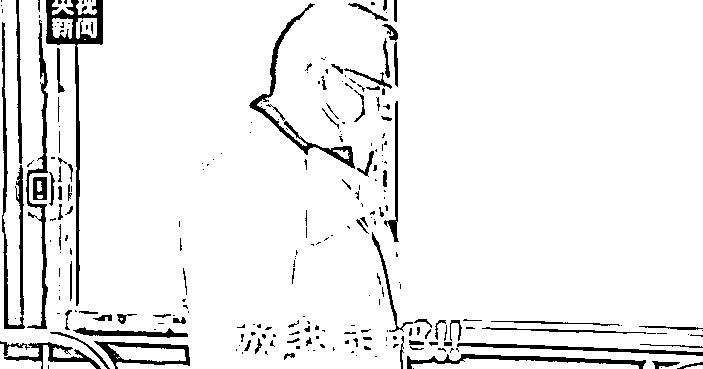

铁链拴住的女子终于得到了“解救”，进了精神病院。 

精神病怎么能放你出去！

视频中她能清晰表达出的第三句话：

**这个世界不要俺了，这一窝不是人，通通都是强奸犯。**

三句话，正是女人悲惨命运的一生。

**他们全是“强奸犯”，“强奸”了她的自由，“强奸”了她的人生。**

**甚至，名字都有可能不是自己的。**

实在可怜可悲可叹！

愿天下无拐！

来源：昌南大队长

← 向右滑动与灰产圈互动交流 →

