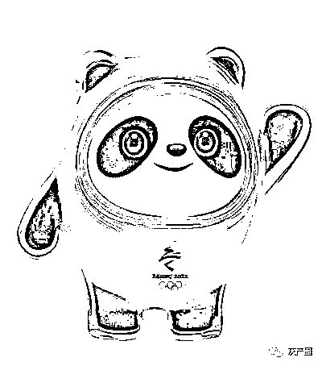
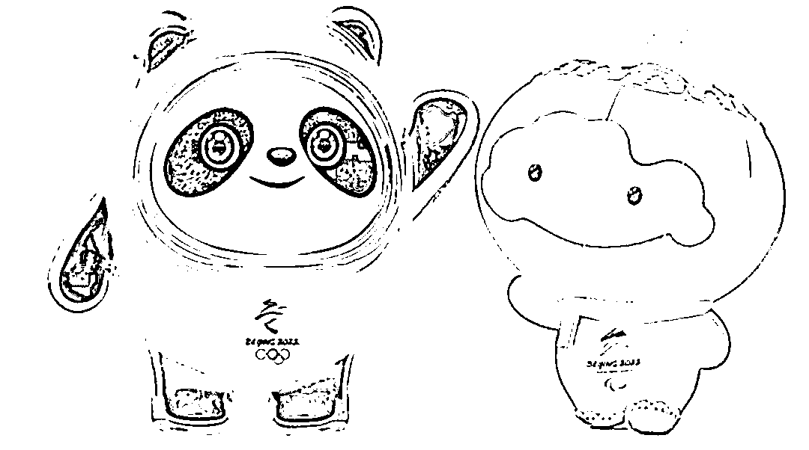
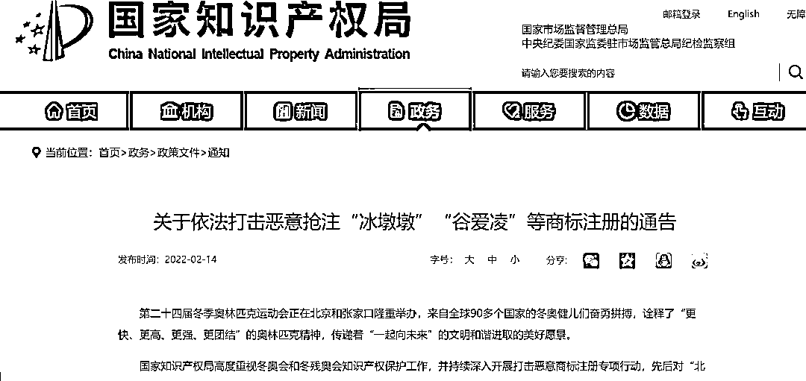
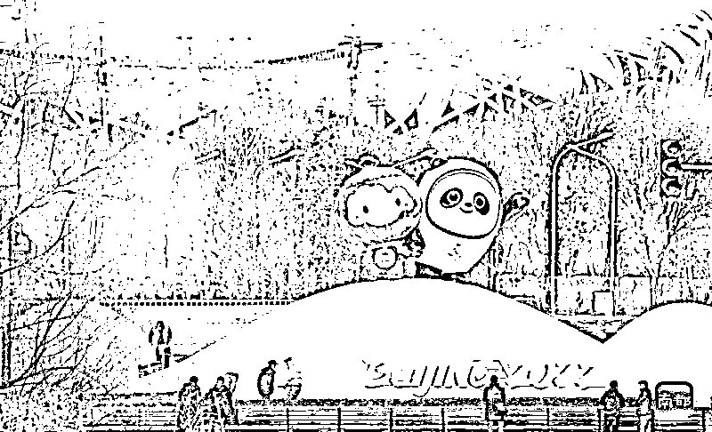

# 全国首例！制售盗版“冰墩墩”、“雪容融”被判刑一年

> 原文：[`mp.weixin.qq.com/s?__biz=MzIyMDYwMTk0Mw==&mid=2247529771&idx=3&sn=a258fceac3caef612e2d2b7d66560f87&chksm=97cbbe13a0bc37050aa4cd87f64865f5d0196b7e7189fda3be23b3dd0a42b7835a02adcf2aaf&scene=27#wechat_redirect`](http://mp.weixin.qq.com/s?__biz=MzIyMDYwMTk0Mw==&mid=2247529771&idx=3&sn=a258fceac3caef612e2d2b7d66560f87&chksm=97cbbe13a0bc37050aa4cd87f64865f5d0196b7e7189fda3be23b3dd0a42b7835a02adcf2aaf&scene=27#wechat_redirect)

**据北京冬奥组委，北京冬奥会吉祥物“冰墩墩”形象和名称属于我国法律法规确定的奥林匹克标志，未获北京冬奥组委的许可，任何人不得为商业目的使用“冰墩墩”形象和名称。** 

你近日是否遇到“一墩难求”情况？但提醒不要在非官方授权渠道购买“冰墩墩”。据中新网，14 日，中宣部版权管理局副局长汤兆志在全面加强冬奥知识产权保护专场发布会上介绍，近期，北京快侦、快诉、快判一起制售盗版冬奥吉祥物冰墩墩、雪容融玩偶案，犯罪嫌疑人任某被判处有期徒刑一年、并处罚金 4 万元，成为全国首例侵犯北京冬奥吉祥物形象著作权刑事案件。

南都记者了解到，同日，国家知识产权局官网发布通告，对“冰墩墩”、“谷爱凌”等 43 件商标依职权主动宣告无效。据北京冬奥组委，北京冬奥会吉祥物“冰墩墩”形象和名称属于我国法律法规确定的奥林匹克标志，未获北京冬奥组委的许可，任何人不得为商业目的使用“冰墩墩”形象和名称。

“冰墩墩”和“雪容融”。图源国家知识产权局官网。

**国家版权局**

**共接到各类权利人通知后**

**删除涉冬奥侵权链接 32376 个**

据媒体公开报道，汤兆志表示，截止 2 月 12 日零时，优酷、爱奇艺、腾讯视频、新浪微博、B 站、抖音、百度等 27 个主要视频、社交、直播及搜索引擎平台，国家版权局共接到各类权利人通知后删除涉冬奥侵权链接 32376 个；按照国家版权局等 6 部门组成的冬奥会反盗版工作组的要求，通过自查主动删除涉冬奥侵权链接 227452 个；各平台因传播涉冬奥侵权内容等情况，处置各类账号 3363 个。在此基础上，关闭了 39 个境外非法网站，依法处置了 52 个涉嫌非法传播涉冬奥内容的境内网站(APP)。

与此同时，国家版权局也加强了对传统侵权盗版问题的查处。近期，北京快侦、快诉、快判一起制售盗版冬奥吉祥物冰墩墩、雪容融玩偶案，犯罪嫌疑人任某被判处有期徒刑一年、并处罚金 4 万元，成为全国首例侵犯北京冬奥吉祥物形象著作权刑事案件。

汤兆志还指出，从版权角度而言，除了法律特别规定，比如《著作权法》规定的，为个人的学习、研究、欣赏而使用作品，或者为了新闻报道，媒体中不可避免的再现一些作品的内容，除了这些合理使用的情形外，其他未经许可的著作权意义上的使用行为，都可能构成著作权侵权。

“比如有的商家未经权利人许可，擅自生产玩具、玩偶或者将其用于服装、玩具等等周边衍生产品的行为，都可能触犯著作权版的有关规定，构成侵权。损害公共利益的，还将会受到行政处罚，构成犯罪的会和刚才通报的案件那样，被追究刑事责任。”汤兆志说。

**国家知识产权局**

**对“冰墩墩”、“谷爱凌”等 43 件商标依职权主动宣告无效**

2 月 14 日，国家知识产权局也在官网发布《关于依法打击恶意抢注“冰墩墩”“谷爱凌”等商标注册的通告》，显示 2019 年以来，少数企业、自然人以牟取不当利益为目的，将北京 2022 年冬奥会和冬残奥会吉祥物、运动健儿姓名等冬奥热词进行恶意抢注，委托代理机构提交商标注册申请，非法利用奥运会和奥组委的声誉，侵害他人姓名权及其他合法权益，造成了重大社会不良影响，损害了我国严格保护知识产权的良好形象。

国家知识产权局官网截图。

对此，国家知识产权局予以坚决打击，依据《奥林匹克标志保护条例》、《商标法》第十条第一款第（八）项等规定，对第 41128524 号“冰墩墩”、第 62453532 号“谷爱凌”等 429 件商标注册申请予以驳回（附件一）；依据《商标法》第四十四条第一款规定，对已注册的第 41126916 号“雪墩墩”、第 38770198 号 “谷爱凌”等 43 件商标依职权主动宣告无效。

据国家知识产权局官网，早在 2019 年 9 月，国家知识产权局业务受理大厅就迎来了两位特殊的申请人：北京 2022 年冬奥会和冬残奥会组织委员会（下称北京冬奥组委）法律部权益处的工作人员。当天，他们代表北京冬奥组委在受理大厅正式提交了北京冬奥会吉祥物、北京冬残奥会吉祥物形象相关的标贴、标牌、图形用户界面（GUI）等 8 件外观设计专利申请。　

据悉，早在 2002 年，我国就发布了《奥林匹克标志保护条例》，为 2008 年北京奥运会、残奥会的顺利举办及各项权益提供了有力保障。2018 年 7 月 31 日，新修订的《奥林匹克标志保护条例》开始施行。同一天，北京冬奥组委向国家知识产权局商标局提交首批奥林匹克标志和残奥会标志注册申请。据了解，北京冬奥组委此次提交的标志包括 14 件奥林匹克标志和 4 件残奥会标志。

****

**未获北京冬奥组委的许可**

**任何人不得为商业目的使用“冰墩墩”形象和名称**

那么，什么情况下“冰墩墩”可以依法合规地使用，需要履行哪些手续，遵守哪些规则？据新华网，北京冬奥组委表示，首先，吉祥物“冰墩墩”是北京冬奥组委的重要财产，北京冬奥组委对“冰墩墩”的形象依法享有著作权、注册商标专用权、外观设计专利权，对“冰墩墩”中英文名称还依法享有注册商标专用权。因此，任何人对“冰墩墩”形象或者名称的使用，都应当遵守《中华人民共和国著作权法》《中华人民共和国商标法》《中华人民共和国专利法》（以下简称著作权法、商标法、专利法）等相关法律法规的规定。

比如，“冰墩墩”的形象作为美术作品，北京冬奥组委的著作权是受法律保护的，未经北京冬奥组委许可，其他任何单位或者个人不得使用该作品，更不得将“冰墩墩”的形象进行歪曲、篡改等不当使用，按照法律规定合理使用的除外。同理，北京冬奥组委对“冰墩墩”的形象和名称享有的注册商标专用权、外观设计专利权同样受法律保护。对于违法违规使用，北京冬奥组委有权追究侵权人的法律责任。

1 月 12 日，“冰墩墩”“雪容融”亮相北京中轴线。新华社发

其次，北京冬奥组委对“冰墩墩”的形象和名称除了享有传统的著作、商标、专利等知识产权以外，还特别享有奥林匹克标志专有权。对一些重要的奥林匹克元素采取特殊的保护措施，是我国所特有的，其源于《奥林匹克标志保护条例》，也体现了我国对奥林匹克规则的尊重。目前，国家知识产权局已经公告总计 63 项奥林匹克标志。这里既包括可爱的吉祥物“冰墩墩”，也包括奥林匹克五环图案、北京冬奥会会徽等标志。

此外，奥林匹克标志的使用可以分为商业和非商业两种情况。一是商业使用。《奥林匹克标志保护条例》规定，未经奥林匹克标志权利人许可，任何人不得为商业目的使用奥林匹克标志。北京冬奥会吉祥物“冰墩墩”形象和名称属于我国法律法规确定的奥林匹克标志，未获北京冬奥组委的许可，任何人不得为商业目的使用“冰墩墩”形象和名称。

目前，国际奥委会全球合作伙伴和北京冬奥会官方合作伙伴和官方赞助商可以依法商业使用“冰墩墩”形象和名称。此外，北京冬奥会特许经营生产商和零售商可以依据北京冬奥会特许经营计划生产和销售“冰墩墩”形象和名称的特许商品。

新华社照片，北京，2022 年 2 月 13 日    （新华全媒+·北京冬奥会）2 月 13 日，新一批“冰墩墩”抵京。   新华社记者 陈钟昊 摄

二是非商业使用。机关法人、基层群众性自治组织法人、事业单位等非营利法人或者组织可以申请非商业使用北京冬奥会吉祥物“冰墩墩”。申请人申请非商业使用“冰墩墩”，应遵守《北京 2022 年冬奥会和冬残奥会组织委员会有关标志非商业使用规则》（冬奥组委发〔2019〕19 号），登录北京冬奥组委官方网站，搜索“有关标志非商业使用规则”链接进入相关页面，按要求填报材料，进行申请。

获得许可的使用人应当按照许可的范围、签署的承诺以及北京冬奥组委制定的技术规范使用“冰墩墩”，不得实施任何侵害北京冬奥组委知识产权的行为，也不得协助任何第三方实施足以引人误认为其与北京冬奥组委、北京冬奥会等存在特定联系的混淆行为。

来源：南方都市报 app

← 向右滑动与灰产圈互动交流 →

