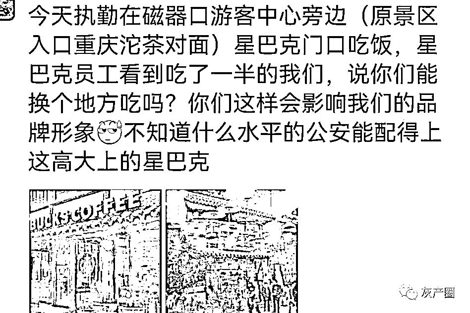
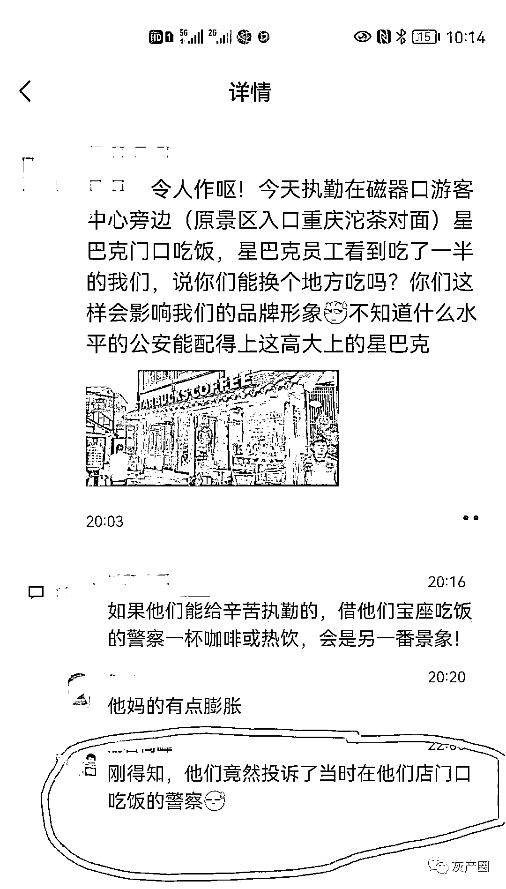
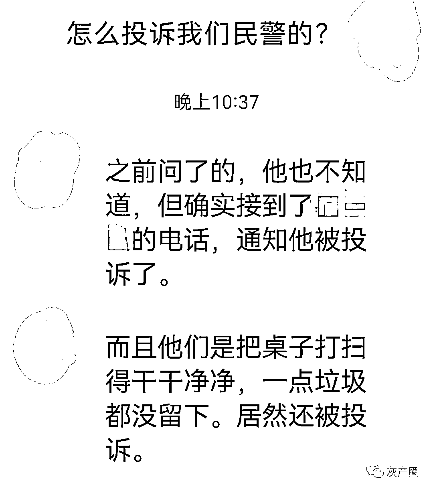
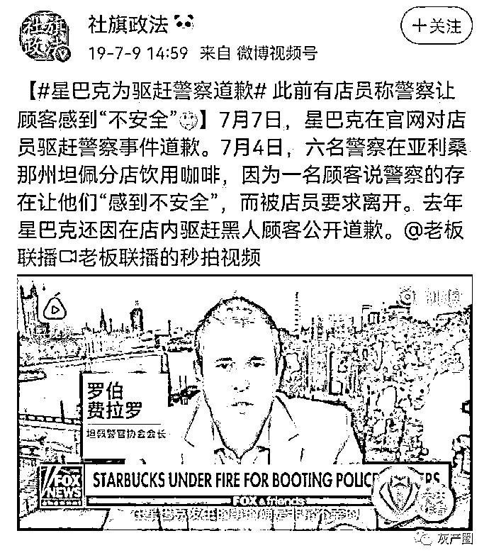
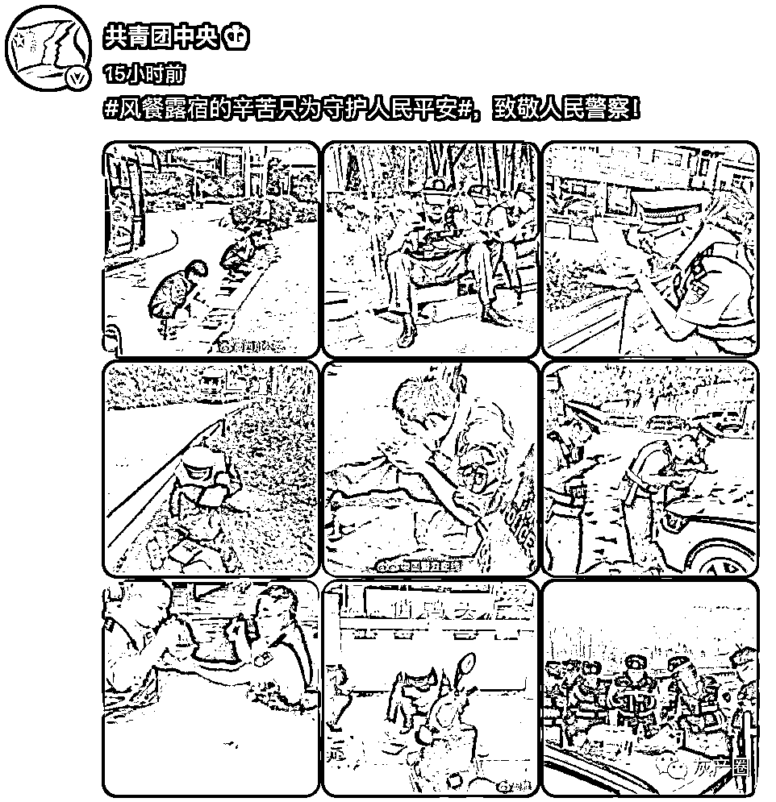
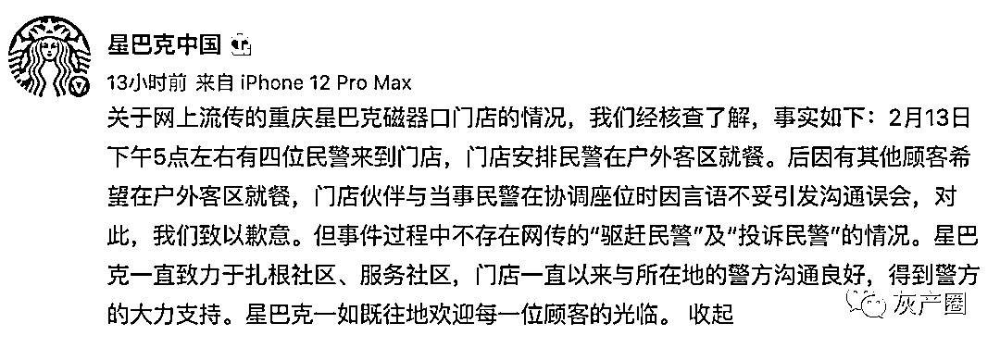

# 星巴克驱赶执勤在门口吃饭的民警，称其“会影响品牌形象”

> 原文：[`mp.weixin.qq.com/s?__biz=MzIyMDYwMTk0Mw==&mid=2247529771&idx=4&sn=f23f174f865871dbfb51137bb77bc5dd&chksm=97cbbe13a0bc370595adb9f904e4d7ec04fdfd003932c43b4bf1f61defcda867518fd17a7ce9&scene=27#wechat_redirect`](http://mp.weixin.qq.com/s?__biz=MzIyMDYwMTk0Mw==&mid=2247529771&idx=4&sn=f23f174f865871dbfb51137bb77bc5dd&chksm=97cbbe13a0bc370595adb9f904e4d7ec04fdfd003932c43b4bf1f61defcda867518fd17a7ce9&scene=27#wechat_redirect)

2 月 13 日，有网友发帖称：重庆一星巴克赶走在门口吃盒饭的民警还恶意投诉。截图显示，星巴克员工看到在门口吃饭的民警，称其“会影响品牌形象”。

因为昨天重庆太阳很好，到磁器口游览的市民很多。所以加派了执勤民警维护秩序、服务市民！民警走之前把桌子打扫的干干净净，一点垃圾都没留下。网上还流传着一张尚未证实的聊天截图，这个磁器口的星巴克员工不仅驱赶警察，事后他们还向相关部门投诉了在他们门口的执勤民警。

2019 年美国星巴克驱赶警察最终官网公开道歉。

@共青团发文表态 

2 月 14 日，重庆，星巴克发表声明否认驱赶并投诉警察。声明称，2 月 13 日下午 5 点左右有四位民警来到门店，门店安排民警在户外客区就餐。后因有其他顾客希望在户外客区就餐，门店伙伴与当事民警在协调座位时因言语不妥引发沟通误会，对此，我们致以歉意。但事件过程中不存在网传的“驱赶民警”及“投诉民警”的情况。

狐狸头狈狈:所以是哪个顾客看着外面坐着民警在吃饭然后跟员工说我要坐那

洛宣然:正常人都不会没素质到想要已经有人坐的位置吧

Dwan 降临:不真实如果是客人，怎么会知道民警有没有在星巴克消费？如果他无法判断民警是否在星巴克消费，是不会提出要求赶走民警让自己在户外客区就餐的要求的，有素质的客人都不会这样。合理的公关应该是所有座位都满了，星巴克店员只好要求没有消费的民警让座，雇佣我当公关吧

慕初浛:咖啡你卖很贵  驱赶警察很醉  微博见势不对 原来员工有罪

来源：微博那些事儿

← 向右滑动与灰产圈互动交流 →

