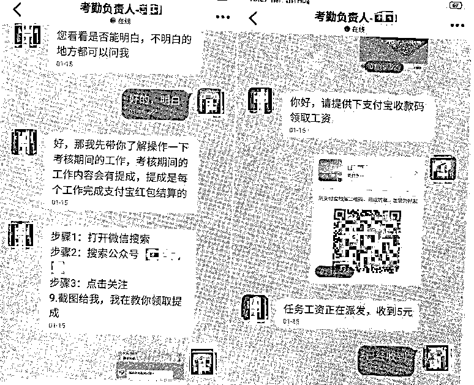
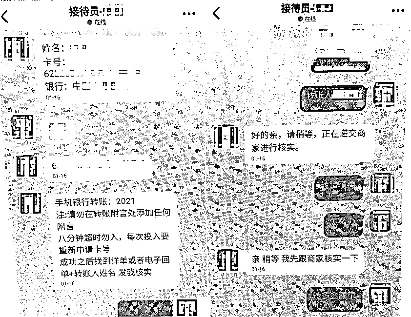
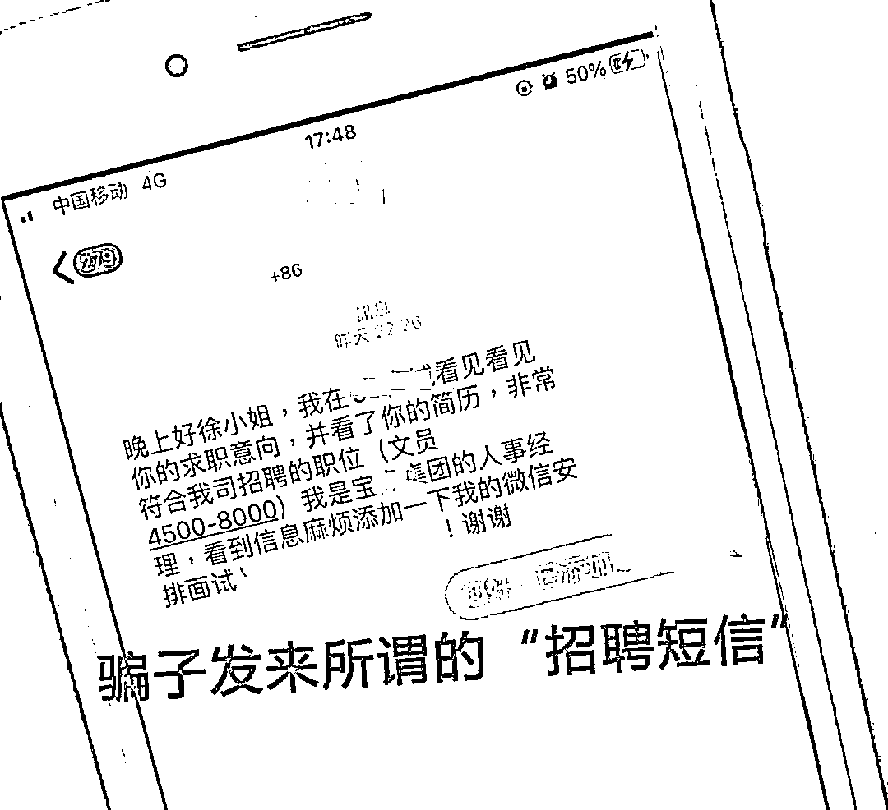

# 紧急提醒！年后这几类诈骗高发！

> 原文：[`mp.weixin.qq.com/s?__biz=MzIyMDYwMTk0Mw==&mid=2247529771&idx=5&sn=a16948619205d6deaa8dbf05a0ee3425&chksm=97cbbe13a0bc370593d79cdc228ee00ddd16fec7250fdfd5045f4ed4e65c68d4bbcf873d1845&scene=27#wechat_redirect`](http://mp.weixin.qq.com/s?__biz=MzIyMDYwMTk0Mw==&mid=2247529771&idx=5&sn=a16948619205d6deaa8dbf05a0ee3425&chksm=97cbbe13a0bc370593d79cdc228ee00ddd16fec7250fdfd5045f4ed4e65c68d4bbcf873d1845&scene=27#wechat_redirect)

春节长假结束后

大家陆续返岗复工

也有很多人踏上了求职之路

警方提醒广大求职者

警惕“境外高薪务工”陷阱

切勿贪图小利吃大亏

“

**那边我这辈子都不想去了**

**还不如回来坐牢！**

[`mp.weixin.qq.com/mp/readtemplate?t=pages/video_player_tmpl&action=mpvideo&auto=0&vid=wxv_2264663424817381378`](https://mp.weixin.qq.com/mp/readtemplate?t=pages/video_player_tmpl&action=mpvideo&auto=0&vid=wxv_2264663424817381378)

1

**轻信“境外高薪务工”变成“诈骗犯”**

2021 年 8 月份，刚满 20 岁的阿权，在网上看到一则招工广告：**每月 8000 元底薪加提成，吃住全包，工作内容是夜场安保。**

经过几通电话联系，**听着对方描述的前景，又是“高月薪”，又是“包出境”“好生活”，阿权就心动了**。很快，根据对方的指示，阿权来到了云南，辗转多地到了边境。

当阿权反应过来自己是偷渡出国时，已经晚了……一到地后，**大量当地武装持枪人员把他们团团围住，强行把阿权带到了“公司”。**

所谓的“公司”，**其实就是铁皮房搭建的办公室和宿舍，外围有围墙，还有荷枪实弹的安保人员进行把守。**

▲围墙上布满带有尖刺的铁丝网

公司的主管直接摊牌：**我们就是搞电信诈骗的**，如果听话，大家一起吃香喝辣。如果不听话，后山那些坑就是为你们准备的。**如果想逃跑？那就要看看，是你的腿快，还是子弹快？**

公司一共分为 3 个组，“杀猪盘”组、“网络赌博”组、“黄播”组。阿权被分到了“杀猪盘”组，**每天的任务就是通过社交软件，添加好友，按照提供好的话术，通过网恋的方式来骗取钱财。**

后来，公司主管认为阿权搞诈骗实在“拉胯”，便转手把阿权卖给了另一家“公司”。新公司很快也发现了阿权的“不寻常”，于是同意阿权给自己“赎身”。就这样，历时 120 天，阿权才重新回到了国内。**回****国不久后，阿权就向警方自首。**

请大家不要轻信

“境外高薪务工”招聘信息

此类信息可能是诱惑你到境外

强迫你从事

**电信网络诈骗、****网络赌博等**

****违法犯罪活动****

****并以此向国内亲人敲诈勒索巨额钱财****

****天下没有免费的午餐**** 

****境外不是天堂****

****看到这类招聘信息时应格外留心****

****要确定信息发布机构是否具有****

******“境外就业中介经营”**的相关资质****

****出国务工应要求招工单位****

****办理务工签证****

****注意签订境外就业合同****

****莫贪小利而失大局丢性命****

********

****年后是求职高峰****

****骗子也“复工”了****

****还推出多种招工“诈骗套餐”****

****广大求职者一定要擦亮双眼****

****谨防掉入不法分子设的圈套****

****2****

******女子刚毕业找工作，没想到……******

****刚毕业不久的小王，在网上看到一条让她颇为心动的招聘信息，便主动联系了该公司的人事。随后，对方要求小王下载一款名为“大 X 生活”的 App，称公司需要用这个 App 网上办公。****

****小王下载注册账号后，添加了“公司考勤负责人”为好友，**对方以完成任务为由让小王关注一个微信公众号，并转了 5 元到她的支付宝账户。**次日早上，对方又要求其**关注三个微信公众号，并给她转了 10 元作为返利。******

********

****之后，“负责人”开始提高任务难度，要求小王完成数据对冲的任务。前两次顺利获得奖励的小王没有多想，**在对方指引下选择了 200 元对冲金额的任务，并将钱转到指定账号。******

********

****然而，对方却声称小王的操作步骤有误，需要转 600 元到指定的银行账户以弥补协议。小王按照要求操作后，对方又以申请修复任务卡号、转错金额等理由不断要求其转账，**直至转账 4000 多元后，小王才察觉到自己遭遇了诈骗，于是报警求助。******

********

****不少求职者很容易****

****被虚假招聘信息蒙蔽双眼****

****连面都没见****

****交完所谓的“费用”后****

****才发现自己被骗****

****3****

******找工作变成了“网络刷单”******

****2021 年年底，广东惠州的徐女士在网上应聘后，**仅仅 2 天被一步步“引诱”进行刷单，险些被骗走 6000 元。******

********

****骗子以女士被录用为由，让其下载指定 App 并将其拉入“企业工作群”，然后发布“刷单任务”。徐女士按照要求步步操作，很快得到 135 元返佣。****

********

****正当徐女士感慨这份工作既轻松又赚钱的时候，警方来电话了。原来，惠东县公安局城南派出所民警接到预警指令，致电徐女士告知其正遭遇刷单诈骗，千万不能转账！****

****骗子通过各大知名招聘平台****

****利用高薪职位广撒网****

****伪装成各类正规企业****

****邀请受害者试做简单任务并给予奖励****

****在取得信任后****

****骗子会要求进行其他操作****

****“充值、连续刷单、提现失败……”****

****受害者步步陷入套路深渊无法自拔****

********

******大家在求职过程中******

******要尽可能了解清楚******

******相关公司情况后再入职******

******提及转账要多留心眼******

******发现被骗后要保存证据******

******并第一时间报警求助******

****来源：拒绝跨境赌博，中国警察网，广东公安****

********

****← 向右滑动与灰产圈互动交流 →****

********