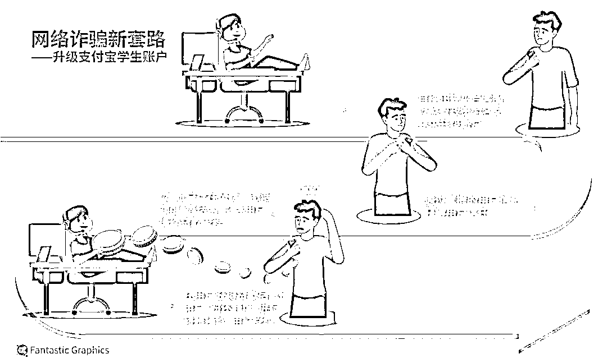
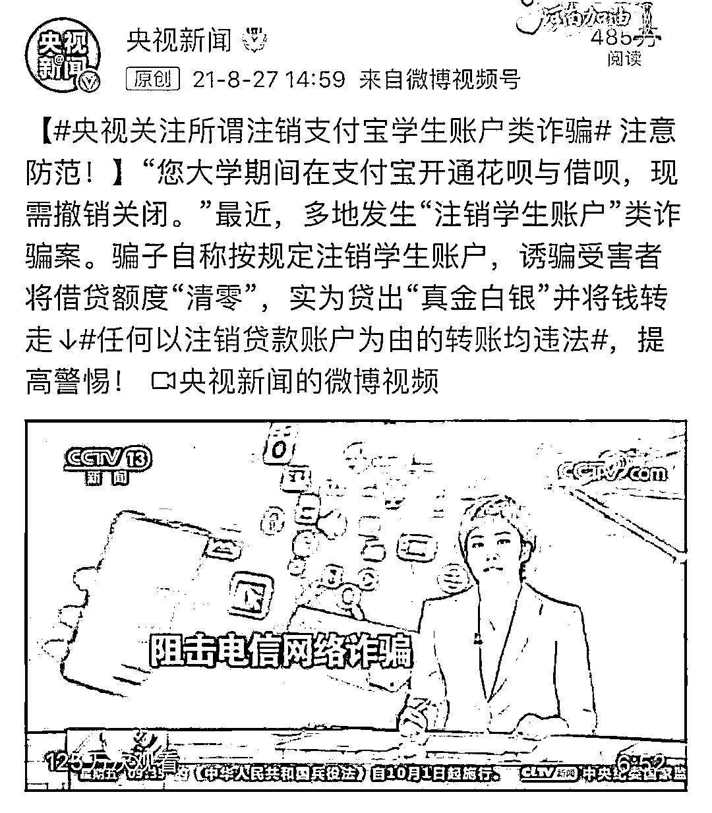
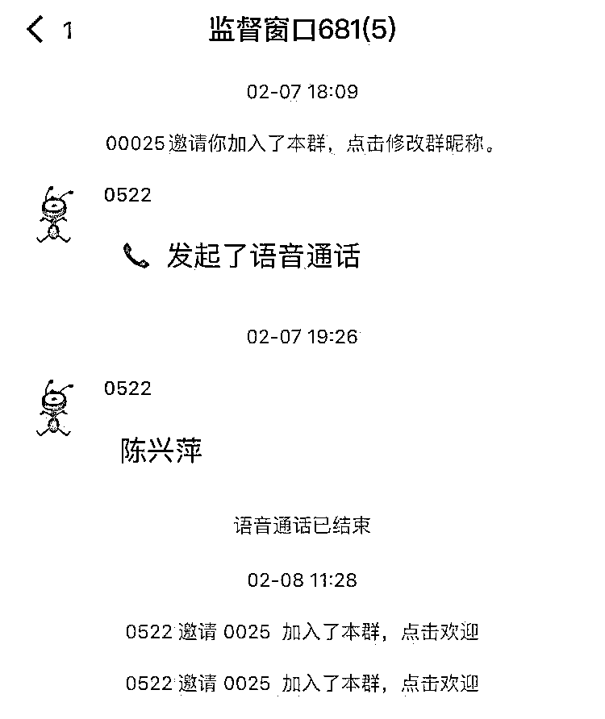
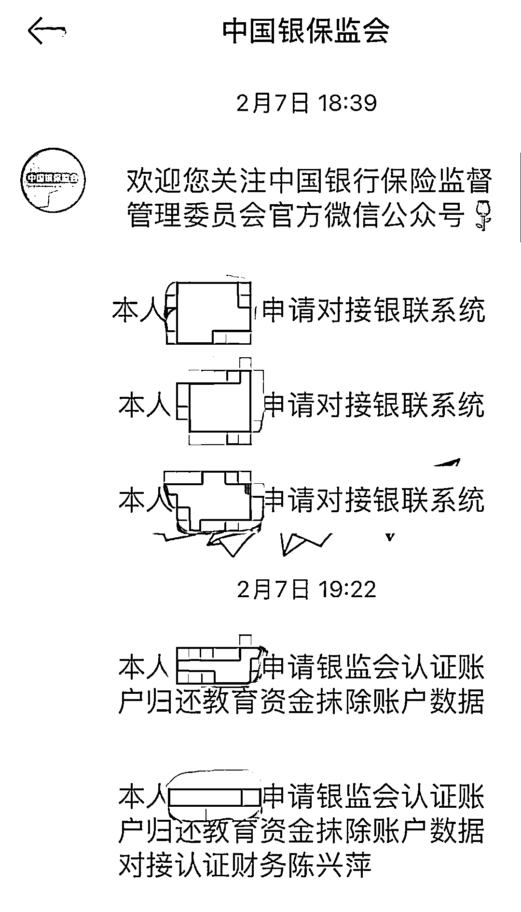
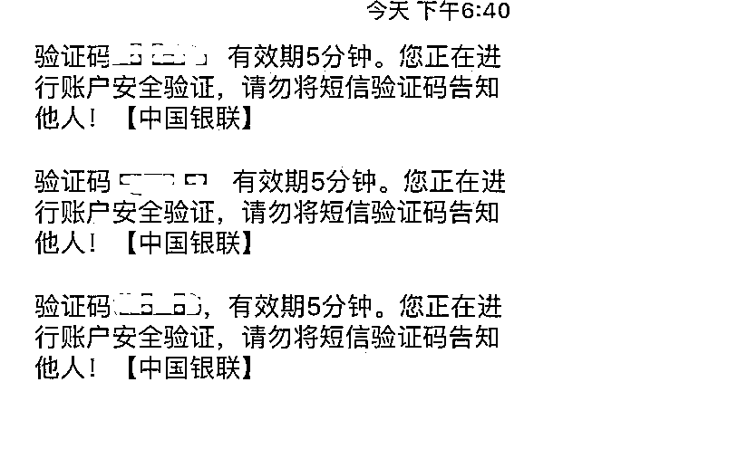

# 一封读者来信：骗子差点骗走我四万元

> 原文：[`mp.weixin.qq.com/s?__biz=MzIyMDYwMTk0Mw==&mid=2247529771&idx=6&sn=fc2a3fcd71988f646dacc65cb923dcdf&chksm=97cbbe13a0bc3705a0247bd5ac93746aa46702507df006454f70cb5a526bce6173d4acbffbcf&scene=27#wechat_redirect`](http://mp.weixin.qq.com/s?__biz=MzIyMDYwMTk0Mw==&mid=2247529771&idx=6&sn=fc2a3fcd71988f646dacc65cb923dcdf&chksm=97cbbe13a0bc3705a0247bd5ac93746aa46702507df006454f70cb5a526bce6173d4acbffbcf&scene=27#wechat_redirect)

图源：东方 IC

**编者按**

**2 月 7 日，《IT 时报》记者接到一位读者发来的微信，“上班第一天，骗子也开工了。”接着，他讲述了自己在这惊心动魄一天里的故事：一位自称支付宝客服的骗子，以这位读者的“支付宝账户为学生账户需要注销”为由，诱使他从借呗中贷款，并将之转账于骗子指定账户。**如果不是在最后一刻清醒过来，他将在开工第一天，背负起四万元的网贷。****

**这是一个并不新鲜的骗局。在网上搜索“支付宝学生账户骗局”，类似案例从 2021 年 3 月后陆续出现，8 月被央视报道后甚至上过热搜，但来信的读者却依然差点陷入困境。第二天，在将骗子拉黑之后，这位读者给《IT 时报》写来一封信，希望自己的经历能够警醒其他年轻人，一定要擦亮眼睛，切勿上当。**

****

**2 月 7 日晚上 6 点，我接到一通归属地来自天津的手机，对方自称是支付宝官方客服，说我的支付宝账户是“学生账户”，需要注销，不然会影响征信。**

**听了这个消息，我懵了，大脑空白一片，**我问：“你们为什么不用官方热线电话打过来？”“我们用的是网络电话，电话号码是随机产生的。”电话那头就这样搪塞过去。****

**事后想想，我竟然信了他们这套话术，然后一步步落入他们的圈套。**

**这个电话客服之后让我添加一个 QQ 号，告诉我业务人员会告诉我如何操作，才能把学生账户注销。添加了 QQ 后，那边的人很快打来语音通话，他们知道我的姓名、毕业院校等基本信息，说 2021 年 3 月中国银保监会联合其他部委下发了《关于进一步规范大学生互联网消费贷款监督管理工作的通知》，注意到我的支付宝账号就是学生账号才联系我的，并指导我去中国银保监会官网去查看以上通知。**

**“以后学生账户都是违法的，不把学生账户转换就会对你以后的征信造成影响，严重的话会上老赖名单。”**QQ 里这名骗子玩起心理战，企图用恐吓的态度打懵我。**我注意到骗子的语速很快，尽管有疑虑，但几乎插不上什么话。**

 **

“你们为什么要用 QQ 打电话？”我询问道。**骗子说，QQ 是中国银保监会认证过的通信软件，QQ 语音通话是全程录音的。**但我还是对他们自说的“支付宝官方客服”身份感到疑惑，为打消我的疑虑，骗子又指导我关注“中国银保监会”微信官方公众号，让我编辑了“本人申请对接银联系统”这段文字发送给中国银保监会公众号，他们那边会进行对接，**然后我这边会收到一条来自中国银联 95516 的验证信息。**

按照他的操作步骤，我确实收到了中国银联的短信。事后，我又编辑相同的文字，进行同样操作，却没有收到中国银联的验证码信息。骗子说，是他把对接接口给关闭了，所以我才收不到验证信息。**QQ 里这名骗子普通话很好，听不出口音**，加上他旁边也有其他客服帮用户操作的声音，让我觉得他真是支付宝客服了。

**在这名“支付宝客服”飞快的语速中，我开始了注销学生账户的步骤。**在他一步一步的耐心指导下，我开通了支付宝借呗、网商贷。其实，骗子口中的“注销学生账户”骗局就是让你把支付宝借呗、网商贷里的额度统统借出来，再提现到名下银行账户，最后转账到骗子指定的账户。

我也不傻，当即反问道：“这样我不就成了借钱的人了？”骗子说，注销学生账户就是要走完一套符合中国银保监会规定的程序，而银行流水记录可以完成这种程序闭环，并再三保证从网贷平台借出来的债务不会转嫁到我的头上。然后又絮絮叨叨了一通，说只要几个步骤几分钟就能搞定了，并让我在拨号界面拨打“**21*01066279113#”，说是让监管能监听到我们之间的对话。

为什么要拨打这个号码？**后来我在网上查到拨打号码“**21*01066279113#”的实质，是对手机设置呼叫转移，来电会被转接到银保监会的电话 010-66279113 上，这样的操作，既能让受害人相信自己，也能及时阻断反诈民警的来电提醒。**

现在回想起来，**骗子的套路不就是这样吗？一哄二吓三继续。**开通借呗、网商贷的过程中，我尽管多次收到支付宝的风险提示，但招架不住骗子的“贴心指导”，从支付宝里借出了 4 万。当把钱提现到常用的一张银行卡后，由于我的账户单笔和每日限额都很低，4 万不能转账到骗子指定的平安银行账户里。又是一顿操作后，最终这张银行卡还是不能把 4 万转账过去，只能换另外一张银行卡。眼看着骗子即将成功，他们那边的收款账户却出现了问题，骗子说可能是银行工作人员下班了，今天学生账户是注销不了了，让我明天继续操作。

真是谢天谢地！后来我上网搜索，去年已经有很多人被同样的骗局所骗。**我，钝感十足，即使一开始是不信的，但结果差点被骗 4 万**。第二天，骗子按照约定的时间联系我，**我极不耐烦地“问候”了他全家。**

经历过这件事后，我想对大家说：电信诈骗就在身边，千万不能掉以轻心，不管电话那头怎么说，让你转账的都不要信，**没事的时候下载个“国家反诈中心”App，多刷刷诈骗案例。  **

——可可（化名）

来源：《IT 时报》公众号 vittimes** ****

**← 向右滑动与灰产圈互动交流 →**

****