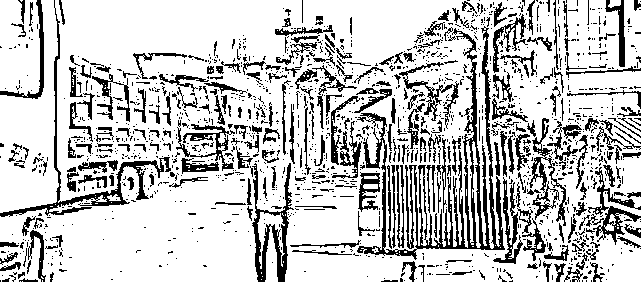
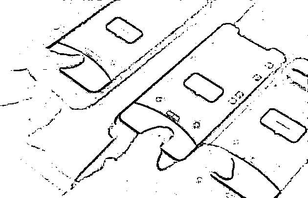
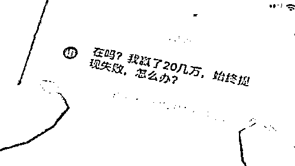
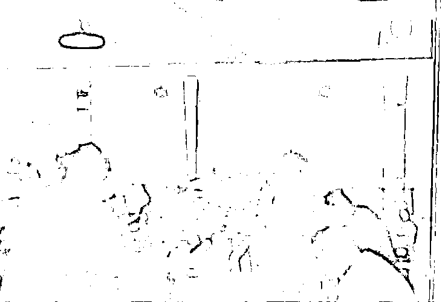
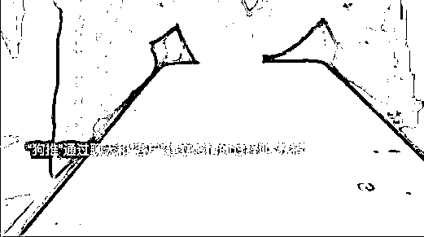
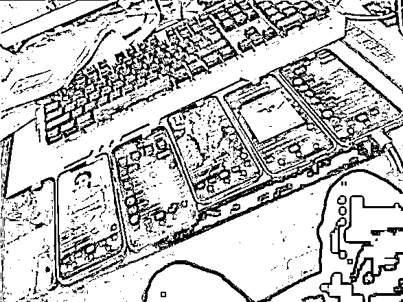
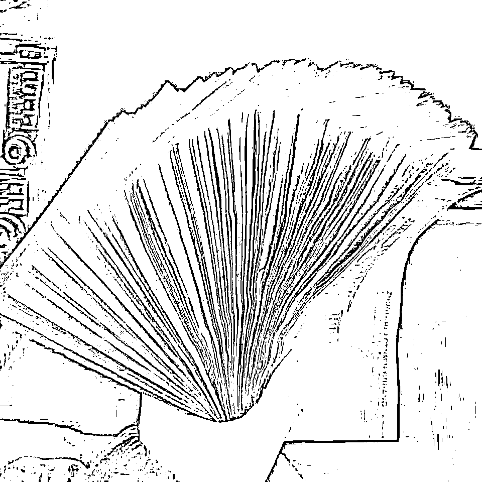
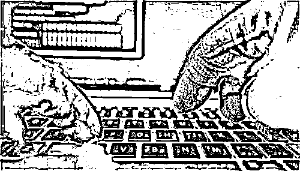
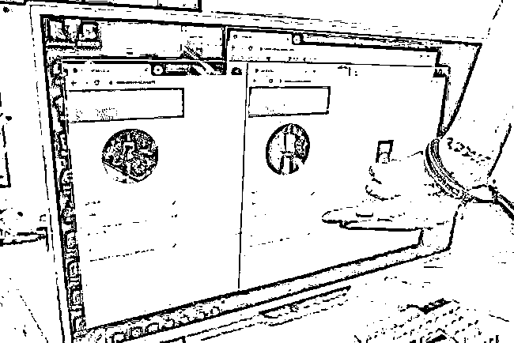
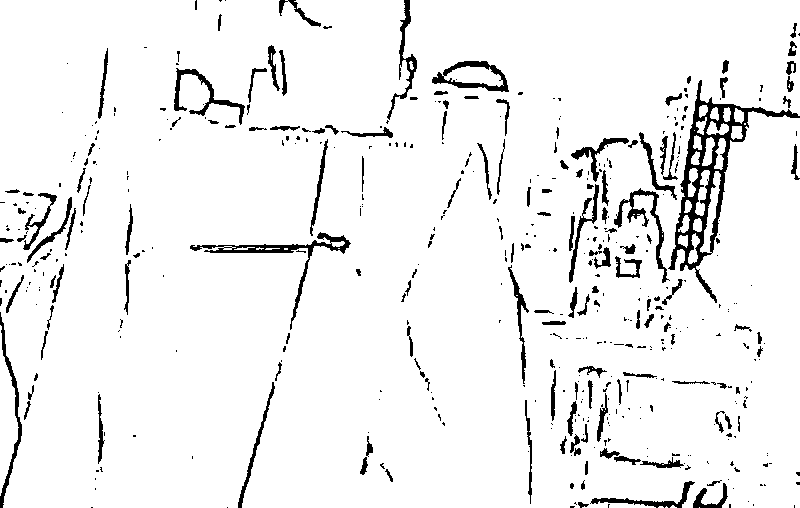

# “海王”误入缅甸诈骗，冒死救下 105 个女人，上演现实版无间道！

> 原文：[`mp.weixin.qq.com/s?__biz=MzIyMDYwMTk0Mw==&mid=2247529838&idx=1&sn=e342aeed375b6739252bf75869f6021c&chksm=97cbbe56a0bc3740d33c05d82fdfe166e528d81265893e7ac69279b76bf71d0cc3e30fa83ec8&scene=27#wechat_redirect`](http://mp.weixin.qq.com/s?__biz=MzIyMDYwMTk0Mw==&mid=2247529838&idx=1&sn=e342aeed375b6739252bf75869f6021c&chksm=97cbbe56a0bc3740d33c05d82fdfe166e528d81265893e7ac69279b76bf71d0cc3e30fa83ec8&scene=27#wechat_redirect)

“你知道杀猪盘吗？删了我吧，不要再轻易相信陌生人，否则你会倾家荡产，生不如死。”

电话另一端，杨宇听着自己聊了半个月的“男朋友”—郝振东，说出这样一段话后，陷入了震惊之中。

此时她才知道自己所谓的男朋友，其实是中缅著名诈骗团伙的一员。

但也正是这个“海王”，最终冒着生命危险，拯救了 105 个女人，上演了现实版“无间道”。

那他们是如何诈骗的？郝振东为何会“弃暗投明”？他又是怎样拯救那 105 个女人的呢？

# 家庭的破灭，渣滓的狂欢

中缅边境，某办公大楼里。

一台台冰冷的电脑面前，坐着一个个神色冷漠的男人，但他们在网络上却扮演着“爱健身、养宠物，还会做饭的肌肉男”。

有些人甚至肚胖腰圆、中年谢顶，身上还穿着破烂的短衫，与“网络上的自己”天差地别。

不过没关系，这些人不是孤军作战，在他们的背后有一个超过 30 人的“智囊团”。

专门负责收集资料，打造人设，迎合聊天女性的喜好来塑造男性形象。

等到这些女性上钩，她们所谓的“男朋友”就会循序渐进地把她们拉入深渊。

先是三百两百的骗，等到时机成熟再发觉这样一段话，

“宝贝，这样来钱太慢，你筹备了二三十万，我带你玩把大的，结束了之后，我直接带你去马尔代夫旅游，到时候我开着法拉利，保时捷来接你！”

独居的孤独女性怦然心动，如数照做，却不知她们已经成为了“肉猪”，即将被诈骗犯无情屠宰。

当这二三十万亏空结束后，诈骗犯会一边安慰她们，让她们继续投资，一边继续给她们画大饼，直到彻底把她们的钱包掏空。

房子、车子抵押了，还欠下了一屁股贷款，被骗者步入绝境之中，可这时她们的男朋友却“变了心”，轻则一句“我们不合适”和平分手，重则直接删除微信走人。

上海某位女性被这样的骗局，足足骗了 292 万，家里被清空，“男朋友”也弃自己而去之后。

该名女性最终选择了跳楼自杀，猩红的鲜血染遍了地面，一个家庭就是破裂。

但她那个所谓的“男朋友”却在中缅边境最豪华的酒吧里，大把大把地挥洒着钞票。

一面肆意喷溅昂贵的香槟，另一面接受着老板的嘉奖、同事的膜拜。

而这样的“庆功会”在这个团体中太常见了，几乎每个月都有数次乃至十数次，这些丧心病狂的渣滓，拿别人的生命垫付了自己的酒资。

不过在这个团体中有一个例外，他就是郝振东。

# 一时不慎，踏入魔窟

小学毕业就外出务工的郝振东，做过工地工人，也做过老板。

刚开始的时候没有学历和工作经验，他只得干一些修桥修车、开烧烤摊之类的活。

干了几年没存下来什么钱，于是 2004 年的时候，他跑到洛阳去学了一年的计算机技术。

学成归来后，他就开了网游代练工作室，拿出所有积蓄，在家里购置了 400 多台电脑，另外挂帮助游戏客户刷金币。

行情好的时候，一个月也能挣 20 余万元，只不过由于近年来网游公司大力打击代练，甚至会大规模封号。

所以郝振东的工作室最终也是惨淡收场，不仅没挣到钱，反而亏损了 200 多万，就连妻女也因他“不务正业”，离他而去。

尝试过挣快钱之后，郝振东就再也回不到打工的生活里去了，就像他自己说的那样，

“当你尝过肉味后，还能忍受每顿吃素吗？”

由于一心想着挣快钱，所以最终经过小叔介绍，郝振东盯上了一个去缅甸当客服的工作。

在跟老板沟通的过程中，老板明确表示这和信用卡套现差不多，只能说是“打法律的擦边球”，算不上违法，而且来钱特别快。

因此郝振东看着视屏里老板桌上一摞摞的现金动了心。

可是等到郝振东真的到了缅甸之后，才发现这份工作远不像老板说得那么简单。

刚刚抵达中缅边境，他就被一辆非政府武装的车子带进了“公司”。

一个 200 平米的办公室里，足足窝着五六十个人，这些人大多面无表情地坐在自己的位置上打字。

而郝振东也很快了解到，他的新工作不是游戏客服，而是“杀猪盘”。

公司相关人员会专门从网络上物色目标女性，然后交由他们这些“工作员”聊天。

具体聊天内容由其他几十位“专业人员”负责，而他们的任务就是利用这些花言巧语打开目标的心理防线，当“狗推”。

被迫接受“狗推”的身份后，摆在郝振东面前的，是 3 本土味情话合集，一台电脑以及三部手机。

手机里面下有 8 款社交软件，软件里的个人资料也都是盗用的网红模板，凭借着这些东西，郝振东就可以开始自己的工作了。

刚开始的时候，郝振东和绝大多数人一样，难以相信通过这种方式能够骗到钱，可是很快身边的两个同事就给了他鲜明的答案。

第 1 个同事也就是我们上面提到的，诈骗了某位上海女性 292 万的渣滓。

他的这次诈骗案例被老板立为典型，而他本人也得到了数万元奖金，在公司里可谓风光无限。

另一位同事叫小杨，他的目标是一位东北女性，凭借着一手话术，他成功从女方那里骗到了 176 万。

而这笔钱是女方卖房卖车，且向家里亲戚大量借款凑出来的，为的是给男朋友排忧解难。

却没想到这个许诺要跟她结婚的男人，其实只是把她当做“肉猪”来屠宰。

也不是没有人心软或者想要逃跑，可是大多都没有好结果。

在郝振东的旁边，有一位比他还小的同事，这人在第 1 次诈骗结束后，大哭了一场，还对诈骗对象心怀怜悯。

可一旦开了先河，享受到挣快钱的快感后，很快就学会了硬下心肠。

那能不能从这个组织中全身而退呢？

能，但是必须要交天价的赎金，如果第 1 个月交不上来，那么就会利滚利，而更多的人最终只能选择帮老板“挣”到 30 万……

可等到他们真的走上诈骗的道路后才明白，根本没有回头路可言。

每次诈骗成功后，纸醉金迷的生活以及大量奖金，让绝大多数参与者都动摇了，而现在这样的选择也摆在了郝振东的面前。

郝振东自然是交不起赎金的，他没有选择，只能干起“狗推”的活。

但是当跟自己的“第一头肉猪”聊了半个月后，他却始终下不了回家的决心。

老板怒骂，催促他赶快动手，却不想这丑恶的嘴脸非但没能逼他走上歧途，反而让他清醒，并最终做出了一个令人意外的决定。

# “海王”中的孤勇者

郝振东决定了，他要向自己的“肉猪”坦露真实情况。

由于所有“狗推”的微信都被老板在后台监察着，因此他只能通过打电话的方式来告知真相。

冒着生命危险，郝振东如实向对方交代了一切，可换来的结果却是删除微信、就此不再联络。

在接下来的工作中，郝振东也多次偷偷的向一些人说出实情，但对方在得知他是诈骗犯后，通常都会怒骂他一顿，然后砰的挂断电话。

尽管如此，郝振东依旧没有动摇自己的原则。

他知道自己是新手，老板对他有较大的包容度，但如果他长时间做不成生意，老板也肯定会怀疑他。

但郝振东依旧不愿意走上诈骗的道路，他实在无法狠下心来毁灭一个个原本圆满的家庭。

这样的情况一直持续到郝振东的第 6 个客户，也就是我们文章开头所提到的杨宇。

当郝振东在电话里袒露一切过后，杨宇并没有急着挂断电话，反而是在沉默之后说了这样一句话，

“我该怎么做，才能把你从那里救出来呢？”

此刻杨宇也没有太多的想法，只是觉得这个男人没有欺骗自己，自己也应该回馈以善意。

而她的这番话也着实让深陷魔窟的郝振东，满心温暖。

犹豫了一下，郝振东最后决定抓住这个机会，

“如果你真的想帮我，那么可能要陪我演一场戏……”

经过电话联系，有了默契的郝振东和杨宇，在微信里开始按照约定聊天。

杨宇在郝振东介绍的平台上充值了 1000 元后，明确表示在自己的手机上还有 30 多万元，但是对相关项目还有疑虑，想要观望一段时间。

老板在得知相关情况后，果然放松了对郝振东的警惕。

却不知道杨宇早在上次打完电话后，就已经将相关情况报告给了警局，警方正在抓紧展开排查。

至于排查内容，则是郝振东借着杨宇向警方透露的 18 位“客户名单”。

令人惊讶的是，当警方找到这 18 人的时候，她们绝大多数都不承认自己落入骗局。

甚至有很多人公然向自己的男朋友表示，有疑似警方的人联系了自己，说男朋友是诈骗犯。

好在警方并没有透露出郝振东的身份，公司老板也只认为是警方加大了排查力度，偶然间得知了他们公司的信息，因此就没有过于重视。

而公安局在深入与这 18 位客户进行交流后，最终才让他们中的许多人幡然悔悟，警方也借此确定了郝振东所展露出的信息属实。

“你放心，我们很快就会安排人展开救援，将你从贼窝中救出来！”

当杨宇接着电话向郝振东转述了警方的话后，郝振东终于安下心来。

但是随即他就诞生了一个大胆的想法，他不仅要拯救自己，还要拯救那些仍旧沉沦于骗局的“目标们”。

# 惊天逆逃，携卷 105 人名单

在经过深思熟虑后，郝振东最终开始了自己的计划。

首先，他每晚都在公司加班到深夜三四点，有时候甚至整夜地睡在公司。

其次，郝振东借着夜色从同事们的电脑里拿到了大量的名单，要知道此举可以说是冒着生命危险。

且不说公司本来就有监控，郝振东需要小心再小心，一旦有巡夜的人进入公司，看到郝振东的举动，恐怕他就会惨死当场。

当历尽艰辛终于拿到了 105 人名单之后，时间也来到了郝振东与警方联系的期限。

趁着夜色，他悄悄摸了出去，却不想接下来看到的一幕让他浑身冰冷。

原来在公司的外围竟然还有一层武装力量在负责巡逻，如果他贸然出去，肯定会被抓回来。

情况危急，郝振东无奈之下逃进了洗浴中心。

一直躲到了凌晨六七点，负责巡逻的人撤去，他才趁机跑出了公司基地，来到外面的一家游戏厅中躲了起来。

最终在警方的建议下，成功逃出缅甸，来到了中缅边境。

而公司这个时候也察觉到了郝振东的逃离，连忙派人来追。

当两拨人碰头的时候，郝振东已经踏入了中国国境，对面虽然满心愤恨，但是也不得不悻悻离去。

回来之后，警方根据郝振东提供的名单，找到了那 105 人，并最终因此至少挽回了超过 2000 万元的损失，由此可见，郝振东做出了巨大贡献。

公司老板在得知了郝振东的时候，甚至特意派人找到了郝振东的家人，并且威胁他，管好自己的嘴，否则自己人就可以派人在那抓回去。

这一次，郝振东依旧没有向恶势力妥协，反而选择不遮脸上节目。

公开自己的信息，以此来表示自己的强硬态度，也借着扩大自身影响力，来让对方心有忌惮，最终事情得以顺利结束。

不过这 100 多人虽然成功逃出了魔爪，但是国内目前被杀猪盘套牢的人仍旧不在少数。

我们一定要打起警惕之心，不得贸然相信陌生人的花言巧语，更不能够轻易把钱财授予他人。

须知，只有每个人都打起防诈之心，培养防治意识，才是杜绝诈骗的最好手段。

来源： 百晓生道破盘界

← 向右滑动与灰产圈互动交流 →

