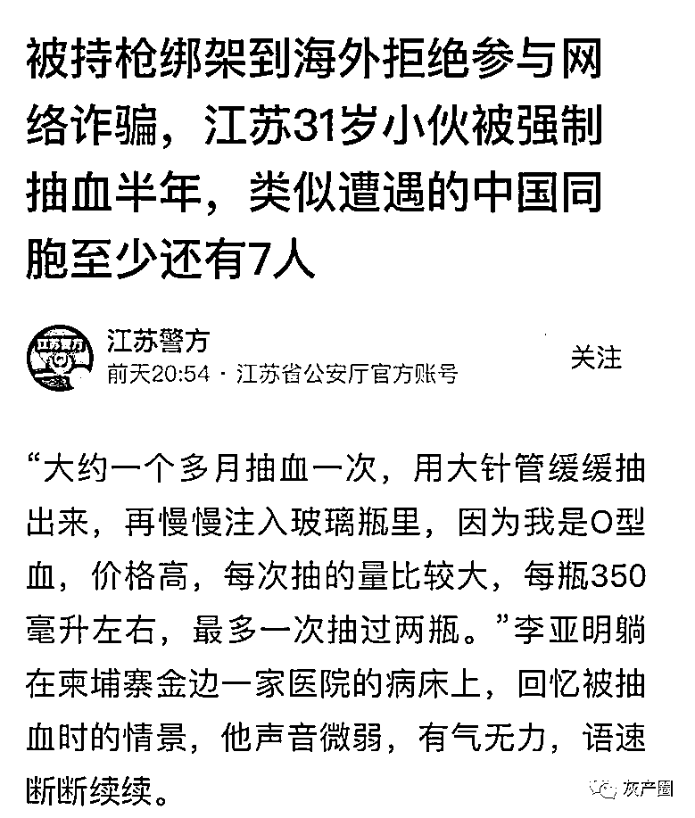
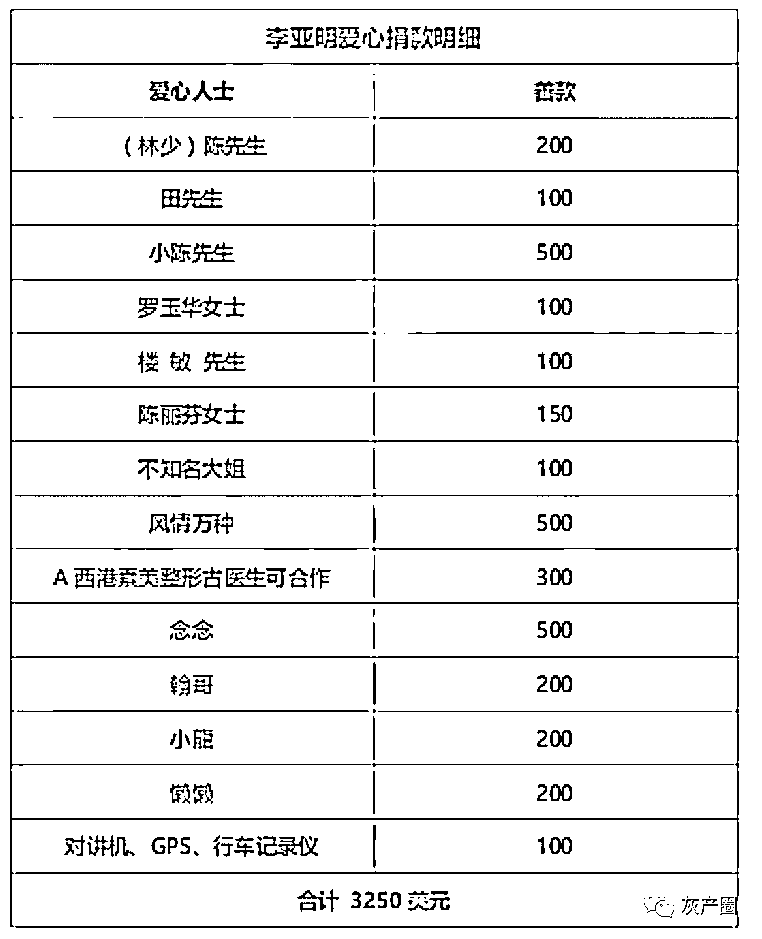

# “血奴”事件登上中国热搜

> 原文：[`mp.weixin.qq.com/s?__biz=MzIyMDYwMTk0Mw==&mid=2247529838&idx=4&sn=4a964e1d46b24649457693b324928e58&chksm=97cbbe56a0bc3740b78e74a5a241b191ffc132ef603b593fe3fee1a50aeb9f199d8ea3a05b95&scene=27#wechat_redirect`](http://mp.weixin.qq.com/s?__biz=MzIyMDYwMTk0Mw==&mid=2247529838&idx=4&sn=4a964e1d46b24649457693b324928e58&chksm=97cbbe56a0bc3740b78e74a5a241b191ffc132ef603b593fe3fee1a50aeb9f199d8ea3a05b95&scene=27#wechat_redirect)

中国小伙李亚明（化名）在柬埔寨被网投圈养“抽血”的事件引发在柬埔寨、中国两国引发巨大关注。

目前，相关话题已登上抖音热榜，观看次数超 600 多万次。

中国媒体“上游新闻”发布的采访视频，已有 18 万人点赞，评论数近万条。 

上游新闻的抖音视频 

有网友评论称，“他守住了底线，中国人不骗中国人，希望能赶快把同胞救回来。”

也有网友称，“恐怖，这是发现了，不知道的死了多少了。”

还有网友称，“啥时候两国能合作一下，共同打击那边的电信诈骗。”

目前，人民网福建频道等也发布视频，跟进此事。 

江苏省公安厅也在今日头条账号上，发布了相关新闻。 

江苏省公安厅发布的内容 

据了解，目前李亚明身体有所恢复，已经能扶着独立慢慢地行走了。

但由于李亚明目前造血功能尚未恢复，因此每天需输血治疗。

李亚明病情有所好转 

李亚明被抽血的新闻报道刊载后，有不少热心人士捐款助其完成治疗，截至 2 月 16 日 12 点，已捐善款 3250 美元。 

捐款记录 

据《上游新闻》消息，大使馆、警方已关注此事并介入。

来源：今日柬闻 

← 向右滑动与灰产圈互动交流 →

