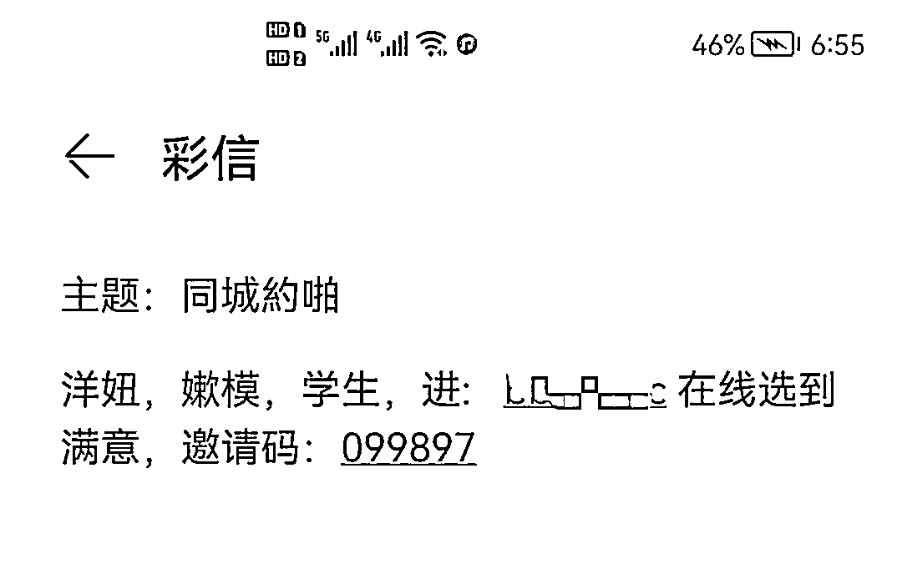

# 天天强调刷单就是诈骗，你咋还能被骗？

> 原文：[`mp.weixin.qq.com/s?__biz=MzIyMDYwMTk0Mw==&mid=2247529838&idx=6&sn=380b9be4becb06c67aece1d9d88fc76e&chksm=97cbbe56a0bc3740334d37908c7c5cffc9fb0f5a7400ed85fded7117da286ac1e84be8fc9ffb&scene=27#wechat_redirect`](http://mp.weixin.qq.com/s?__biz=MzIyMDYwMTk0Mw==&mid=2247529838&idx=6&sn=380b9be4becb06c67aece1d9d88fc76e&chksm=97cbbe56a0bc3740334d37908c7c5cffc9fb0f5a7400ed85fded7117da286ac1e84be8fc9ffb&scene=27#wechat_redirect)

**发案最多**

**损失金额最大**

**刷单到底是怎么骗钱的呢?**

**虚假诈骗 APP 是如何下载的？**

****请你往下看：****

********

**************刷************单************诈************骗****** **********************0****1**************

******小额红包诱惑，逐步深入：******

****骗子通过社交媒体平台、短信等广泛发布虚假广告，称做任务、做兼职赚钱。诱骗受害人先进入大的刷单群，将活跃的人继续拉入小群，在小群里最活跃的人，引流公司会将信息卖给境外诈骗团伙，由诈骗团伙“客服”一对一对受害人实施诈骗。****

******手段详解：******

****1、通过简单任务，领取小额返利，将贪心的人进行筛选，拉入小群；****

****2、在小群，完成下载 APP（诈骗 APP）任务，又可以领取小额红包。****

****3、已下载 APP（诈骗 APP）的，单独加 QQ，让受害人做大额刷单，实施诈骗。诈骗分子充分拿捏了受害人的心理，把最活跃，最贪心的人挑选出来，实施精准诈骗。****

****4、诈骗 APP 有：抖音全民任务 APP、精工坊 APP、鸿宝科技 APP、变现库 APP、绿植 APP、敦煌 APP 等等（受害人报案提供）。****

********

****（虚假诈骗短信）****

**************0****2**************

******利用虚假约炮、招嫖平台，诱骗受害人刷单做任务：******

****骗子制作虚假的约炮、招嫖平台，广泛发布虚假广告，让受害人登录虚假 APP。登录虚假 APP 后，要实现目的，按照平台的流程，就需要做任务。所谓的做任务，就是诱骗去刷单。****

******手段详解：******

****1、制作虚假的约炮、招嫖平台；****

****2、通过 QQ、短信、交友软件等广泛发布虚假广告、虚假链接；****

****3、利用被害人的色心，诱导其下载诈骗 APP，并有一对一客服忽悠你做刷单、赌博任务，完成三个任务可以”免费约炮“；**** 

****4、当你认为马上就可以成功的时候，突然发现钱根本无法提现，这才意识到自己被诈骗！**** 

****5、诈骗 APP 有：夜啪 APP、HilyAPP、伊趣”APP 等。****

********

********

****（虚假平台链接短信、诈骗 APP）**** 

**************0****3**************

******利用免费领物品，逐步诱骗式：******

****声称可以免费领取物品，吸引受害人下载虚假诈骗 APP，中期拉受害者进群派单刷任务，引诱受害人进行尝试，并会给回一定的收益返还，后期逐步引导受害人投入大笔款，甚至去博彩投大注另求高回报。****

******手段详解：******

****1、以免费领取礼品为由头，诱骗受害人，礼品是不可能领到的；****

****2、要领物品，下载 APP（诈骗 APP）；****

****3、受害人下载诈骗 APP 后，发现里面还可以“赚钱”。****

****4、小额返利，逐步发大单给受害人刷，直至倾家荡产。****

********

****（虚假诈骗 APP 页面）****

**************防诈骗提醒**************

*******1.****不要贪心*******

****骗子利用受害人的贪念实施诈骗，逐步诱骗，让受害人无法自拔。天上不会掉馅饼，没有免费的午餐，动动手指就能赚大钱的绝对是诈骗。****

*******2.******要下载国家反诈中心 APP*******

****骗子制作虚假诈骗网址链接、APP，通过科技化伪装，普通人无法辨别，请下载安装国家反诈中心 APP，给手机加上防护罩、给自己的资金再加一份保障。**** 

*******3.****拒绝任何形式的刷单*******

****请大家牢记！只要是刷单！就是诈骗！****

## 

****来源：至道终结诈骗，邯郸市反诈中心****

********

****← 向右滑动与灰产圈互动交流 →****

********