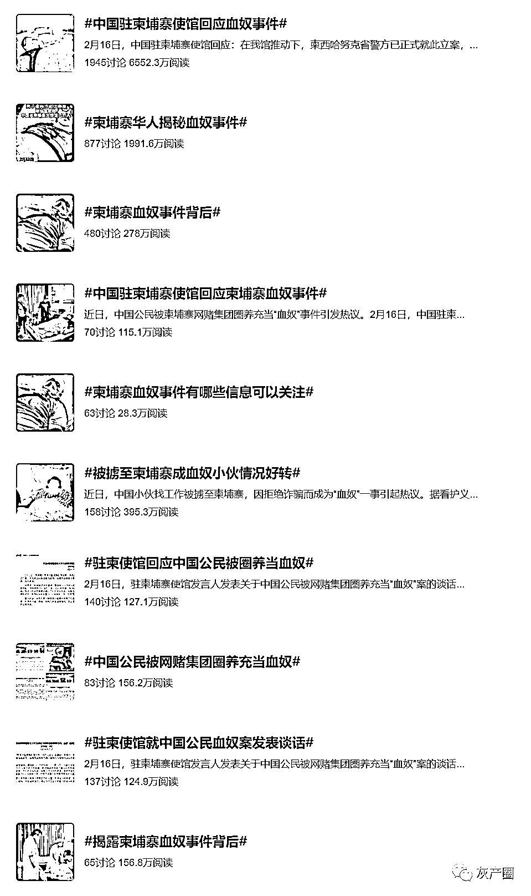
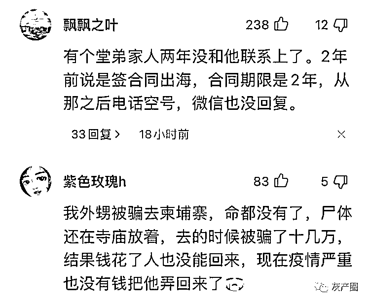
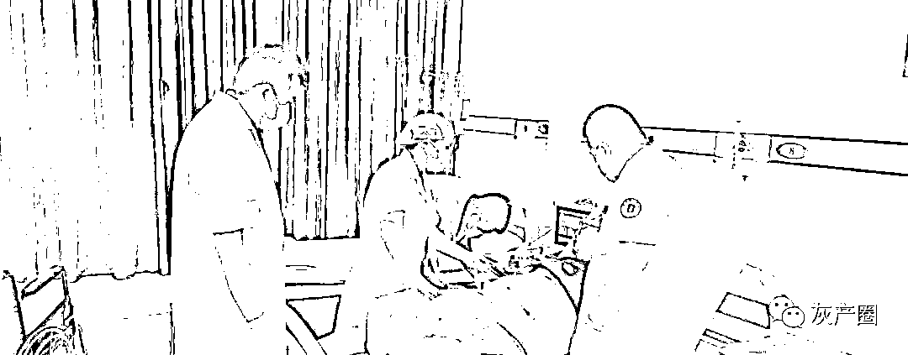
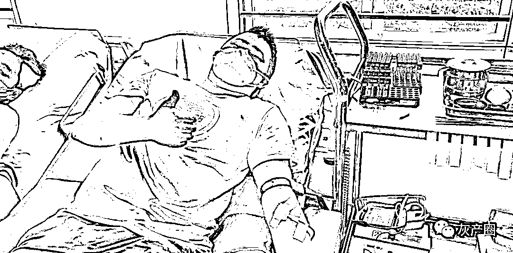

# 从“血奴”身上抽出来的血，去了哪里？

> 原文：[`mp.weixin.qq.com/s?__biz=MzIyMDYwMTk0Mw==&mid=2247529890&idx=1&sn=d14992d5536c7d32c114d35a1f879477&chksm=97cbbe9aa0bc378c6e9ea328c77389ee308e276ae5888167262313e367e9b292fe9dfc57be91&scene=27#wechat_redirect`](http://mp.weixin.qq.com/s?__biz=MzIyMDYwMTk0Mw==&mid=2247529890&idx=1&sn=d14992d5536c7d32c114d35a1f879477&chksm=97cbbe9aa0bc378c6e9ea328c77389ee308e276ae5888167262313e367e9b292fe9dfc57be91&scene=27#wechat_redirect)

近日，中国同胞李亚明（化名）因拒绝从事网络诈骗，而被网赌公司抽血的消息引发巨大关注。

除在柬的主要华文媒体纷纷报道外，《凤凰周刊》《潇湘晨报》等中国国内媒体也刊发了报道。在今日头条上，“[小伙被持枪绑架到海外遭强制抽血](http://mp.weixin.qq.com/s?__biz=MzIyMDYwMTk0Mw==&mid=2247529838&idx=4&sn=4a964e1d46b24649457693b324928e58&chksm=97cbbe56a0bc3740b78e74a5a241b191ffc132ef603b593fe3fee1a50aeb9f199d8ea3a05b95&scene=21#wechat_redirect)”的话题冲入头条热榜，相关阅读量已超 700 万。

抽血话题上热搜 

不少中国网友在新闻下评论，有网友称，“看得让人浑身起鸡皮疙瘩，对主人公的不幸深表同情，对主人公的坚决不妥协，深表钦佩！希望快点好起来，希望警方早日破获本案，能早日解救出更多的受害人！”

也有网友称，“真是触目惊心，公司最近在柬埔寨办厂，正在从国内工厂动员大家去柬埔寨，太吓人了。”

国内网友的评论 

2 月 14 日，《今日柬闻》记者在中柬第一医院看到医生正在给李亚明输血，目前其气色已有所好转。

[`v.qq.com/iframe/preview.html?width=500&height=375&auto=0&vid=f3323bip8jw`](https://v.qq.com/iframe/preview.html?width=500&height=375&auto=0&vid=f3323bip8jw)

李亚明表示，由于自己的造血功能还没有恢复，所以目前只能靠输血来维持。据了解，医院目前每日为李亚明输 2 袋共 700 毫升的鲜血，目前已经一共输了 8 袋。

为给李亚明提供鲜血，中柬义工队号召爱心人士踊跃献血。

李亚明入院时中柬第一医院紧急抢救骨干之一、体检中心护士长潘芝良今天也去血库为李亚明献血。

潘芝良护士长（左）在李亚明刚入院抢救时

潘芝良为病人献血

记者碰触李亚明腿部时发现，其腿部已有了血色，也有了一些弹性，不再像之前石头一般。

李亚明对《今日柬闻》记者表示，自己之前在北京做保安，听人介绍说在广西做保安工资高，就同意前往广西。

结果 2021 年 6 月到了广西后，李亚明和另外一人被人在车上从陆路运送到越南，过境还被人用枪抵在腰间，并强迫喝下了一瓶“矿泉水”，之后就昏睡过去，再醒来已到越南胡志明。之后，李亚明和其他人一起被送到柬埔寨西港。

**从“血奴”身上抽出来的血，去了哪里？**

李亚明称，自己是 8 月开始被人抽血的，之前已在该园区被人多次殴打，“三天电一次，最后把腿电废了。” 

李亚明对《今日柬闻》记者回忆，自己当时被网赌公司关在一个用会议室改造的小黑屋里，该会议室之前墙上是玻璃，被贴上布后成为黑房间，再隔断成七八个小黑屋，他在其中一间，在小黑屋里李亚明的手被手铐铐住。 

有一天一名医生过来抽血化验，之后开始抽血。每次抽血是用输液器抽取，再注入一个 350 毫升的玻璃瓶中，每次抽两瓶，共 700 毫升。 

抽血的医生是一个 40 多岁的中国男子，每次都是同一个人，“是他们自己人”。

李亚明称，有一次自己被抽血 6 天以后，再次被抽，那一次抽了两个 400 毫升的玻璃瓶，共 800 毫升，“可能他们那次有急用”。 

至于被抽出来的血送到哪里，李亚明称有一次听人事跟人聊天中提到，“送到岛上去”。

李亚明猜测该岛上有器官贩卖活动，理由是另一名被抽血的中国男子“金刚”曾被人事威胁要卖器官，第二天，“金刚”就消失了。

春节前，人事曾威胁李亚明乖乖配合，否则就要“把你像‘金刚’一样扔到岛上卖器官”。

**关于“血奴”的争论** 

此前曾有不少在柬同胞疑虑，网赌公司养“血奴”卖血的逻辑不通，因为相比网络诈骗来说，卖血所得极为有限。 

根据柬埔寨相关规定，医院用血需从国家血库取得，不可私人买卖。但有知情人士表示，有时候急用血，可能会找本地人献血，大概要给 100 美金到 150 美金的补贴。而捐血者献血后按规定需到血库，换取血库中等量已经过消毒和检验的血。

知情人士称，但在西港许多时候血库供血不足，有的医院会想办法不经过血库，自己找血来用。只要血型匹配，找来的血有时不经任何消毒或检验，就直接输入病人体中。

但即使是这种“违规用血”，如果有人卖血也并非暴利。

有在柬华商认为，“血奴”的血一种可能是用作器官买卖手术时所用，因为西港血库不足，而做地下手术也需一定量的血液输血，“血奴”则只是地下灰色产业链的一环；第二种可能是有时候园区诊所里自己用，“基本稍有规模一点的园区自己都有诊所”。

← 向右滑动与灰产圈互动交流 →

