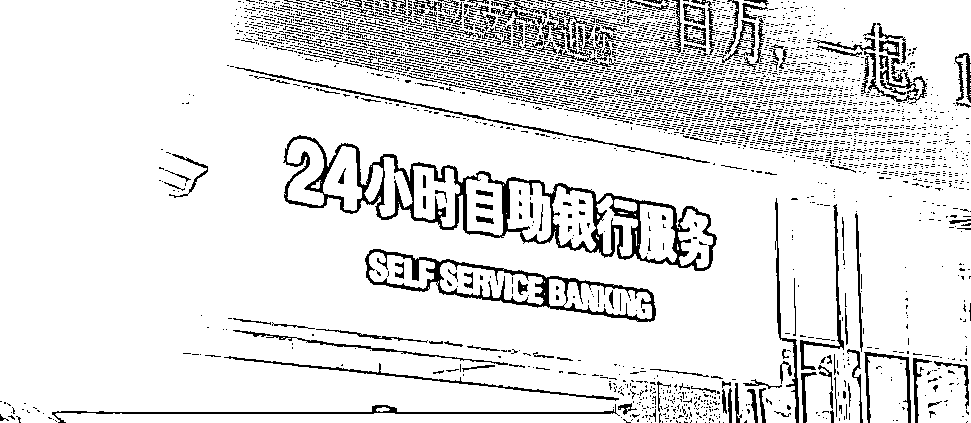
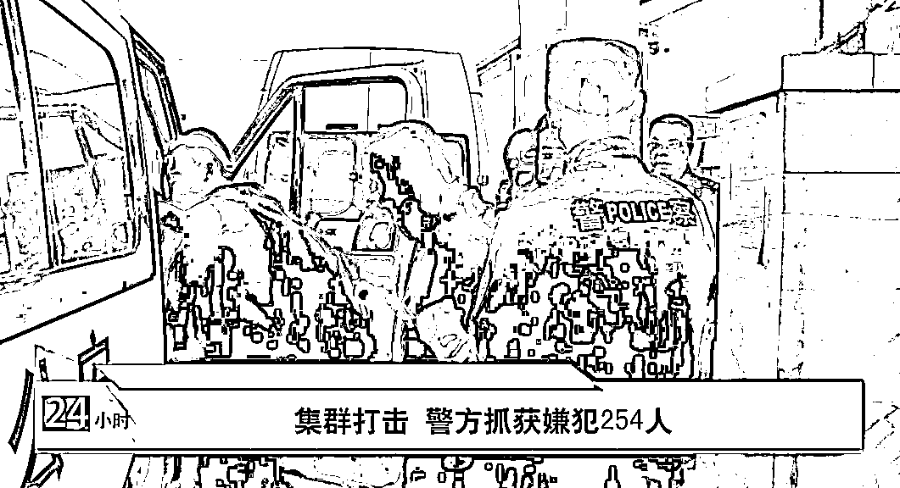
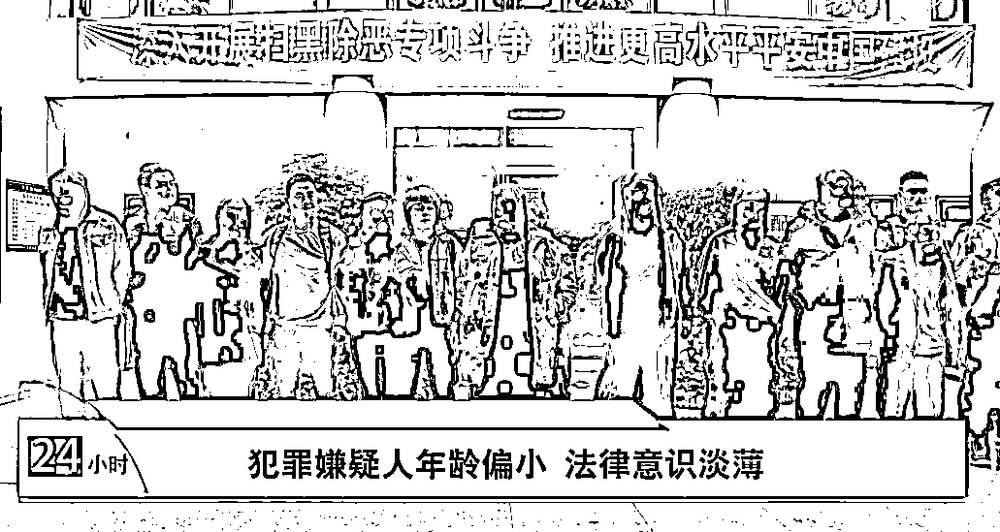

# 186 人被刑拘！湖南警方摧毁一特大电诈团伙！

> 原文：[`mp.weixin.qq.com/s?__biz=MzIyMDYwMTk0Mw==&mid=2247529890&idx=3&sn=f47a8b58c3a0da3843e56d8d59838379&chksm=97cbbe9aa0bc378c0955cdc76535970266f519703aa6e70018e749aa2fc547b47a280df1f31e&scene=27#wechat_redirect`](http://mp.weixin.qq.com/s?__biz=MzIyMDYwMTk0Mw==&mid=2247529890&idx=3&sn=f47a8b58c3a0da3843e56d8d59838379&chksm=97cbbe9aa0bc378c0955cdc76535970266f519703aa6e70018e749aa2fc547b47a280df1f31e&scene=27#wechat_redirect)

没有正当工作，名下银行卡流水却非常大，这一异常情况引起了芦淞警方的注意。根据这一线索，芦淞公安分局刑侦大队顺藤摸瓜， 破获部督“10.26”特大电诈跑分洗钱专案，近日获公安部贺电表扬。

[`mp.weixin.qq.com/mp/readtemplate?t=pages/video_player_tmpl&action=mpvideo&auto=0&vid=wxv_2272785508453924864`](https://mp.weixin.qq.com/mp/readtemplate?t=pages/video_player_tmpl&action=mpvideo&auto=0&vid=wxv_2272785508453924864)

去年 1 月，芦淞公安分局刑侦大队在开展日常工作中，查获了一名出租银行卡用于资金转账的犯罪嫌疑人王某。**王某刚刚 20 岁，没有正当工作，然而他名下的银行卡每日的流水却非常大，甚至一天就达到几十万到上百万元。**警方对王某开展突击审讯，王某称自己是将银行卡出售给了朋友肖某。

芦淞公安分局刑侦大队民警 钟武杰：一张银行卡的价格，大概是一千元左右，不仅有这一千元的直接现金，同时还会根据所有转账的数额进行直接的提成，所以获利是非常大的。

王某交代，自己总共提供了四张银行卡交给肖某。警方通过对肖某展开秘密侦查发现，肖某在株洲主要以写字楼单间、电竞酒店为据点：一方面发布信息购买银行卡；一方面聘请人员建立以银行卡、支付宝为媒介流转资金的转账团伙，并通过某网络平台，**购买虚拟币，将钱洗白，从而转给上游犯罪团伙。**

警方在摸清楚该团伙的组织脉络后，在株洲、长沙、福建等地开展收网行动。2021 年上半年，警方部署多次抓捕行动，陆续将涉嫌跑分洗钱的 145 人抓获归案。

鉴于该案案情重大，2021 年 11 月 1 日，公安部予以挂牌督办，经过集中攻坚研判，发现了涉及全国 20 余个省市自治区 400 余条涉案线索。通过省市各级公安机关的努力，一个涉案人员多、涉案地域广、层级复杂的特大电诈团伙被一举捣毁。 

去年 11 月底，在省公安厅的指挥之下，全省公安机关对该案呈现的省内线索发起全省集群打击，并同步提请公安部发起全国集群战役。通过深挖，该案共抓获犯罪嫌疑人 254 人，捣毁窝点 32 个，涉案流水上亿元，冻结资金 80 余万元。

**目前，因涉嫌帮助信息网络犯罪，共有 186 人被刑拘。**

盘点该起案件，涉案人员大多数为 30 岁以下的年轻人。他们没有正经工作，面对这些高利益的诱惑，缺乏抵制力；在明知出售、出租银行卡会用来犯罪的情况下，仍然把自己的卡提供给他人，从而非法牟利。

**该案成功侦破，近日，受到公安部发贺电表扬。**

警方提醒，市民切勿出租出售出借自己的银行卡，为电信网络诈骗集团提供便利，这种违法行为不仅会面临信用惩戒，可能 5 年内不能办理非柜面银行业务，还将会被追究刑责。

来源：株洲法制，红网

← 向右滑动与灰产圈互动交流 →

