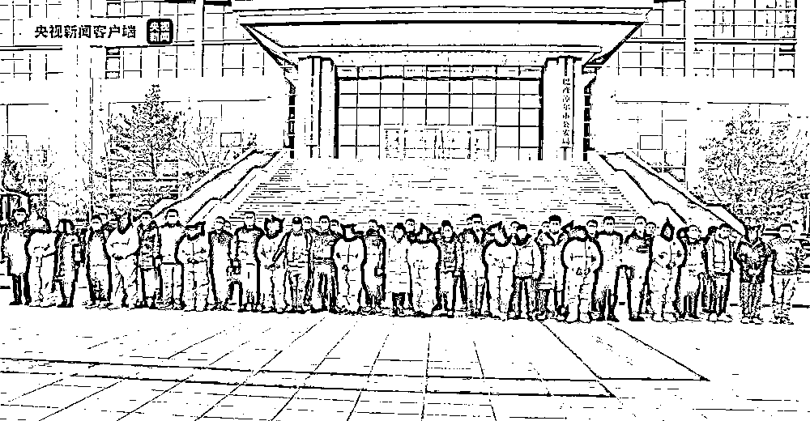
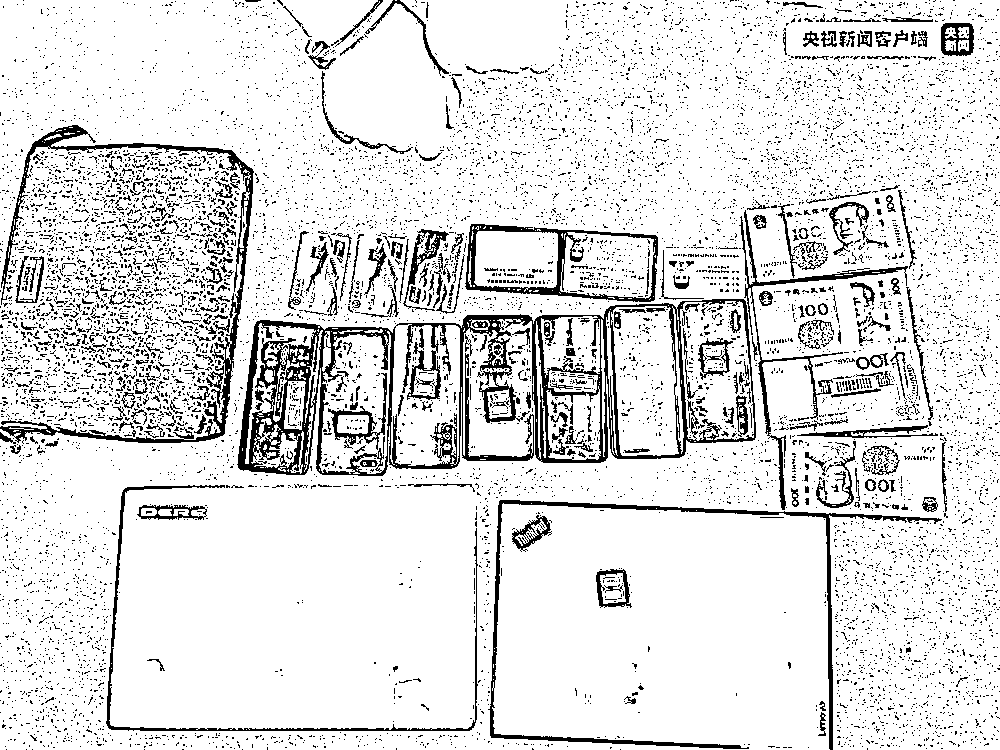
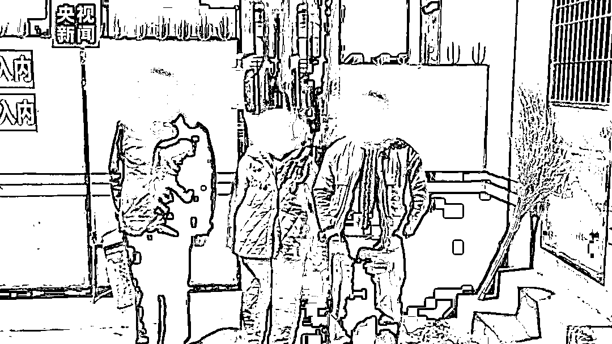
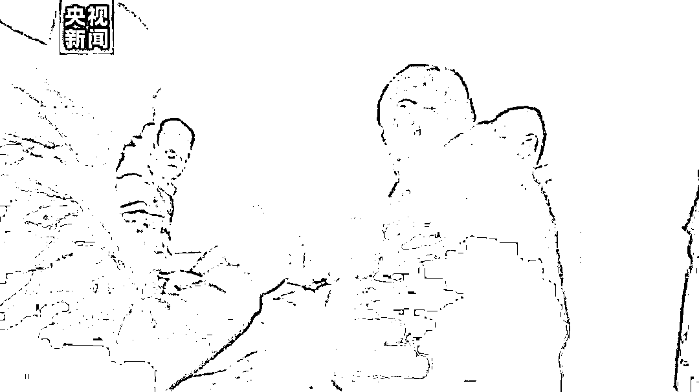

# 为网络赌博提供帮助，这些团伙栽了！

> 原文：[`mp.weixin.qq.com/s?__biz=MzIyMDYwMTk0Mw==&mid=2247529890&idx=4&sn=cdfabfb7af3b07d62c699ade26f083d7&chksm=97cbbe9aa0bc378ce90984341d38388153b88b6868c42853bc3043987b2f7d2c7408a07cf775&scene=27#wechat_redirect`](http://mp.weixin.qq.com/s?__biz=MzIyMDYwMTk0Mw==&mid=2247529890&idx=4&sn=cdfabfb7af3b07d62c699ade26f083d7&chksm=97cbbe9aa0bc378ce90984341d38388153b88b6868c42853bc3043987b2f7d2c7408a07cf775&scene=27#wechat_redirect)

**“即充即玩”**

**“赢了随时提现”**

**“动动手月入过万”**

网络赌博平台常用的话术

不知害了多少人

而那些为虎作伥

为网络赌博提供帮助的家伙们

 终究是难逃法网！

1

**内蒙古**

近日，内蒙古巴彦淖尔市公安局侦破一起特大跨境网络赌博案件，**抓获犯罪嫌疑人 28 名，涉案资金流水达 20 亿余元。**

2021 年 8 月，巴彦淖尔市公安局民警在工作中发现一条涉跨境网络赌博线索，该局立即成立专案组展开侦查。经过近 4 个月的侦查，专案组基本摸清了该犯罪团伙的组织架构和赌博网站运行流程，查明了**以王某华为首的犯罪团伙组织境内赌客通过手机应用进行跨境网络赌博，同时为赌博平台代理洗钱业务的犯罪事实。**截至案发，该网络赌博平台涉案资金流水已达 20 亿余元。

据民警介绍，该犯罪团伙分工明确，**有专人为该团伙长期提供银行卡、第三方支付平台账号等作为支付账户，并参与洗钱的流水分成。**具体负责洗钱的人员则**每天通过境外软件接收“上线”安排的任务，为赌博平台提供代收代付业务**，并定期向犯罪团伙组织者王某华进行资金清算。

巴彦淖尔市公安局近期抽调 100 余名警力，奔赴多地执行集中抓捕任务，共抓获犯罪嫌疑人 28 名，打掉了该团伙开设在台州市、临海市、杭州市、遵义市等地的 4 处工作室，累计扣押涉案银行卡 173 张、手机 65 部，冻结涉案资金 1000 万余元。

目前，案件正在进一步办理中。

2

**湖南**

今年 1 月 19 日，湖南岳阳市公安局岳阳楼分局通报称，岳阳楼分局治安大队联合辖区多个派出所、情报大队以及岳阳市公安局网技支队岳阳楼大队破获一起网络赌博案件，**涉案金额上千万元，抓获涉赌违法犯罪嫌疑人 14 人。**

2021 年 12 月 16 日，岳阳楼公安分局治安大队民警接群众举报，**有人利用棋牌、交友类手机软件，组织人员进行网络赌博，并抽头盈利。**接报后，岳阳楼公安分局立即抽调精干警力成立专案组展开调查。历经一个月的分析研判，他们掌握了网络赌博团伙主要情况，并秘密布控了对该团伙成员实施抓捕的方案。 

2022 年 1 月 13 日，专案组民警奔赴长沙、娄底等地实施同步抓捕，共抓获犯罪嫌疑人 14 人。经审查，陈某玉等 11 人对其开设赌场的犯罪事实供认不讳，彭某骞等 3 人如实交代了其参与赌博的违法事实。

目前，陈某玉等 11 人因涉嫌开设赌场已被刑事拘留，彭某骞等 3 人因赌博已被行政拘留，案件正在进一步办理中。

**为虎作伥者**

**必将受到法律严惩！**

**3 种网络赌博常见套路**

**↓↓↓**

1

**输就跑**

网络赌博的服务器隐秘性强，参与者与组织者互不相识，甚至参与者之间也素未谋面。如果参与者侥幸赢钱，组织者就会直接溜之大吉，彻底人间蒸发。

2

**只赚“平台费”**

此种网络赌博中，组织者不“坐庄”，只提供平台服务。当网络赌博的赌资像滚雪球一样越滚越大，平台可说是躺着挣钱。

3

**“网络出千”**

几乎所有的网络赌博，组织者在后台都有技术控制的权限。比如，一种猜数字类的赌博，参与者认为押某个数的概率高达 90%，于是都押宝在这个数上。组织者或者庄家则会让程序员在后台更改结果，参与者却蒙在鼓里，最终输钱。

**也提醒大家** 

**所有赌博网站的目的只有一个：**

**骗光你的钱财！**

** 不赌****，你永远不会输！**

来源：拒绝跨境赌博综合自央视新闻客户端、中央广播电视总台湖南总站

← 向右滑动与灰产圈互动交流 →

