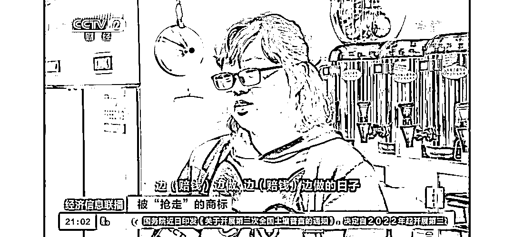
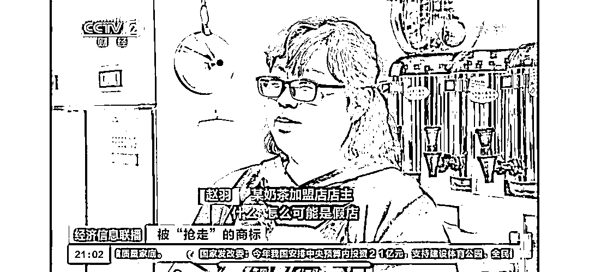
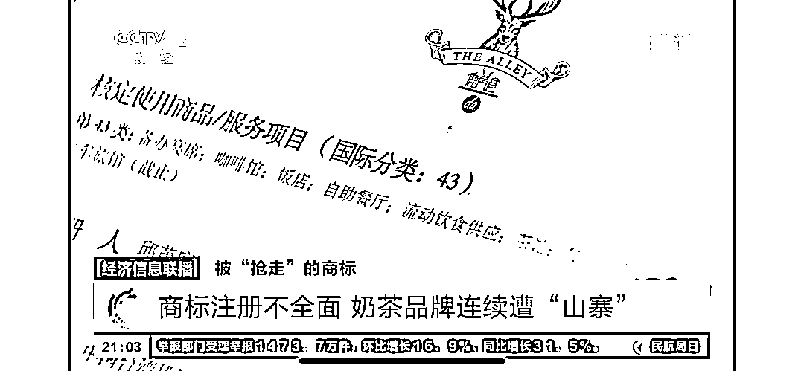
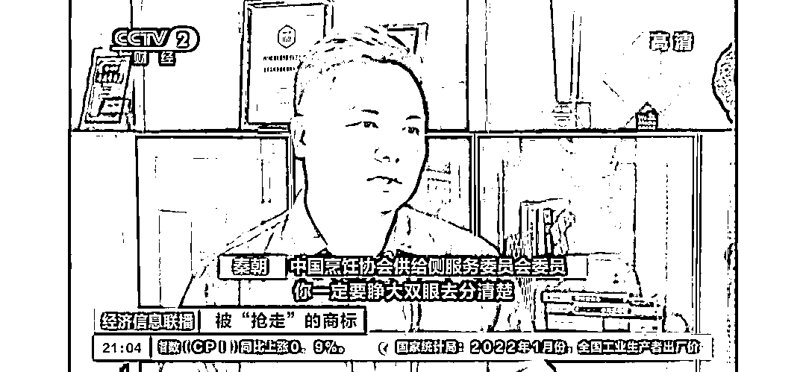

# 7000 家假店，网红奶茶花 1 个亿打假！

> 原文：[`mp.weixin.qq.com/s?__biz=MzIyMDYwMTk0Mw==&mid=2247529890&idx=5&sn=c6d535117e73681962ba6e6242a32b57&chksm=97cbbe9aa0bc378c5ccfd960f678b941aacd3d69859429640977b93ed6e2610447631d7e2ea8&scene=27#wechat_redirect`](http://mp.weixin.qq.com/s?__biz=MzIyMDYwMTk0Mw==&mid=2247529890&idx=5&sn=c6d535117e73681962ba6e6242a32b57&chksm=97cbbe9aa0bc378c5ccfd960f678b941aacd3d69859429640977b93ed6e2610447631d7e2ea8&scene=27#wechat_redirect)

奶茶“资深”爱好者的终极梦想， 

可能就是开家奶茶店，

天天都有喝不完的奶茶。

作为奶茶爱好者的赵羽实现了这个梦想，

**先后投资 90 万，**

**加盟了一家知名品牌奶茶店。**

先别急着羡慕赵羽！

她没想到的是，

她的奶茶店**一年赔了 130 多万！**

**啥奶茶店这么“坑”？**

**这到底是怎么回事？**

[`mp.weixin.qq.com/mp/readtemplate?t=pages/video_player_tmpl&action=mpvideo&auto=0&vid=wxv_2273253753036341253`](https://mp.weixin.qq.com/mp/readtemplate?t=pages/video_player_tmpl&action=mpvideo&auto=0&vid=wxv_2273253753036341253)

**奶茶口味不对劲**

**2018 年 9 月的一天，赵羽点击了一个知名奶茶品牌加盟的弹窗，留下了联系方式，立刻就有客服人员联系她。**

**随后，赵羽先是交了 30 多万元的加盟费，之后，又投资了 60 多万元。** 

**赵羽想好好经营奶茶店，但店铺却莫名其妙地越来越冷清。** 

**赵羽说，很多这个知名奶茶品牌的粉丝来自己店里喝奶茶，都会问她：**“你的（奶茶）口味怎么会不一样呢？”****

**很快，这些粉丝就不再来了。**

****

**“每天都是在煎熬当中，（经历着）边（赔钱）边做，边做（边赔钱）的日子。”**

**赵羽回忆着那段艰难的日子：“当时，房租是两万八，再加上水电费（每月）大概是四千块钱。一直坚持到 2019 年 12 月，**大概赔了得有一百三四十万**。”**

****竟开了一年多的“假店”****

****开店一年多后，2019 年 12 月，赵羽突然接到了一个电话，被告知自己**被骗了，开的是“假店”**。还有**7000 多个加盟商**也是这样被骗的。****

****“我当时都懵了！什么？怎么可能是假店？”****

********

****“后来，他（正规品牌方）把我叫到了公司，首先（正规品牌方）有商标注册证，等我尝了产品之后，我才确定，这（才）是真的。”****

****随后，赵羽更换了设备和原材料，店铺的经营才扭亏为盈。****

****“之前设备也都扔了，它的**质量非常差，有的漏水，有的掉腿**。”**** 

******品牌方“打假”花了一个亿******

******正规茶饮品牌的负责人告诉记者，2017 年初开了第一家店后，品牌方在当年的 9 月份开始申请注册餐饮服务类商标。******

******在这期间，“山寨”门店的开店速度远远大于正版店铺。******

******正规品牌方告诉记者：“**最夸张的时候我们全国只有 114 家直营店，假的店有 7000 多家。**当取得商标以后，进行一个打假和拆除招牌的行动。经济成本的话，就达到了**一个亿**左右。”******

************

******据了解，商标共有 45 大类，需要分类别进行注册和保护，这家茶饮品牌介绍，一开始，他们只注册了**第 43 类“餐饮服务”商标**，而忽略了**第 30 类“方便食品”和第 32 类“啤酒饮料”商标**的注册。******

******因此，这一正规茶饮品牌方在清理了 7000 多家“山寨”门店后，市场上却又出现了大量的“山寨”冲泡类奶茶。****** 

******不得已，品牌方又走上了打假之路。******

********真假难辨********

********真假加盟页面之间，只有细微的区别**，想加盟的人非常容易落入“山寨”品牌的陷阱。******

******相关专业人士搜索某知名茶饮品牌的加盟信息，给记者举例，发现排在搜索结果页面前三位的都是“山寨”品牌的加盟链接。******

******而“山寨”页面和正版页面的差别就是英文名不同，“普通人不仔细看就看不出来。”******

******专业人士嘱咐大家，想加盟某品牌之前，一定要仔细去辨别真假！******

************

********你有没有遇到过“山寨”品牌加盟店？********

******来源：央视网综合央视财经******

************

******← 向右滑动与灰产圈互动交流 →******

************