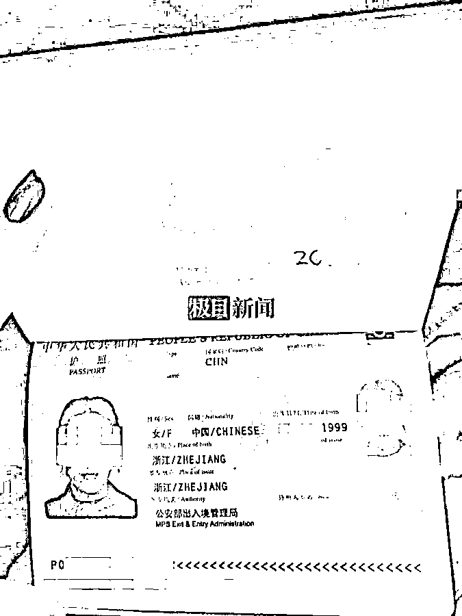
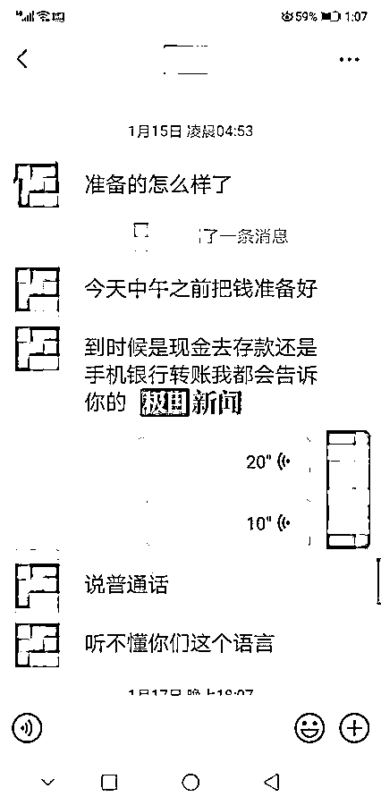

# 23 岁女孩在柬埔寨失踪数日！父母曾被勒索 20 万，聊天记录曝光

> 原文：[`mp.weixin.qq.com/s?__biz=MzIyMDYwMTk0Mw==&mid=2247529954&idx=1&sn=bd1de714046231347e9df22b25025317&chksm=97cbbedaa0bc37cc2c67e866e09807af13786583b0dd3726d513ce9d01454076c2a960282a02&scene=27#wechat_redirect`](http://mp.weixin.qq.com/s?__biz=MzIyMDYwMTk0Mw==&mid=2247529954&idx=1&sn=bd1de714046231347e9df22b25025317&chksm=97cbbedaa0bc37cc2c67e866e09807af13786583b0dd3726d513ce9d01454076c2a960282a02&scene=27#wechat_redirect)

一年多未见女儿一面，未想到她已经到柬埔寨，且生死未卜。

2 月 17 日，51 岁的浙江张女士（化姓）告诉记者，**女儿在柬埔寨疑被绑架，期间还曾收到他人用女儿微信所发信息，对方称绑架了其女儿，还索要 20 万元，但后来失去了联系。**

18 日下午，女孩王欣（化名）家乡所在地浙江当地警方回复记者称，接到其家人报警后，办案部门一直在多渠道多途径多部门进行协调沟通办案，同时也在进行国内外协同办案的工作，“谁家都会有小孩，这种事情谁都不想的，**该尽力的我们会全力以赴的。**”涉及到相关的具体案情，对方表示暂时不便透露。

王欣生活照

张女士介绍，女儿王欣（化名）1999 年生于浙江一地级市，因父母长期在外务工，她由奶奶一手带大。张女士至今觉得，作为母亲，在这方面她是有责任的，亏欠孩子太多。王欣中专毕业后，到杭州的工厂上班。

王欣的性格大大咧咧，讲义气，很多人喜欢跟她交朋友。在母亲眼里，王欣没有心机，没心没肺，“在外面很容易吃亏。”

本来以为王欣一直都在杭州。2020 年 10 月，王欣的表姐结婚，母亲提前跟王欣打电话，通知她回老家参加婚礼。那时候，王欣告诉母亲她在柬埔寨，还称公司组织员工到柬埔寨旅游。最终回国经过隔离后，王欣顺利参加了表姐的婚礼。

王欣和朋友一起

十一过后，王欣再次离开。春节前，父母让王欣回家过年，她回复说三个人在外面合作开了公司，谈了个男朋友，自己要陪男朋友过年，等过了年再回老家。

王欣的护照

当时，父母以为王欣在杭州过年了，可 2021 年的五一小长假和十一长假，王欣依然没有回家。

“有时候跟她沟通少，说多了她也嫌我啰嗦。”母亲张女士说，女儿很独立，工作后也没有向父母要一分钱。

今年 1 月 13 日，一年多时间没见女儿的张女士再次发信息让孩子回家过年，王欣又说年前回不去。但 14 日晚 8 时 42 分，女儿的微信发来消息：“我现在着急用点钱，现在能给我转多少？”随后，对方张口要 20 万元。

微信对话截图

张女士回复称家里的钱存了定期，并询问“是给你的朋友用吗？”对方回复：“是我自己着急用，这不是催着我回国嘛，要把这边的事情抓紧处理好。”

但紧接着，对方又称，“你女儿一直在国外，你女儿被我绑架了，把钱准备好，我明天把卡号发给你。”

微信对话截图

为了验证女儿是否安全，张女士和丈夫用方言发了语音，要求让女儿回复，且要看看女儿。后来对方一直没有回音。

15 日凌晨，女儿的微信号发来消息：“爸爸，没事的。”同时用语音发了句：“这些东西是男朋友发的，现在没事了。”但之后，女儿再也没有回复消息了。

随后，张女士向浙江当地警方报案。

几天后，张女士从警方处确认了女儿在柬埔寨失踪的消息，并得知王欣此前曾在柬埔寨一家宾馆长期居住。该宾馆老板告诉张琳，王欣一行两女一男，三人此前多天联系不上，后从新闻媒体上得知疑似其中一男一女身亡的消息，王欣则不知所踪。

张女士曾想去柬埔寨一趟，但被当地熟人劝住，因为去了可能就无法回国，而且就算到了当地，对找人并不会起到太大作用。

目前，张女士和丈夫只有在家里等待大使馆和警方的消息。

来源 ：极目新闻

← 向右滑动与灰产圈互动交流 →

