# 男子嫖娼上瘾，诈骗 1700 万全部找外围女…

> 原文：[`mp.weixin.qq.com/s?__biz=MzIyMDYwMTk0Mw==&mid=2247529954&idx=3&sn=d6a0fa41d20158f149ee6beecc99a380&chksm=97cbbedaa0bc37ccbfbac643dee3a76ae6c0a8d347e8ff8cff1afe5878184b31268902395bd2&scene=27#wechat_redirect`](http://mp.weixin.qq.com/s?__biz=MzIyMDYwMTk0Mw==&mid=2247529954&idx=3&sn=d6a0fa41d20158f149ee6beecc99a380&chksm=97cbbedaa0bc37ccbfbac643dee3a76ae6c0a8d347e8ff8cff1afe5878184b31268902395bd2&scene=27#wechat_redirect)

2015 年二月，江苏泰州市公安局接到一个女子的报案，说自己被亲戚邱某骗了 1700 万。 

由于被骗金额巨大，泰州公安当局引起了高度重视，很快便将在外地潜逃的邱某抓获。

在忏悔的椅子上，自知法网难逃的邱某对于自己的诈骗行为供认不讳，坦然承认。

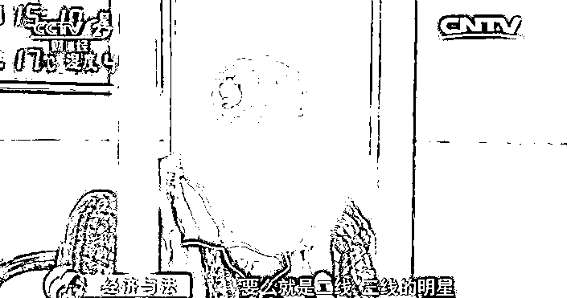

# 邱某落网，牵出灰色产业链 

据他交代那 1700 万都已经被他挥霍一空，用来卖了豪车和名表以及各种高端的消费。

但警方却注意到在他的消费记录中还有 160 多条转账记录意义不明，一共加起来有 300 万。当被问及时邱某言辞闪烁，左右他言。

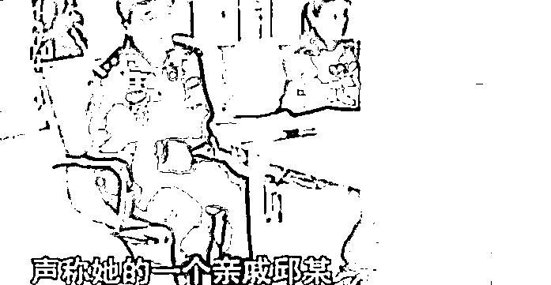

最后在连番的审问下才知道，这竟是他 6 个月来所花出去的嫖资。此话一出所有的办案人员都不敢相信，一个正常的男子怎么可能在怎么短的时间里嫖宿一百多次？ 

而且每次的价格都是如此昂贵？

警方怀疑邱某很有可能是购买了毒品等违禁品，很多犯人都会这样为了减轻罪行故意说谎遮掩。

为了弄清楚这笔钱的去向，泰州警方展开了深入调查。但是调查的结果很快让警方大吃一惊。

手机上这些少则三千多则一万的记录，的确都是邱某性交易后的汇款。而交易对象都是一些美貌女子，数量众多几乎没有重样，而且都分布在天南地北各个城市。

通过邱某对自身经历的供述警方意识到，原来在千万诈骗案的背后，还隐藏着另一个波及全国的卖淫大案！

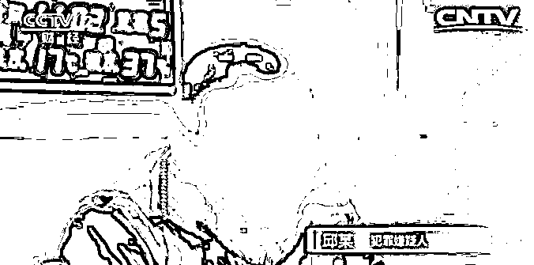

# 色字头上一把刀，从银行精英到负债累累的骗子 

出生于 1985 年的邱某，在大学毕业之后就一直在泰州本地一家银行工作。一开始他老实本分，刻苦工作。出色的表现让他很快就升职成为高级职员，享受着 30 万的年收入。

在工作上取得了一定的成就后，邱某开始沉迷与物质上的享受，在豪车名表上投入了大量的金钱，甚至不惜贷款也要维持这种生活。

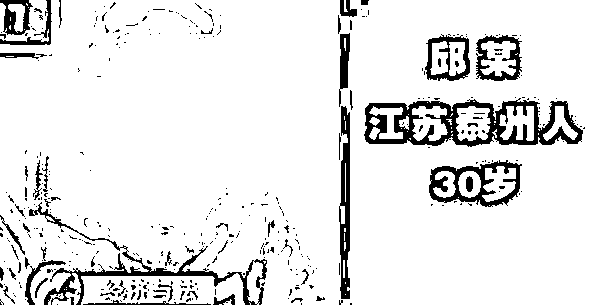

一次在上海出差的时候，无聊的邱某通过社交软件搜索附近的人，与一个头像是美貌女子的人加了好友，在交流中对方说如果寂寞，自己可以介绍一些高质量漂亮的女孩来作陪，模特和明星任由挑选。 

邱某明白了对方的意思，很快对手机上所谓的“明星”“模特”心动了。他激动之下一口气就点了 5 个，当晚被点到的几个女孩来到邱某的酒店并发生关系后，分开时邱某一共向她们支付了 5 万的嫖资。

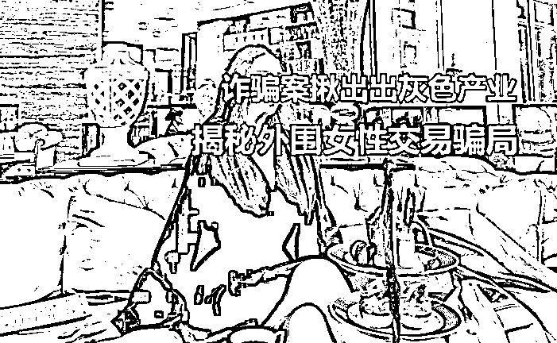

六分之一的年收入被一夜花光，但邱某却没有收手，而是彻底迷失在了这种美色交易之中。只要一有出差的机会他就要联系那名老鸨，让对方搜罗各种美女来陪他过夜。 

在不到半年的时间里，他就与多名女子进行过交易。价格从最低的两三千，到最高的五万。在这种毫无节制的挥霍下，邱某的积蓄很快一点不剩。

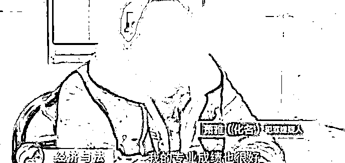

不仅如此他还用拆东墙补西墙的方法，在手机的借贷平台上欠下了巨额的高利贷。这些借贷平台的利息高到令人绝望，就算他再工作 100 年也不可能还清债务。 

于是邱某利用自己在银行工作的便利，打起了用理财产品诈骗的心思，而他第一时间想到的诈骗的对象就是自己身边人。由于邱某平时生活奢靡，做派大方，这种表象很快就骗到了一些中老年人的信任，并成功在一个亲戚那里骗到了 1700 万的理财资金。

拿到钱的邱某连夜消失，不仅没有还钱的打算，反而继续跑到上海挥霍无度。这 1700 万除了购买豪车名表等奢侈品外，最大的去向就是当做嫖资。

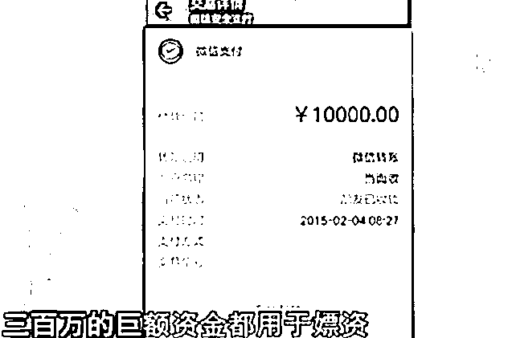

短短 10 个月邱某前后就与 160 名女子发生了交易，以转账和现金的方式一共支付出去了 300 万。 

# 揭开“高端名媛”性交易骗局

直到 2015 年，亲戚报案，警方将其抓捕归案之后，邱某花天酒地的生活才被终止。

但即使已经被关进了牢房里，这个诈骗犯仍然相信和自己交易的女子都是二线三线的明星。却不知道自己其实才是被骗的最惨的那一个

在邱某落网之后，警方通过他在群里的聊天记录，排查到了几名与邱某频繁接触的卖淫女的真实身份。

随后在同年的 10 月，警方实施了抓捕行动，分别在五个城市抓获了“鲁静”“萧雅”等 6 名犯罪嫌疑人。

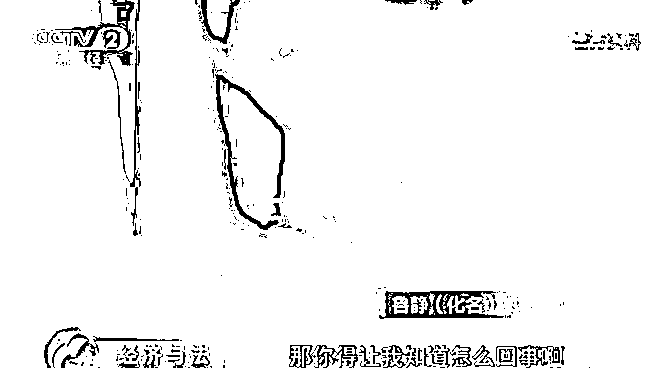

经过查询得知，“鲁静”等人根本不是什么模特也不是什么明星演员，大部分学历也只有高中初中。

除了长得年轻漂亮之外，她们其实和一般普通的女孩没什么两样。

网络上对这个群体有一个统称叫做“外围女”。 

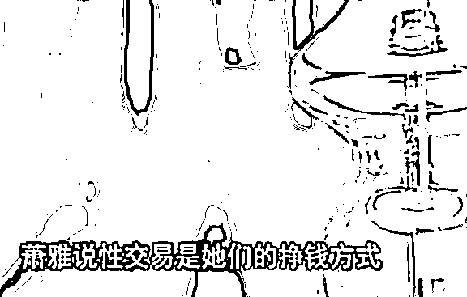

模特和明星的身份都是经过花钱包装出来的，她们在网络上找一些包装公司帮她们拍一些像明星一样的照片和视频，然后雇佣写手杜撰一些虚假的新闻，最关键的是还要在某些百科上买位置，让人一搜就能相信这些编造出来的假信息。 

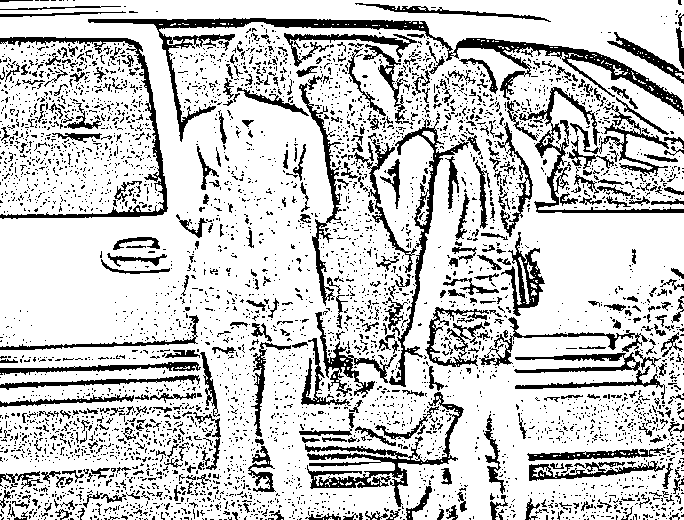

在这个圈子里越是会包装的人，身价就会越高，冒充明星进行交易价格最高能达到 15 万。

而得益于现代社交平台的发达，这些外围女之间形成了一个封闭的圈子，一般只有熟人介绍才能进入其中。 

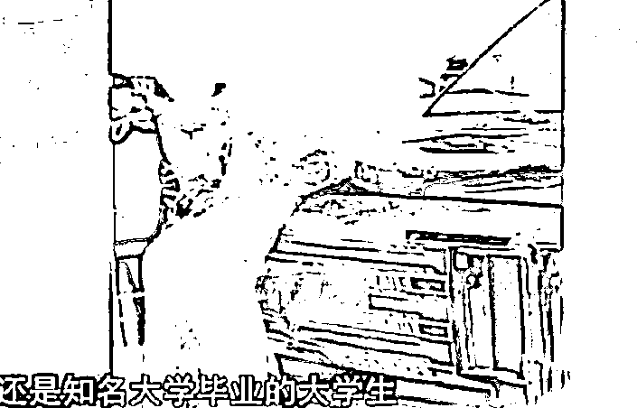

她们彼此之间会相互介绍业务，在群里一搜就能知道一个女孩的所有服务信息。

但是这些信息大部分都是假的，圈子里的人都对此守口如瓶。

以此来在性交易中骗取更多的报酬。 

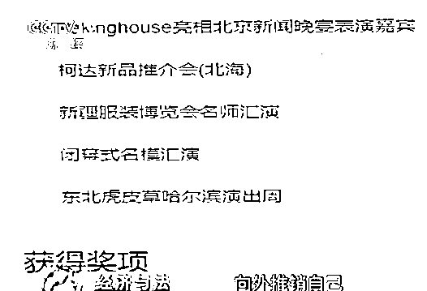

天道好轮回，苍天饶过谁！ 

不得不说在这个被虚假信息充斥着社会，骗子的骗术实在是越来越多样化了。

即使是骗了一千多万的金融诈骗犯，也会被美色所欺骗，

但无论真真假假如何迷人双眼，只要有一颗不贪不燥的心就不会上当。

来源：围脖那些事儿

← 向右滑动与灰产圈互动交流 →

