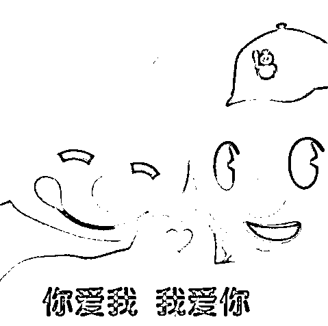
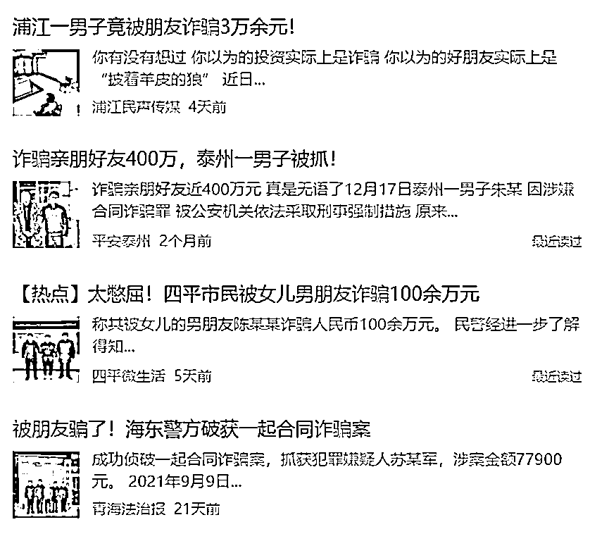

# 表白被拒怎么办？“借”个身份，一边恋爱一边诈骗

> 原文：[`mp.weixin.qq.com/s?__biz=MzIyMDYwMTk0Mw==&mid=2247529954&idx=4&sn=4201c4c44a4b6e64fdaadce744193674&chksm=97cbbedaa0bc37cc37123907e47982e67b49c744c9953813efe3e2a374b4d0ca41c909935751&scene=27#wechat_redirect`](http://mp.weixin.qq.com/s?__biz=MzIyMDYwMTk0Mw==&mid=2247529954&idx=4&sn=4201c4c44a4b6e64fdaadce744193674&chksm=97cbbedaa0bc37cc37123907e47982e67b49c744c9953813efe3e2a374b4d0ca41c909935751&scene=27#wechat_redirect)

**01**

**你不跟我好，我有的是法子骗你钱**

热心好友小王积极送祝福，

向单身郭仔介绍了同乡女子小丽，

二人在网上你来我往，

随后确认男女关系陷入热恋甜蜜蜜。

谈到二人当初的风花雪月，郭仔还有点怀念。

“开始就是普通朋友随便聊聊，慢慢地发现彼此很合适，就发展到了男女朋友的关系。”

“明明大家都聊得挺正常的，后面就开始奇奇怪怪起来。

她**不是说家里面有什么事情要花钱，**

**就是说她受伤需要医药费**，诸如此类乱七八糟的事……”

一年来，小丽陆续以各种理由向郭仔要钱，

郭仔秉承着“好男人不该让心爱的女人受伤”的原则，

对小丽有求必应，**先后给了十多万**。

尽管如此，**小丽还是不同意见面**。

啊这？钱也花了，甜言蜜语也说尽了，

原来是**网络姻缘一线牵，一说见面拔了网线装停电**？

“我跟小丽认识将近一年左右，**从头到尾没见过她**。”

网恋，套钱，但是不见面，好熟悉的套路啊！

郭仔，你有没有考虑过搜索引擎查一下“杀猪盘”呢？

“我也怀疑过！**但介绍人小王是我的朋友，她不会骗我啊**！”

怀疑——打电话给媒人小王确认——安心——又怀疑——又打电话。

郭仔内心的起起伏伏没人懂，

直到终于有一天，郭仔按捺不住回贵州老家看望小丽，

他拿着“小丽”的照片询问。

村民：**不知羞，怎么问有夫之妇的**？

郭仔连夜骑着单车跑去派出所报了警。

警方调查，发现郭先生一直在聊天的对象，

根本不是什么“小丽”，而是给他介绍对象的小王。

**小王借用了当地同村的一个女孩的形象及身份，跟郭仔浓情蜜意了一整年。**

她交代：

“当时一开始是为了拜郭仔为师，

反正心里也有好感，顺势就**告白然后被拒绝**了，

心里比较抑郁，也比较纳闷，**就产生了这种想骗他钱财的想法**。”

虽然**小王已经被刑事拘留**。

但郭仔受的伤却实实在在。

我只想当你的师父，你却想当自己的师娘。

得不到我的人你就想得到我的钱？

**02**

**昨天还是好朋友，今天把你钱全骗走**

被自己信任的亲朋好友诈骗是种什么体验？

郭仔表示为爱情受了点伤罢了，重新振作也还是条好汉。

我们倒霉的浦阳阿项则觉得：so sad。

阿项想从事滴滴代驾工作，

于是找到了已是代驾员的**初中同学洪某**咨询相关情况。

谢谢洪某的悉心指导，不过可惜**阿项并没有通过代驾考试**。

哎，没有缘，那就算了吧。

不曾想几月后，阿项收到了洪某的消息，

表示滴滴平台要招聘代驾员，可以**不用考试只需参加培训即可上岗**。

阿项：好耶！

然后立即向洪某转了 2500 元购买代驾专用的电瓶车。

随后，阿项在洪某的要求下，

**陆续缴纳了装备费、会员费、报名费、保证金等费用，共计 35300 元**。

“**老同学办事，我放心的。**”

但在交完费后，阿项既没有收到电瓶车，也没有接到参加培训的通知。

联系洪某时也被对方以各种理由推脱、搪塞。

无奈之下阿项报了警。

原来，洪某得知好友阿项没有通过代驾考试，

自己又非常缺钱，便**想去他那“搞”点钱**。

为了让这场骗局更加真实，

洪某将自己微信小号伪装成滴滴公司推送给阿项，

并冒充工作人员以代驾电瓶车费用、装备费、报名费等各种费用的名义，

骗取了项某 5100 元。

不仅如此，尝到“甜头”的洪某还让阿项从滴滴金融平台进行贷款，

用以“提高等级和接单量”，

并诱使对方将贷款转入“公司”预存一个月，从而骗取 30200 元。

据洪某供述，除了装备费要缴纳外，其他费用全是其虚构的。

同学情一场，

假的，假的，都是假的！

但**洪某因涉嫌诈骗罪被浦江县公安局依法刑事拘留**是真的。

**03**

**当你曾经的朋友变身诈骗犯**

比起被陌生人诈骗时的愤怒，

熟人之间诈骗涌现更多的是不敢置信。

真的吗？为什么？我们以前感情很好的啊？！

但其实熟人之间的诈骗也并不少见。

隔三岔五也能收到不少咨询，

“我被朋友骗了怎么办？”

“我朋友骗了我钱，现已被拉黑，日久见人心！”

哎，充满尔虞我诈的可恶成年人！

记忆里的曾经大家都是多么的单纯啊！

——倒也没有，诈骗其实根本不论年龄性别！

怎么敢的？！

难道这些受骗者们被骗时真的一点漏洞也没发现吗？

他们表示，之所以被骗主要有三个原因：

一是**出于对老朋友的感情和信任**。

不设防的心理就给了骗子很大操作空间。

二是骗子是这个世界上最好的演员，

他们心思缜密善于利用人性的弱点行骗令人防不胜防。

三是大部分**受骗者都对骗子“帮衬”的内容并不了解**，造成自己上当受骗。

也有的“朋友”在被抓之后“幡然醒悟”，痛哭流涕，

哀求受骗人能够出具谅解书，自己一定偿还这份情。

“我们以前是朋友的呀！”

**当他下定决心伤害你的那一刻起，你们就不再是朋友了**。

愧疚挣扎后悔，都是骗子自己的事情，

我们被骗人完全不需要有任何负担，

你可以选择原谅对方，但不原谅也没人可以指责！

希望大家的生活充满阳光美好，

让诈骗速速远离！

Peace and love !

← 向右滑动与灰产圈互动交流 →

