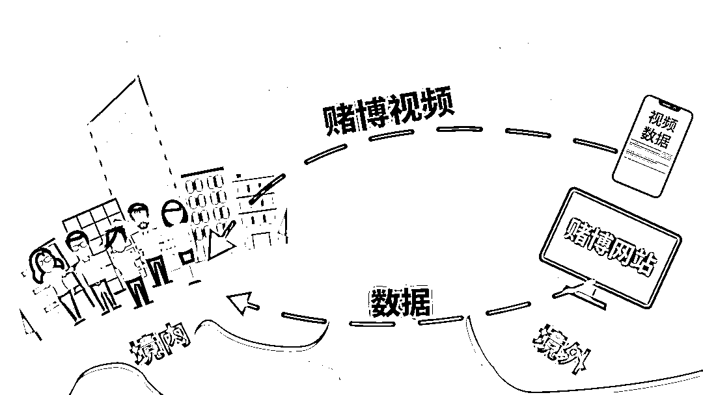

# 网络赌博十赌十输，没有例外！

> 原文：[`mp.weixin.qq.com/s?__biz=MzIyMDYwMTk0Mw==&mid=2247529954&idx=5&sn=2b324a7b4a439407ee1a07cafe71b043&chksm=97cbbedaa0bc37cc2fa041ed54f56c3d521a93e6761446ef63b54d876e5d740c8289b7d11f9f&scene=27#wechat_redirect`](http://mp.weixin.qq.com/s?__biz=MzIyMDYwMTk0Mw==&mid=2247529954&idx=5&sn=2b324a7b4a439407ee1a07cafe71b043&chksm=97cbbedaa0bc37cc2fa041ed54f56c3d521a93e6761446ef63b54d876e5d740c8289b7d11f9f&scene=27#wechat_redirect)

**跨境网络赌博**

不仅导致受害者深陷泥潭

遭受巨大的资金财产损失

而且严重危害

人民群众财产安全和合法权益

损害社会诚信和社会秩序

影响国家经济安全和社会安全稳定

[`mp.weixin.qq.com/mp/readtemplate?t=pages/video_player_tmpl&action=mpvideo&auto=0&vid=wxv_1856862501909413890`](https://mp.weixin.qq.com/mp/readtemplate?t=pages/video_player_tmpl&action=mpvideo&auto=0&vid=wxv_1856862501909413890)

当我们在浏览网页、使用网络平台或软件时，各式各样的“网络赌博”广告信息常常会不经意间出现在我们眼前。这些广告信息往往以“致富、赚钱、提现”等字眼吸引眼球，试图诱导我们的关注和参与。实际上，跨境赌博、网络赌博的背后是充满恶意的陷阱，请保持警惕，务必远离！

**手法概述**

**不法分子一般通过以下方式，广泛发布网络赌博广告，以及设置网络赌场入口，诱导公众下载 App 等。**

**网络平台页面虚假广告**

一些网络赌场会将其入口和下载链接嵌入某些不良网站或公众号推送内容中，或是在网络社交平台投放网络赌博的广告信息。

**通过短信发送虚假广告**

广泛发送欺诈短信，以“月赚百万租金”、“资金一秒到账”等噱头诱导点击链接下载 App。短信中一般还配有照片等吸引眼球的内容，附带联系方式。

**组建网络赌博聊天群**

在网络聊天软件中广泛加他人为好友，通过后就将这些人拉进自建的各种赌博群聊中，在群聊中发送赌博广告、推荐下载赌博 App。

**常见形式**

****网络赌博的常见形式****

通过网络游戏、猜大小、押单双等形式进行赌博；

通过组建在线聊天群，采用发放红包方式进行赌博；

基于体育竞技、福利彩票形式的外围赌博；

主打“娱乐购物商场”，实则操盘赌博等。

**赌博 App 往往伪装为具有赌博色彩的如棋牌类等小游戏，以“致富、赚钱、提现”等字眼诱导公众参与。不法分子还会在赌博聊天群中，利用“发红包”功能，发起“赌大小”、“压数字”等赌博活动，同时安排人员不断发布赚到钱的截图营造出已经有很多人获利的氛围，以获取参与者的信任。然而一旦有人参与，起初可能会“被安排”赢得一些小钱，最后一定是血本无归。**

**套路揭秘**

**植入黑链接**

为了逃避法律监管，境外赌博集团通常会把服务器设于境外，通过国内伪基站对网站植入黑链接、群发短信，或利用虚假微信群、QQ 群等手段进行宣传推广。

**人为操控后台修改胜率**

这些平台通常会先给新会员一点甜头，引诱其上钩，让新会员赢钱，但玩得久了，就通过后台作假方式修改胜率、杀大赔小，玩得越久输的概率也就越大，等会员投入大额资金的时候，就把钱套光。

**设置高提现门槛**

可能有人会问，我玩小点肯定能提现，没问题。是这样的吗？答案是否定的。因为，只要参与了，就算赢了钱，也未必能提现。如果运气好赢了钱，那么在提现时就会发现，前期小金额的盈利，可能会允许提现，如果后期赢的数额大一些，客服是不会给你转账或者提现的。平台会提示你：“需要达到一定的金额才能提现“，达到后平台又提示你：“需要达到一定的时间、次数才能提现”。很多人，在不知不觉间，就已经把钱都输光了，甚至还有人，举巨债赌上身家性命，到最后人财两空，后悔莫及！

**警方提示**

✪参与网络赌博，开设赌博网站是违法犯罪行为，需要承担相应法律责任，务必加强防范，自觉抵制。

✪跨境赌博、网络赌博是骗局，平台背后往往是不法分子在操控输赢，**请了解网络赌博套路，认清赌博的危害和后果，切勿相信虚假广告宣传，更不要参与。**

✪对于网络中陌生的“好友”应提高警惕，切勿轻信对方说辞。妥善保护好自己的银行账户信息和个人信息，不要向他人泄露或在不明网站中填写。

**从自身做起**

**提高防范意识**

**坚决远离跨境赌博、网络赌博**

来源：西宁刑警，巴蜀反诈

← 向右滑动与灰产圈互动交流 →

