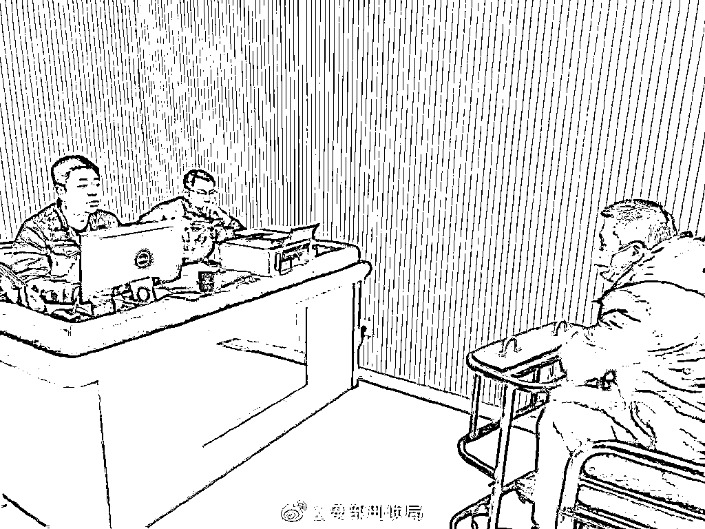
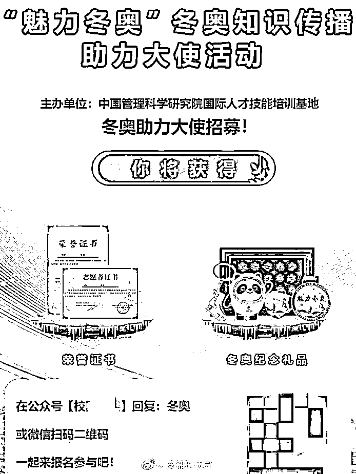
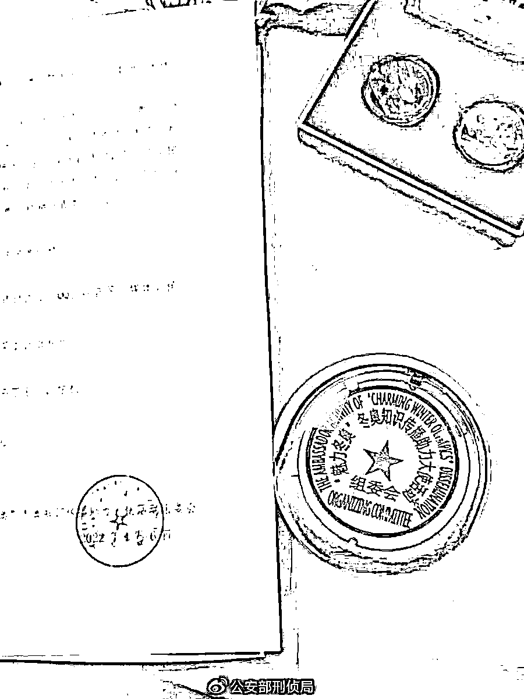
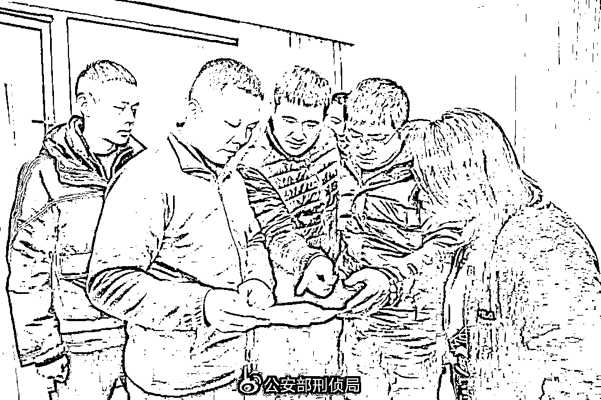
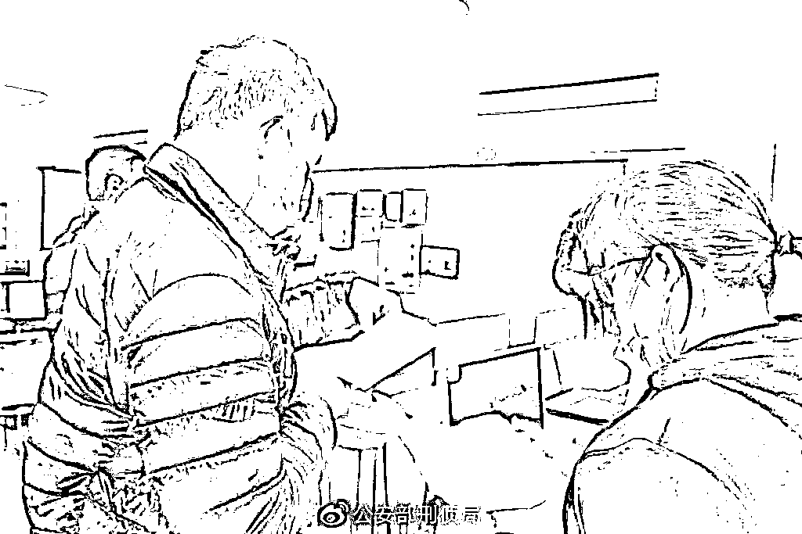
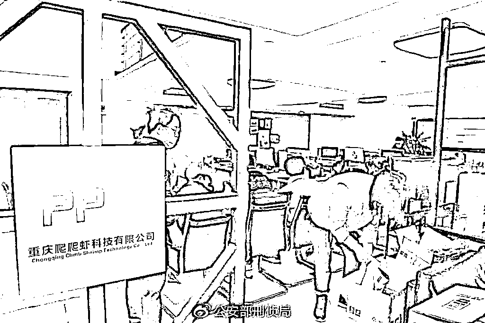
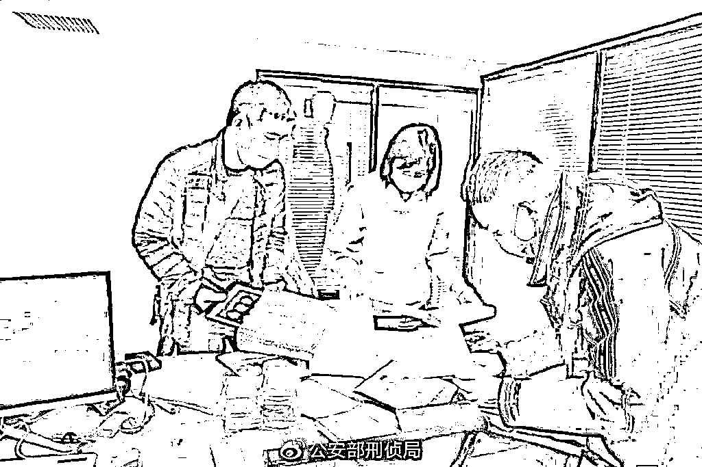
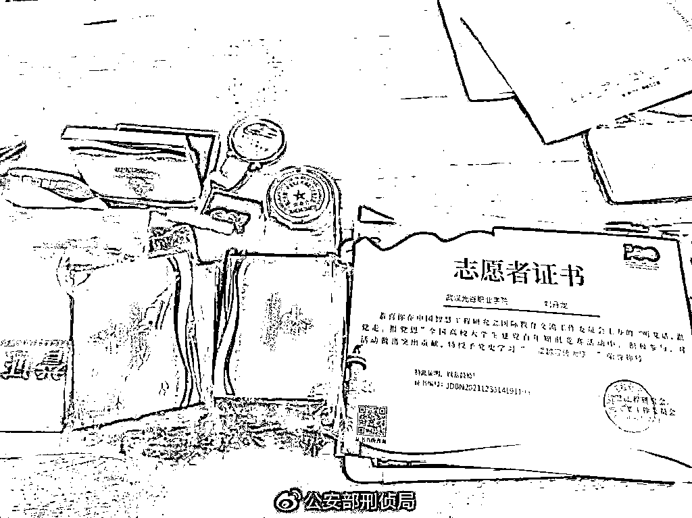
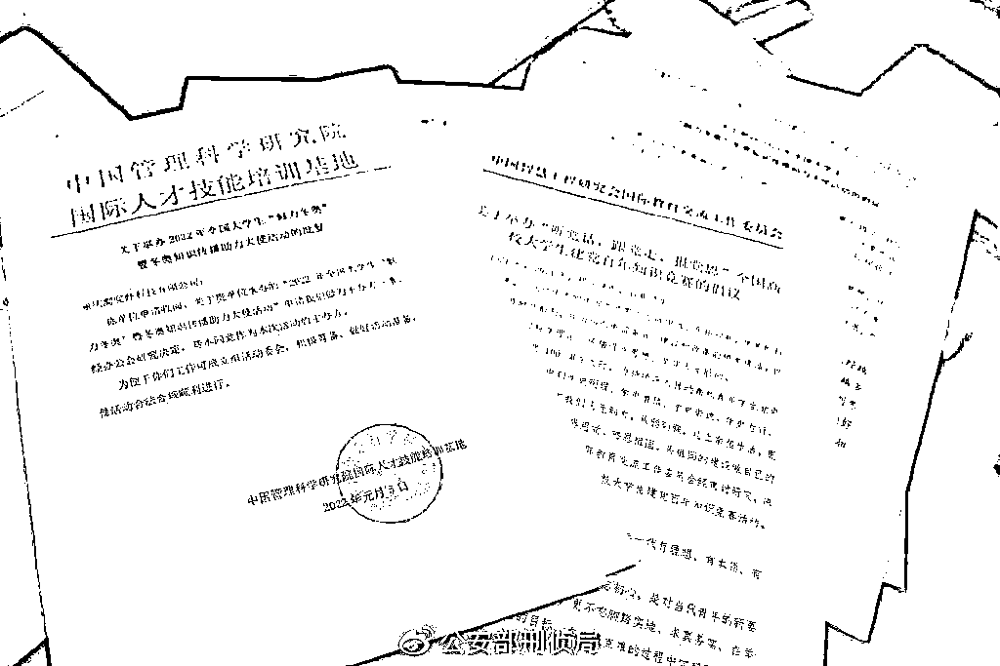

# 借冬奥行骗！全国 350 多万大学生中招！

> 原文：[`mp.weixin.qq.com/s?__biz=MzIyMDYwMTk0Mw==&mid=2247529954&idx=6&sn=6d42d959c53eb170ebed4872151683ac&chksm=97cbbedaa0bc37cc5e8aefedd1ebca1cc89c3c8c08c4ded32d96a8d7c19c9b6c23ac82354fda&scene=27#wechat_redirect`](http://mp.weixin.qq.com/s?__biz=MzIyMDYwMTk0Mw==&mid=2247529954&idx=6&sn=6d42d959c53eb170ebed4872151683ac&chksm=97cbbedaa0bc37cc5e8aefedd1ebca1cc89c3c8c08c4ded32d96a8d7c19c9b6c23ac82354fda&scene=27#wechat_redirect)

抓获涉案人员 19 名 

案值逾千万元

同时还查获该犯罪团伙

非法获取到的 350 余万名

大中专院校学生的个人信息数据

到底发生了什么？ 

2022 年北京冬奥会举世瞩目。赛场内，各国选手激烈角逐。赛场外，一场名为“‘魅力冬奥’冬奥知识传播助力大使活动”的线上答题也在全国范围内广泛传播。然而，**这样一场打着“魅力冬奥”旗号的活动却是一个精心设计的骗局。**

**经缜密侦查，在公安部部署开展的“净网 2022”专项行动中，江苏南通、如东两级公安机关成功破获一起特大假冒冬奥知识传播活动诈骗案。**

****

**▲专案组民警正在对犯罪嫌疑人进行讯问。**

**“在公众号‘校园实践’回复：冬奥或微信扫码二维码，一起来报名参与吧！你将获得荣誉证书和冬奥纪念礼品。”2 月 8 日，有热心网友向南通市公安局网安支队举报，一场名为“‘魅力冬奥’冬奥知识传播助力大使活动”的线上答题在本地微信群、朋友圈内传播开来，吸引众多网友报名参加，**涉嫌非法搜集公民个人信息和诈骗。****

****

**▲虚假活动海报。**

****

**▲警方现场查获的“活动组委会”印章。**

**经初查，南通网警发现，这个活动主办单位名为“中国管理科学研究院国际人才技能培训基地”，主要针对大中专院校在校学生开展，活动实行“冬奥值”积分制度，报名后首先在 10 分钟内答 10 道冬奥的常识题，答对 6 道即可加“冬奥值”10 分。**答题后，还要求填报所在学校、姓名、身份证号、手机号等个人信息。**参与过程中，需通过学习签到、邀请报名等方式获取“冬奥值”，达到一定分值可获得一星至五星不同等级的“冬奥大使”称号，在全国排名靠前的还可获得定制手办“冰墩墩”等限量奖品。**

**2 月 9 日，南通市公安局网安支队会同如东县公安局成立专案组开展破案攻坚。经进一步侦查，专案组很快查明背后隐藏着一个以李某辉（男，38 岁，内蒙古人）、汤某峰（男，40 岁，江西人）等人为首的，专门针对大中专院校在校学生设计各类在线答题活动，从而非法获取公民个人信息、诈骗钱财的犯罪团伙。**

****

**▲行动前，专案组民警正在讨论抓捕方案。**

**2 月 16 日，南通、如东两级公安机关抽调 20 余名精干警力，兵分两路，分别在重庆、北京将 19 名涉案人员全部抓获归案，现场查获作案用手机 38 部、电脑 57 台、U 盘 16 个，**以及非法获取的 350 余万条公民个人信息，均为全国各大中院校在校学生为参加答题活动在线自主填报的。**** 

****

**▲专案组民警现场取证。**

****

**▲专案组民警在现场进行搜查取证。**

****

**▲专案组民警在现场进行搜查取证。**

**经查，今年 1 月，犯罪嫌疑人李某辉伙同汤某峰等人在没有取得冬奥组委会官方授权的情况下，依托互联网开发了一个“竞赛平台”，精心设计了积分规则和活动海报，以公众号、微信群、朋友圈推广等形式，在全国范围内发起“‘魅力冬奥’冬奥知识传播助力大使活动”。**

**以发放虚假“冬奥大使荣誉证书”、冬奥纪念礼品等为奖品，并宣称所颁发的荣誉证书可作为大学生社会实践加分、评奖学金等依据，**诱骗各大中专院校在校学生进入“竞赛平台”，填写姓名、手机号码、身份证号码、联系地址等个人信息**，并收取 28 元至 36 元不等的证书工本费牟利。截至案发，该犯罪团伙依托这一“竞赛平台”，**已非法获取全国大中专院校在校学生的个人信息 350 余万条，骗取部分参与者缴纳证书工本费总计 1000 万余元。****

********

****▲警方查获的部分前期活动资料。****

****南通市公安局网安支队副支队长张达经透露，在侦查过程中，南通警方还发现该犯罪团伙此前多次利用非正规行业协会、学会等开展此类线上答题活动。****

********

****▲犯罪团伙利用非正规行业协会、学会等开展各种活动。****

****目前，该案正在进一步侦办中。****

******警方提醒******

******目前的网络答题和抽奖活动，参与者大都要填写一些基本的个人信息，活动主办方可借机营销、吸粉引流、收集个人信息等。面对各类网络活动，广大网友要擦亮双眼，对活动主办方要仔细甄别，特别是涉及填写身份证号码、手机号码、联系地址等重要的个人信息时，一定要慎重。中奖后，主办方要求领奖前缴纳各类费用的更应提高警惕，谨防上当受骗。******

******来源：中国警察网，公安部刑侦局，戒赌吧****** 

************

******← 向右滑动与灰产圈互动交流 →******

************