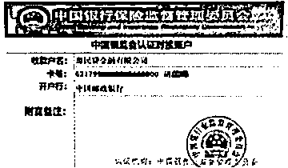

# 当心！“支付宝客服”盯上了曾用过“花呗”的你，结果……

> 原文：[`mp.weixin.qq.com/s?__biz=MzIyMDYwMTk0Mw==&mid=2247529954&idx=7&sn=34e3778272bdf45a7b87cc506fd4741b&chksm=97cbbedaa0bc37cce315e3bb85efa605ade136c0dce03608f034638476acdba7903f9c85d751&scene=27#wechat_redirect`](http://mp.weixin.qq.com/s?__biz=MzIyMDYwMTk0Mw==&mid=2247529954&idx=7&sn=34e3778272bdf45a7b87cc506fd4741b&chksm=97cbbedaa0bc37cce315e3bb85efa605ade136c0dce03608f034638476acdba7903f9c85d751&scene=27#wechat_redirect)

“注销校园贷”诈骗手法层出不穷

无论是在校大学生

还是刚刚毕业的年轻人

都成了诈骗分子眼中的“肥肉”

而近期

警方通过梳理警情发现

这种特别有针对性的骗局又翻新了

**从“注销校园贷”**

**变成了“注销支付宝学生账户”**

**案例来了**

**市民张先生接到一通 170 开头的电话**

**对方自称是“支付宝客服”的工作人员**

**电话中，“支付宝客服”称张先生的支付宝账号是学生时代申请的，当时使用过“花呗”“借呗”等借款功能，根据国家最新政策，张先生的支付宝账号存在安全隐患与信用风险，必须配合“客服”的要求进行操作，否则将影响到个人征信，甚至会影响到子女之后的就学等。**

**一开始**

**张先生并不太相信对方的说法**

**直到看到了对方发来的**

**“银监会证明材料”“支付宝客服工作证”**

**“对接银行账户”等证件照**

****

**张先生信了**

**赶紧开始配合对方进行“操作”**

**“支付宝客服”声称，张先生**只有将“借呗”“花呗”清零之后，才能把学生账号转换为社会人士账号。****

**于是张先生把自己**

**支付宝里“花呗”“借呗”**

**总计 6000 元的额度借出来后**

**转给了“客服”先前发来的**

**“银监会对接账号”**

****

**“支付宝客服”称银监会收到钱后会给张先生出一个证明，钱款也会原路返还到张先生的支付宝账号中，但**还需要张先生到指定的贷款平台贷款，才能彻底把自己的“支付宝学生账号”变更成“支付宝成人账号”。****

**于是，张先生在指定的**

**云闪贷、惠民贷、微粒贷、美团平台上**

**根据自己的信用额度**

**申请了相应借款**

**每一次申请成功后**

**“支付宝客服”都会立马发来**

**一张所谓相应贷款平台的“对接账户”图片**

****

**在张先生将自己在四个平台**

**借到的 85000 元**

**依次转到了对方指定的账号后**

**直到当天下午**

**都没等到借款回到自己支付宝账号**

**回拨了“支付宝客服”的 170 号码**

**这才发现联系不上了**

**在与支付宝官方客服核实后**

**才发现自己被骗了**

****

****警方分析****

********

****张先生遭遇的是“注销校园贷”骗术升级版“注销支付宝学生账户”，其主要有**以下两个“新套路”**:****

******1、**骗子自称“支付宝客服”，一开始**准确报出受害者个人信息**，而且这些受害者确实都有使用过支付宝中的“花呗”“借呗”等借款功能；****

******2、**骗子为了骗取更多的钱款，**会诱导受害者在转完“花呗”“借呗”的额度之后，再到指定正规贷款平台注册并贷款**，之后再发送事先制作好的虚假“平台对接账户”，要求受害者向指定账户转账汇款。****

******警方提醒广大市民群众****** 

****这些瞄准青年人群体的诈骗手法，往往是利用受害者担心个人征信受到不良影响的心理，诱骗用户到相关平台贷款，再以“归还额度”为由，要求用户转账。****

******支付宝都是通过身份证实名认证，不存在学生账户改为工作账户的情况。**支付宝唯一客服号为 95188，工作人员不会以个人手机号或添加对方 QQ 号、微信号来联系用户要求转账。****

****市民群众对于任何要求用户注销贷款账户为由的转账行为都不要轻信。“客服”发送的相关图片、验证码可能都是不法分子精心伪造过的。接到相关电话时，一定要通过正规的官方渠道和客服联系，核实相关信息的真实性。有任何疑问也可以拨打 96110 全国反诈劝阻专线进行咨询举报，一旦被骗应第一时间拨打 110 进行报警。****

****来源：厦门公安，厦门市反诈骗中心****

********

****← 向右滑动与灰产圈互动交流 →****

********