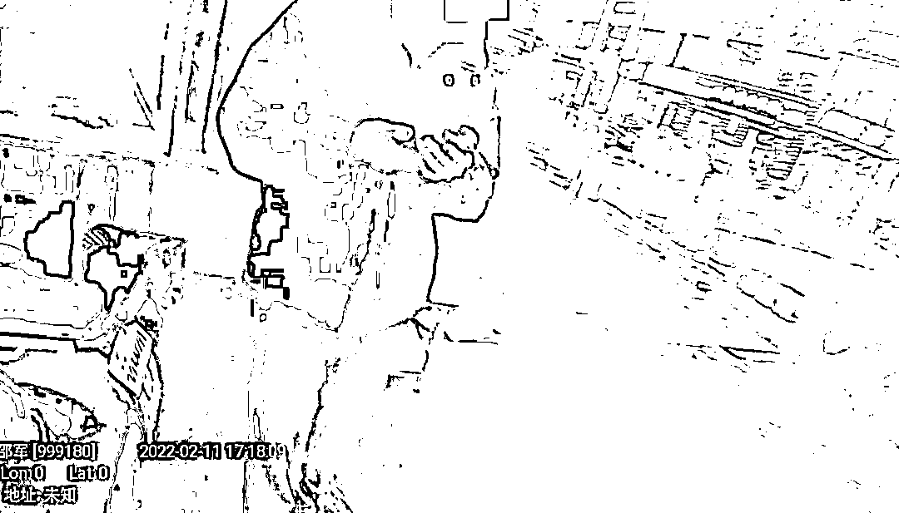
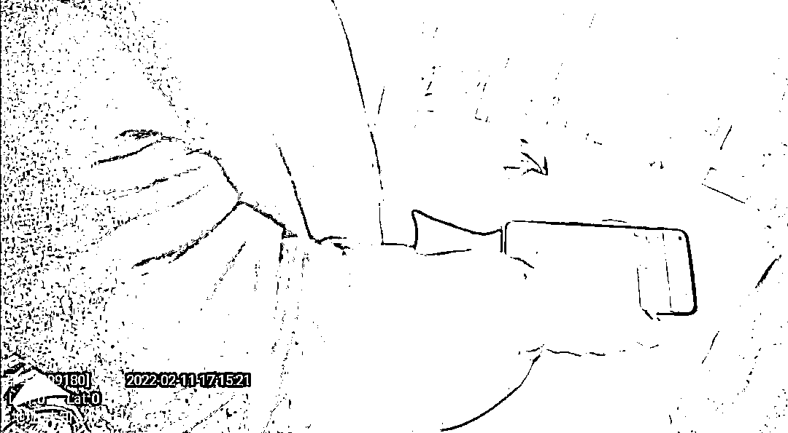
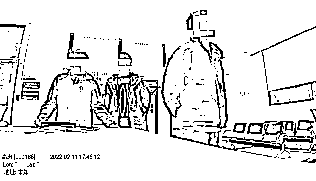

# “你们不懂平台规则！”男子深信刷单能赚钱，结果......

> 原文：[`mp.weixin.qq.com/s?__biz=MzIyMDYwMTk0Mw==&mid=2247529954&idx=8&sn=253188dae4a4d98e0e24fccf07a7cd68&chksm=97cbbedaa0bc37ccadf0ae822a39f6de3e11f8089ddffa37a1f4bd92844db6672252b640f4aa&scene=27#wechat_redirect`](http://mp.weixin.qq.com/s?__biz=MzIyMDYwMTk0Mw==&mid=2247529954&idx=8&sn=253188dae4a4d98e0e24fccf07a7cd68&chksm=97cbbedaa0bc37ccadf0ae822a39f6de3e11f8089ddffa37a1f4bd92844db6672252b640f4aa&scene=27#wechat_redirect)

2 月 11 日 17 时许，杭州钱塘区下沙派出所接小张（化名）报警称，室友小王（化名）疑似遇到电信网络诈骗了，现在自己正赶回住所了解情况。接警后，民警邵军立即出警。

 ****“我没有被骗，是你们不懂平台规则”**** 

邵军赶到现场后，报警人小张已在门口等着民警，并急忙地带着民警去见小王，随后，开始催促小王赶紧向民警讲述事发过程。

“你就从头到尾跟他们讲一遍，我求你，你就讲一遍。”

“**不是，不是骗子。是我自己点错了，要把本金搞回来，懂不懂，现在就是补单，钱真的是可以拿的。**”

在小张的反复催促下，小王坚决认为自己没有被骗，似乎还觉得小张有些“愚蠢”，不懂平台规则。

邵军一听，立马断定这是一起典型的网络刷单诈骗，要求小王停止平台操作。

**“你这个就是网络刷单。”**

**“没有，不是，我这个是可以提现的，就差最后一单了。是不是诈骗，我自己心里还是有点数的。”**

邵军的反复强调，并没有让小王觉得诈骗就发生在自己身上，依旧认为自己在“赚钱”。

“你这个钱不管充多少进去，都是打水漂的。这个钱到最后是没法提现的，这就是骗子的套路。刷单就是诈骗！”邵军反复教育着小王，并详细讲解网络刷单的常见手法，但小王就是认为自己没有被骗。

****“我没有被骗，你们怎么就不信我。”****

反复劝说无果后，邵军要求小王跟自己回派出所核实情况，但小王仍反复强调，“不是诈骗”，不用去派出所核实。

小张也是为小王操碎了心，“他们是专业的，你说不是诈骗，那过去查一下么。”随后，小王开始“嫌弃”起小张，觉得是小张事多，自己不懂还瞎报警，耽误自己“赚钱”，并给小张看自己手机上操作的平台，试图说明这是正规平台，但小张一看就觉得这平台就是在诈骗。

“你就是不信我。”小王开始抱怨小张对自己不够信任，非得叫上警察。

“我信你，但我不信这个平台！”小张回应道。

无论民警怎么说，室友怎么劝，小王仍一意孤行。“你去派出所核实了，如果不是诈骗，我立马就把钱借给你，如果不是诈骗，中间耽误时间让你损失了的钱，我全都补给你，行不行。”小张这么一说，小王才愿意去派出所核实情况，但也一直摸着手机，似乎在操作什么，嘴上还一直叨叨着，“**这下真来不及了。我被你们坑死了。**真是不是诈骗，是我自己点错了。**真的不是诈骗，马上就回本了。**”

****“真的没被骗，按规则来是真的可以赚钱”****

到派出所后，小王还是始终觉得自己没有被骗，这只是在浪费时间，一起跟来的室友怎么劝，小王都不听。

“这就是典型的网络刷单诈骗，**我们公安民警是保护你们钱袋子的，**有必要把你拉到派出所骗你么。”民警高忠见此现状，开始教育了起来。

但小王已被平台蒙蔽了双眼，“我的钱还在这里，只不过还有一单没做完，现在不能提现，这个不是骗人的。”

经了解，小王当天在网络上看到一条接单做任务赚钱的链接，后通过链接下载安装了软件，登录并注册账号后，有“客服”联系了小王，下发了工作任务。

小王按照对方要求，在平台上进行操作并在对方指定的银行卡账户内转账。第一次往平台上充值 1000 元，完成任务后，赚了 200 块，并直接将本金及佣金 1200 元提现了出来。

第一单操作的成功，让小王“信”了这个“赚钱”渠道。后在平台继续操作中，“客服”称小王做错了任务需要重新做，进行补单。

此时，小王已先后往平台充值了 3 笔钱，共计 30000 元。因钱袋已空，小王向室友小张借钱，小张发现不对劲后报警。

在派出所，民警先是普及了网络刷单的常见手法，给小王看近期发案的同类网络刷单案例，反复教育下，小王还是觉得只是自己操作失误，按照规则操作是可以赚钱的。

“我们公安机关专门打击这些东西，你不信我们，信这种平台客服。充进去的钱，全部取出来，你现在就走。”高忠这么一说，小王挠着头，一屁股坐在了凳子上，对民警的话有些半信半疑。为防止小王继续充钱，民警逐一给小王的父母、亲朋好友打了电话，要求不许借钱给小王。

经查询，小王转至指定银行卡的 3 万元钱已被全部转走，此时，小王才意识到自己是真的被骗了。

目前，警方已立案侦查，案件正在办理中。

来源：钱塘公安，阻击诈骗

← 向右滑动与灰产圈互动交流 →

