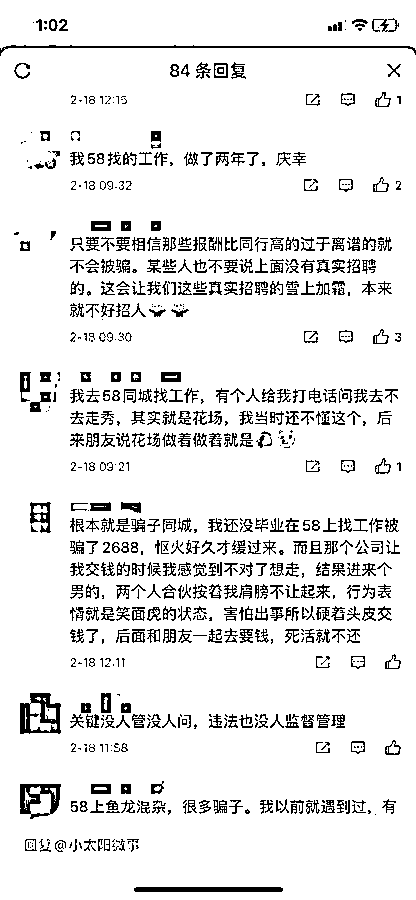
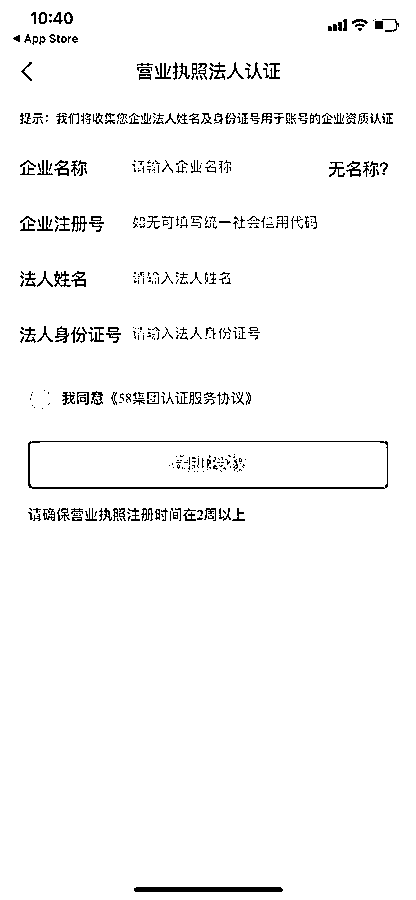

# 柬埔寨“血奴”事件牵出 58 同城：大量网友被骗，有人招聘马仔贩毒

> 原文：[`mp.weixin.qq.com/s?__biz=MzIyMDYwMTk0Mw==&mid=2247530022&idx=3&sn=2b937b715241a4ada98132f4d1598e9f&chksm=97cbbd1ea0bc3408e7013dc16c0db012048a5e10c572e58411c00ed8cc14019d63f78ea87f26&scene=27#wechat_redirect`](http://mp.weixin.qq.com/s?__biz=MzIyMDYwMTk0Mw==&mid=2247530022&idx=3&sn=2b937b715241a4ada98132f4d1598e9f&chksm=97cbbd1ea0bc3408e7013dc16c0db012048a5e10c572e58411c00ed8cc14019d63f78ea87f26&scene=27#wechat_redirect)

据《极目新闻》报道，近日，被骗到柬埔寨沦为“血奴”的中国小伙引起广泛关注，他自称是在 58 同城上求职被骗出国的。

58 同城回应称，**未查到该小伙所提及企业此前发布的招聘信息，正配合警方调查。**

[`mp.weixin.qq.com/mp/readtemplate?t=pages/video_player_tmpl&action=mpvideo&auto=0&vid=wxv_2275033411138404359`](https://mp.weixin.qq.com/mp/readtemplate?t=pages/video_player_tmpl&action=mpvideo&auto=0&vid=wxv_2275033411138404359)

**视频剪辑 王鹏**

记者以“58 同城”“虚假招聘”为关键词在裁判文书网进行搜索，发现大量求职者因虚假招聘信息被骗的案例。

其中，**有人在 58 同城上发布招聘虚假信息找马仔贩毒，还有人应聘工作最后加入卖淫团伙。**

**律师分析称，**58 同城对在其网站上发布招聘有审核义务。如收到投诉后未进行进一步核实和删除等工作，其与招聘公司还应承担连带责任。****

****“血奴”小伙自称在 58 同城找工作****

**近日，极目新闻报道一中国小伙李林鹏（化名）找工作被掳至柬埔寨，因拒绝参与网络诈骗而成为“血奴”，引发广泛关注（[**此前报道**](http://mp.weixin.qq.com/s?__biz=MzIyMDYwMTk0Mw==&mid=2247529838&idx=4&sn=4a964e1d46b24649457693b324928e58&chksm=97cbbe56a0bc3740b78e74a5a241b191ffc132ef603b593fe3fee1a50aeb9f199d8ea3a05b95&scene=21#wechat_redirect)）。**

**在采访中，李林鹏回忆，2021 年 5 月自己在 58 同城上看到一家广西夜总会招保安，才根据招聘信息到广西崇左市面试。**

**结果到了崇左，自称是夜总会的人又将其送至凭祥，最终凭祥有人将其绑架至柬埔寨。因为对方带枪，李林鹏无从逃跑和反抗。**

**在柬埔寨，网络诈骗公司将李林鹏买来后要求其进行网络诈骗，李林鹏因为拒绝从事该工作天天挨打。**

 **最终，**对方直接以抽血的形式从李林鹏身上获利，他被抽血抽至病危后惊险逃出。****

**目前，李林鹏已经在医院接受救治，但招聘网站 58 同城受到大量网友指责。在该条新闻下方，许多网友反映自己曾在 58 同城求职遭遇骗局。**

****

****58 同城称未查到相关招聘信息****

**2 月 18 日，极目新闻记者尝试在 58 同城上发布招聘信息，系统显示需要提供企业名称、注册号、法人姓名及身份证号等信息进行认证。**

****

**曾在 58 同城上发布招聘信息的创业者孙先生告诉极目新闻记者，网站确实会对企业资质进行认证，**但不会对发布的岗位信息再作进一步核查。****

******2 月 18 日，58 同城回应极目新闻记者称：******

****58 同城了解到“小伙找工作被掳至柬埔寨沦为‘血奴’”的报道，相关信息提及同城网。**58 同城已沟通到相关部门，了解到该案件正在持续调查，58 同城将充分配合警方工作，目前 58 同城未查到新闻中所提及企业此前发布的招聘信息。**一直以来，58 同城高度重视信息审核，不断加强平台方对企业入驻的资质审核，确保企业合法注册，保障用户得到真实有效的招聘信息。****

******有人在 58 同城招聘马仔来贩毒******

****2 月 18 日，**记者以“58 同城”“虚假招聘”为关键词在裁判文书网进行搜索，发现近 3 年来，共有近百例求职者因虚假招聘信息被骗的案例。******

******其中，有人在 58 同城上发布招聘虚假信息，真实目的是找马仔贩毒。******

******在一份 2021 年 3 月发布的《黄兴兴朱明正走私、贩卖、运输、制造毒品罪二审刑事裁定书》中记录，毒贩在缅甸小勐拉将冰毒用水和酒精溶解后，交给马仔通过物流、快递的方式邮寄到重庆，再由重庆的马仔取货、提取和交易。******

********而这些马仔都是通过贴吧和 58 同城发布信息招聘的，**他们还必须在缅甸带过毒品后，才可到内地做提取和交易毒品的工作。裁定书中的黄兴兴和朱明正正是这些马仔中的两个，二人最终一个被判死刑，一个被判无期徒刑。******

******团伙通过招聘两个月骗得 200 余万******

****在这些关于虚假求职信息的判决案例中，**最普遍的是发布虚假招聘信息后，面试时收取求职者各类费用获利，两个月违法所得就可达 200 余万元。******

****一份 2020 年底发布的裁定书中记录，河南人杨嘉宁和同伙在网络构建诈骗集团，集团内分工明确，由外宣人员在 58 同城等网站上发布虚假招聘信息吸引被害人，这些被害人被统称“小白”。****

****小白们点击信息后，会被外宣推荐给客服，客服再向小白推荐工作，并以马甲费、保证金、工号费等名义骗取财物。****

****此后，客服还会将小白们推荐给培训，培训人员继续以培训费等名义骗取财物。以这种方式，在 2017 年 2 月至 4 月间，该诈骗集团共计骗取资金 200 余万元。****

****在其他类似的案件中，诈骗团伙发布虚假招聘信息吸引求职者后，收取费用的名目还有报名费、门禁卡费、服装费、办证费、资料费等。****

****2018 年至 2020 年，还有团伙直接在 58 同城上发布虚假招聘广告，用于骗取求职者的简历等公民个人信息进行出售，共计获利 469 万余元。****

******律师称平台对招聘信息有审核义务******

****北京京师律师事务所律师许浩向极目新闻记者分析称，**58 同城对在其网站上发布的招聘信息有审核义务。******

******根据《电子商务法》的规定，电商平台经营者需要对提供服务的经营者的主体身份、联系方式、资质许可等进行核验、登记，比如企业的工商营业执照，企业法定代表人的身份信息，联系方式等。**如果招聘信息的发布者可以提供上述信息，一般会认为平台已经尽到了审核义务，无需担责。********

****“但是有平台收到用户对于该招聘企业的投诉后，未进行进一步的核实或删除、屏蔽、断开链接等必要措施，此种情况下，平台则需要对于损失扩大部分与招聘公司承担连带责任。”许浩强调。****

****许浩表示，根据《电子商务法》的有关规定，如果平台未尽到审核和管理义务的，由有关主管部门责令限期改正；逾期不改正的，**处二万元以上十万元以下的罚款；**情节严重的，**责令停业整顿，并处十万元以上五十万元以下的罚款。******

****此外，网络平台应当建立行之有效的管理机制和技术措施，应该为其服务持续提供安全维护。在发生安全缺陷、漏洞的情况下，及时采取补救措施。做好网络安全应急预案。如果网络平台方没有及时补救安全缺陷，也需要承担相应的赔偿责任。****

****来源：极目新闻****

********

****← 向右滑动与灰产圈互动交流 →****

********