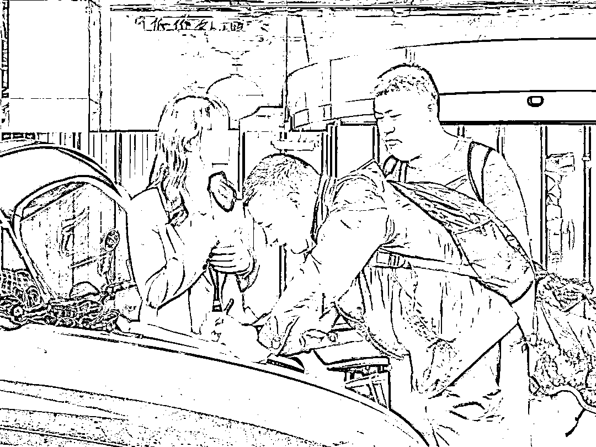

# 猎艳近百人！这个“白马王子”不简单…

> 原文：[`mp.weixin.qq.com/s?__biz=MzIyMDYwMTk0Mw==&mid=2247530022&idx=7&sn=ea0d10b8b945c20d570de65e68db3601&chksm=97cbbd1ea0bc340885205a4a665505de75214f9e78286011cc869570a19932e1160d42d78768&scene=27#wechat_redirect`](http://mp.weixin.qq.com/s?__biz=MzIyMDYwMTk0Mw==&mid=2247530022&idx=7&sn=ea0d10b8b945c20d570de65e68db3601&chksm=97cbbd1ea0bc340885205a4a665505de75214f9e78286011cc869570a19932e1160d42d78768&scene=27#wechat_redirect)

初中文化今年 38 岁 3 个孩子的父亲却凭借“勤奋好学”成功俘获了**数百名女子的芳心**

近期，宜昌市公安局三峡坝区公安分局侦破一起以婚恋交友为幌子的电信网络诈骗案。**嫌疑人何某获有期徒刑 11 年 6 个月，罚金 3 万元。同时，追缴违法所得 54 万余元。**

****

32 岁的 L 女士在宜昌市某宾馆务工，此前曾在某婚恋交友平台注册会员。2019 年 8 月 14 日，L 女士与男子“翟颜清”在交友平台相识，对方自称是外科医生，博士研究生毕业，在杭州有房。

网上交往中，L 女士收到了“翟颜清”发来的自拍照，是一个眉清目秀的帅哥。

经过一段时间聊天，彼此更加熟悉后，L 女士觉得“翟颜清”**说话有涵养，声音有磁性，普通话标准，有问必答拿捏分寸到位**，两人非常投缘，他就是自己心中的白马王子。

↑民警赴黄冈市抓获嫌疑人何某

网恋期间，“翟颜清”开始找 L 女士借钱。刚开始说是还房贷，L 女士当即转去了 3500 元。此后一年的时间里，对方又以进修、还信用卡、请客吃饭等各种理由，**陆续找 L 女士借了 10 万余元。**

每当 L 女士提出视频聊天时，“翟颜清”就会以工作性质不方便为由拒绝；要求去杭州见，对方先答应，又以家中有事为由拒绝；要求他来宜昌见面，对方借口疫情原因无法成行；要求发一些工作照，对方就在网上下载杭州某医院的图片予以搪塞。

2020 年 5 月，L 女士感觉这个“男友”不靠谱，要求“翟颜清”偿还债务。**没想到对方原形毕露，在电话中辱骂李女士及其家人**，威胁不准报警，否则暴力攻击其家人。L 女士这才发觉被骗，赶紧报了警。

********

接到报警后，警方判断，**这是一起典型的以婚恋交友为幌子的电信诈骗案。**

三峡坝区公安分局刑侦民警周建、田杰敏对此展开侦查，通过受害人提供的证据进行梳理摸排，确定嫌疑人是黄冈市蕲春县的何某。

↑民警发短信与受害人沟通交流

起初，警方认为是团伙作案，骗局背后有个电信诈骗窝点。经一周反复排查，最终确定系何某单独作案。

经调查，何某初中文化程度，已婚，夫妻均无工作，育有 3 个孩子。

两口子都没有工作，哪来的钱养儿育女、满足家庭日常开销？何某落网后，民警在他的手机里找到了答案。

从 2017 年起，何某给自己冠上了工程师、大学教师、医生、律师等身份，在各婚恋平台广泛“撒网”，数年间，共有 102 名来自全国各地的网上“女友”给他转钱，少则几百元，多则上万元。

除每天在网上寻找新目标外，何某同时利用多个手机微信号，在众多“女友”中周旋，维护彼此“感情”，以达到骗财的目的。

何某落网后，并不承认自己的行为涉嫌诈骗，还想通过花言巧语忽悠侦查员。

**“我们是谈朋友”、“借贷关系，顶多是民事纠纷”、“这些钱以后要还的”……**

再狡猾的“狐狸”也斗不过“猎手”。

**“你找女方借钱后，连对方姓名都不记得，怎么还别人的钱？你是有家室的人，还答应双方见父母结婚？”**民警接连逼问，何某无法自圆其说，沉默不语。

************

102 名受害人，受骗总额 54 万余元，找到她们取证，至关重要。“不仅可以促使何某认罪，还要对她们进行反诈宣传，提高防范意识。”周建说。

办案民警在一一联系、核实时，部分受害人出于保护隐私或担心名誉受损，不愿配合工作，还有人将办案民警误认成何某的同伙，给后续工作带来了诸多麻烦。

民警周建、田杰敏、张永振等人没有气馁。因为受骗女子遍布全国各地，一个多月时间，他们三下深圳、二上南京，行程几万公里，开始了漫长又艰辛的取证路。

↑民警赴外地寻找受骗女子取证

深圳 D 女士被何某诈骗 6666 元，民警多次与其电话联系，被误认成骗子，直到在当地公安民警陪同下登门拜访，才顺利完成任务。

事后，**D****女士以《赶路人》为题写下感谢信。**

**赶路人**

他们衣着极其朴素，衣服前胸后背有星星点点湿透的汗印，口罩的鼻尖处也湿透，他们背着重重的资料包，里面有文件、电脑、打印机、打印纸……

年长的警官（约 50 岁）单肩挂着行李包，压弯了腰……马上进入办案状态，请求所需桌椅，一刻也不浪费。结束后，他们急忙要赶往下一个地方，一一取证，只为让诈骗者绳之以法，判其该承担的刑罚……100 多名受害人，来自全国各地，像我这样不配合的，他们都耐心的攻克下来……                                  D 女士

通过扎实的取证，何某受到了应有的处罚。

****************

仅有初中文化的何某，是怎样骗到 102 名女子的？受害人中不乏高学历行业高管、成功的私企老板等。除自身防范意识不足，是否还有更深层次的原因？

在办案民警印象中，何某不仅有缜密的思维、伶俐的嘴，还在作案过程中**随时“备课”**。例如，何某在与教师职业的女性聊天时，会在网上查询关于“教师”的最新行业新闻，以显得自己博学多才。

为达到骗人的目的，何某还专程到外地**花钱学习“不良 PUA”的课程**，即学习如何用情感欺骗和心理操控女性的套路。

该套路从伪造身份，聊天话题选择，女生行为语言背后的心理分析，到每个阶段应该进行哪些步骤，都有一套完善的“理论”。一般会**构建一个****完美的“人设”**吸引女方上钩，工作、学历、朋友圈内容全是假的，平时抛出的段子也可能是提前背好的模板。

网络是个虚拟世界，在没有见到对方、不了解对方真实身份的情况下，**一定要当心“网络爱情”骗局**。

骗子之所以会“骗”，主要是语言功夫，凭借花言巧语博得受害人信任，因此，**不要盲目相信素未谋面之人，不要被对方花言巧语所迷惑**，**尤其是涉及到转账等财务问题，更是要格外小心**。

来源：平安宜昌、湖北省反诈骗中心、阻击诈骗

← 向右滑动与灰产圈互动交流 →

