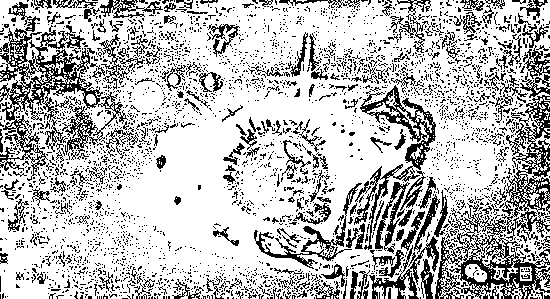

# 诈骗、洗钱…管它什么“元宇宙”，捂紧钱包才是硬道理！

> 原文：[`mp.weixin.qq.com/s?__biz=MzIyMDYwMTk0Mw==&mid=2247530022&idx=8&sn=714075cc83d3971f7c444b8286dfa802&chksm=97cbbd1ea0bc3408fa1010d0d0839b6ef34d7f966f17a915c6966237095be427252344fe4417&scene=27#wechat_redirect`](http://mp.weixin.qq.com/s?__biz=MzIyMDYwMTk0Mw==&mid=2247530022&idx=8&sn=714075cc83d3971f7c444b8286dfa802&chksm=97cbbd1ea0bc3408fa1010d0d0839b6ef34d7f966f17a915c6966237095be427252344fe4417&scene=27#wechat_redirect)

****

**处置非法集资部际联席会议办公室 18 日发布《关于防范以“元宇宙”名义进行非法集资的风险提示》。**

**风险提示指出，近期，一些不法分子蹭热点，以“元宇宙投资项目”“元宇宙链游”等名目吸收资金，涉嫌非法集资、诈骗等违法犯罪活动。包括编造虚假元宇宙投资项目，打着元宇宙区块链游戏旗号诈骗，恶意炒作元宇宙房地产圈钱，变相从事元宇宙虚拟币非法谋利等。**

**值得注意的是，不仅利用“元宇宙”非法集资、诈骗的风险被提示，作为“元宇宙”核心要素的 NFT，近期也被多方提示其潜藏洗钱风险。韩国金融监督局近期表示将加强对 NFT 和元宇宙等新兴市场企业 IPO 的核查。美国财政部也发布报告专门提示 NFT 可能会带来新的风险,尤其是开展洗钱和恐怖融资方面的风险。**

**多重风险下，近期元宇宙概念股也连连受挫。2 月 18 日，港股元宇宙概念股跳水，快手跌近 5%，商汤跌 3.75%，哔哩哔哩跌 3.2%，泡泡玛特跌 2.5%。“元宇宙第一股”Roblox 近日也因业绩不及预期单日大跌 26.51％。**

****元宇宙概念股跌跌不休****

**“元宇宙”概念近期在股市连连受挫。**

**2 月 18 日，港股元宇宙概念股跳水，快手跌近 5%，商汤跌 3.75%，哔哩哔哩跌 3.2%，泡泡玛特跌 2.5%。**

**美国当地时间 2 月 15 日盘后，有“元宇宙第一股”之称的游戏公司 Roblox 发布最新财报。由于业绩不及预期，该公司股价大跌，次日收盘跌幅达 26.51％。当天该公司市值蒸发 114 亿美元，约合 722 亿人民币。**

**四季度财报显示，该公司期内收入为 5.68 亿美元，按年增长 83%，但净亏损进一步扩大至 1.43 亿美元，远高于 2020 年同期的 5870 万美元。从全年数据来看，2021 年，Roblox 全年营收为 19.2 亿美元，按年增长 108%，净亏损高达 4.9 亿美元。**

**押注元宇宙的 Facebook 母公司 Meta Platform，于美东时间 2 月 2 日发布其 2021 年第四季度财报。因业绩显著低于市场预期，美东时间 2 月 3 日，Meta 股票开盘大跌，截至当日收盘，股价暴跌 26.39%，至 237.76 美元，创下 2012 年该公司上市以来的最大单日跌幅。**

****官方提示“元宇宙”非法集资四大手法****

**处置非法集资部际联席会议办公室 18 日发布《关于防范以“元宇宙”名义进行非法集资的风险提示》。**

**风险提示指出：**

**近期，一些不法分子蹭热点，以“元宇宙投资项目”“元宇宙链游”等名目吸收资金，涉嫌非法集资、诈骗等违法犯罪活动，现将有关手法及风险提示如下：**

**一、编造虚假元宇宙投资项目。有的不法分子翻炒与元宇宙相关的游戏制作、人工智能、虚拟现实等概念，编造包装名目众多的高科技投资项目，公开虚假宣传高额收益，借机吸收公众资金，具有非法集资、诈骗等违法行为特征。**

**二、打着元宇宙区块链游戏旗号诈骗。有的不法分子捆绑“元宇宙”概念，宣称“边玩游戏边赚钱”“投资周期短、收益高”，诱骗参与者通过兑换虚拟币、购买游戏装备等方式投资。此类游戏具有较强迷惑性，存在卷款跑路等风险。**

**三、恶意炒作元宇宙房地产圈钱。有的不法分子利用元宇宙热点概念渲染虚拟房地产价格上涨预期，人为营造抢购假象，引诱进场囤积买卖，须警惕此类投机炒作风险。**

**四、变相从事元宇宙虚拟币非法谋利。有的不法分子号称所发虚拟币为未来“元宇宙通行货币”，诱导公众购买投资。此类“虚拟货币”往往是不法分子自发的空气币，主要通过操纵价格、设置提现门槛等幕后手段非法获利。**

**风险提示指出，上述活动打着“元宇宙”旗号，具有较大诱惑力、较强欺骗性，参与者易遭受财产损失。请社会公众增强风险防范意识和识别能力，谨防上当受骗，如发现涉嫌违法犯罪线索，请积极向当地有关部门举报。**

****元宇宙游戏和房产炒作一度火爆****

**去年以来席卷全球的“元宇宙”浪潮始于 Roblox 在纽交所上市，这家头顶“元宇宙第一股”的游戏公司上市首日股价从 45 美元涨到了 70 美元，市值突破 400 亿美元。此后一段时间“元宇宙”仿佛点金石，A 股市场也曾一度掀起相关概念股的热潮，多支元宇宙概念股连续涨停。元宇宙相关标的也成为一级市场投资人们的“香饽饽”，有关项目被迅速孵化，以图在最短时间登陆资本市场分得一杯羹。**

**在“元宇宙”概念被火爆炒作的同时，对其质疑、争议也一直存在。上述风险提示中提到的打着元宇宙区块链游戏旗号诈骗，恶意炒作元宇宙房地产圈钱，变相从事元宇宙虚拟币非法谋利等现象在去年以来的炒作风潮中较为典型，其中不乏一些明星项目。**

**如风险提示中提到的，“打着元宇宙区块链游戏旗号诈骗”，这类骗局的套路一般是宣称“边玩游戏边赚钱”“投资周期短、收益高”，诱骗参与者通过兑换虚拟币、购买游戏装备等方式投资。**

**这类项目往往以“GameFi”的名义出现。GameFi，即 Game Finance，可以为“游戏化金融”。简单来说，GameFi 指的是将去中心化金融产品以游戏的方式呈现，将 DeFi 的规则游戏化，将游戏道具衍生品 NFT 化。其最显著的特点就是用户的资产成为了 DeFi 游戏中的装备或工具，反过来，用户在参与游戏过程中可以获得收益或奖励。**

**去年 12 月，央视曾曝光一起元宇宙区块链游戏骗局。报道称，无论是何种形式的元宇宙区块链游戏，都需要用户将人民币兑换为 USDT 这种虚拟币，再兑换成该游戏所使用的虚拟币。而所谓“虚拟货币”，本质上是一种未经批准非法公开融资的行为，涉嫌非法发售代币票券、非法发行证券以及非法集资、金融诈骗、传销等违法犯罪活动。**

**该报道还指出，网络上鼓吹的“元宇宙链游”，只是借着元宇宙概念炒作推广的骗局。许多区块链游戏本质是款网页小游戏，开发成本很低，对外宣传可以理财赚钱，其实只是拿后入场的人支付的资金来填补窟窿。**

**炒作元宇宙房地产是另一个典型现象，其中最具代表性的是虚拟世界社区 Decentraland。该社区用户可开发及拥有土地（LAND）、艺术品和非同质化代币（NFT），成员亦可参与平台的分布式自治组织（DAO）。而据相关宣传，LAND 的拥有者，也就是地主，能够完全控制自己创建的内容环境和应用，小到一个静态的 3D 场景，大到具有更多交互功能的应用或游戏。LAND 还可以进一步形成主题社区，从而形成多样的兴趣部落和具备丰富用途的共享空间。**

**不断刷新的“天价”和明星人物的购买，让该类元宇宙房产保持着热度。去年底，Decentraland 上的一块虚拟土地以价值近 240 万美元成交，虚拟游戏平台 Sandbox 上的一块虚拟土地以 430 万美元(约 2739 万人民币)的价格售出，创下了“元宇宙”房地产交易价格的新纪录。林俊杰、余文乐等娱乐圈明星也大手笔购入虚拟房产，林俊杰称自己买了 Decentraland 平台上的三块虚拟土地，花费约 12.3 万美元。**

****多方提示 NFT 洗钱****

**值得注意的是，不仅利用“元宇宙”非法集资、诈骗的风险被提示，作为“元宇宙”核心要素的 NFT，近期也被多方提示其潜藏洗钱风险。**

**韩国金融监督局（FSS）近期表示将加强对 NFT 和元宇宙等新兴市场企业 IPO 的核查。FSS 在最新发布的年度工作计划中宣布，将加强对包括 NFT 在内的新交易资产的监控。FSS 表示，将针对快速增长的数字资产市场中对消费者造成损害的因素制定对策。**

**美国财政部近期发布《通过艺术品交易开展洗钱和恐怖融资的研究》报告，将 NFT（非同质化代币）归类于新兴在线艺术品市场，并指出该市场可能会带来新的风险。报告将 NFT 定义为底层区块链上的数字单位或代币，代表了图像、视频、音频文件和其他媒介形式的所有权，或物理资产、数字财产的所有权。报告指出，NFT 可用于进行自我洗钱。犯罪分子可以用非法资金购买 NFT 并与自己进行交易，以在区块链上创建销售记录；然后，NFT 将被出售给一名不知情的个人， 罪犯将从后者与犯罪无关的干净资金中获利。**

**报告指出，NFT 类数字艺术品也有可能在没有中间商的情况下进行点对点交易，这些交易也有可能不会被记录在公共分类账上。这些数字艺术品本质上要比传统艺术品易于交易；在多数情况下，交易方不用实际移动艺术品或支付运输服务相关的费用，比如保险、运输成本或关税；数字艺术品能够通过互联网转移，而无需担心地理距离和跨国境。“这使得数字艺术品很容易被那些寻求洗钱的不法分子所利用，因为其价值的转移不会招致金融监管或实物运输管理方的调查。”报告称。**

**区块链分析公司 Chainalysis 也在近期的报告中指出，NFT 市场中的洗售交易（wash trading）值得关注。**

**洗售交易是指，投资者同时出售和购买相同的金融工具，以在市场中对该产品的价值和流动性造成误导性，人为地创造交易的虚假繁荣。“NFT 的洗售交易方式是卖家将某个 NFT 出售给原始拥有者控制的新钱包，使其显得更有价值。” Chainalysis 指出，从历史上看，洗售交易一直是加密货币交易所试图让交易量看起来比实际更大的一种手段。**

**北京大成律师事务所合伙人肖飒认为，目前看来，利用虚拟货币进行洗钱较具有普遍实用性，一些相对来说数额不大的赃款利用虚拟货币进行洗钱或者逃避监管是更加行之有效的选择。而利用 NFT 进行洗钱要困难和复杂的多，但其背后的赃款却也更加隐蔽和牵涉的利益也更加巨大。**

**“虚拟货币洗钱像是阴谋，而 NFT 和艺术品洗钱更像是阳谋。在利用艺术品进行洗钱的过程中，赃款持有者完全可以以真实身份全程参与，匿名性对其而言似乎可有可无，正呼应了 NFT 现如今伪匿名性的特点。”肖飒表示。**

**来源：证券时报，巴蜀反诈**

****

**← 向右滑动与灰产圈互动交流 →**

****