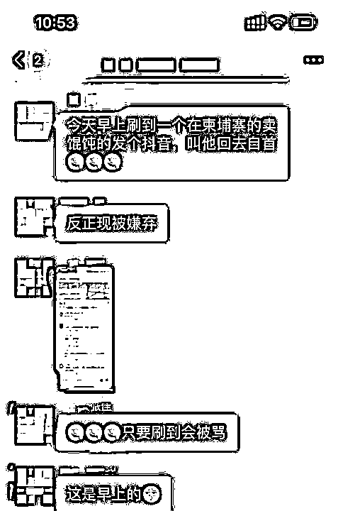
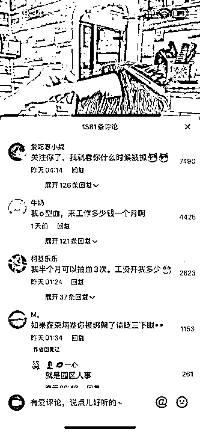
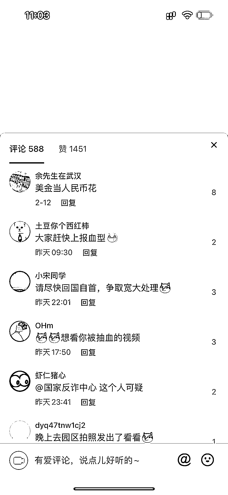
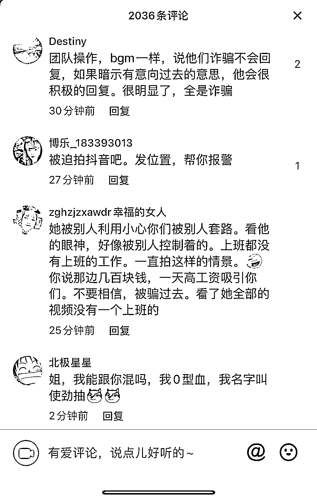
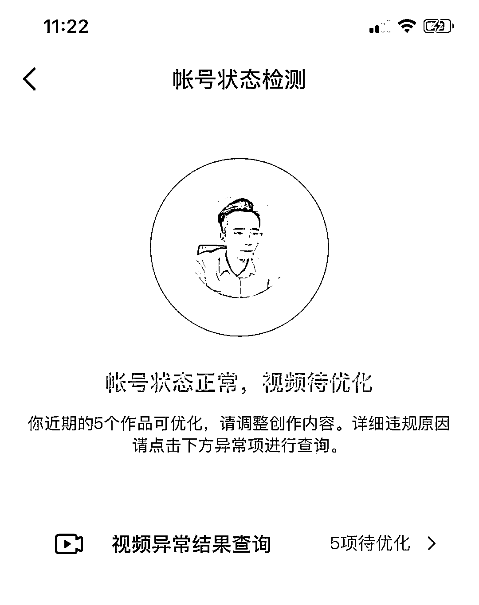
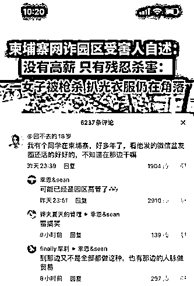

# “血奴”事件热度节节攀升，柬埔寨的抖音网红们被“网暴”了……

> 原文：[`mp.weixin.qq.com/s?__biz=MzIyMDYwMTk0Mw==&mid=2247530112&idx=1&sn=bdd83fe1ea019385a9513bf10cd756f4&chksm=97cbbdb8a0bc34aebeb39612baf2bafd7b06ccd01ae06ebee20433a841d9143cc8fe77ddf2fe&scene=27#wechat_redirect`](http://mp.weixin.qq.com/s?__biz=MzIyMDYwMTk0Mw==&mid=2247530112&idx=1&sn=bdd83fe1ea019385a9513bf10cd756f4&chksm=97cbbdb8a0bc34aebeb39612baf2bafd7b06ccd01ae06ebee20433a841d9143cc8fe77ddf2fe&scene=27#wechat_redirect)

“血奴”事件自发生以来，持续受到国内媒体的强烈关注，继多次登上今日头条和抖音热榜后，《南方周末》、《封面新闻》等也纷纷发稿

近日，央视财经频道也报道了这一事件，中国驻柬埔寨大使馆也表示已立案，中柬警方将协同办案，力争尽快破案！

所有关注此事件的人都为之愤怒，如今的时代竟还有如此丧尽天良之事，也让原本不认识柬埔寨的人，以这样的方式认识了它，一时间，柬埔寨在国内臭名昭著，而在这里正经工作生活的中国人，也无端遭受到攻击。

**他们遭遇“网暴”**

自从“血奴”事件在国内热度不断攀升，越来越多的人关注到这一事件后，或许是太过愤怒，国内的网友们纷纷将抖音上在柬埔寨的博主喷了个遍。

**近日来，只要是在柬埔寨的抖音账号，稍微有些流量的人，评论区基本都已经沦陷**。

不少抖音博主无辜躺枪，评论数基本和点赞数持平。

比如抖音“柬埔寨小 6”发布的最新一期视频中点赞数 1658，评论就有 1581 条，**而且高赞评论的内容基本都是“关注你了，我就看你什么时候被抓”、“我 O 型血，来工作多少一个月啊”“我半个月可以抽 3 次血，工资开我多少”、“如果在柬埔寨你被绑架了请眨三下眼。**”

甚至直接有人说他是园区人事。

有网友偏执的认为在柬埔寨还发视频的就是给网投做人事，帮忙宣传拉人头到柬埔寨。

除了柬埔寨小 6 外，迪迪周的视频底下也是骂声一片，网友们似乎把对犯罪分子的愤怒，全部转嫁到了每一个在柬埔寨工作的人身上。

迪迪周在接受柬埔寨头条采访时表示：“最近几天收到很多恶评，还有私信谩骂的，我理解大家是因为对这件事很愤怒，我们也很愤怒，但被无差别攻击真的很冤。”

[`mp.weixin.qq.com/mp/readtemplate?t=pages/video_player_tmpl&action=mpvideo&auto=0&vid=wxv_2275846309196726284`](https://mp.weixin.qq.com/mp/readtemplate?t=pages/video_player_tmpl&action=mpvideo&auto=0&vid=wxv_2275846309196726284)

据了解，迪迪周目前来柬埔寨一年多，当初之所以选择来柬埔寨，是因为有一家公司邀请她到柬埔寨来合作自媒体，先是来考察，后来因为疫情一直滞留在这里，买过三次回国机票都被取消了。

迪迪周给自己账号的定位是生活类博主，分享在柬埔寨的美食、美景和人文，平常也参加一些公益活动，她以分享生活为主旋律，但她万万没想到，记录生活也被人骂，还有人疯狂在她的视频下@反诈中心，甚至喊话让警察抓人。

对此，迪迪周表示很无奈，在柬埔寨的这一年多，除了做自媒体人，她也和一家媒体公司合作进行采访，主要采访一些中柬政要，传递正向的中国力量。

但她也很坦然，她说：“**网友绝大多数都是出于愤怒，也有人是纯粹的键盘侠，他们不是针对我一个人，是针对所有在柬埔寨的中国人，这是有偏见的，他们说的事情我没做过所以我很坦然，但我不想每一个在柬埔寨的人都被打上标签。像我这样的自媒体人尚且能为自己发声，但那些被误解的普通人呢，他们只能默默承受。我希望大家能理性看待，不要一杆子打死所有人**。”

抖音上文案出现雷同

迪迪周说：“**柬埔寨是泾渭分明的，有一大批在这边正经工作的中国人，在这边生活工作的人早已经练就了自己的生存法则，而我自己也只是专注于分享，那些负面的东西一方面是自己不想去接触，另一方面是接触不到。**”

“其实我自己无所谓，但是我怕家人看到伤心，我发的每条视频，他们都会看。”

另外一名抖音名叫周 sir 在柬埔寨的中国人，也同样被喷击，他说：“视频都被喷下架 5 个了。”

而他实际上是建筑公司的，平常视频中也会展示工作的场景，但是依然遭到了无差别攻击。

此外还有多名在柬埔寨用抖音记录和分享的人士也遭到无差别攻击，还有很多普通的工作者被身边的家人朋友误解和质疑。

**他们被误解**

柬埔寨被越来越多的人知道后，但凡在柬埔寨工作的人，多多少少都会受到牵连，被误解、被质疑，熟悉的家人朋友会比较理解，但也会觉得柬埔寨太不安全，让尽快回去。

但是不熟悉的人，就会多有猜疑，甚至直接有网友公开评论称：“我有个同学在柬埔寨，好多年了，看他发的微信盆友圈还活的好好的，不知道在那边干嘛”

诸如此类的误解还有很多，**一名在柬埔寨从事地产行业的中国人表示，国内的朋友都在劝她回国，担心她在柬埔寨的安全，她对此表示十分感谢和理解，但她希望大家能客观的看待柬埔寨，恶性事件确实有，但全靠自己的圈子，并且表明自己不会去灰产**。

最后她说：“我在柬埔寨一切安好，请国内朋友们放心。”

一名在柬埔寨多年的华商表示：“**这件事发展到最后，就是所有在柬埔寨的人都会受到影响，但这是大家必须经受的，打击非法犯罪无论付出多大的代价，都应该支持，我们必须从长远发展的角度看问题，社会的毒瘤不除，在柬中国人的投资经商环境也只会越来越差。**”

柬漂生活实属不易，目前正常在这边经商、工作生活的人，都滞留在这里，航班稀少，票价昂贵，辛苦打工的钱不舍得买高价机票回国，但是每次遇到有同胞帮助时，他们又积极伸出援手，捐款捐物积极献血救人。

希望国内的网友们能理性发声，我们需要严惩的是始作俑者，而不是普普通通生活的人们。

**此前报道：**

**[“血奴”事件登上中国热搜](http://mp.weixin.qq.com/s?__biz=MzIyMDYwMTk0Mw==&mid=2247529838&idx=4&sn=4a964e1d46b24649457693b324928e58&chksm=97cbbe56a0bc3740b78e74a5a241b191ffc132ef603b593fe3fee1a50aeb9f199d8ea3a05b95&scene=21#wechat_redirect)**

**[从“血奴”身上抽出来的血，去了哪里？](http://mp.weixin.qq.com/s?__biz=MzIyMDYwMTk0Mw==&mid=2247529890&idx=1&sn=d14992d5536c7d32c114d35a1f879477&chksm=97cbbe9aa0bc378c6e9ea328c77389ee308e276ae5888167262313e367e9b292fe9dfc57be91&scene=21#wechat_redirect)**

**[柬埔寨“血奴”事件牵出 58 同城：大量网友被骗，有人招聘马仔贩毒](http://mp.weixin.qq.com/s?__biz=MzIyMDYwMTk0Mw==&mid=2247530022&idx=3&sn=2b937b715241a4ada98132f4d1598e9f&chksm=97cbbd1ea0bc3408e7013dc16c0db012048a5e10c572e58411c00ed8cc14019d63f78ea87f26&scene=21#wechat_redirect)**

**[“血奴”之后，他们从柬埔寨获救，最小 14 岁](http://mp.weixin.qq.com/s?__biz=MzIyMDYwMTk0Mw==&mid=2247530022&idx=4&sn=99ec46895d346e5acdbd03f935bc1996&chksm=97cbbd1ea0bc34086813e0f47a6b2e55fc8a001ba9e8fc42a18a63742b59e74ab017ddb41d9d&scene=21#wechat_redirect)**

来源：柬埔寨头条，柬埔寨圈儿

← 向右滑动与灰产圈互动交流 →

