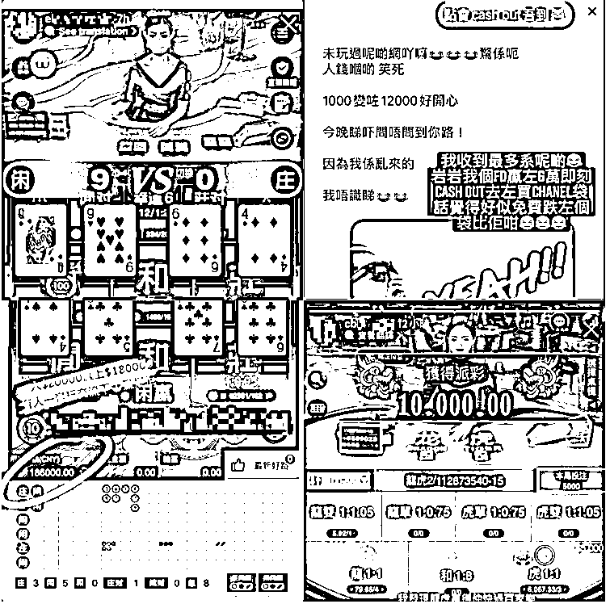
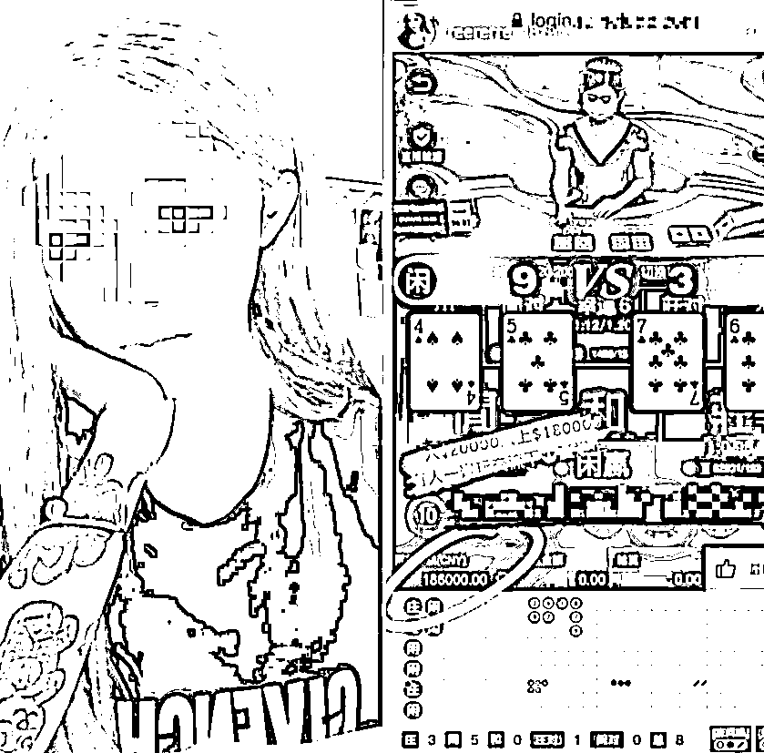
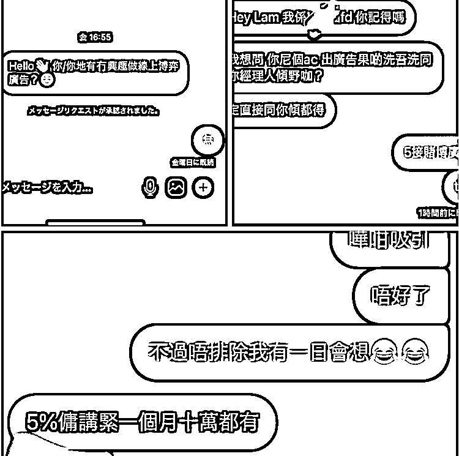
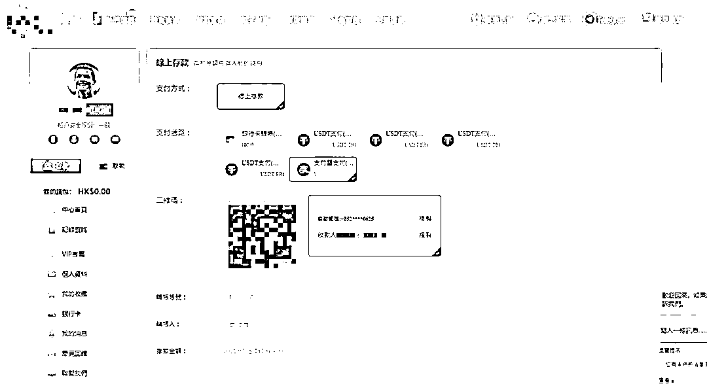
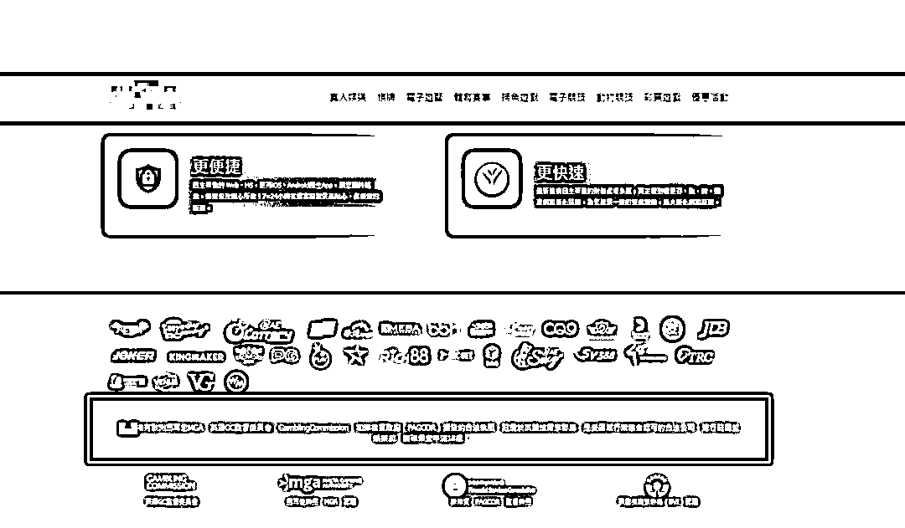
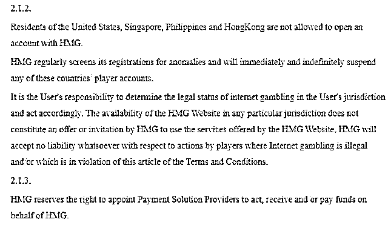

# 香港网红高调为境外网赌做宣传，有人称两日吸引近 800 万投注

> 原文：[`mp.weixin.qq.com/s?__biz=MzIyMDYwMTk0Mw==&mid=2247530112&idx=2&sn=265e30e7b881adb4a69ca738922eda52&chksm=97cbbdb8a0bc34ae168140552bffa4e47dd2c227b4c56cc172fd7b95c6bfd084b837104d803b&scene=27#wechat_redirect`](http://mp.weixin.qq.com/s?__biz=MzIyMDYwMTk0Mw==&mid=2247530112&idx=2&sn=265e30e7b881adb4a69ca738922eda52&chksm=97cbbdb8a0bc34ae168140552bffa4e47dd2c227b4c56cc172fd7b95c6bfd084b837104d803b&scene=27#wechat_redirect)

据香港媒体《香港 01》报道，近期发现多名网红高调在社交媒体宣传外围网上赌场，更有人自爆两日吸引了近 800 万元投注额。

有曾被网上赌场邀请协助宣传的 KOL 透露，此类报酬比其他广告报酬高逾六倍，更可按投注额抽佣。

香港律师指出，宣传外围网上赌场，也属于犯罪，一经定罪，最高可处罚款 500 万元及监禁 7 年。

多名香港网红宣传网上赌场

**网红每日宣传，更声称吸引数百万投注额**

澳门赌厅太阳城和德晋的负责人周焯华、陈荣炼，先后被澳门司警拘捕，之他们涉嫌不法经营赌博和洗黑钱，内地起诉书亦指两集团非法经营网上赌博。在香港，经营或参与网上赌场同样犯法，但网上赌场的宣传却愈来愈猖狂。

《香港 01》收集到至少 10 名网红，在 ins 上宣传网上赌场，有人几乎每日会出至少一条动态，有用家分享，亦有传授嬴钱秘技，**更有人称两日吸引了近 800 万元投注额**。

网红发布的网上赌场动态

一拥有十万多粉丝的网红，几乎每日都会发表与网上赌场赌博有关的限时动态，如“以小博大”、“入$20,000 赢$180,000”等。

《香港 01》记者致电该网红，她先称无参与赌博，“只系玩分，无入过钱”，但记者追问她曾提及赢钱、入钱，她反问“咁关你咩事呢？你咪报警啰！”

**网红素海霖曾被赌场招揽可抽佣 5%**

在 Ins 约有一万粉丝的网红素海霖，近半年收到多个网上赌场邀请其协助宣传，“每出一个限时动态就有 3,000 元。

只需要截图打几个字，说自己轻轻松松又赢钱，比拍摄其他广告，付出的时间和心机少很多。”她直言报酬比其他广告商高三至六倍。

她透露，更有网站以三万元底薪邀请她每日在社交媒体上宣传，如成功吸引玩家进行赌注，更可获得其投注额的 5%佣金，最高每月可以有达十万元报酬。

以她观察，网上赌场会集中找一些“穿着得比较性感、多人睇”的人作宣传，目的是想吸引男性客人成为玩家。她坦言曾心动，但怕犯法而作罢。

素海霖近半年收到多个网上赌场邀请其协助宣传，报酬比其他广告商高三至六倍 （受访者提供）

**可用香港本地银行转账**

这些网上赌场，玩家要登记真实姓名，并以支付宝或香港银行卡转账，最低存款额普遍为 100 港元，赌场亦会要求玩家绑定银行卡以方便存款及取款。

部份接受赌资的转数快户口，以电话号码登记，记者尝试致电，但未能接通。

网上赌场可以支付宝或香港银行卡转账，最低存款额普遍为 100 港元。（赌博网站截图）

**声称拥有多国赌牌，马耳他否认**

部分网上赌场网站声称自己拥有海外赌场的合法执照，如欧洲马耳他博彩管理局牌照、英国博彩监督委员会牌照和菲律宾娱乐和博彩牌照，又指自己是受国际行业协会认可的合法公司。

马耳他博彩管理局回覆查询指，相关网站并未获得博彩管理局任何认可，亦从未授权网站使用其标志；其余两间签发牌照机构则暂未有回覆。

网上赌场网站声称自己拥有海外赌场的合法执照。（赌博网站截图）

**英文版禁止中国香港居民开户，中文版无说明** 

部份网站的英文版本有列明，美国、新加坡、菲律宾和中国香港居民不得在网站开设账户，并指网站会定期检查其注册异常情况，并将立即无限期暂停此些国家、地区的任何玩家账户，但中文版则无相关资讯。

这些网站亦隐藏注册公司的资料，亦无联络方法，难以追查由哪些赌场或财团营运。

部份网站的英文版本有列明，美国、新加坡、菲律宾和香港居民不得在网站开设账户，但中文版则无相关资讯。（赌博网站截图）

**在港收受赌注属非法赌博，律师：宣传亦涉协助教唆**

上述网上赌场，并无获得香港政府发牌。

大律师陆伟雄表示，即使相关网上赌场在海外设立公司及有当地的赌牌，但只要赌场有接受玩家在香港下注，不论是收受赌注者或是下注者，都有可能违反香港《赌博条例》：**“你在香港对着电脑落注，整个行为就是在香港进行一个赌博活动，那一定不行。**”

根据《赌博条例》的「有关赌博及奖券活动的罪行」，一经定罪，最高可处罚款 500 万元及监禁 7 年。

部份网上赌场网站，接受本港银行转账，部份是个人账户，陆伟雄直言，即使是只负责收受赌注、没有营运赌场，都算违法。

至于出广告宣传单 KOL 有无法律责任呢？陆伟雄表示，只要他的目的是鼓励了别人参与网上赌博，亦属于协助教唆。**根据《赌博条例》的“推广或便利收受赌注”，一经定罪，最高可处罚款 500 万元及监禁 7 年**。

香港警务处回复指，警方不时会进行网上巡逻，搜集是否有非法赌博活动于网上进行。如发现违法行为，警方会进行调查及作出执法行动，而去年首 11 个月月因涉及非法赌博罪行而被警方拘捕的人数有逾 5,211 人，较过去三年的数字多，但未有细分多少为网上赌场数字。

来源：我在柬埔寨

← 向右滑动与灰产圈互动交流 →

