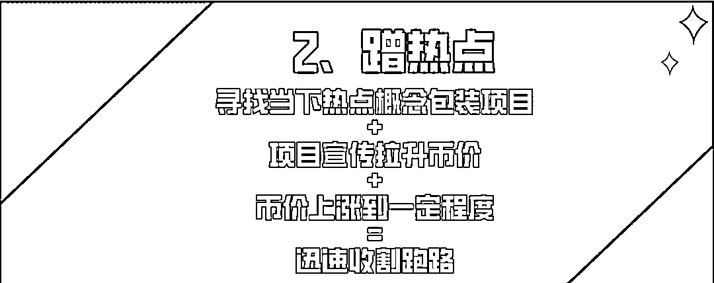

# 随随便便收割上亿，这些跑路的土狗项目都是怎么忽悠你的？

> 原文：[`mp.weixin.qq.com/s?__biz=MzIyMDYwMTk0Mw==&mid=2247530112&idx=3&sn=ce1eca0e7c3b784342c93e846ea6607a&chksm=97cbbdb8a0bc34ae35c68e240c2586a0f78b24a74654f1c017698271987bf03e9450b0cb0a6c&scene=27#wechat_redirect`](http://mp.weixin.qq.com/s?__biz=MzIyMDYwMTk0Mw==&mid=2247530112&idx=3&sn=ce1eca0e7c3b784342c93e846ea6607a&chksm=97cbbdb8a0bc34ae35c68e240c2586a0f78b24a74654f1c017698271987bf03e9450b0cb0a6c&scene=27#wechat_redirect)

前有“保时捷”半个月卷款 1.6 亿跑路，后有邀苍井空站台的泰迪币（TeddyDog）项目在预售阶段筹集约 1508 万人民币后砸盘跑路，再有各种蹭元宵晚会热点的项目在元宵晚会后纷纷暴跌……上一瞬间以为自己要暴富了却在下一个瞬间就被项目方捐款跑路了，已成为币圈“韭菜人”的真实写照。那这些卷款跑路的土狗项目都是怎么忽悠用户的？

**1 “卷款跑路”成虚拟货币诈骗新趋势**

**据国外机构 Chainalysis 的一份报告指出，2021 年加密货币犯罪涉及金额高达 140 亿美元，诈骗案件造成的损失高达 78 亿美元，同比增长了 82%。**而导致诈骗损失增加的很重要一个原因就是 Rug pulls 的出现，也就是我们所说的项目方卷款跑路。****

**2021 年诈骗损失金额中**有超过 28 亿美元的损失来自于 Rug Pull 的行骗方式**，占比 36%，而在 2020 年仅占 1%。**

****

****2 常见的土狗项目忽悠套路****

********

******“明星效应”是不少项目包装行骗的惯用招数之一。**邀请名人、明星来为项目推广，**利用名人、明星的自身流量吸引大量投资者入坑**，最终割韭菜跑路。****

********

****例如最近一个叫 Teddy dog（泰迪币）的跑路项目，邀请日本女优明星仓井空为其站台，吸引了大量粉丝购买，币价疯狂上涨，上涨的币价又吸引了更多的用户疯狂入坑。在大量用户入金后，巨额大单砸盘，币价一夜暴跌，项目方卷款数千万跑路。****

******提醒：**即使是名人、明星代言或者站台的项目也要保持清醒冷静，可别一个劲盲目的冲！这些名人、明星可能并不是项目责任人，一旦用户被骗，这些名人、明星并不会对你的损失负责。****

********

******疯狂蹭热点是币圈项目最显著的特征，找一个当下热点概念包装包装，一个项目就出来了。**而如果有一个热点项目成功了，后面必然还会出现一大串类似的项目。****

********

****例如，就因为春晚节目中沈腾说要成为“元宇宙的 Dog King”，就让一个叫 dogeking 的项目爆火，币价立马上涨上万倍，随后还立马爆发了一大批各种“King”的项目。以及碰瓷元宵节晚会的各种“花灯虎、元宵狗、元宵、团圆、卖汤圆、虎哥、冰墩墩……”项目。然而入坑这些蹭热点项目的用户，并没有等来暴涨，却在热点过后等来集体暴跌，再一次被割韭菜。****

******提醒：**信息爆发的时代最不缺的就是“热点”，你以为你坐上了“热点”的快车，抓住了暴富的密码，却不知等待自己的可能是下一刻猝不及防的被割。“热点”总会淡去，保护好自己的资产才是永恒。****

********

******虚假宣传项目有大平台背景或者包装跟大平台相同的项目名称，也是币圈常用的诈骗手法，这样的各类项目也不在少数，让用户误以为项目实力雄厚而入坑。******

********

****例如，卷款 1.6 亿跑路的仿盘 POSCHE 币项目，应该让不少用户都还没缓过神来。币圈人都爱保时捷，那这不 Posche 就来了么，利用人们对保时捷的钟爱情怀，吸引用户入金，在做大池子后，迅速砸盘，从高点 140 美金左右，直接暴跌到最低点 5 美金，1 小时内完成了全部收割，而在价格暴跌之前，资金池中大量资金已经被率先抽走，毫无流动性。****

******提醒：**别以为取了个跟大平台一样的名字就有大平台的背景了！项目方收割用户的时候可不会因为跟大平台相同的名字就手软，反而因为大平台的名气更容易招揽投资者而收割的更多。再说了，你们入金的“POSCHE”可比真正的“PORSCHE”少了个“R”呢！****

******3 土狗项目惯用收割手法******

********1、Rugpull 拉地毯（撤池子）********

******即将币价拉升到了一定程度就开始收割了，项目方利用手里多个账户大量的廉价筹码，将池子里的资金全部撤出，当流动性被撤出的时候，实际上意味着这个币出逃空间被锁死。项目投资者就会因恐慌争相踩踏，最终导致币价归零。******

********2、“貔貅池”只进不出********

******“貔貅池”是只能买不能卖，或者只有白名单可以售卖。只要进场就意味着被成功收割，用户只能只能眼睁睁看着币价上涨却卖不出去。******

********3、走后门（合约漏洞）********

******这个是在一开始就计划好要收割用户的，在项目前期就把漏洞预设好了。后期可以利用代币合约漏洞，可以在代币流通量达到瓶颈时，瞬间增发无数个代币，最终让用户没得玩，只有被割。******

************

********3 写在最后********

******土狗项目为何如此猖獗？**一方面发币的成本低**，可能 10U 就可以发一个币，因此就导致各种项目蜂拥上市；**其次项目方不求一味地将盘子做大**，可能有个几万 U 就可以开始收割了，**收割跑路时间大大缩短**，很多人还没反应过来，可能就已经被割韭菜了；最后因为缺少监管，项目都在链上，**项目方的信息难以查询辨别，即使被收割了，用户也无处维权。********

********越来越多的人因为暴富心理涌入币圈，也正因如此虚拟货币诈骗愈发猖獗，赚钱不易，比起冒险求财，保证自己现下拥有的财产安全更重要，希望不要再有人盲目的陷入这样的骗局吧！******** 

****************

********← 向右滑动与灰产圈互动交流 →********

****************