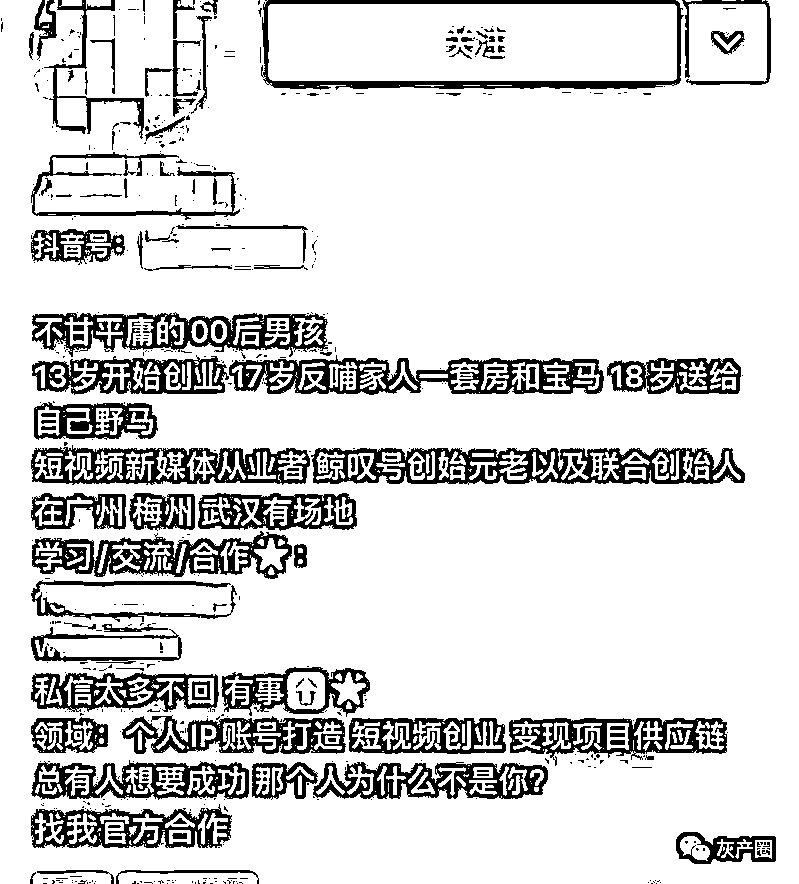
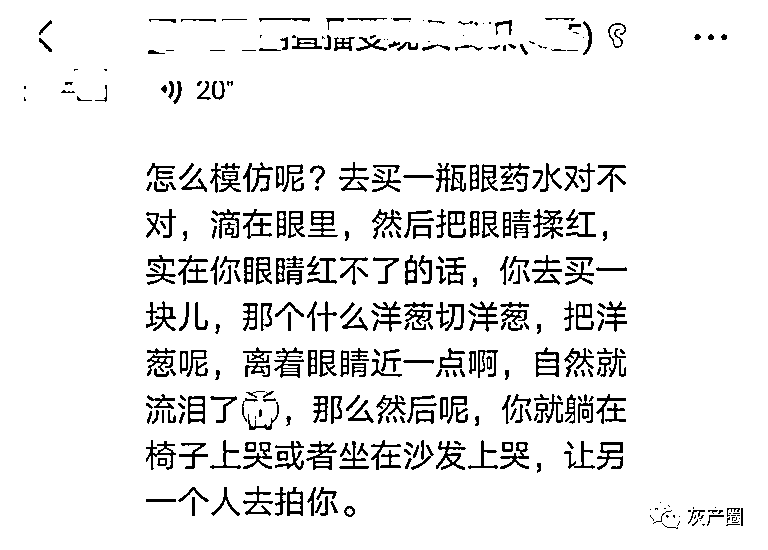
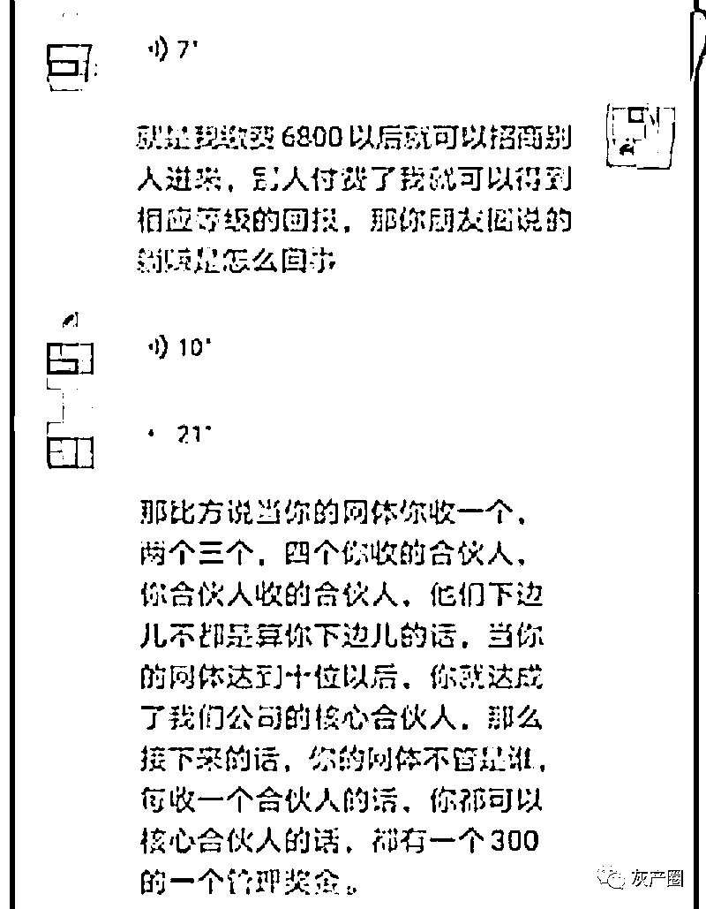

# 5 亿豪宅，199 万“月子”餐，7.5 万总统套房……炫富短视频大调查：拉人头卖课号称月入 30 万，因涉传销被罚！

> 原文：[`mp.weixin.qq.com/s?__biz=MzIyMDYwMTk0Mw==&mid=2247530112&idx=5&sn=29dc8dea6a1688a57b5cb9e998c81751&chksm=97cbbdb8a0bc34ae3d16f3a03a56c741c7af509049c3cd86dea79cc8d40d2de83917c30abdd0&scene=27#wechat_redirect`](http://mp.weixin.qq.com/s?__biz=MzIyMDYwMTk0Mw==&mid=2247530112&idx=5&sn=29dc8dea6a1688a57b5cb9e998c81751&chksm=97cbbdb8a0bc34ae3d16f3a03a56c741c7af509049c3cd86dea79cc8d40d2de83917c30abdd0&scene=27#wechat_redirect)

5 亿元豪宅，199 万元“坐月子”套餐，7.5 万元一晚的总统套房……南都记者调查发现，这类炫富短视频背后并不简单——在攫取网络巨额流量的同时，有公司借机卖起了所谓致富课程，声称能迅速打造热门流量变现，甚至能“保底月入 30 万”“13 岁创业 17 岁就买房买车”。

这些课程往往价格不菲，买断后全靠自学，想回本就必须不断“拉人头”发展下线推销课程，疑似涉嫌传销。此前，有市民向南都报料称遭遇上述套路，矛头指向名为“鲸叹号”的公司。近日，南都记者在“信用中国”官网注意到，市民反映的公司已因涉嫌传销违法行为被罚款 80 多万元。

**一个月还了十几万的负债? 靠贩卖焦虑、炫富吸引下线******

******2020 年 6 月，晓昭(化名)在网络上刷到名为“鲸叹号”的公司成员亚星(化名)的短视频，内容是一个月还了十几万的负债。“后面就看她朋友圈经常炫收入、炫豪车，说加入她们团队的人都赚到了钱。”加微信后，亚星劝说她大力发展合伙人，只要缴纳 6800 元就可以低成本创业，很多加入公司的人最终都改变了命运，机遇错过就不再来了。******

******晓昭介绍，在反复灌输下，她付费 6800 元成为鲸叹号公司合伙人。随后她被拉进了一个培训群，听了几节课后，发现内容都是围绕怎么发展下线、拉合伙人去培训。主要内容有几个部分：一是如何在短视频平台吸引下线、拉人去培训，“所谓的精准粉丝就是我这样想要快速赚钱的‘韭菜’，教的拍摄内容及文案都是贩卖焦虑、炫富、创业翻身”;二是如何在朋友圈炫富、炫豪车，打造创业青年人设;三是成交话术，教授怎么发展下线，以及有人质疑该模式违法犯罪时如何反驳及说服。******

******“一级一级，我上级的上级是个团队长，都是不断发展合伙人。”晓昭称。******

************

******短视频平台上鲸叹号合伙人的介绍：13 岁开始创业，17 岁反哺家人一套房和宝马。****** 

******教人准备眼药水卖惨 称一个月打底收入 30 万******************

******记者通过平台关注鲸叹号一名合伙人，并通过该合伙人购买了 99 元的“必火课程”，不同老师在一个 500 人微信群里通过语音授课，为期 5 天。授课老师除了讲解课程如何拍出有流量的短视频，如何通过炫富获取关注，甚至鼓励发布相同的文案，只是关键词略有改动。“豪车可以不一定是豪车，叫辆滴滴都能火，同样一个场景同一种表现形式，每天换个衣服拍就行了”“前期做账号，为了火，咱们可以不择手段”“卖惨事先准备眼药水或者洋葱”。******

************

******微信群里，授课老师称，拍摄痛哭的短视频可事先备好洋葱和眼药水。****** 

******在直播间讲述课程项目如何变现时，授课老师则直接推荐学员购买不同课程，并称不同项目均可简单复制且快速变现。记者看到，直播间有不少学员付费报名课程，甚至成为合伙人，这时授课老师会截图在群里不断刷屏。但也有学员反映，“今天这节课很不满意，都跑题了”“一步步都要交钱了，跑偏了完全”。******

******授课过程中，不少老师也自称通过拍摄短视频实现了财富自由，如“一个月打底的收入是 30 万”，告诉学员“卖课程，是最好的变现方式没有之一”“变现方式为卖课程卖项目卖服务”。******

******发展 30 人即成市场总监 声称可以“躺着赚钱”******************

******另一报料人林亭(化名)告诉记者，她于 2020 年 3 月被游说交了 12980 元成为合伙人，并享有所有的课程服务。据她介绍，鲸叹号课程有 99 元的热门“必火课程”、998 元的闲鱼带货达人课程、1680 元创作达人等以及交 12980 元成为合伙人招商等。******

******“只有交了 12980 或者 6800 才能有合伙人资质去售卖课程，当你收了几个合伙人，这些合伙人收的合伙人都组成你的网体。当你的网体达到 10 位以后，就能成为核心合伙人;网体达到 50 人就能成为团队长，成为团队长后，这个团队不管发展到多少层级，你都能分一杯羹。但是交 6800 元和 12980 元成为合伙人的抽成比例不一样，后者更高。”******

******林亭称，花 12980 元买断课程后全靠自学，问推荐人课程项目反而一问三不知，自己发的视频也从来没有上过热门，“后来才发现，这个模式想回本就必须继续拉合伙人。”******

******而向记者推销课程的合伙人，也介绍了鲸叹号的整个课程营运：首先，可以通过直播间输出内容卖产品、广告，付费不同课程学习;其次，交 12980 元成为公司合伙人，以售卖课程从中赚取提成。他告诉记者，成为合伙人后有资格去售卖课程，“假设你将该课程用 99 元卖出去后，还能再次 10 元再次复购，中间便赚取差价 89 元，其他课程亦至少有一半及以上的提成。”******

******“比如你是 A，你发展了合伙人 B，B 发展了 C，你只能从 B 这一级获得收益，而不能从 C 获得收益，但都是你的团队。”该合伙人称，当团队发展了 30 个合伙人(交 12980 元的课程)之后，就可签约成为市场总监，第 31 个人开始，就有 600 元/个的团队管理奖，可以躺着赚钱，“这是公司给你的，当网体有了后，每个月不用怎么做，只要管理团队底下的人去做就有钱赚。” 他告诉记者，目前公司合伙人超过 4000 人，全网课程付费人员超过 20 万，有武汉、梅州、广州三家分公司，六家内部孵化公司。******

************

******▲根据截图，合伙人具有招商资格，可以不断招收合伙人。****** 

******豪车只拍方向盘不露脸 有人质疑直接被踢出群******************

******“群里面发的视频、文案都是共用的，豪车就会拍方向盘不露脸，还不断有人在刷‘日进 10 万’。”秦月(化名)最先交了 12980 元的合伙人费用后，被拉进去了一个培训群，但后面发现所谓的短视频培训似乎跟她想象的不一样。“还有这种搞法?”秦月当即在群里面质疑，随后便被踢出了群。******

******根据秦月及不同付费成员向记者提供的截图，授课老师会直接在群里发送视频素材以及文案。但当秦月提出退款后不仅被踢出群，合伙人也直接把她拉黑，“我都还没上课，就完全不能退款了，连协商退款的资格都没有。”******

******根据合同规定，“甲方开始参加培训课程后，中途提出退出培训的，或因自身原因无法参加完 7 天培训课程退出的，乙方不予退款”。另外，根据付费成员签订的 12980 元合同以及 6800 元的合同，均为 7 天短视频运营培训课程，但签约公司名称却不一样。前者为梅州市鲸叹号咨询服务有限公司，后者为广州鲸叹号文化传媒有限公司。******

******天眼查显示，广州鲸叹号文化传媒有限公司于 2020 年 4 月成立，8 月 27 日因所在经营场所无法联系被天河区市场监督管理局列入异常经营名录，后于 10 月 23 日被移出，注册地址、公司主要人员均发生过变更。梅州市鲸叹号咨询服务有限公司则于 2020 年 10 月成立，2021 年 2 月股东曾发生变更。******

******最新进展：因涉传销被罚 80 多万元******************

******此前，记者获悉，有不少付费成员因无法协商退款向 12345 反映。近日，南都记者在“信用中国”官网注意到，广州鲸叹号文化传媒有限公司和梅州市鲸叹号咨询服务有限公司因涉嫌组织策划传销违法行为，于 2022 年 1 月 29 日被梅州市梅江区市场监督管理局罚没 801416.91 元。******

******根据处罚依据显示，其运营模式符合从事非法传销的组织要件和计酬要件：一是组织要件。即发展人员，组成网络。组织者通过承诺给予参与者一定的“回报”，发展他人加入，参加者加入后，以同样的方式介绍和发展他人加入，即发展下线，下线可以再发展下线，以此组成上下线紧密联系的人际网络，形成传销的“人员链”(必须全款 6800 元、12980 元、19800 元购买课程后，才能成为合伙人，并获取招商资格)。二是计酬要件。对参加者以其直接发展的下线数量或者间接发展的下线数量为依据计算和给付报酬，形成传销的“金钱链”(合伙人复购课程即享 50%权益;享受抖米赚团队内所有团长及达人 5%做单分润、合伙人网体 10 人为等级核心合伙人，团队管理奖 300 元/个;合伙人网体 50 人为等级团队长，团队管理奖 600 元/个，闲鱼奖金 30 元/个)。******

******综上，依据《禁止传销条例》的规定，鉴于当事人在“鲸叹号”运营过程相互分工配合，共同组织策划了传销违法行为，梅州市梅江区市场监督管理局决定责令当事人立即停止传销违法行为，并作出如下处罚：没收广州鲸叹号文化传媒有限公司违法所得 32207.24 元、梅州市鲸叹号咨询服务有限公司违法所得 69209.67 元，共计没收共同违法所得 101416.91 元;对广州鲸叹号文化传媒有限公司和梅州市鲸叹号咨询服务有限公司分别处以罚款 350000 元，共计罚款 700000 元;以上罚款合计 801416.91 元，全额上缴国库。******

******来源：南方都市报，利箭在行动******

************

******← 向右滑动与灰产圈互动交流 →******

************