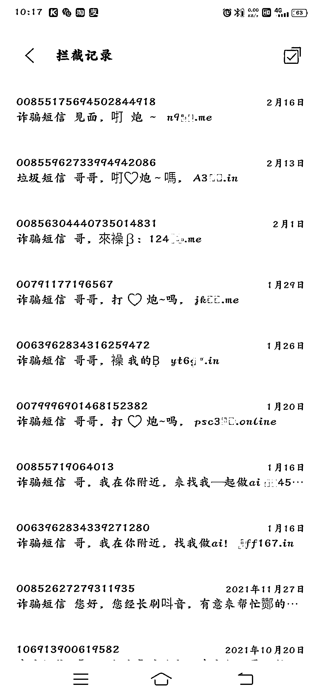
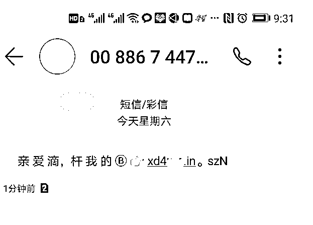
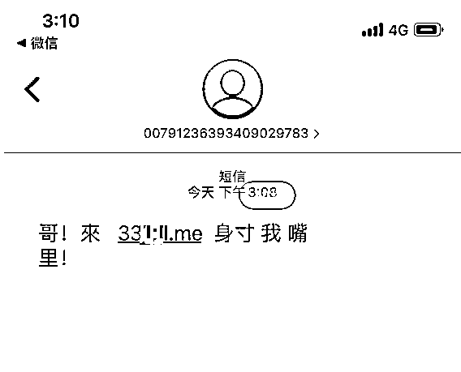
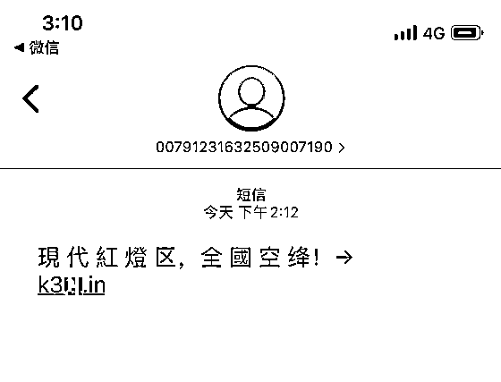
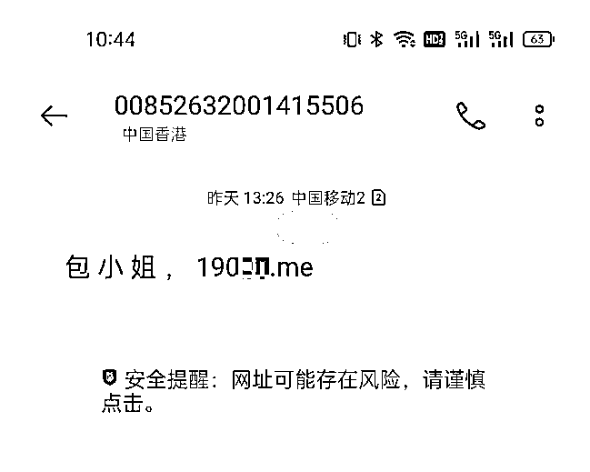
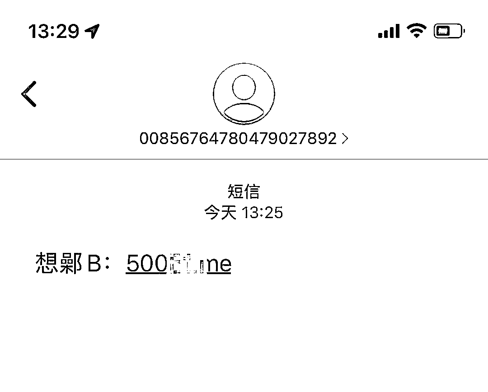

# “包小姐”“同城约会”…你收到的这些短信都是诈骗！

> 原文：[`mp.weixin.qq.com/s?__biz=MzIyMDYwMTk0Mw==&mid=2247530112&idx=7&sn=8e3809212ccdd3589ab1fa9ea47a3cf7&chksm=97cbbdb8a0bc34ae05ad2e7c6bb390c09ce8f0fadc45a1c1893ee12d92b0287742ed94b419a7&scene=27#wechat_redirect`](http://mp.weixin.qq.com/s?__biz=MzIyMDYwMTk0Mw==&mid=2247530112&idx=7&sn=8e3809212ccdd3589ab1fa9ea47a3cf7&chksm=97cbbdb8a0bc34ae05ad2e7c6bb390c09ce8f0fadc45a1c1893ee12d92b0287742ed94b419a7&scene=27#wechat_redirect)

随着电子通讯的飞速发展，广大群众对于手机、iPad 等电子产品的需求度也不断增大，随之而来的是各类 APP 研发行业蓬勃兴起，而一些 APP 开发者为了吸引眼球，增加下载量和使用量，采取了“打擦边球”的方式，将应用和情色挂钩，通过短信等即时通信工具引导群众下载 APP，并在 APP 主页面上发布大量的裸露美女图片或是隐含挑逗意味的视频片段，引诱一些用户通过充值获取完整版淫秽视频的手段实施诈骗。 

近日，莆田公安机关接到多个群众报警称，自己在手机上时常会收到平台推送“约炮”链接，好奇心引导下载后发现该平台以“介绍线下约炮”为由，诱导在该 App 注册充值。

 

 

 

 

 

**“约炮”的那些套路**

**1.伪装身份，等你上钩 **

骗子会伪装身份，在陌陌、探探、贴吧等社交平台发布带有引诱性的图文信息或短视频，并附带客服联系方式，诱发受害人的需求，让受害人主动上套。

**2.谈妥价格，交保证金**

当受害人自投罗网主动联系后，诈骗分子便会佯装在电话中和受害人谈好服务项目及价格。待双方达成交易意向后，诈骗分子便会以各种似乎“合乎情理”的理由让受害人先交钱，并且信誓旦旦称一收到钱马上安排上门服务。

**3.变本加厉，索要钱财**

交完押金或诚意金后，诈骗分子一般便会与受害人相互加微信，随后诈骗分子便会利用其急于接受服务的心态，以车费或安全保障费为由，要求支付押金或保证金，否则就不退诚意金，也不会安排人员上门服务。

**4.骑虎难下，乖乖付款**

转过几笔钱后，如果受害人依旧没有察觉到这是一场骗局，便会处于骑虎难下的情况，面临两难的选择。如果拒绝转账，不但享受不到服务，前面已经付的钱也要不回来，出于这种心理，受害人只得相信对方不是骗子，乖乖地按照诈骗分子的套路，继续支付他们所谓的“押金”、“保证金”。

**5.上门敲诈，拿钱消灾**

如果受害人意识到了自己被诈骗，不按诈骗分子的要求转账，诈骗分子便会恐吓受害人，即使按照诈骗分子的要求转账了，小姐也上门了，也难免会转化成为仙人跳，从而达到诈骗分子的敲诈目的。

**6.删除好友，销声匿迹**

当受害人识破骗局或没有再被诈骗的价值时，诈骗分子会立马将受害者拉黑或删除好友，消失得无影无踪。

警方提醒

收到带涉黄内容和网址链接的短信一定不要点击，例如：哥哥，可见面，**.me、**.in（特别是 me、in 后缀的网址）。骗子诱惑你点击网址链接下载涉黄 APP，在 APP 内女主播会不断发送同城招嫖信息并通过播放淫秽视频来诱骗你充值投资做任务等进行诈骗。切记：色字当头钱财尽，谨防上当受骗！

来源：莆田反诈骗，阻击诈骗

← 向右滑动与灰产圈互动交流 →

