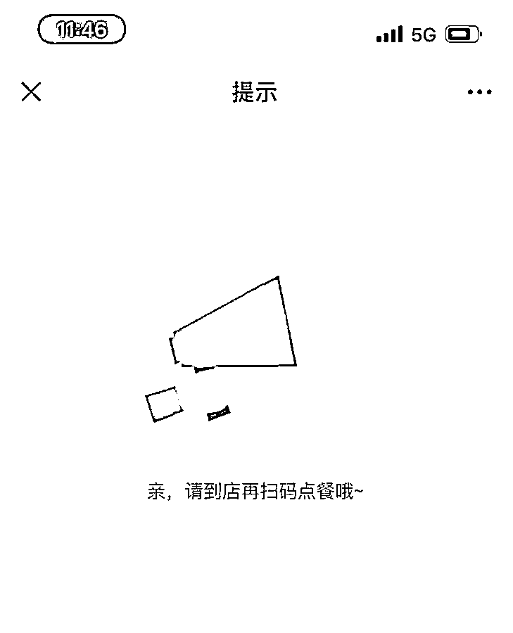

# 博主晒点餐二维码，结果被网友下单 300 多万元！最后结算…

> 原文：[`mp.weixin.qq.com/s?__biz=MzIyMDYwMTk0Mw==&mid=2247530112&idx=8&sn=2f498eda05cb896398613020be1d07a5&chksm=97cbbdb8a0bc34ae2621e00e5bfb2c8f78c916fce25dfd1cd919f92bc5b3ddb21d147d6117cc&scene=27#wechat_redirect`](http://mp.weixin.qq.com/s?__biz=MzIyMDYwMTk0Mw==&mid=2247530112&idx=8&sn=2f498eda05cb896398613020be1d07a5&chksm=97cbbdb8a0bc34ae2621e00e5bfb2c8f78c916fce25dfd1cd919f92bc5b3ddb21d147d6117cc&scene=27#wechat_redirect)

扫码点餐已经成为绝大多数餐厅的标配

但点餐码可不能随便乱晒

一不留神酿大祸

据报道，2 月 18 日晚，北京一位博主在饭店就餐时，随后拍下点餐二维码分享到微博上，没想到竟被网友疯狂远程下单，金额从 123 万直冲到 300 多万，直到餐厅将二维码关闭，网友还在点。

涉事餐厅回应称，餐厅确实被网友远程点了大量的菜，这是恶搞。2 月 19 日中午，记者获悉，**餐厅负责人已到辖区派出所报警。**

****

# ****涉事餐厅：正常秩序受影响，已报案****

**2 月 19 日，“博主晒点餐码被网友下单 123 万”的消息也随即冲上热搜。** 

****

**从奇点财经微博视频曝光的菜单中可以看到，网友下单的菜品包括战斧牛排、芝士焗龙虾、基辅秘制火鸡腿、瓦列拉脆皮肘子、雅尔塔米饭、乌克兰红菜汤、沙皇手工喜宴伏特加……其中，238 元的提拉米苏蛋糕被下单 1000 份，单价 18000 元的沙皇手工喜宴伏特加也被点了 68 瓶。而且，这顿饭钱还一直在肉眼可见地涨。截至 18 日 23：30 分，点餐页面显示下单已超 300 万元。**

****

****

****

**其中，沙皇手工喜宴伏特加被点了 68 瓶，引发了网友热议。**

****

**当事博主表示，当天发点餐码是为了吐槽座位号。记者在博主的微博上看到，2 月 18 日晚上 6 时 15 分，其发布微博称：“今晚吃饭的桌号，太二了。”配图上除了带有多个 2 的桌号外，还有餐厅名字和未打码的二维码。**

****

****

**不久，博主又接连发微博说：**“谁给我点了 68 瓶伏特加，现在饭店不让我走，已经到派出所了。” “我说菜怎么一道接着一道上，我都吃不完呢。”**其微博定位显示，地点为北京海淀区万寿路派出所。**

****

**此事引起了网友广泛关注，有人说：“这位朋友去吃饭点了 123 万的餐，然后为了掩盖自己能吃的事实，愣说是别人点的。”**

**随后，该博主在微博写道：“我就是当事人，就是误会，大家都散了。”**

****最后，该博主结账时只付了自己实际消费的部分。****

**记者 19 日上午 10 点来到位于海淀区的这家餐厅，餐厅负责人李先生告诉记者，据餐厅员工回忆，18 日中午，确实有三位男性一同到 202 桌用餐，其中一人疑似是网络博主。三人点了一个套餐又加了其他菜品，**共计消费四五百元。****

**“晚上开餐前，大约 6 点多，我们吧台的热敏纸开始疯狂出单。”李先生说，当时有一位女士刚在 202 餐桌坐下，还没开始点单，吧台就收到了大量点单信息，他们立刻为那位女士换了一个位置，并停用了 202 餐桌的点餐牌。**

****

**当晚，有大量网友通过该二维码点餐，共计 300 多万。李先生说，这些单在点餐牌停用后都是无效的。他向记者展示的点单信息显示，19 日凌晨，依旧有网友下单了意大利面、基辅奶抓饼等菜品，并备注有 4 位儿童。**“这明显就是恶搞的，谁大半夜在餐厅吃饭。”**李先生说，除了 202 桌，201 和 208 桌也被人恶意下单，他们将这几桌一并停用。**

**事后，李先生认为这只是一起恶作剧。“**我们没有报警，**而且我们餐厅所在辖区并不归万寿路派出所管。”李先生称，博主在微博上所说并非实情。记者在 202 餐桌看到，桌面上的点餐牌的桌号、二维码均已更换。19 日早，该点餐二维码已显示需要到店再扫码点餐。**

****

**19 日中午 12 时，“从昨晚到今天早上，我们电话都要被打爆了。”李先生介绍，有网友质疑餐厅和博主一同炒作，他们很委屈。李先生表示，自己开门做生意，却被人误解为炒作，**此事给餐厅造成了负面影响，餐厅的电话也一直响个不停。****

**“正常就餐的顾客已经打不进来了。”李先生说，**目前餐厅的正常秩序已受到影响，他们已经到辖区派出所报警，接下来将会做笔录。****

**对于此事，有网友表示：“点单二维码为什么要发网上呢？”也有网友质疑，餐厅难道不向客人核实菜单吗？**

# ****律师：远程扫码下单要承担支付义务****

**上海一位律师表示，不是说谁坐在这个位置上谁买单，而是谁下单谁买单。“博主的错误是把二维码发到网上去了，客观上给这种类似恶作剧的人提供了一个机会，如果非要追究责任应该是那个下单的人，在合同法上，扫码下单是一种缔约合同的行为，要承担支付义务，所以说远程扫码不是恶作剧，而是有法律风险的。”**

**在网上晒图，分享美好生活，原本没错，但不能缺根弦。就如网友说的，什么图都往网上发，泄露自己隐私，也泄露他人隐私，甚至是留下隐患。**

****为此，在此提醒，当心泄露隐私惹灾祸，火车票、飞机票、登机牌、车牌、护照、快递单等，都不要乱晒。****

**来源：极目新闻、每日经济新闻、都市快报**

****

**← 向右滑动与灰产圈互动交流 →**

****