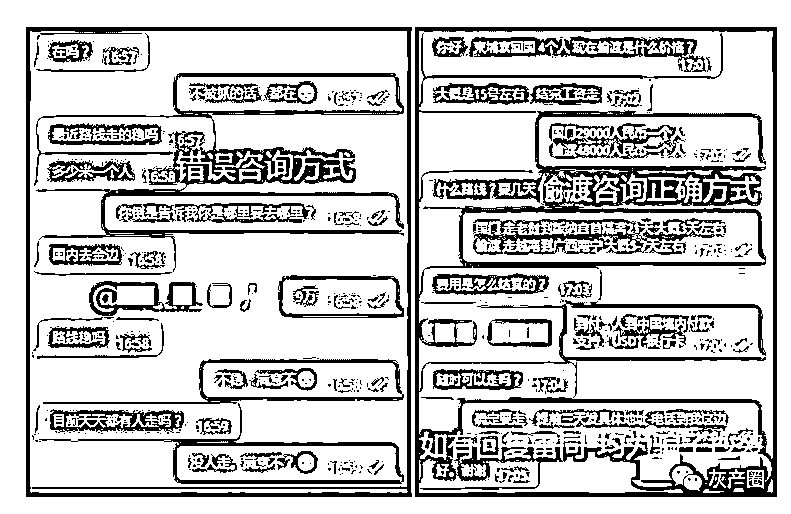
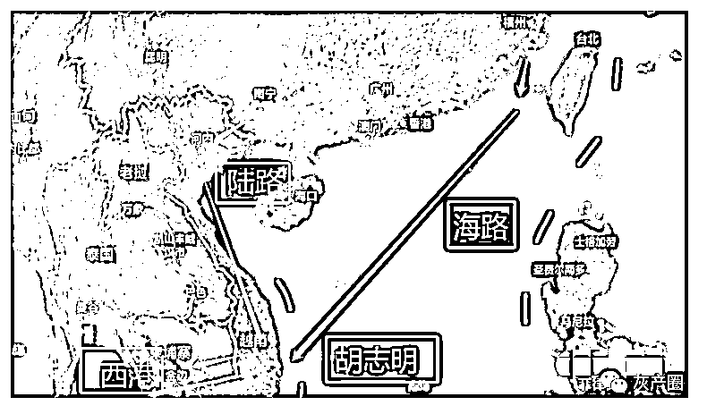
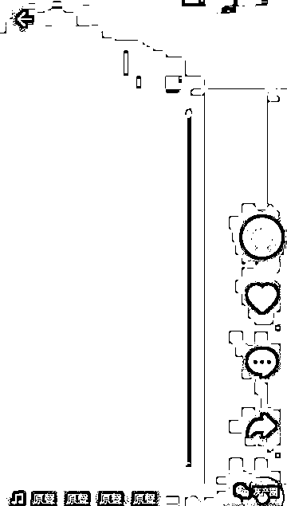
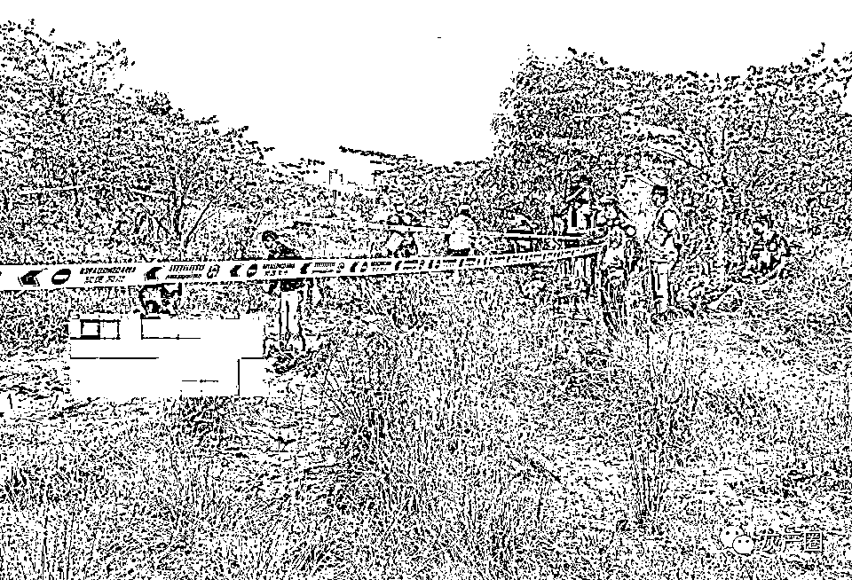
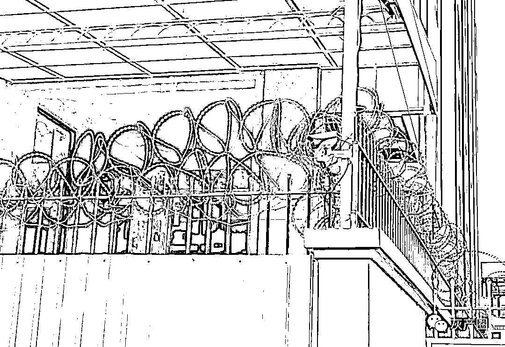

# “血奴”背后的柬埔寨网赌江湖

> 原文：[`mp.weixin.qq.com/s?__biz=MzIyMDYwMTk0Mw==&mid=2247530165&idx=1&sn=8ab8ddbcdd672c570b9d6f3883309e53&chksm=97cbbd8da0bc349bc8e1f5293170263ad0da2c9706e07fc6d650a5bef920c53a215976b857c0&scene=27#wechat_redirect`](http://mp.weixin.qq.com/s?__biz=MzIyMDYwMTk0Mw==&mid=2247530165&idx=1&sn=8ab8ddbcdd672c570b9d6f3883309e53&chksm=97cbbd8da0bc349bc8e1f5293170263ad0da2c9706e07fc6d650a5bef920c53a215976b857c0&scene=27#wechat_redirect)

“血奴”事件被报道后，在柬埔寨及中国国内引发强烈反应。

但在此事件背后，则是一个个庞大、复杂且分工明确的网赌灰色产业网络。

柬埔寨西港夜景

**“菜农”奴隶化：疫情下柬埔寨灰色经济扭曲发展**

“菜农”，是许多来到柬埔寨的中国人很快就会听到的一个新词。数以万计的中国“菜农”们，在柬埔寨钢筋混凝土铸成的高楼里，种植、收获着罪恶之花。

“菜农”的称呼来自于博彩与“菠菜”的谐音。赌博业又被称作博彩业，从事网络赌博的人员则谐音称其工作为“种菠菜”，于是网赌工作人员便成为了“菜农”。

2019 年前，网络赌博产业在柬埔寨沿海城市西港以及波贝等边境城市蓬勃发展，“菜农”们中有不少人收入优厚、挥金如土，成为西港、波贝、木牌等各赌场城市里中餐馆、会所、美容美发等产业的最大主顾。

好景不长。2019 年“818 网赌禁令”后，“种菠菜”在柬埔寨被剥掉了貌似合法的外衣，成为了灰色的地下非法产业，不少大型网络赌博公司搬离。

2019 年，网赌禁令后离开的波贝菜农 

疫情后的 2020 年，由于菲律宾新冠疫情严重，部分网赌公司搬迁回柬埔寨。但与此前的高调不同，许多网赌公司转为了“园区”形式，园区以疫情管理为由对外封闭，外人难以入内，安全系数提高。而在园区也对在其内工作的“菜农”进行严格管理，禁止外出，因此由网赌人员引发的社会治安事件当时有所减少。

2020 年下半年，中国进一步对网赌诈骗行为进行打击。一方面，对涉赌涉黑资金进行严查，冻结大量银行账号，使得网赌资金链受到威胁；另一方面，由于疫情防控原因往返中柬航班减少，再加上警方出动大量人员，在机场对所有来柬人员排查及劝返，因此从中国来柬的新“菜农”数量急剧减少，网赌公司人手大量紧缺。

由此在柬埔寨的网赌产业呈现畸形发展。

一方面，网赌公司吸纳新“菜农”的难度及成本成倍增加，网赌公司为转嫁成本造成动辄超 1 万美金的天价赔付；

另一方面，网赌公司对“菜农”加强控制且不允许其离开公司，出现问题动辄殴打、关小黑屋，“菜农”逐渐成为网络赌博和网络诈骗产业的奴隶。

**偷渡：海陆空全方位发展**

受疫情影响，往来中柬两国的航班大幅减少。但网赌公司流动性大，不断需要新鲜血液，合法来柬途径被堵，非法的偷渡活动蓬勃发展起来。

由于中国与柬埔寨陆路并不接壤，因此多数偷渡活动经越南或老挝等邻国进行。

从中国广西到越南，再到柬埔寨，这是一条古老的陆路偷渡线路。如今，则成了网赌公司运输新鲜“菜农”的生命线。或许是为避免被侦查，许多菜农在谈及偷渡时会用“暗度”这个隐晦的字眼。

据消息人士透露，目前从中国到越南再到柬埔寨的陆路偷渡费用，早已超过每人 1 万美金。

偷渡蛇头在纸飞机上的业务介绍截图 

由于中越边境附近山高林密，环境险恶，偷渡过程中伴随着极大的风险。据了解，有一次在偷渡边境过程中，一名准“菜农”不慎坠落山崖身亡。

疫情暴发后，柬埔寨与越南边境关闭，陆路偷渡也难以进行，不少“菜农”偷渡到越南后发现竟然到不了柬埔寨。

之后，海路偷渡应运而生。

据一名前“菜农”小波（化名）表示，自己跟几名同胞被中介蛇头从广西偷渡到越南胡志明市，之后蛇头原计划将其用面包车偷渡到柬埔寨，到了边境附近却发现无法通行。

最终小波和其他人一起，被蛇头用快艇从越南一码头海路偷渡到西港。到岸后，被网赌公司安排车辆直接接到网赌园区。

海路偷渡人员，除了从越南出发的，还有直接从中国大陆出发者。

湖南人贺宫（化名）就是被网赌人员以招工为名诱骗，从中国某港口直接乘坐轮船偷渡到西港。

因此，目前的偷渡路线中，除了从中国直接轮船偷渡到柬埔寨外，一种是陆路从广西出境到越南，到胡志明市再陆路或海路到柬埔寨；另一种是海路从中国沿海地区乘船到胡志明，再陆路或海路到柬埔寨。胡志明成为网赌偷渡的一个中转站点。

偷渡中转路线示意图

据小波称，自己在胡志明期间是在一个别墅区，整栋别墅及周边都是从中国到越南等待前往柬埔寨的准“菜农”。

据中柬义工队队长陈宝荣介绍，通过陆路，经老挝、越南等国家偷渡来到柬埔寨的中国人，一批只有 10 人左右。而改为海运后，通过坐船一批可以将 80 至 100 人偷渡至柬埔寨。

起初，船只直接从中国开往柬埔寨，中国方面的监管变严以后，蛇头先用小船把人从中国沿海码头带到公海，然后用大船把人从公海偷渡进柬埔寨，最后再把人卖给网赌园区，其中最年轻的甚至还未成年。

**招人：各途径传销式发展**

而为了招聘到新鲜“菜农”，网赌公司及招聘的人事中介使用了各种办法。

除“血奴”事件中被曝光的 58 同城外，百度贴吧、抖音等地，都是网赌公司招徕人员的场所。

而目前有些公司转向招聘柬埔寨本地人、泰国人和越南人等，抖音国际版 TikTok 也成了发布招聘的热门平台。

TikTok 上的一则园区招聘推广的信息

而近日由于“血奴”事件影响太大，部分抖音和 TikTok 上招人的视频悄然下架。 

部分抖音博主下架招聘视频 

而除了网络招聘外，还有线下传销式的招聘。 

云南小伙小韦（化名）就是被自己认识很久的老乡，骗到了柬埔寨波贝，据其他“菜农”讲，其老乡还从中拿到不菲的佣金。

发现来的公司是做网络诈骗“杀猪盘”后，小韦试图从楼上爬下逃走，不幸被保安发现，从 4 楼坠下摔成重伤。

小韦的经历并非个例，由于网赌公司急需人手，目前许多网赌公司在中国国内的招聘已呈现与传销合流的倾向，许多招聘人员使用传销话术为应聘人员洗脑，而“菜农”到柬埔寨网赌公司工作后，也被公司主管使用传销的办法“打鸡血”。 

**绑架：层出不穷的黑案**

而除了在中国内地用尽各种办法招人外，网赌公司还开拓源头，在留在柬埔寨的中国人中间招纳新鲜力量。 

而由于网赌公司“买人头”的费用早已超过 1 万美金一人，部分原网赌公司人事与黑社会联手，做起了绑架的生意。绑架一个人后，先是勒索其钱财，并从其在中国的家属手中敲诈，之后没有剩余价值后，再卖到网赌公司。 

去年年末到今年年初，柬埔寨华人圈屡屡传出绑架案，让在柬国人风声鹤唳。而这一切，在西港埋尸案达到了顶点。

1 月 21 日上午，西港发现一名戴手铐被埋尸的男子尸体，当晚，又发现一名戴手铐被埋尸的女子尸体。 

发现尸体现场

据消息称，其中女性死者王某系被人绑架勒索后撕票，而男性死者李某也与绑架案有关。

**园区：保安看守严密的王国** 

不管是从国内招聘而来，还是在柬埔寨被绑架而来，这些新“菜农”们最后都被带入了网赌园区。 

“园区”也是柬埔寨的一个特殊称谓，全称是“网投园区”，说是网络投资，其实就是网络赌博与网络诈骗等。一般意义上在柬埔寨所说的“园区”，并不是指工厂林立的工业经济园区，“网投园区”内也没有工厂，“网投园区”与“工业园区”两者迥然不同。

“网投园区”安保森严，一般有本地保安甚至宪兵在园区门口看守，园区每栋楼下还有保安，“菜农”在里面不能出大楼或园区。园区外面围墙上有铁丝网，防止人逃走，门口和其他地方还有摄像头实时监控。 

金边某网赌大楼外围

前“菜农”小方被卖到的大楼，楼下是五六米的围墙，上面缠绕着电网，还有一条深深的水沟。“对方拿着枪指着我，让我老实点，不要乱动。当时很害怕。”那一瞬间，小方已经有逃跑的想法，那是他最绝望的时刻。

在园区内，“菜农”们许多每天工作十多个小时，加上加班有时候要工作 17、18 个小时，但原来承诺的高薪也不能兑现。 

有的人想跑，被抓到后就被抓到“小黑屋”里殴打。多名逃出来的“菜农”对《今日柬闻》表示，在网赌公司里被用电棍打不是最惨的，最惨的是一种橡胶棍，里面填充了不知是石子还是什么材料，打起来非常疼。有一名菜农表示，自己曾被这种橡胶棍打得皮开肉绽，刚逃出来时背上是血糊糊的一片。

**转卖：难以摆脱的魔鬼轮回**

碰到想要逃走的“菜农”，或者迟迟出不了“业绩”的菜农，网赌公司在“小黑屋”里打一顿后，慢慢会找机会把这被榨干价值的菜农加价转卖掉。

有的菜农被买过来的时候“赔付”是 1 万美金，几经转卖后“赔付”已高达数万美金。但这一魔鬼的轮回难以摆脱。 

所谓“赔付”，也是网赌行业的术语。就是网赌公司花在每个“菜农”身上的花费，“菜农”离开公司时要赔给公司。许多“菜农”被卖时，要签一份自愿工作及承认多少“赔付”的协议，如果要离开公司时，公司就拿出协议来索要“赔付”。

而有的菜农为了离开网赌公司，无奈缴纳“赔付”，但又被公司暗地卖到另外一家公司，再继续上一个轮回。 

想离开？没那么容易，有钱也不行。

**分工：中介公司专业化** 

经过几年的发展，在柬埔寨的网赌行业已形成许多分工不同的行业。有的在国内负责招聘“菜农”，有的负责偷渡，还有最近形成的绑架团伙，均是为网赌公司工作人员的来源服务。

而除此之外，还有专门养号、卖号的“号商”，还有专门提供收款服务的“卡商”，有专门为换汇、洗钱服务的“渠道”。网赌这个日进斗金的行业，已形成了分工复杂的庞大网络。

**幕后：勋爵与富豪的关系网**

而随着网赌公司多年的经营，其触角也向柬埔寨本地政商界发展。

据一名在柬多年的华商分析，许多开设网赌园区的富豪租用本地勋爵的土地，两者形成合作关系，网赌园区为本地勋爵和权贵上缴大量资金，本地勋爵和权贵则成了园区的“保护伞”。

不少网赌公司也有意利用各种传闻，并扩大其词，称某某高官是自己的“后台”，“中国警察碰不了我们。”

2019 年禁赌令后，柬埔寨当局打击网赌犯罪时就有不少“后台”传闻出现。甚至到后来柬埔寨副总理苏庆的儿子苏速卡都不得不站出来，公开表态自己并不是网赌集团的“后台”。

苏速卡 2019 年 10 月时致函柬埔寨国家警察总署总监涅沙文及王家军副总司令兼全国宪兵司令邵速卡，表示在当局打击网赌犯罪时，有些不法分子利用有权有势的人来作为自己的“靠山”。同时也有小部分机会分子造谣和抹黑他是网络赌博背后的靠山，协调业主从事网络赌博。

苏速卡表示，这些虚假消息诽谤和抹黑了他的尊严，应该受到惩罚。

一名在柬华商表示，在网赌行业的一权力逻辑里，本地地主（勋爵、权贵）提供土地（保护伞），网赌园区则在土地上建设大楼园区，再出租给各网赌公司，网赌公司则从园区租借办公场所，再招徕员工从事网赌和诈骗业务。 

而在这一行业中，“菜农”处于最下层，为上面的组长、主管、网赌公司老板服务。 

在疫情后，网赌行业扭曲发展，最底层的“菜农”逐渐奴隶化，“网络奴隶”、“血奴”等报道不断出现。

西港一名网赌园区的人事则对记者表示网赌的存在对西港非常重要，“不可否认博彩行业让一部分人损失一部分财产，但是这个东西一个愿意打一个愿意挨，人生不都是在交智商税？博彩行业撤离还有你们什么事情吗？谁来带动当地经济？指望你们这些记者，还是所谓的商会？我不知道这些所谓的报道哪些黑手在推动，也不想知道。”

有在柬同胞评论“菜农”买卖时表示，“这种事已经持续一年多了吧，以前批判西方两三百年前的跨大西洋奴隶三角贸易的时候，不会想到东南亚现代电信诈骗奴隶贸易会如此猖狂。”

来源：今日柬闻

← 向右滑动与灰产圈互动交流 →

