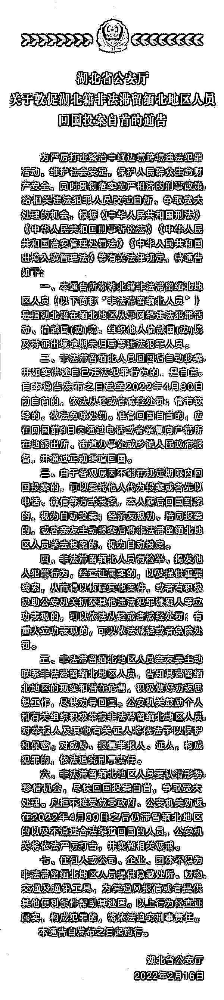
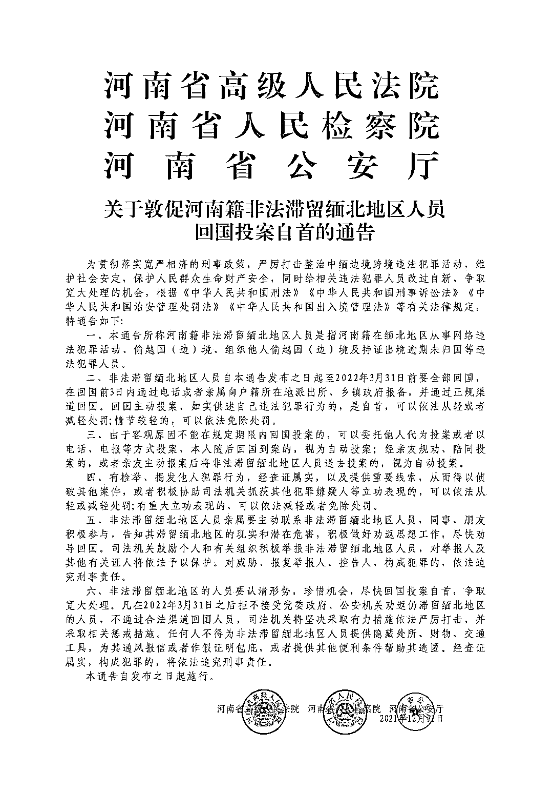
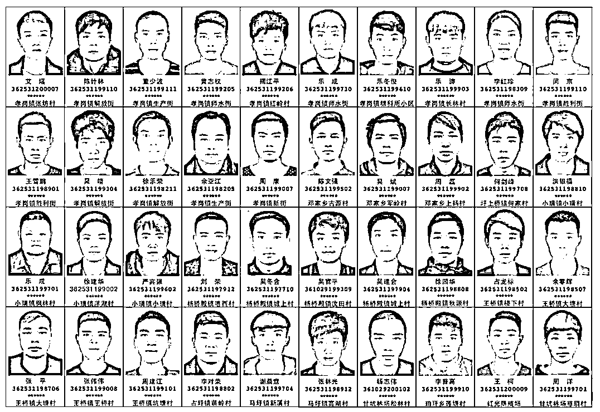
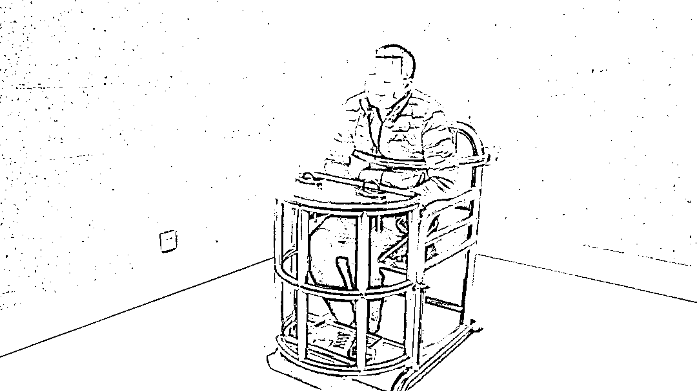
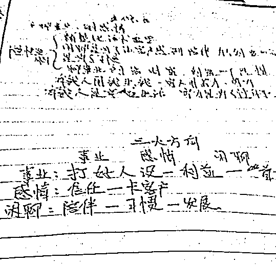
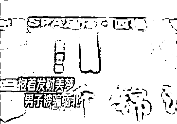

# 境外发财梦该醒醒了！多地发布紧急通告！

> 原文：[`mp.weixin.qq.com/s?__biz=MzIyMDYwMTk0Mw==&mid=2247530165&idx=2&sn=4a82a59fe30b1702ef8232d85ef5faf8&chksm=97cbbd8da0bc349b3d3bd170ea6c3ef7de38ae87cbeabf70a0f503fcbef0d5a40c1b699578d5&scene=27#wechat_redirect`](http://mp.weixin.qq.com/s?__biz=MzIyMDYwMTk0Mw==&mid=2247530165&idx=2&sn=4a82a59fe30b1702ef8232d85ef5faf8&chksm=97cbbd8da0bc349b3d3bd170ea6c3ef7de38ae87cbeabf70a0f503fcbef0d5a40c1b699578d5&scene=27#wechat_redirect)

近期 

多地发布

敦促非法滞留缅北地区人员

投案自首 

以及

非必要不得前往柬埔寨等国家的通告

**湖 北**

**河 南**

**江 西**

**上饶市>>**

**关于公开警示非法滞留缅北人员的通告**

为依法打击跨境违法犯罪行为，根据相关法律法规，上饶市中级人民法院、上饶市人民检察院、上饶市公安局、上饶市司法局于 2021 年 5 月 21 日联合发布了《关于敦促非法滞留缅北及境外从事违法犯罪上饶籍人员回国的通告》，但依然有少数铅山籍非法滞留缅北人员不知悔改、执迷不悟，无视政府部门的政策宣传和大力规劝，顽固不化，拒不回国。

根据公安机关掌握的非法滞留缅北人员违法犯罪事实，结合我县劝返工作实际，现对 7 名铅山籍仍非法滞留缅北拒不回国人员以通告的形式予以公开警示，并勒令在今年 3 月 31 日前回国，否则将采取更严厉的惩戒措施和强制措施。所有铅山籍非法滞留缅北人员要认清形势，珍惜机会，在规定的时间内主动回国，否则不但祸及自己，还将对家人、子女的参军、升学、就业、信用等多方面造成长久、严重负面影响。

自本通告发布之日起至 2022 年 3 月 31 日前，凡主动到户籍地公安机关报备、投案自首，如实供述自己违法犯罪行为的，可依法从轻或者减轻处罚；犯罪情节较轻的，可以依法免予处罚。

本通告自发布之日起施行。

铅山县打击治理电信网络新型违法犯罪

工作联席会议办公室

2022 年 2 月 18 日

附：7 名铅山籍非法滞留缅北人员信息

姓名：朱建波， 身份证：362324*****052419，户籍地址：河口镇洋田村朱家自然村 48 号。

姓名：张宇，身份证：362324******023018，户籍地址：新滩乡西坂村叶家自然村 165 号

姓名：黄辉，身份证：362324******267211，户籍地址：武夷山镇岑源村岑源街 050 号

姓名：李忠扬，身份证：362324******4516，户籍地址：葛仙山镇长岭村旧李家 5 号

姓名：蔡承环，身份证：362324******5432，户籍地址：石塘镇十都村徐家畈自然村 54 号

姓名：诸兴华，身份证：362324******4214 ，户籍地址：永平镇五都村诸家 041 号

姓名：黄斯斯，身份证：361124******2729 ，户籍地址：虹桥乡桥亭村五组

**抚州市东乡区>>**

**关于敦促非法滞留缅北的**

**东乡籍人员限期回国返乡的通告**

为贯彻落实中央关于打击治理电信网络诈骗犯罪的重要指示批示精神，依法严厉打击整治中缅边境跨境违法犯罪活动，切实保护人民群众生命财产安全，坚决维护社会大局持续稳定。根据宽严相济刑事政策给予东乡籍非法滞留缅北人员、中缅边境非法出境人员、境外从事电信网络诈骗、赌博、走私、贩毒等违法犯罪活动人员(以下简称:非法滞留缅北人员)改过自新和争取宽大处理的机会，根据《中华人民共和国刑法》《中华人民共和国刑事诉讼法》《中华人民共和国治安管理处罚法》《中华人民共和国出境入境管理法》等有关法律规定，现对上述人员进行劝返，特通告如下：

一、自本通告发布之日起，滞留缅北地区的江西抚州东乡户籍人员，积极主动与户籍所在镇、村（社区）和家属联系，务必于 2022 年 3 月 15 日前，通过正常渠道入境回国，回国前，需提前 7 天通过电话或家属向户籍地派出所报备，并通过规定渠道回国。入境后，要严格遵守国内疫情防控相关规定，防止境外疫情输入。

二、回国路线。云南开放回国路线：1.普洱市—孟连县—勐阿口岸和芒信口岸（货物口岸）；2.西双版纳州—勐海县—打洛口岸；3.临沧市—沧源县—永和口岸和芒卡口岸；4.临沧市—镇康县—南伞口岸。这四条路线均允许滞留在缅北地区的中国公民回国（包括没有合法有效证件的人员）。通过其他口岸回国，也需要填写报备表。

三、目前仍然非法滞留缅北的东乡籍人员，要认清形势，珍惜机会，在限定期限内回国返乡投案自首，到户籍地派出所配合公安机关审查。如实供述自己违法犯罪行为或检举、揭发他人犯罪行为的，经查证属实，可以依法减轻、从轻或者免除处罚。对拒不接受劝返仍非法滞留缅北人员和经劝返已回国后不主动到户籍地公安机关报备的人员，将坚决采取严厉措施依法打击惩处，并会同有关部门采取以下“七个一律”惩戒措施：

1、一律对不主动向户籍地公安机关报备回国的滞留缅北违法犯罪人员，不通过合法途径回国人员，依法予以曝光公示，并从严从重打击处理。

2、一律严控办理通信业务及银行业务，将非法滞留缅北人员名下所有的手机卡全部关停并暂停名下银行卡的非柜面业务功能。

3、一律视情况列入失信人员名单，限制乘坐交通工具、入住宾馆、信用卡消费、贷款审批，对已办理的工商营业执照列入异常经营名单。

4、一律对逾期不归、不主动联系户籍地村(社区)干部、派出所民警，不主动登记备案的滞留缅北人员的户口，视情况作“下落不明”冻结、注销户籍，冻结、注销后停止身份证、护照、行驶证等一切户籍业务及相关业务办理。

5、一律对滞留缅北人员本人或直系三代家庭成员在入团、入党、参军、考录公务员政治审查、子女升学时依法依规从严审核。

6、一律对拒不接受党委政府、公安机关劝返仍滞留缅北人员，暂停其本人切政府政策性补贴(如:粮食生产直接补贴等)、社会福利保障(如:医保等)和国家救助保障(如:低保等)。

7、一律暂停为滞留缅北人员本人或直系亲属提供新宅基地及申报新建住房。

四、欢迎广大人民群众踊跃举报跨境违法犯罪线索，直接抓获或协助公安机关抓获违法犯罪嫌疑人的，根据相关规定给予奖励。对威胁、报复举报人的，依法予以处罚；构成犯罪的，依法追究刑事责任。

请大家通过微信群、朋友圈等形式互相转告，告知缅北滞留人员回国的相关政策。希望各位滞留缅北人员珍惜此次机会，尽快申报，早日返乡！

特此通告

本通告自发布之日起实施。

东乡区打击治理电信网络新型

违法犯罪工作联席会议办公室

2022 年 2 月 14 日

附：一批非法滞留缅北人员名单 

（可点击放大查看）

**广昌县>>**

**关于广昌籍人员**

**非必要不得前往缅甸、柬埔寨等亚洲重点十国**

**及前往云南边境需提前报备的****通告**

当前，境外新冠肺炎疫情和打击电信网络诈骗犯罪形势依然严峻，为坚决贯彻党中央、省、市决策部署，严密防范境外疫情输入，坚决遏制广昌籍人员非法出入境从事电信网络新型违法犯罪活动，切实维护全县人民群众生命健康和财产安全，根据相关法律法规规定，特通告如下：

一、广昌籍人员非必要不得乘坐从厦门、昆明、上海、成都、广州等五个国际机场前往亚洲十个重点国家：缅甸、越南、印度尼西亚、柬埔寨、老挝、泰国、菲律宾、马来西亚、土耳其、阿联酋等国。如有紧急情况确需前往，应至少提前 3 日向户籍所在地村居(社区)及派出所同步报备，并提供营业执照、房产证明(购房合同)、租房合同、有效劳动合同、公派出差文件等相应证明材料，经审核批准后方可前往上述地区。未提前报备、审批被上级有关部门通报、拦截、劝返的，将参照广昌籍滞留缅北人员相关处置措施予以严厉惩戒。

二、广昌籍人员非必要不得前往云南省德宏州、临沧县、普洱县和西双版纳州等边境地区。如有紧急情况需要前往的，须提供公派出差文件、旅游协议书、营业执照、房产证明(购房合同)、租赁合同、有效劳动合同等相应证明材料，至少提前 3 日向户籍地村(居、社区)和派出所报备，派出所将相应证明材料上报广昌县打击治理电信网络新型违法犯罪工作联席会办公室后方可前往，避免造成不便。因未提前报备或私自前往而被云南边境公安机关、国家移民管理部门登记拦截的，将参照广昌籍滞留缅北人员相关处置措施予以严厉惩戒，涉嫌违法犯罪的，依法严厉打击。目前已到达云南省边境的广昌籍人员务必立即主动与户籍所在地村居(社区)和派出所同步联系，核实个人报备事宜。

三、组织、运送、参与偷越国(边)境的，将依法予以严惩。目前正在实施或预谋非法出境的人员，自本通告发布之日起，应主动停止、立即返回并通过家属及时联系户籍所在地派出所，如实供述自己违法行为的，可以依法从轻或减轻处罚；情节轻微的，可以免于处罚。

四、鼓励广大人民群众积极举报非法出入境违法犯罪线索，如有发现正在或已经非法出入境、滞留境外从事电信网络诈骗等违法犯罪活动的相关线索，欢迎拨打 110 或到广昌县公安机关进行举报，公安机关将严格保密举报人信息，经查证属实的，依照相关规定给予奖励；对威胁、报复举报人的，依法予以处罚；构成犯罪的，依法追究刑事责任。 

广昌县打击治理电信网络新型违法犯罪工作联席会办公室

2022 年 2 月 14 日

搜索相关内容

发现近期很多官号都在

来

咱们一个一个说

其实关于缅北的悲惨经历

我们聊过不止一次了

（点击图片可直达链接）

 

高月薪、包出境、好生活

这些美梦随着你抵达

缅北地界的那一刻瞬间破碎

等待你的是武装持枪

是暴力威胁

是无尽的折磨与欺骗

……

来听听这个亲历者讲述

关于缅北的噩梦

男子张某为挣大钱，偷渡到缅甸，结果却被骗进了电诈团伙。经历几个月终于千辛万苦逃脱。为了避免更多人上当受骗，2 月 17 日，他在湖北省十堰市公安局茅箭区分局里讲述了在缅甸噩梦一般的经历……

据当事人张某讲述，在 2020 年 3 月份，他在广州工作，有朋友要给他介绍一份“高薪”工作。

**听着对方描述的高月薪、好生活，他心动了，没跟父母商量就答应前往。**

很快，对方给张某买好了机票，根据对方的指示，他坐飞机到了昆明。

抵达昆明后，黑车司机接到张某后，将他送往边境线，**张某到达目的地后，才意识到自己落入了诈骗团伙。**

当事人张某说：“公司里面有一百多个人，门口还有十个穿着绿色军服的当地武装人员，拿着手枪、长枪站岗。公司里面也有人员在巡逻。然后**把我的护照都收去，之后，我在公司里面也出不来。**”

**到达当天，张某便被人要求与人进行聊天，对其进行电信诈骗。**

据张某讲述，如果不学如何诈骗就会被当地武装人员用手铐铐起来打。诈骗公司让他伪装成女性通过诈骗公司准备好的话术，软件等在网上进行诈骗，引诱被害人录下不雅视频，以此为依据对被害人进行要挟。

无奈之下，张某只好在网上努力和人搭讪、套近乎，却还是完不成每个月公司下达的任务。

当事人张某：“我过去了一个多月，因为我业绩每次都不达标。

**被当地武装人员拷在床头，拷了一晚上，拳打脚踢，还用橡皮棒打在身上，腿上、腰上都是紫的。**”

害怕、气愤、不平和逃离的欲望在脑海时时浮现，在那里的每一天，他都在谋划如何逃离。之后张某趁他人睡着之后，从二楼跳下后，侥幸逃了出来。张某回国后，主动向公安机关自首，为避免别人上当受骗，他主动要求讲述自己上当受骗的经历和感悟。

当事张某：“**根据我自己的亲身经历，我希望大家千万不要相信什么高薪诚聘，都是骗人的，我现在就是特别后悔，当时就因为想贪一点小便宜，被迫弄成这样，那边不是天堂，而是地狱**，大家在网上交友，擦亮自己的眼睛，因为我们那儿一百多个人，骗的都是男性，但是他们都是冒充女性，用提前录好的视频发给你看。如果遇到类似我这种情况，可以到当地的公安找当地的公安帮忙核实一下是真是假。”

像这种以出国务工为由

骗人参与诈骗的事件并不少见

都是以非常吸引人的条件

诱惑人落入圈套

**警方在此提示**

不要盲目相信

网络上的高薪诚聘

一定要核实工作的真实性、合法性

尤其是靠近边境地区的

如果已身陷境外或边境地区的

违法犯罪活动地点

最好是在确保自身安全的情况下

选择求助措施

在确保安全的情况下逃出来

求助当地的中方大使馆或者办事处

通过他们代为联系家属报警

再来说说

关于柬埔寨的“那些事”

近日一位在柬埔寨的中国小伙

被网诈团伙圈养“抽血卖钱”的消息

在网上流传

[`mp.weixin.qq.com/mp/readtemplate?t=pages/video_player_tmpl&action=mpvideo&auto=0&vid=wxv_2274681892140711945`](https://mp.weixin.qq.com/mp/readtemplate?t=pages/video_player_tmpl&action=mpvideo&auto=0&vid=wxv_2274681892140711945)

据悉，小伙是江苏人，2021 年 6 月，有人介绍他到广西工作，结果被人劫持送到了柬埔寨。他因拒绝参与网络诈骗，半年内被抽血 7 次。

文章称，“O 型血，值钱，所以被榨干。”“每隔一个半月就被抽三瓶血，还有 7、8 个人被抽。”送入医院时，除了右臂以外全身极度浮肿，脱去衣物时身上多处针眼密密麻麻触目惊心。

16 日，驻柬埔寨使馆发言人发表关于中国公民被网赌集团圈养充当“血奴”案的谈话，全文如下：

2 月 12 日，柬埔寨中柬第一医院向我馆反映，该院收治了 1 名李姓中国男子，其因轻信同城网上的虚假招工广告，被犯罪团伙胁迫偷渡至柬，后遭柬西哈努克港中国城内网赌电诈团伙非法拘禁，并被多次大剂量抽血，生命垂危。

获悉后，驻柬使馆高度重视，要求院方全力救治病人。2 月 15 日，当事人身体状况好转后，使馆警务联络官即会同中柬执法合作办公室人员赴中柬第一医院探望并调查当事人被侵害情况。此前，为尽快立案调查，我馆分别向柬警察总署、西哈努克省和国公省警方通报相关线索，要求柬警方高度重视并予立案。在我馆推动下，柬西哈努克省警方已正式就此立案，中柬两国警方正协同开展相关侦查工作，力争尽快破案。

借此机会，中国驻柬大使馆再次提醒欲来柬工作的中国公民遵循正规渠道，不可轻信高薪招聘的虚假广告。如遇被诈骗、绑架、限制人身自由等情况，务必尽快设法向柬警方报案并向使馆通报情况，以便警方及时立案调查。

当前

藏身境外

特别是缅北、柬埔寨的犯罪分子

以招工等名义，通过招聘网站

网络平台发布广告

以高额薪酬为诱饵

吸引年轻人前往务工

实际是从事诈骗犯罪活动

前往境外后

这些人在参与诈骗犯罪的同时

自身也被限制人身自由

甚至被殴打致伤致残致死

生命安全得不到任何保障

回国后还要接受法律惩处

据相关人员自述

他们大多抱有发财梦和

侥幸心理偷渡出境

至境外诈骗窝点后

不仅挣不到钱

反而人身自由受限

人格受辱，后悔莫及

痛苦不堪

警方在此发布安全提示

出境务工

请通过正规渠道，擦亮眼睛

**千万不要被花言巧语**

**高薪回报所欺骗**

**被蒙蔽而拉入犯罪团伙**

**沦为犯罪分子的帮凶**

**从被害者成为害人者**

同时正告

身处缅北诈骗窝点的人员

**请立即中止犯罪，尽快回国**

**主动到公安机关自首**

**争取依法宽大处理**

来源：中国警察网

← 向右滑动与灰产圈互动交流 →

