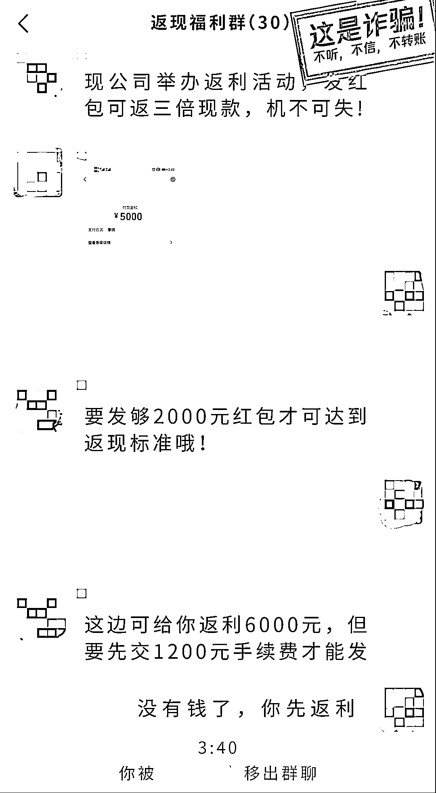
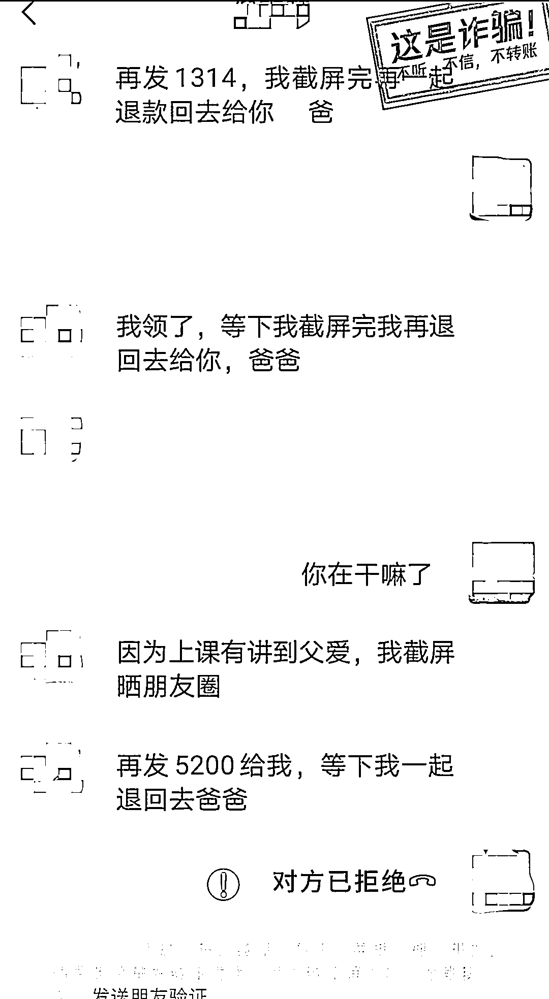
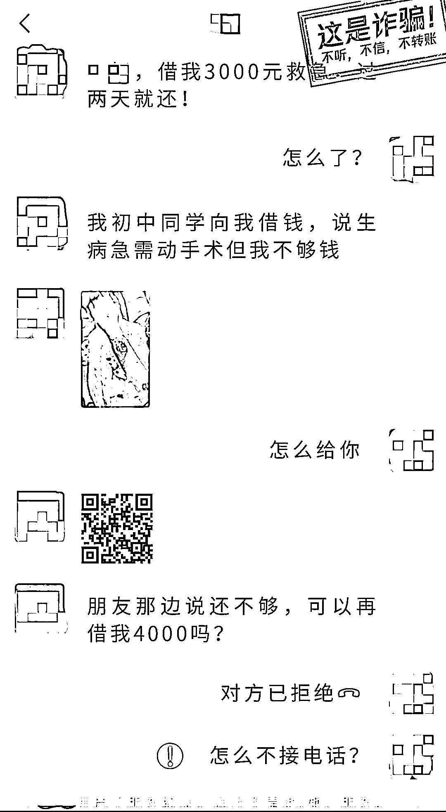
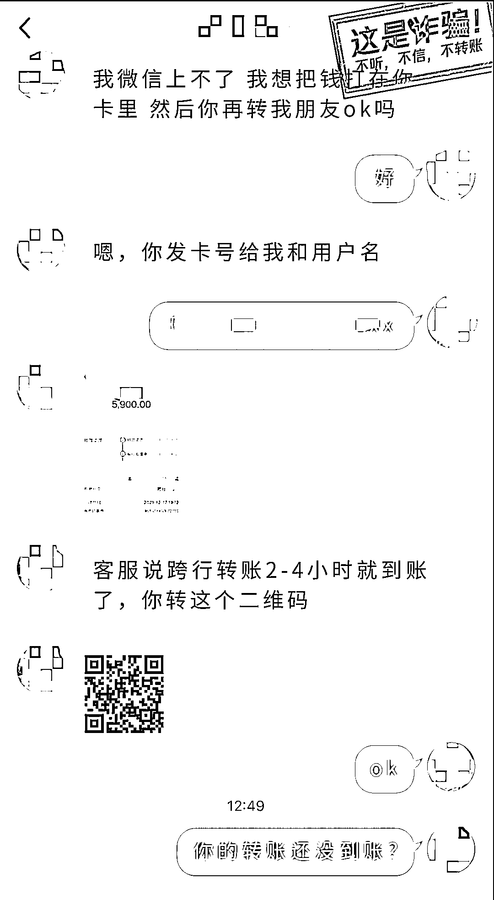

# 我被盗号后，亲友是这样上当的……

> 原文：[`mp.weixin.qq.com/s?__biz=MzIyMDYwMTk0Mw==&mid=2247530165&idx=5&sn=a9bfa959b3ed3bef0808a1f6d826da2b&chksm=97cbbd8da0bc349b68a87b600c7e20a660b3b1affc364413cc103b2849c6ee05c0be709e8b1f&scene=27#wechat_redirect`](http://mp.weixin.qq.com/s?__biz=MzIyMDYwMTk0Mw==&mid=2247530165&idx=5&sn=a9bfa959b3ed3bef0808a1f6d826da2b&chksm=97cbbd8da0bc349b68a87b600c7e20a660b3b1affc364413cc103b2849c6ee05c0be709e8b1f&scene=27#wechat_redirect)

刚过完年，骗子们又开始摩拳擦掌地使坏了。

有不少同学跟一哥反馈，说最近遇到盗号欺诈“重出江湖”。我们一起来看看，骗子究竟又出了什么新招。

Q:

**什么是盗号欺诈？**

A:

骗子通过盗取他人帐号，冒充被盗帐号本人的身份，通过编造各种借口向列表好友借钱、代转账、诱导参与高额返利等，从而骗取钱财。

1.**诱导参与返利活动**

骗子盗取帐号后，在该帐号朋友圈发布高额返利活动，诱导受害人进活动群发红包，**骗取本金、手续费**等，收款后把受害者踢出群聊。

  

除了在朋友圈发布高额返利消息，骗子还会**用被盗帐号主动私聊列表里的好友**，实施精准诈骗，同时伪造返利截图，让对方信以为真。

2.**借钱发朋友圈晒转账**

骗子盗取帐号后，冒充帐号本人身份，群发借钱信息，以**想在朋友圈炫耀恋情、亲情、友情**等为由，**要求转账并承诺会返还**，收钱后却直接拉黑受害者。

        

对于要求的转账金额，一般为**520、1314、5200**等带有特殊意义的吉利数字。

3.**自己或亲友出事急需借钱**

骗子盗取帐号后，利用号主的身份，给列表的亲友群发借钱信息，**以自己突发意外、亲友生病等为借口**诱导受害人直接转账或扫码付款，骗取话费、手术费、医药费等。

       

为了增强可信度，骗子可能还会通过此前的聊天记录来**模仿号主的说话方式和称呼**，让人难以分辨真假。

4.**帐号受限需代转账**

骗子利用被盗帐号联系列表好友，谎称亲友生病住院急用钱，以**支付受限**为由，提出先通**过银行卡转钱**给受害人，而后**以跨行转账有延迟**为由，让受害人先**垫付资金**，骗取医药费、手术费等。

狡猾的骗子还会通过**伪造转账汇款截图**来迷惑受害人，让其放下戒心。当受害人同意垫付资金后，除了直接发送二维码让受害人扫码付款外，**还会让受害人添加所谓“医生”**为好友进行转账。

更要注意的是，目前还出现了**连环盗号**的新招：

骗子先盗取受害人的好友帐号，然后利用帐号本人的身份，**以帮忙辅助验证等为由，通过扫二维码填表等形式，套取受害人的手机号、社交帐号、支付密码等个人信息**，从而盗取帐号并借此骗取钱财。

具体盗号手法可戳→《[朋友，帮忙辅助验证一下](http://mp.weixin.qq.com/s?__biz=MzIyMDYwMTk0Mw==&mid=2247525055&idx=3&sn=8800e79bea7d7076f2df6fa3ff24b2ee&chksm=97cba987a0bc2091db21c7eaba318a02300147c95985395aef1da4071f6f3585b0d207648288&scene=21#wechat_redirect)》《[你这一生，被盗过号吗？](http://mp.weixin.qq.com/s?__biz=MzIyMDYwMTk0Mw==&mid=2247483696&idx=4&sn=2284cd278de3f88ecb9d75b5cdb1aea0&chksm=97c8ca08a0bf431e2a63c5dc85e88cac7b1855713e1e2942dce5d9d1404983c6909fc60cd24b&scene=21#wechat_redirect)》

**套路总结**

**冒充身份：**盗取受害人好友的帐号后，冒充好友身份来联系受害人

**编造借口：**以推荐高额返利活动、亲友生病住院、突发意外急用钱等为由，诱导付款、借钱、代转账等

**骗取钱财**：第一次得手后，继续以各种借口要求转账，直到受害人识破

尽管盗号欺诈的手法在不断变化，但是核心套路仍是一致的，都以转账、付款、盗刷资金为最终目的。

所以在遇到好友来借钱时，还是得多留个心眼，多用几种方式去核实对方身份，避免上当受骗。

**×**

**安全提醒**

✦**保持警惕，多方核实**

遇到借钱、换钱等救助时，要多渠道核实情况，通过电话、视频等方式和朋友当面确认

✦**风险提示，多加注意**

当对话页面出现风险提示时，要多加注意，暂停转账付款并联系好友以验证真伪

✦**个人信息，加强保护**

不轻易向他人透露个人信息，如社交帐号密码、支付密码、银行卡账号/密码等，不点击不明链接，不扫不明二维码

来源：微信 110

← 向右滑动与灰产圈互动交流 →

