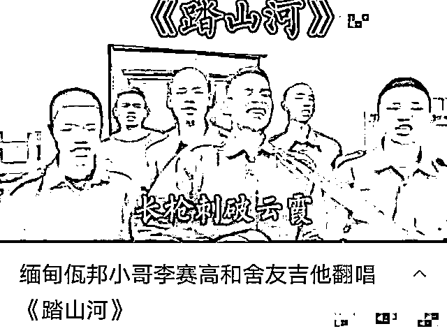

# 血奴事件波及短视频博主？有的疑销号，有的哭诉被网暴

> 原文：[`mp.weixin.qq.com/s?__biz=MzIyMDYwMTk0Mw==&mid=2247530226&idx=1&sn=d442bba79fa53bd78947083b70ab6bec&chksm=97cbbdcaa0bc34dc9674620991035e3bf51c1ada91da6e7f5fdff764357ee4188bf66720baac&scene=27#wechat_redirect`](http://mp.weixin.qq.com/s?__biz=MzIyMDYwMTk0Mw==&mid=2247530226&idx=1&sn=d442bba79fa53bd78947083b70ab6bec&chksm=97cbbdcaa0bc34dc9674620991035e3bf51c1ada91da6e7f5fdff764357ee4188bf66720baac&scene=27#wechat_redirect)

“这里是缅甸北部，我生长的地方。欢迎来到我的世界，娇贵的小公主。”、“曾经我也是屌丝一枚，来到缅北后，混得风生水起”。
在互联网的角落里，流传着许多关于去缅北务工致富的“传说”。不知道你信不信，反正很多信了的人，都后悔不已。柬埔寨“血奴”事件后，很多网友将目光投向那些身在缅甸、柬埔寨的视频博主。这些博主有华人，有当地人，不少都被网友将他们和诈骗联系起来。**柬埔寨“血奴”事件发酵****柬埔寨、缅甸等华人网红纷纷被指责****弹唱网红账号消失，有博主哭诉被网暴**近日，柬埔寨“血奴”事件引发各界关注。受害者“小李”的遭遇让人们大为震惊。 据报道，在 4 个月的时间里，小李总共被抽了 7 次血，每次 350ml，还有次被抽了两瓶。频繁被抽血的情况下，小李的体能几乎耗尽。对方则计划等完全抽不出血了，就贩卖他的器官。好在最后小李被好心人所救，送到了医院。他的身上全是针眼，身体已经快被抽干，100 毫升血液里只剩下 2g 真血。 “血奴事件”的背后，是犯罪团伙在境外肆无忌惮的违法纵行，也是一条黑色产业链的利益输送。 随着“血奴事件”不断发酵，网友们纷纷将短视频平台上在柬埔寨、缅甸的华人博主指责了个遍。首先冲上热搜的，是一个弹唱博主，李赛高。近日，有传闻称，百万粉丝网红李赛高是缅北诈骗公司“亨某集团”的成员。不过这并未被证实。

[`v.qq.com/iframe/preview.html?width=500&height=375&auto=0&vid=z3324gewe54`](https://v.qq.com/iframe/preview.html?width=500&height=375&auto=0&vid=z3324gewe54)

与此同时，李赛高的账号，在短视频平台也搜索不到了。也有不少博主哭诉，自己被冤枉了。有博主自称，自己在视频里说欢迎大家到缅甸玩，只是表达欢迎大家的一片心意。她自己最近也因为诈骗的事遭受到了网暴，她自己并没有骗过人。该博主在另一条视频里称，自己从来没有想过诈骗任何人，也从没想过骗任何人去到那边做诈骗，自己玩短视频是因为热爱分享生活。该博主表示，自己之前的确发过欢迎大家到佤邦的短视频，但是自己发这个内容的时候并没有恶意，自己心灵是纯洁的。不过，网友们纷纷调侃，“我是 X 血型可以去佤邦吗”、“看你头像是 X 集团的大厅”之类的评论。也有博主称，自己是云南人，一直在柬埔寨做实体（空调、中央热水等）。所有资料经得起考察。关于网友们“菠菜”、“抽血”等猜测，是想象力太丰富了。 在该视频的评论区，有网友发问：“你指头咋没的？”以及“交朋友卖掉一个 2-3 万美金”等评论。 有博主称，自己 16 岁开始做早餐生意，从国内到国外，现在认为自己可以做早餐国际海上运输。评论区，也有网友调侃称，“自首吧，身首异处客死他乡很惨的”。有博主表示，因为柬埔寨的“血奴事件”，媒体铺天盖地的报道，让国内很多网民感觉在柬埔寨的中国人，好人也变成坏人了。 在某短视频平台搜索“柬埔寨”相关博主，其所发内容多为自己在柬埔寨生活的日常，以及一些工作相关情况。其中，不少博主也对此次“血奴事件”发表了自己的观点。有博主表示，血奴事件和浙江女孩被害案持续发酵，使国人蒙上了厚厚的阴影。并提醒广大网友，不要相信那些高薪聘请出国务工快速发大财的话，天上没有掉馅饼的事。**境外高薪务工有风险****天上不会掉馅饼**事实上，类似的事情近年来屡见不鲜。网络赌博、杀猪盘、电信诈骗......这些违法行为的老巢似乎都在东南亚地区。近年来，无数在缅北、柬埔寨等地区从事电信诈骗的违法人员逃回国内后，回忆起做诈骗的时光，可谓是人间炼狱。完不成业绩、不听话、逃跑，面临的都是电棍电击以及各种毒打。其中，有不少都还是未成年人。去年，中国警方还公布了一段诈骗分子忏悔的视频。 视频中，这些诈骗分子队列整齐，齐声喊道：“我在缅北做诈骗，现在回到祖国妈妈的怀抱，接受改造，重新做人，我是中国人，中国人不骗中国人。”这些怀着“发财梦”的国人被限制在金边、西哈努克等地所谓的“园区”里，被中国籍老板雇请的打手及物业胁迫，通过“杀猪盘”等方式，在网络上“行骗”，将世界各地华人的钱骗入公司的账户。今年 2 月 6 日，反诈中心曾发布紧急提醒称，不要轻信“赴境外高薪务工、高薪聘请”等招聘信息。此类信息是在诱导你前往缅甸、柬埔寨、菲律宾、老挝、马来西亚、泰国、阿联酋等七个国家后，强迫你从事电信诈骗、网络赌博和卖淫等违法犯罪活动，如你拒绝或不能完成“业绩”，既对你实施毒打、关水牢、剁手、活埋等酷刑并以此向国内亲人敲诈勒索巨额钱财。紧急提醒还发出警告，目前仍然滞留在上述 7 个国家从事电信诈骗、网络赌博等违法犯罪的中国籍人员请立即归国投案自首，否则将被注销户籍。该紧急提醒还告知大众，网上兼职刷单、抖音点赞返利一定是诈骗；网上贷款先缴钱的一定是诈骗；陌生人带你投资理财、网络博彩(买彩票)的一定是“杀猪盘”诈骗；网上投资理财入金款要求转给个人银行账户的一定是诈骗，天上不会掉馅儿饼。 

**此前报道：**

**[“血奴”事件登上中国热搜](http://mp.weixin.qq.com/s?__biz=MzIyMDYwMTk0Mw==&mid=2247529838&idx=4&sn=4a964e1d46b24649457693b324928e58&chksm=97cbbe56a0bc3740b78e74a5a241b191ffc132ef603b593fe3fee1a50aeb9f199d8ea3a05b95&scene=21#wechat_redirect)**

**[从“血奴”身上抽出来的血，去了哪里？](http://mp.weixin.qq.com/s?__biz=MzIyMDYwMTk0Mw==&mid=2247529890&idx=1&sn=d14992d5536c7d32c114d35a1f879477&chksm=97cbbe9aa0bc378c6e9ea328c77389ee308e276ae5888167262313e367e9b292fe9dfc57be91&scene=21#wechat_redirect)**

**[“血奴”之后，他们从柬埔寨获救，最小 14](http://mp.weixin.qq.com/s?__biz=MzIyMDYwMTk0Mw==&mid=2247530022&idx=4&sn=99ec46895d346e5acdbd03f935bc1996&chksm=97cbbd1ea0bc34086813e0f47a6b2e55fc8a001ba9e8fc42a18a63742b59e74ab017ddb41d9d&scene=21#wechat_redirect)[柬埔寨“血奴”事件牵出 58 同城：大量网友被骗，有人招聘马仔贩毒](http://mp.weixin.qq.com/s?__biz=MzIyMDYwMTk0Mw==&mid=2247530022&idx=3&sn=2b937b715241a4ada98132f4d1598e9f&chksm=97cbbd1ea0bc3408e7013dc16c0db012048a5e10c572e58411c00ed8cc14019d63f78ea87f26&scene=21#wechat_redirect)**

**[“血奴”事件热度节节攀升，柬埔寨的抖音网红们被“网暴”了……](http://mp.weixin.qq.com/s?__biz=MzIyMDYwMTk0Mw==&mid=2247530112&idx=1&sn=bdd83fe1ea019385a9513bf10cd756f4&chksm=97cbbdb8a0bc34aebeb39612baf2bafd7b06ccd01ae06ebee20433a841d9143cc8fe77ddf2fe&scene=21#wechat_redirect)**

**[“血奴”背后的柬埔寨网赌江湖](http://mp.weixin.qq.com/s?__biz=MzIyMDYwMTk0Mw==&mid=2247530165&idx=1&sn=8ab8ddbcdd672c570b9d6f3883309e53&chksm=97cbbd8da0bc349bc8e1f5293170263ad0da2c9706e07fc6d650a5bef920c53a215976b857c0&scene=21#wechat_redirect)**

来源：三言财经

← 向右滑动与灰产圈互动交流 →

