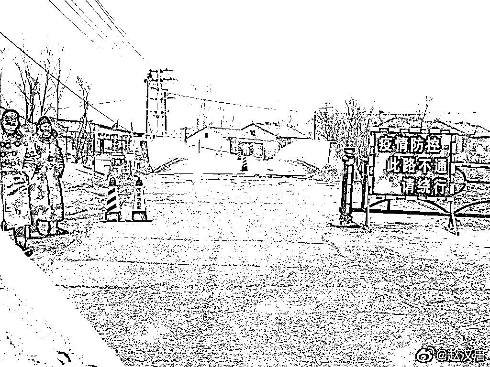
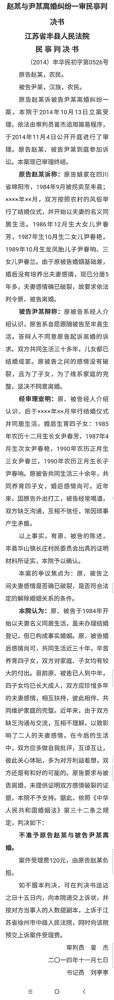

# 丰县→疯县→封县？离婚冷静期原来是徐州首创的

> 原文：[`mp.weixin.qq.com/s?__biz=MzIyMDYwMTk0Mw==&mid=2247530226&idx=2&sn=4a3d7eda789b0761b085a2f1e2715ff9&chksm=97cbbdcaa0bc34dc8101a4cab8e2eb9d530b2dd793b27509c426e90afa4bb544475329162caa&scene=27#wechat_redirect`](http://mp.weixin.qq.com/s?__biz=MzIyMDYwMTk0Mw==&mid=2247530226&idx=2&sn=4a3d7eda789b0761b085a2f1e2715ff9&chksm=97cbbdcaa0bc34dc8101a4cab8e2eb9d530b2dd793b27509c426e90afa4bb544475329162caa&scene=27#wechat_redirect)

今天得到消息，徐州丰县，已经封县了，还建起了隔离墙，据说疫情防控？ 

这个事就说到这，再多说就发不出去了。

上图为叶剑英元帅的孙女叶静子为丰县铁链女事件发生 

不知道大家对“离婚冷静期”是否了解。

离婚冷静期，又称离婚熟虑期，是指在离婚自由原则下，婚姻双方当事人申请自愿离婚，在婚姻登记机关收到该申请之日起一定期间内，任何一方都可撤回离婚申请、终结登记离婚程序的冷静思考期间。

自 2021 年 1 月 1 日起，新调整后的离婚登记程序包括这五个步骤：

**申请→受理→冷静期→审查→登记（发证）。**

首先，离婚冷静期设定为 30 天；其次，离婚冷静期届满后的“再一个”30 天之内，双方需要共同到婚姻登记机关领取离婚证，逾期不领则视为撤回离婚申请。

**也就是说，离婚这个过程最快也要 60 天。**

60 天，这个过程可能发生很多事。 

比如，家暴？或者，你在这期间疯了呢？

**最近**徐州丰县的判决书**在网上广为流传——被拐卖到当地的妇女起诉离婚，竟然被一一驳回，不准离婚。**

这是在干涉婚姻自由吗？

**成功写入民法典的“离婚冷静期”制度，竟然也源于徐州法官清奇的脑回路。**

瞬间了然。 

2013 年末，徐州贾汪区法院开全国之先河，首创“6 个月感情冷静期”。

在官方的表述中，这一创举的目的是为挽救陷入危机的婚姻——在“调解和好”与 “调解离婚”之间增设的第三种调解结案方式。

**说白了，强制要求夫妻双方即使没有和好的可能、仍有一方坚持要离婚，在 6 个月内也不得再次要求离婚。**

其后，徐州经验开始被总结，被放大，被推广，直至被写入民法典。

喜大普奔！全国那些表示希望立刻离婚的人士表示：谢谢了哈。

2015 年 8 月，徐州贾汪法院出台了全国第一份关于 “冷静期”的规范性文件, 对离婚冷静期的概念、功能、适用原则和操作方法进行了详细的规定。这份官方文件正式赋予了徐州司法系统可以裁定婚姻官司诉讼方「6 个月内不准离婚」的权力。

2019 年 3 月, 全国人大法工委专程到徐州贾汪法院开展民法典婚姻家庭编立法调研, 听取了关于“离婚冷静期”的专题汇报。2020 年 7 月, 《中华人民共和国民法典》经十三届全国人大三次会议审议通过, 其中《婚姻家庭编》中正式设立“离婚冷静期”，在全国范围内施行。

请注意，这不是 60 天，这是 6 个月，半年的时间啊。 

中间会发生什么，谁也说不清。

结合铁链女事件，也许我们更能够认清徐州地方法院系统首创“离婚冷静期”制度的初衷及其行为的社会背景，也能更加大胆地猜测：

“离婚冷静期”制度在创立之初，是否就抱着给人添堵的心思，打着捍卫当地大量存在的买卖婚姻以“维护社会稳定”的小算盘？

通过查询裁判文书网，发现丰县法院有多份判决涉及被拐卖妇女。

**这些被拐卖妇女提起了离婚诉讼，但均被丰县法院判决不准与“买家”离婚。**

**2013 年王文群诉邢后永要求离婚，原告系被拐卖到徐州**

**2014 年赵某诉尹某要求离婚，原告同样系被拐卖到徐州**

在明知当事人是被拐卖的，却依然不闻不问，仍然判决不准离婚！

**果然“宁教人打子，某叫人分妻”，只能感叹徐州法制领导将人情法理玩得团团转。**

由此看来，江苏丰县这个地方的水可是够深的！

所以，还有多少阳光照不到的地方？

继续，等通报吧。

← 向右滑动与灰产圈互动交流 →

